# FIFA WC — Commons Categories curation candidates

Side-by-side layout. **Current webp** vs **top-3 Commons candidates** (ranked by filename-heuristic).

To use: visually compare. If a candidate is better, copy its URL and tell me "byt {id} till {URL}".

### Ademir `ademir`

| Current | Candidates |
|---------|------------|
|  [source](https://upload.wikimedia.org/wikipedia/commons/4/4a/Ademir_de_Menezes.jpg) | _No Commons `Category:Ademir` found._ |

### Alan Shearer `alan-shearer`

| **Current** | **Cand 1** (score 35) | **Cand 2** (score 35) | **Cand 3** (score 35) |
| --- | --- | --- | --- |
| 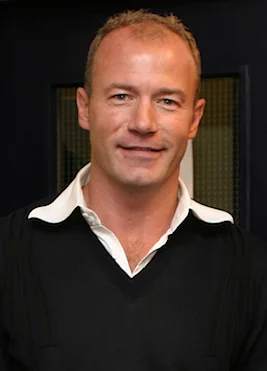 |  |  |  |
| current [source](https://upload.wikimedia.org/wikipedia/commons/b/ba/Alan_Shearer_2008.jpg) | 1999 FA Cup Final Solano free kick.jpg [link](https://upload.wikimedia.org/wikipedia/commons/8/81/1999_FA_Cup_Final_Solano_free_kick.jpg) | 1999 FA Cup Final Scholes goal celeb.jpg [link](https://upload.wikimedia.org/wikipedia/commons/8/8f/1999_FA_Cup_Final_Scholes_goal_celeb.jpg) | 1999 FA Cup Final Manchester United celebrate.jpg [link](https://upload.wikimedia.org/wikipedia/commons/2/2d/1999_FA_Cup_Final_Manchester_United_celebrate.jpg) |

Total in Category: 12

### Aleksandar Tirnanić `aleksandar-tirnanic`

| **Current** | **Cand 1** (score 0) |
| --- | --- |
| 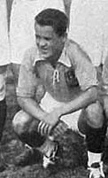 |  |
| current [source](https://upload.wikimedia.org/wikipedia/commons/6/69/Aleksandar_Tirnani%C4%87.jpg) | Aleksandar Tirnanić (1).jpg [link](https://upload.wikimedia.org/wikipedia/commons/3/37/Aleksandar_Tirnani%C4%87_%281%29.jpg) |

Total in Category: 1

### Alessandro Del Piero `alessandro-del-piero`

| **Current** | **Cand 1** (score 5) | **Cand 2** (score 5) | **Cand 3** (score 5) |
| --- | --- | --- | --- |
| 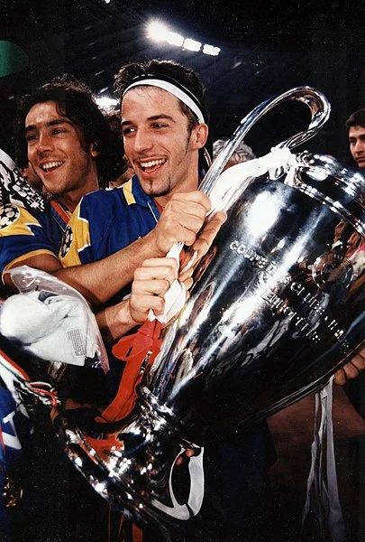 |  |  |  |
| current [source](https://upload.wikimedia.org/wikipedia/commons/d/d3/25th_Laureus_World_Sports_Awards_-_Alessandro_Del_Piero_-_240421_155220_%28cropped%29.jpg) | Juventus - 2010 - Giorgio Chiellini, Alex Manni... [link](https://upload.wikimedia.org/wikipedia/commons/9/99/Juventus_-_2010_-_Giorgio_Chiellini%2C_Alex_Manninger_and_Alex_Del_Piero.jpg) | Juventus FC - Champions League 1995-96 - Alessa... [link](https://upload.wikimedia.org/wikipedia/commons/f/f7/Juventus_FC_-_Champions_League_1995-96_-_Alessandro_Del_Piero_e_Paulo_Sousa.jpg) | Serie A 1999-09-25 Lecce x Juventus - Savino x ... [link](https://upload.wikimedia.org/wikipedia/commons/b/b9/Serie_A_1999-09-25_Lecce_x_Juventus_-_Savino_x_Del_Piero.jpg) |

Total in Category: 15

### Alessandro Nesta `alessandro-nesta`

| **Current** | **Cand 1** (score 10) | **Cand 2** (score 10) | **Cand 3** (score 10) |
| --- | --- | --- | --- |
| 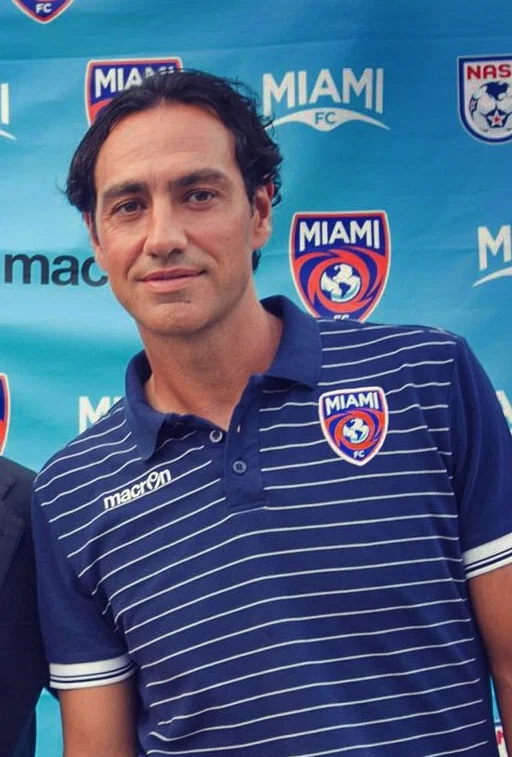 |  |  |  |
| current [source](https://upload.wikimedia.org/wikipedia/commons/0/0f/Alessandro_Nesta_as_Miami_FC_Manager.jpg) | Marco Di Vaio first MLS goal.jpg [link](https://upload.wikimedia.org/wikipedia/commons/4/41/Marco_Di_Vaio_first_MLS_goal.jpg) | Nesta vs Sherjill Mac-Donald 2012.jpg [link](https://upload.wikimedia.org/wikipedia/commons/a/ac/Nesta_vs_Sherjill_Mac-Donald_2012.jpg) | Nesta and Brovsky Impact Montréal 2013-09-07.jpg [link](https://upload.wikimedia.org/wikipedia/commons/a/a5/Nesta_and_Brovsky_Impact_Montr%C3%A9al_2013-09-07.jpg) |

Total in Category: 20

### Alexander Isak `alexander-isak`

| Current | Candidates |
|---------|------------|
| 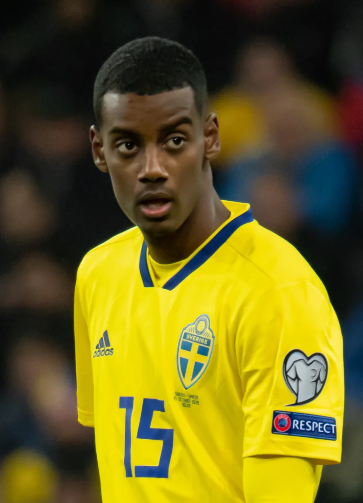 [source](https://upload.wikimedia.org/wikipedia/commons/0/00/UEFA_EURO_qualifiers_Sweden_vs_Spain_20191015_Alexander_Isak_56_%28cropped%29.jpg) | _No Commons `Category:Alexander Isak` found._ |

### Alexis Sanchez `alexis-sanchez`

| Current | Candidates |
|---------|------------|
| 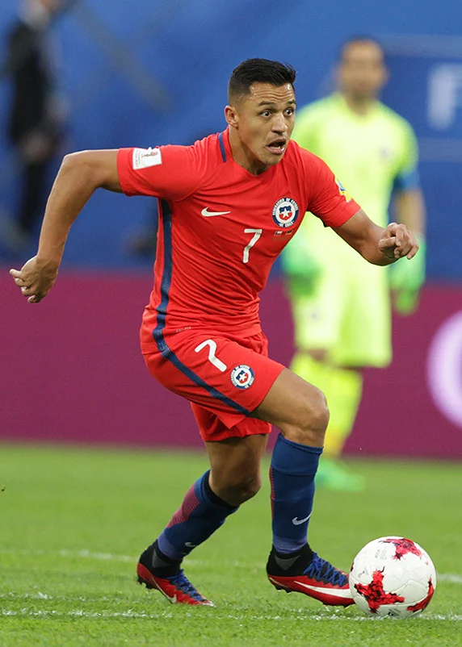 [source](https://upload.wikimedia.org/wikipedia/commons/5/50/Alexis_S%C3%A1nchez_2017.jpg) | _No Commons `Category:Alexis Sanchez` found._ |

### Alf Ramsey `alf-ramsey`

| Current | Candidates |
|---------|------------|
| 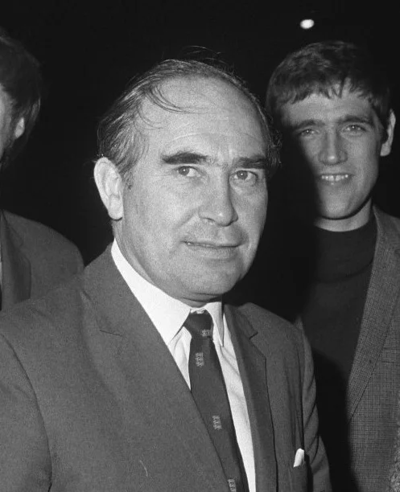 [source](https://upload.wikimedia.org/wikipedia/commons/2/20/Alf_Ramsey_%281969%29.jpg) | _No Commons `Category:Alf Ramsey` found._ |

### Ali Daei `ali-daei`

| Current | Candidates |
|---------|------------|
| 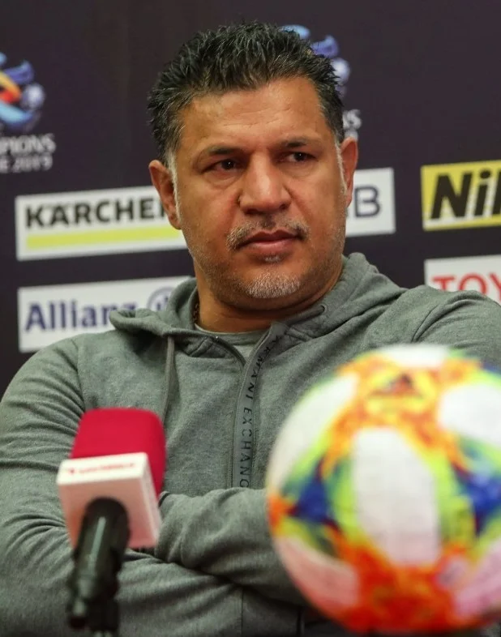 [source](https://upload.wikimedia.org/wikipedia/commons/f/ff/Ali_Daei%2C_Saipa_vs._Al-Rayyan_pre-match_conference.jpg) | _No Commons `Category:Ali Daei` found._ |

### Andrea Pirlo `andrea-pirlo`

| Current | Candidates |
|---------|------------|
| 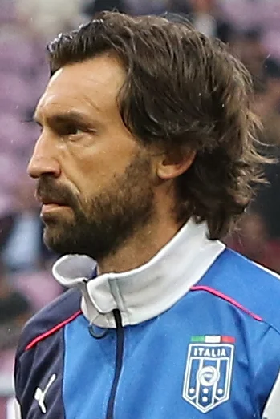 [source](https://upload.wikimedia.org/wikipedia/commons/6/6e/20150616_-_Portugal_-_Italie_-_Gen%C3%A8ve_-_Andrea_Pirlo_%28cropped%29.jpg) | _No Commons `Category:Andrea Pirlo` found._ |

### Andreas Brehme `andreas-brehme`

| Current | Candidates |
|---------|------------|
| 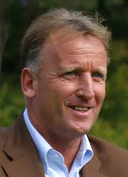 [source](https://upload.wikimedia.org/wikipedia/commons/c/c1/Andreas_Brehme.jpg) | _No Commons `Category:Andreas Brehme` found._ |

### Andrej Kramaric `andrej-kramaric`

| Current | Candidates |
|---------|------------|
| 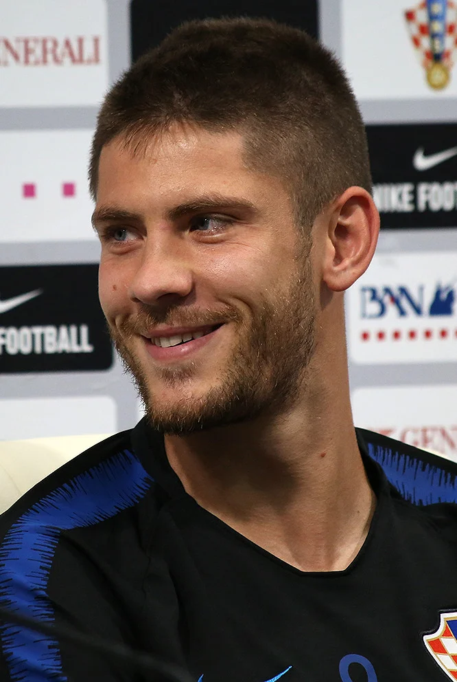 [source](https://upload.wikimedia.org/wikipedia/commons/2/2e/Andrej_Kramari%C4%87_2018.jpg) | _No Commons `Category:Andrej Kramaric` found._ |

### Andrés Iniesta `andres-iniesta`

| Current | Candidates |
|---------|------------|
| 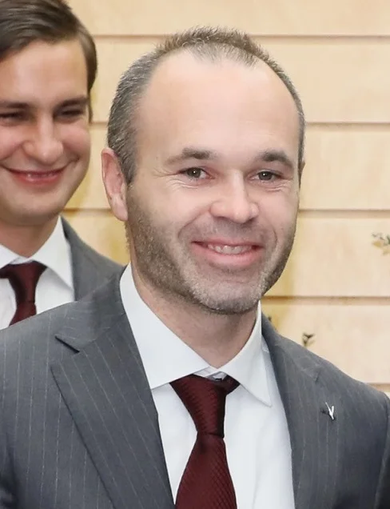 _(no batch-input)_ | _No Commons `Category:Andrés Iniesta` found._ |

### Andriy Shevchenko `andriy-shevchenko`

| Current | Candidates |
|---------|------------|
| 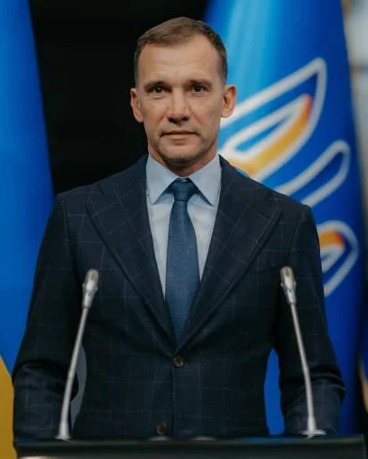 [source](https://upload.wikimedia.org/wikipedia/commons/2/25/%D0%90%D0%BD%D0%B4%D1%80%D1%96%D0%B9_%D0%A8%D0%B5%D0%B2%D1%87%D0%B5%D0%BD%D0%BA%D0%BE_2024_%28cropped%29.png) | _No Commons `Category:Andriy Shevchenko` found._ |

### Ángel Di María `angel-di-maria`

| Current | Candidates |
|---------|------------|
| 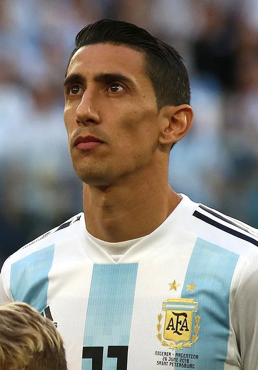 [source](https://upload.wikimedia.org/wikipedia/commons/8/8c/NIG-ARG_%285%29.jpg) | _No Commons `Category:Ángel Di María` found._ |

### Antoine Griezmann `antoine-griezmann`

| Current | Candidates |
|---------|------------|
| 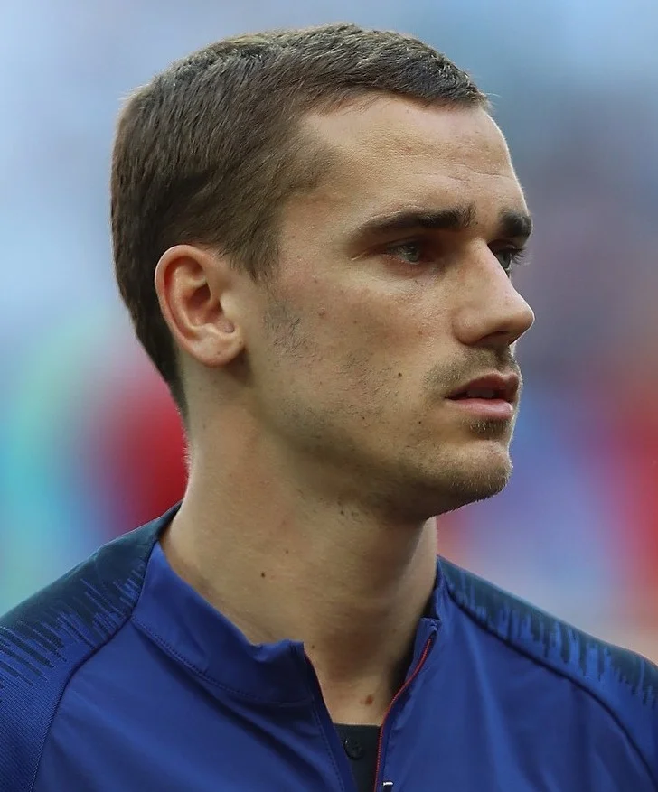 [source](https://upload.wikimedia.org/wikipedia/commons/6/6e/FRA-ARG_%2810%29_%28cropped%29.jpg) | _No Commons `Category:Antoine Griezmann` found._ |

### Antonio Cabrini `antonio-cabrini`

| Current | Candidates |
|---------|------------|
| 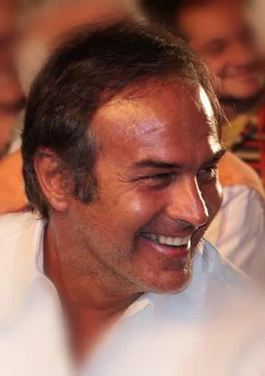 [source](https://upload.wikimedia.org/wikipedia/commons/8/8a/Cabrini_sez.JPG) | _No Commons `Category:Antonio Cabrini` found._ |

### Arjen Robben `arjen-robben`

| Current | Candidates |
|---------|------------|
| 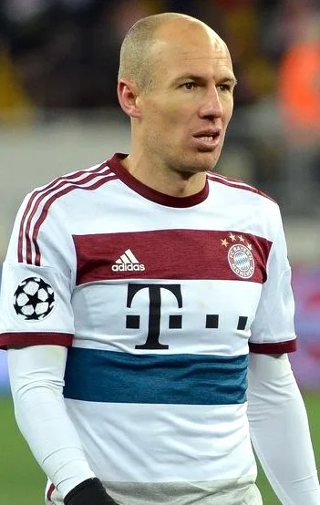 [source](https://upload.wikimedia.org/wikipedia/commons/4/42/Arjen_Robben_v_Shakhtar_2015_%28cropped%29.jpg) | _No Commons `Category:Arjen Robben` found._ |

### Arrigo Sacchi `arrigo-sacchi`

| Current | Candidates |
|---------|------------|
| 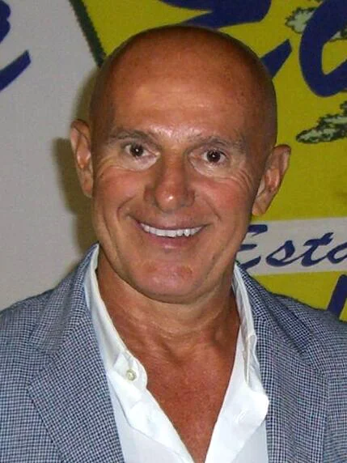 [source](https://upload.wikimedia.org/wikipedia/commons/5/58/Arrigo_Sacchi_2007_%28cropped%29.jpg) | _No Commons `Category:Arrigo Sacchi` found._ |

### Arturo Vidal `arturo-vidal`

| Current | Candidates |
|---------|------------|
| 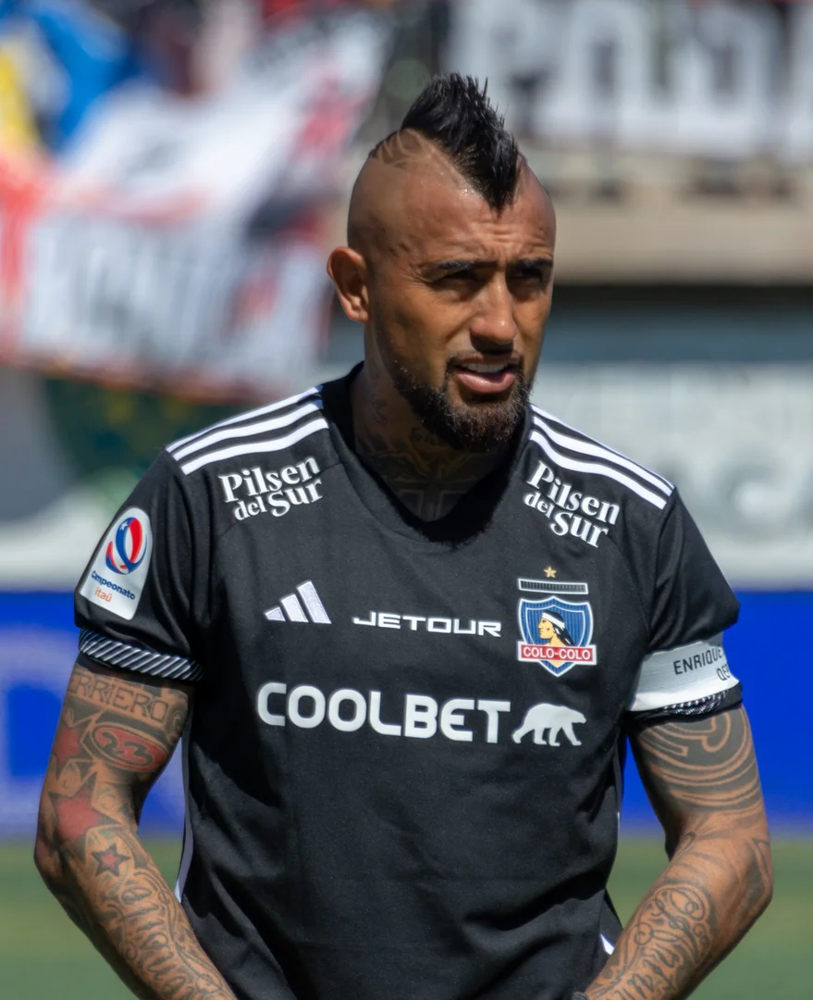 [source](https://upload.wikimedia.org/wikipedia/commons/0/0d/Arturo_Vidal_Copiap%C3%B3_v_Colo-Colo_20241110_13.jpg) | _No Commons `Category:Arturo Vidal` found._ |

### Asamoah Gyan `asamoah-gyan`

| Current | Candidates |
|---------|------------|
| 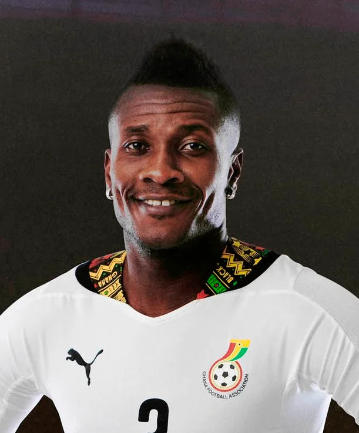 [source](https://upload.wikimedia.org/wikipedia/commons/7/71/Asamoah_Gyan_%282014%29.jpg) | _No Commons `Category:Asamoah Gyan` found._ |

### Ashley Cole `ashley-cole`

| Current | Candidates |
|---------|------------|
| 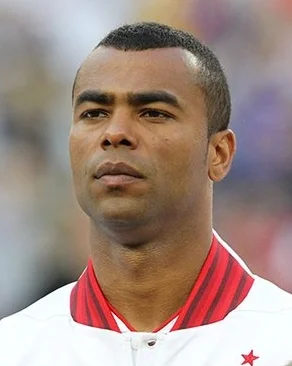 [source](https://upload.wikimedia.org/wikipedia/commons/d/d5/ACole.JPG) | _No Commons `Category:Ashley Cole` found._ |

### Aurelien Tchouameni `aurelien-tchouameni`

| Current | Candidates |
|---------|------------|
| 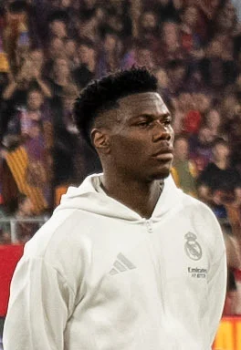 [source](https://upload.wikimedia.org/wikipedia/commons/0/0f/2025_04_26_Final_de_la_Copa_del_Rey_-_Aur%C3%A9lien_Tchouam%C3%A9ni.jpg) | _No Commons `Category:Aurelien Tchouameni` found._ |

### Bastian Schweinsteiger `bastian-schweinsteiger`

| Current | Candidates |
|---------|------------|
| 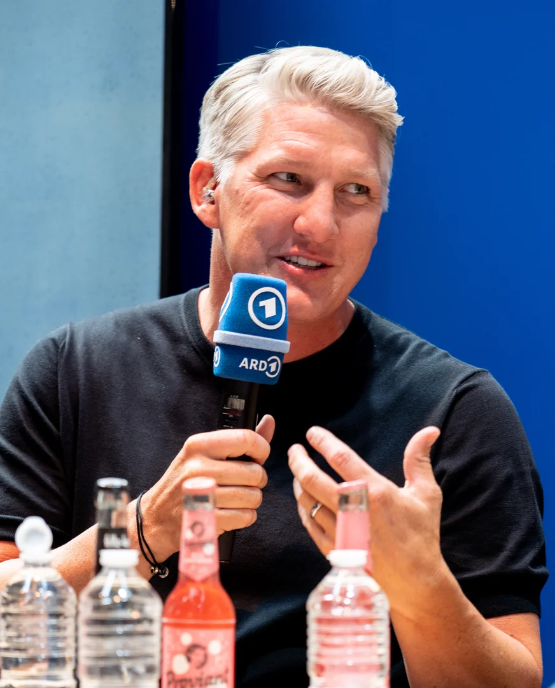 _(no batch-input)_ | _No Commons `Category:Bastian Schweinsteiger` found._ |

### Bebeto `bebeto`

| Current | Candidates |
|---------|------------|
| 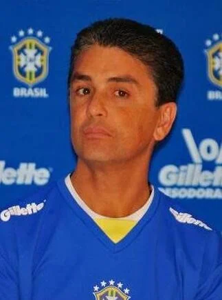 [source](https://upload.wikimedia.org/wikipedia/commons/6/68/Bebeto_brazil_%28cropped%29.jpg) | _No Commons `Category:Bebeto` found._ |

### Bernardo Silva `bernardo-silva`

| Current | Candidates |
|---------|------------|
| 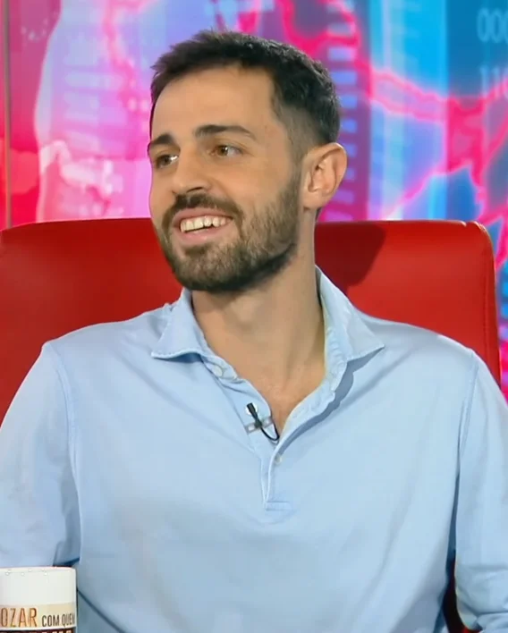 [source](https://upload.wikimedia.org/wikipedia/commons/c/cf/Bernardo_Silva_%28Isto_%C3%89_Gozar_Com_Quem_Trabalha%2C_2024%29.png) | _No Commons `Category:Bernardo Silva` found._ |

### Bernd Schuster `bernd-schuster`

| Current | Candidates |
|---------|------------|
| 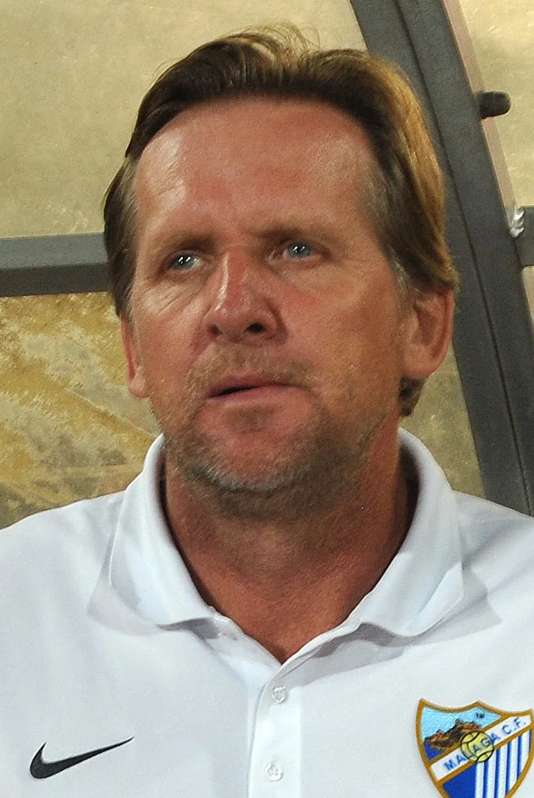 [source](https://upload.wikimedia.org/wikipedia/commons/b/b3/Bernd_Schuster_2013_%28cropped%29.jpg) | _No Commons `Category:Bernd Schuster` found._ |

### Berti Vogts `berti-vogts`

| Current | Candidates |
|---------|------------|
| 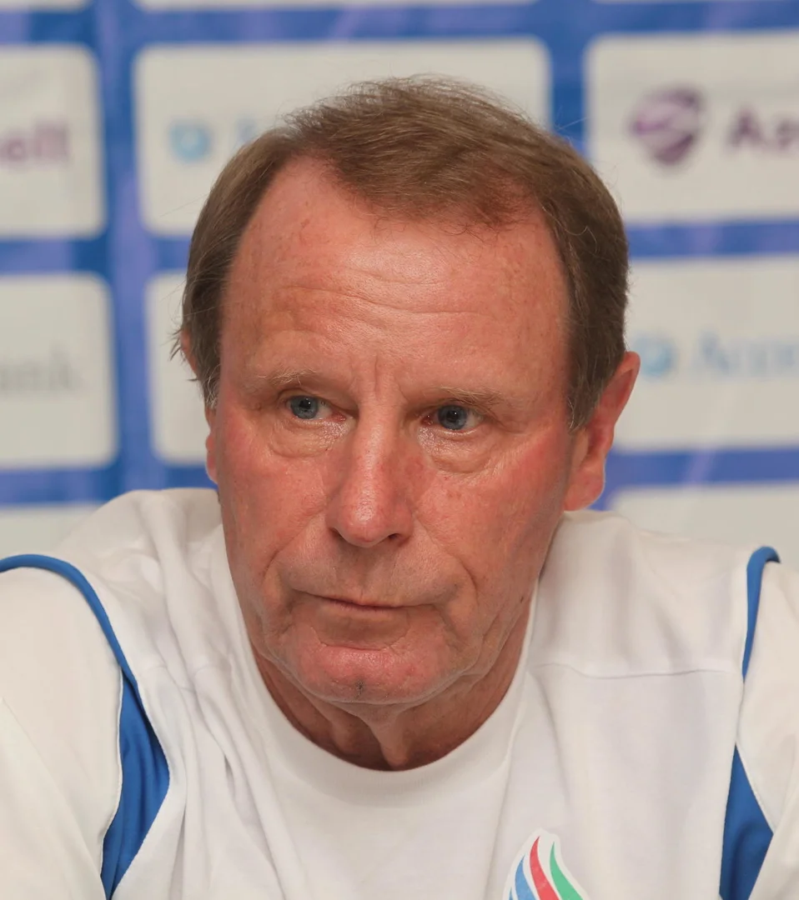 [source](https://upload.wikimedia.org/wikipedia/commons/7/7c/Berti_Vogts_1_%28cropped%29.JPG) | _No Commons `Category:Berti Vogts` found._ |

### Bobby Charlton `bobby-charlton`

| Current | Candidates |
|---------|------------|
| 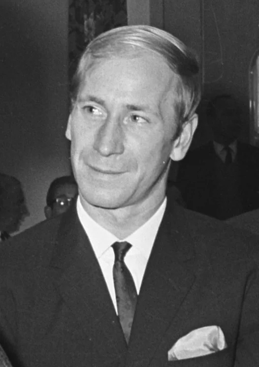 [source](https://upload.wikimedia.org/wikipedia/commons/0/09/LondonHouseAmsterdam1966_Bobby_Charlton.jpg) | _No Commons `Category:Bobby Charlton` found._ |

### Bobby Moore `bobby-moore`

| Current | Candidates |
|---------|------------|
| 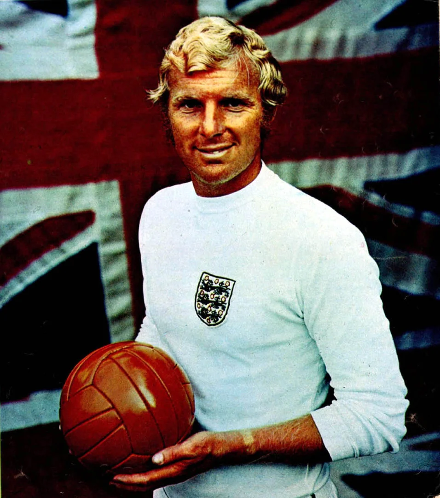 [source](https://upload.wikimedia.org/wikipedia/commons/c/c6/Bobby_moore_elgrafico_1970.jpg) | _No Commons `Category:Bobby Moore` found._ |

### Bora Milutinović `bora-milutinovic`

| Current | Candidates |
|---------|------------|
| 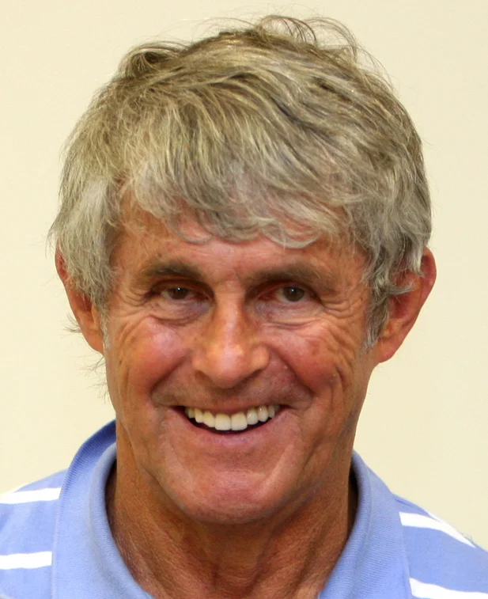 [source](https://upload.wikimedia.org/wikipedia/commons/1/18/Bora_Milutinovic_2012_5_%28cropped%29.jpg) | _No Commons `Category:Bora Milutinović` found._ |

### Bruno Conti `bruno-conti`

| Current | Candidates |
|---------|------------|
| 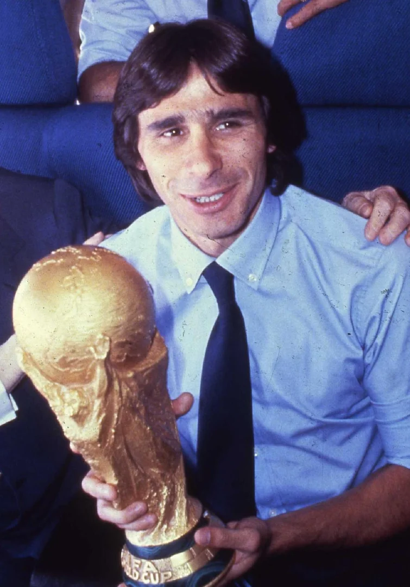 [source](https://upload.wikimedia.org/wikipedia/commons/7/7b/Bruno_Conti_1982.jpg) | _No Commons `Category:Bruno Conti` found._ |

### Bruno Fernandes `bruno-fernandes`

| Current | Candidates |
|---------|------------|
| 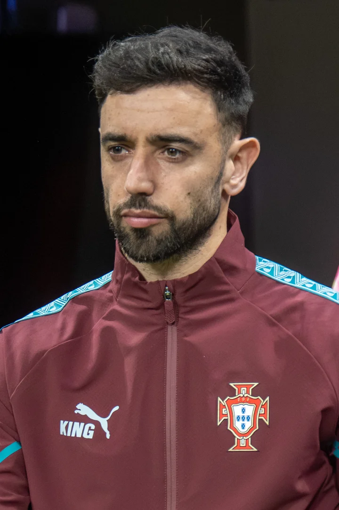 [source](https://upload.wikimedia.org/wikipedia/commons/c/c7/Bruno_Fernandes_USMNT_v_Portugal_Mar_31_2026-27_%28cropped%29.jpg) | _No Commons `Category:Bruno Fernandes` found._ |

### Bukayo Saka `bukayo-saka`

| Current | Candidates |
|---------|------------|
| 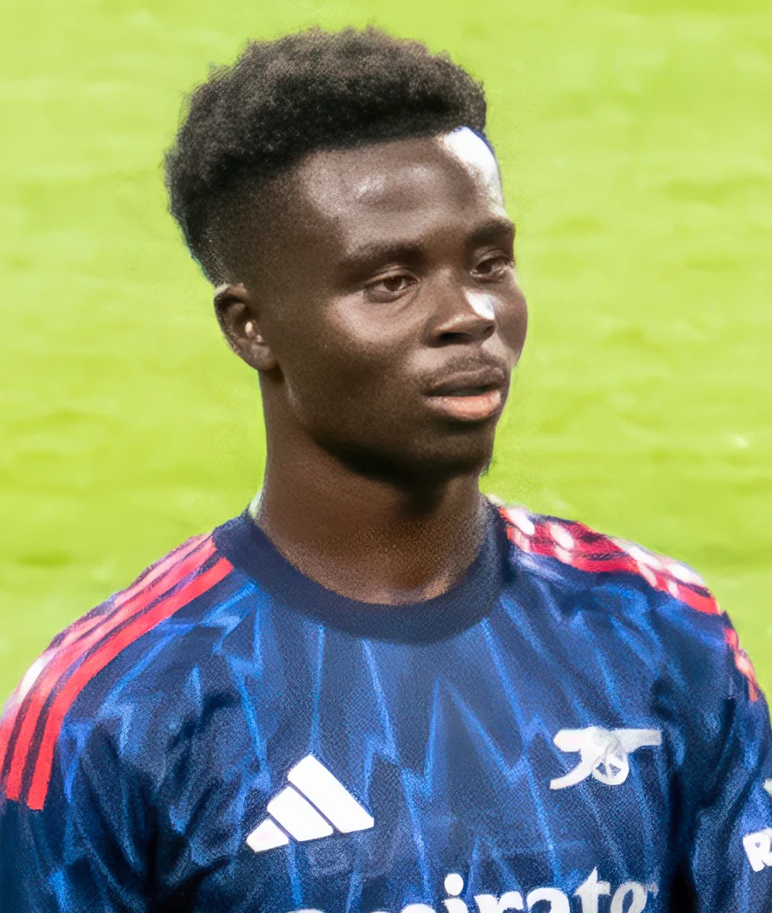 [source](https://upload.wikimedia.org/wikipedia/commons/c/cd/1_bukayo_saka_arsenal_2025_%28cropped%29.jpg) | _No Commons `Category:Bukayo Saka` found._ |

### Cafu `cafu`

| Current | Candidates |
|---------|------------|
| 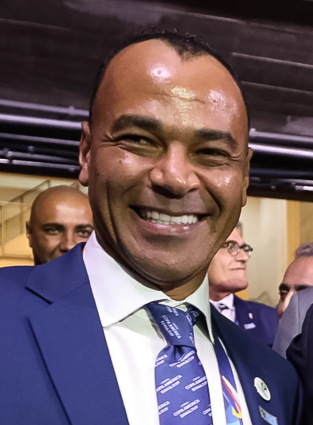 [source](https://upload.wikimedia.org/wikipedia/commons/7/7a/14_06_2019_Abertura_da_Copa_Am%C3%A9rica_Brasil_2019_%2848064408836%29_%28cropped%29.jpg) | _No Commons `Category:Cafu` found._ |

### Cafu Falcao `cafu-falcao`

| Current | Candidates |
|---------|------------|
|  [source](https://upload.wikimedia.org/wikipedia/commons/7/73/Paulo_Roberto_Falc%C3%A3o%2C_Roma_1983-84.jpg) | _No Commons `Category:Cafu Falcao` found._ |

### Carlos Alberto `carlos-alberto`

| Current | Candidates |
|---------|------------|
|  [source](https://upload.wikimedia.org/wikipedia/commons/9/9b/Carlos_alberto_cosmos.jpg) | _No Commons `Category:Carlos Alberto` found._ |

### Carlos Alberto Parreira `carlos-alberto-parreira`

| Current | Candidates |
|---------|------------|
| 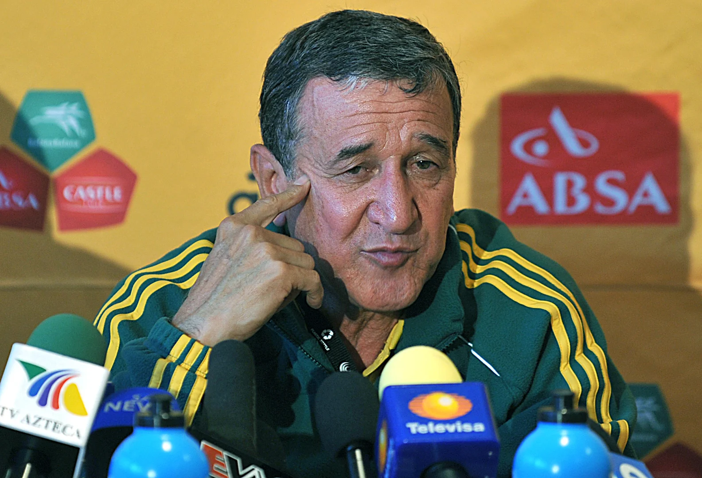 [source](https://upload.wikimedia.org/wikipedia/commons/b/b4/Carlos_Alberto_Parreira_at_University_of_the_Witwatersrand_2010-06-04_4.jpg) | _No Commons `Category:Carlos Alberto Parreira` found._ |

### Carlos Bilardo `carlos-bilardo`

| Current | Candidates |
|---------|------------|
| 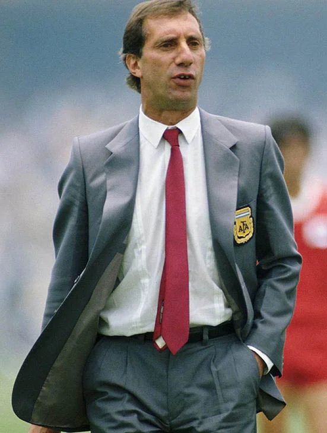 [source](https://upload.wikimedia.org/wikipedia/commons/1/1f/Narig%C3%B3n_Bilardo_1986.jpg) | _No Commons `Category:Carlos Bilardo` found._ |

### César Luis Menotti `cesar-luis-menotti`

| Current | Candidates |
|---------|------------|
| 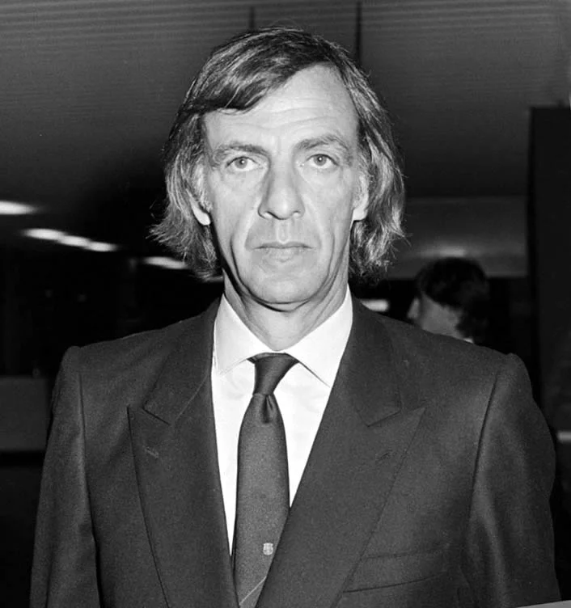 [source](https://upload.wikimedia.org/wikipedia/commons/e/ea/Cesar_menotti_in_1983.jpg) | _No Commons `Category:César Luis Menotti` found._ |

### Cesare Maldini `cesare-maldini`

| Current | Candidates |
|---------|------------|
| 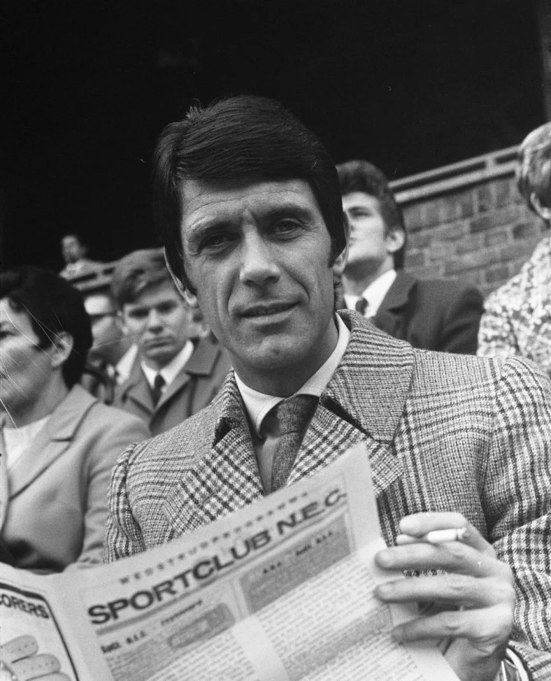 [source](https://upload.wikimedia.org/wikipedia/commons/3/3a/Cesare_Maldini_op_de_tribune_bij_N.E.C._%28cropped%29.jpg) | _No Commons `Category:Cesare Maldini` found._ |

### Cesc Fabregas `cesc-fabregas`

| Current | Candidates |
|---------|------------|
| 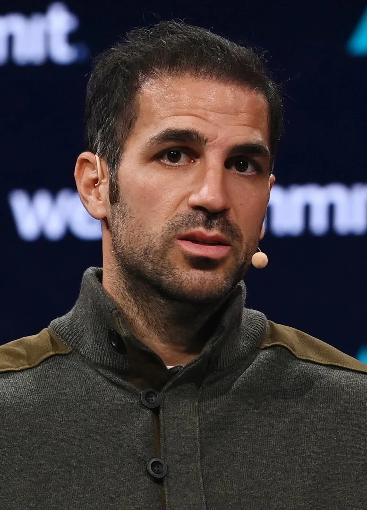 [source](https://upload.wikimedia.org/wikipedia/commons/5/5b/2023_-_Cesc_Fabregas_%28cropped%29.jpg) | _No Commons `Category:Cesc Fabregas` found._ |

### Christian Pulisic `christian-pulisic`

| Current | Candidates |
|---------|------------|
| 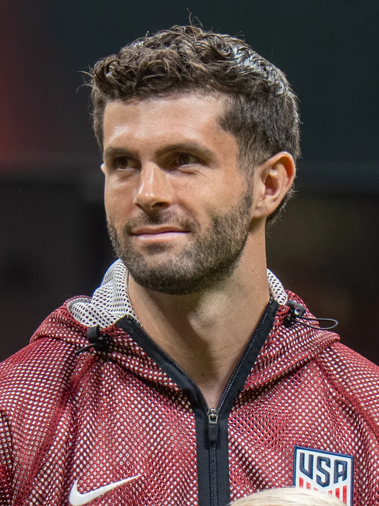 [source](https://upload.wikimedia.org/wikipedia/commons/7/71/Christian_Pulisic_USMNT_v_Belgium_Mar_28_2026-73_%28cropped%29.jpg) | _No Commons `Category:Christian Pulisic` found._ |

### Christian Vieri `christian-vieri`

| Current | Candidates |
|---------|------------|
| 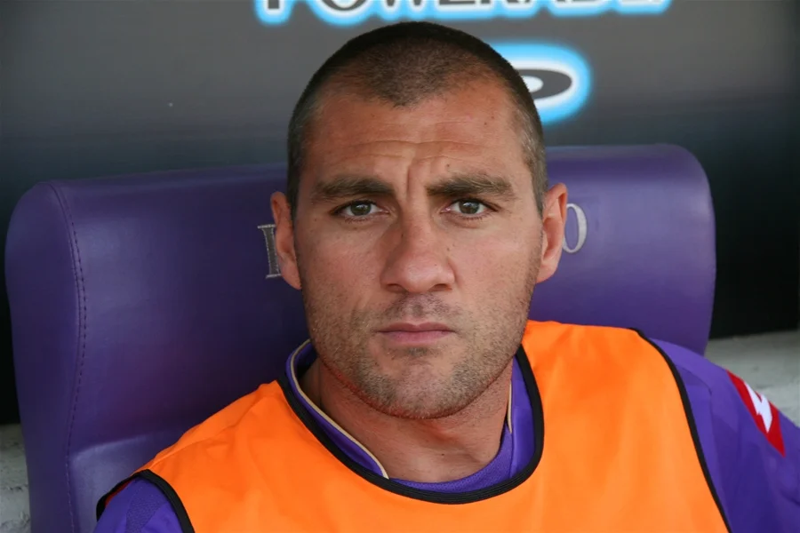 [source](https://upload.wikimedia.org/wikipedia/commons/4/42/Christian_Vieri_%28cropped%29.jpg) | _No Commons `Category:Christian Vieri` found._ |

### Clarence Seedorf `clarence-seedorf`

| Current | Candidates |
|---------|------------|
| 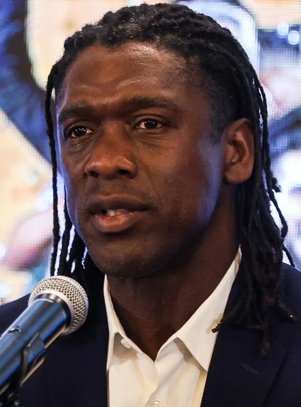 [source](https://upload.wikimedia.org/wikipedia/commons/c/c2/Clarence_Seedorf_Introductory_Press_Conferences%2C_2_June_2025_-_40_%28cropped%29.jpg) | _No Commons `Category:Clarence Seedorf` found._ |

### Claudio Taffarel `claudio-taffarel`

| Current | Candidates |
|---------|------------|
| 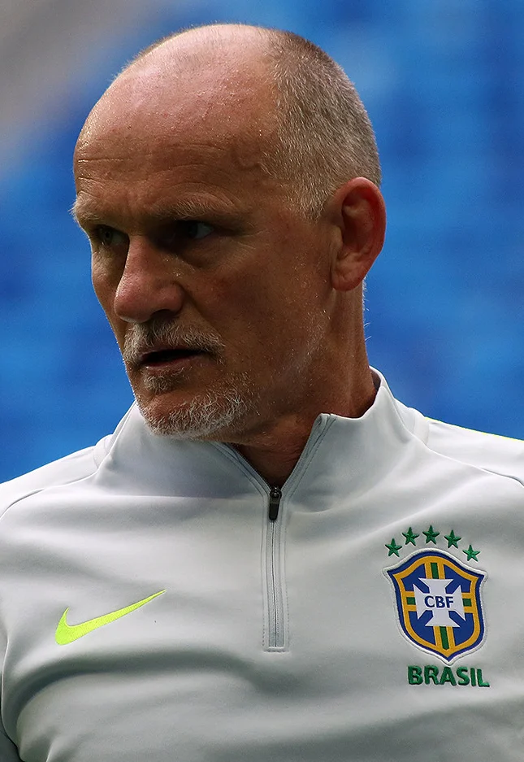 [source](https://upload.wikimedia.org/wikipedia/commons/3/30/Taffarel_2018.png) | _No Commons `Category:Claudio Taffarel` found._ |

### Clint Dempsey `clint-dempsey`

| Current | Candidates |
|---------|------------|
| 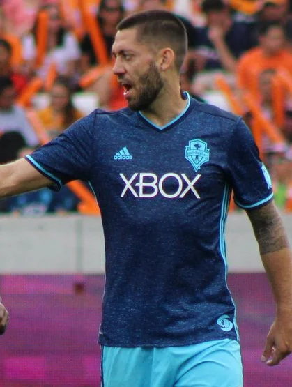 [source](https://upload.wikimedia.org/wikipedia/commons/e/e3/Clint_Dempsey_%2826347615912%29_%28cropped%29.jpg) | _No Commons `Category:Clint Dempsey` found._ |

### Cody Gakpo `cody-gakpo`

| Current | Candidates |
|---------|------------|
| 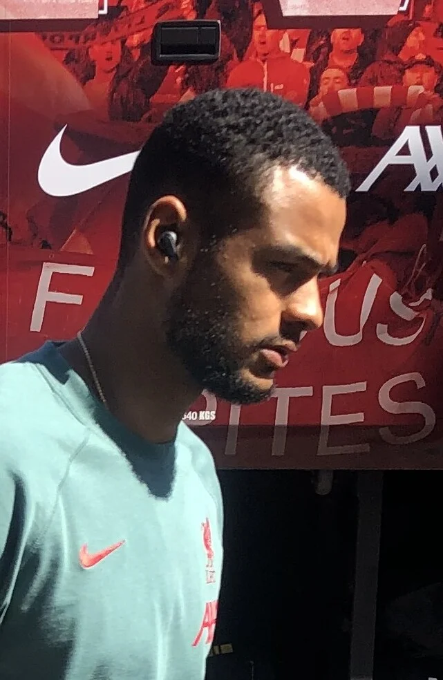 [source](https://upload.wikimedia.org/wikipedia/commons/4/4f/Cody_Gakpo_06042025_%282%29_%28cropped%29.jpg) | _No Commons `Category:Cody Gakpo` found._ |

### Cristiano Ronaldo `cristiano-ronaldo`

| Current | Candidates |
|---------|------------|
| 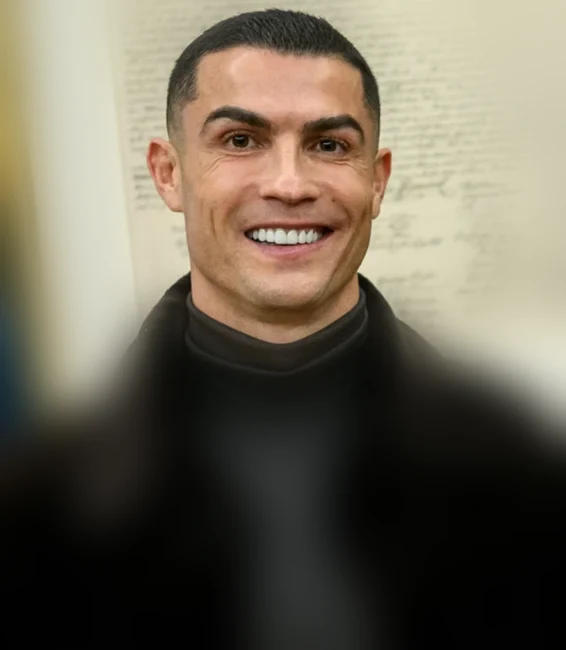 _(no batch-input)_ | _No Commons `Category:Cristiano Ronaldo` found._ |

### Dani Alves `dani-alves`

| Current | Candidates |
|---------|------------|
| 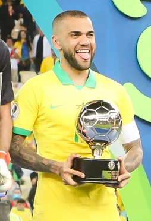 [source](https://upload.wikimedia.org/wikipedia/commons/d/dd/07_07_2019_Final_da_Copa_Am%C3%A9rica_2019_%2848226649586%29_%28cropped%29.jpg) | _No Commons `Category:Dani Alves` found._ |

### Daniel Passarella `daniel-passarella`

| Current | Candidates |
|---------|------------|
| 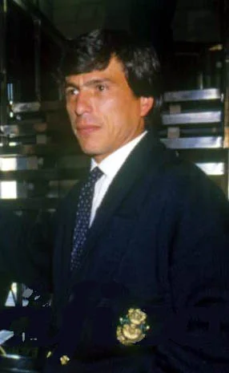 [source](https://upload.wikimedia.org/wikipedia/commons/a/a7/Daniel_passarella_en_1985.jpg) | _No Commons `Category:Daniel Passarella` found._ |

### Daniele De Rossi `daniele-de-rossi`

| Current | Candidates |
|---------|------------|
| 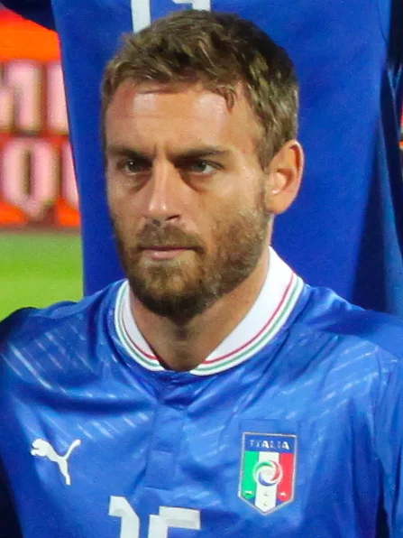 [source](https://upload.wikimedia.org/wikipedia/commons/7/7d/Daniele_De_Rossi_BGR-ITA_2012.jpg) | _No Commons `Category:Daniele De Rossi` found._ |

### David Trezeguet `david-trezeguet`

| Current | Candidates |
|---------|------------|
| 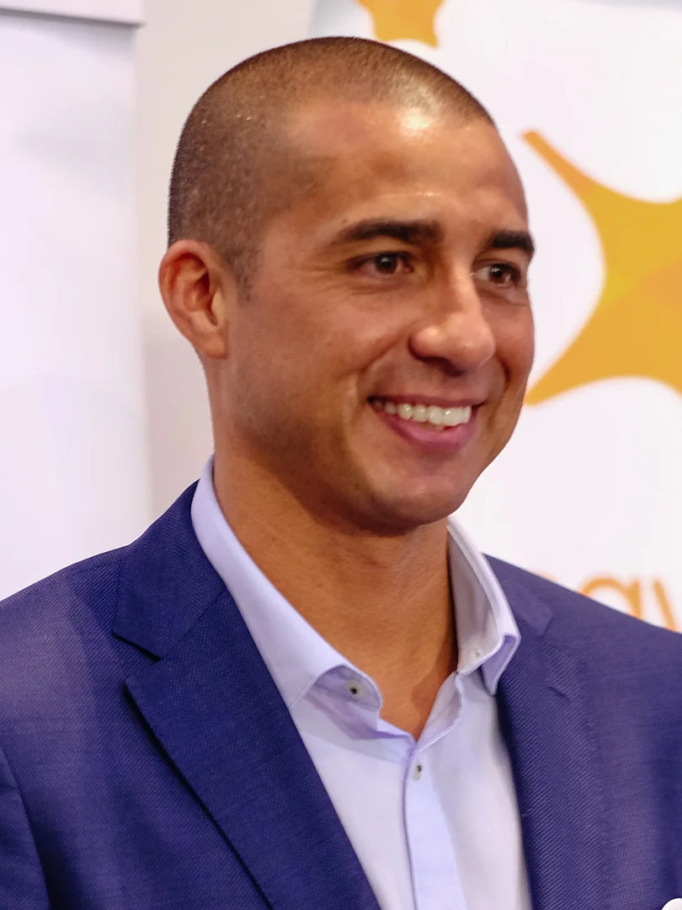 [source](https://upload.wikimedia.org/wikipedia/commons/1/15/David_Trezeguet_became_Save_the_Dream_Ambassador%2C_2017_%28cropped%29.jpg) | _No Commons `Category:David Trezeguet` found._ |

### David Villa `david-villa`

| Current | Candidates |
|---------|------------|
| 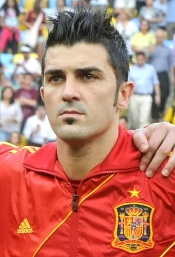 [source](https://upload.wikimedia.org/wikipedia/commons/a/a4/Spain-Tahiti%2C_Confederations_Cup_2013_%2802%29_%28Villa_crop%29.jpg) | _No Commons `Category:David Villa` found._ |

### Declan Rice `declan-rice`

| Current | Candidates |
|---------|------------|
| 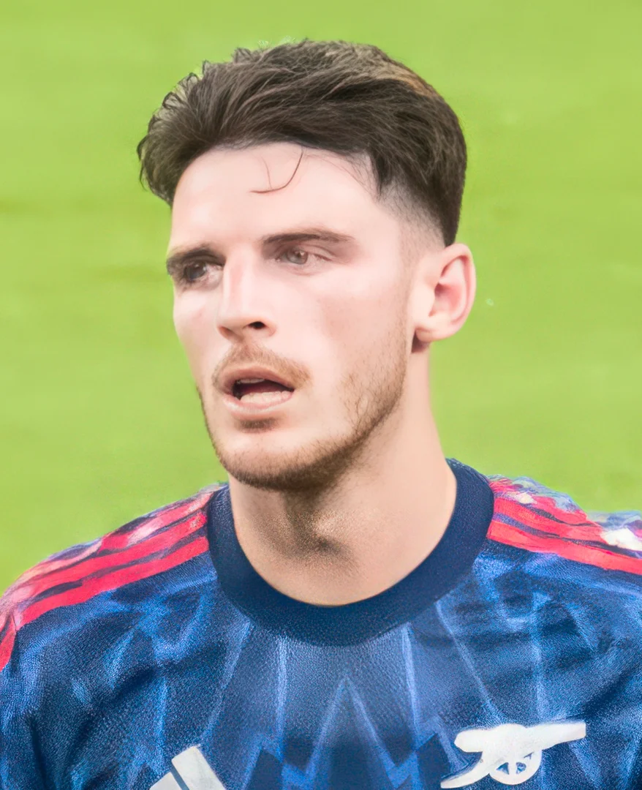 [source](https://upload.wikimedia.org/wikipedia/commons/e/ea/1_declan_rice_arsenal_2025_%28cropped%29.jpg) | _No Commons `Category:Declan Rice` found._ |

### Deco `deco`

| Current | Candidates |
|---------|------------|
| 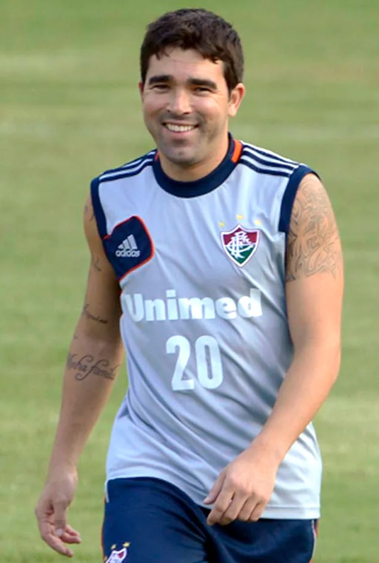 [source](https://upload.wikimedia.org/wikipedia/commons/f/fa/Deco_com_o_Fluminense_em_2013_%28cropped%29.jpg) | _No Commons `Category:Deco` found._ |

### Dejan Kulusevski `dejan-kulusevski`

| Current | Candidates |
|---------|------------|
| 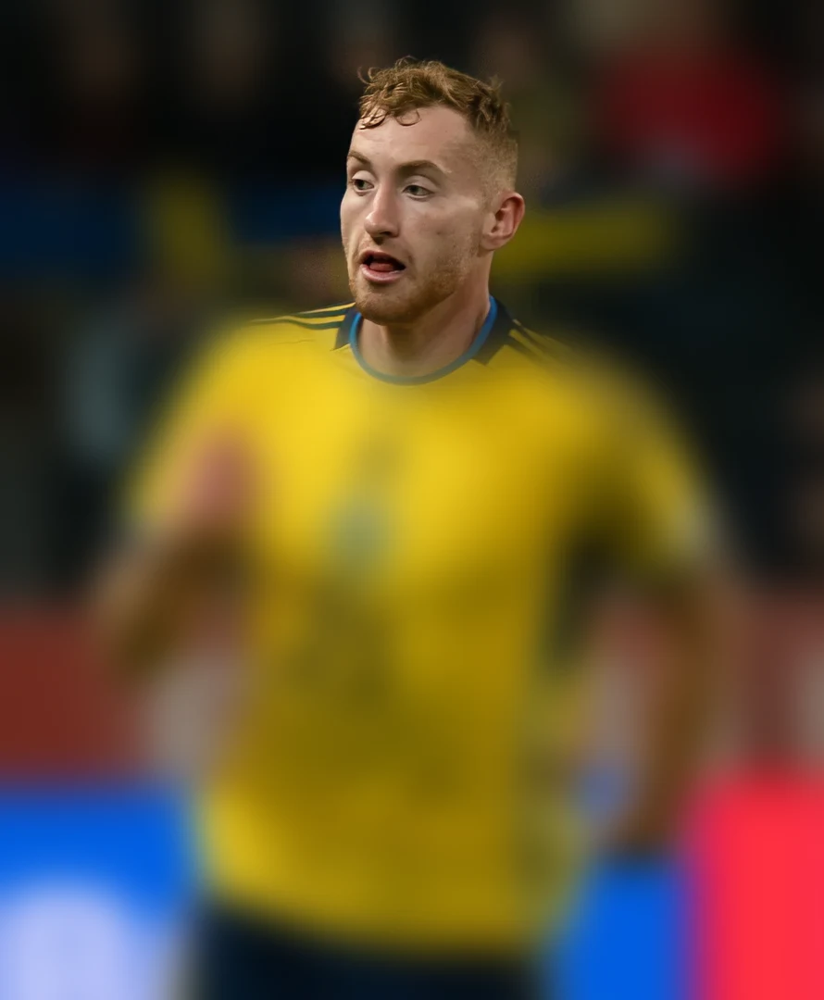 [source](https://upload.wikimedia.org/wikipedia/commons/2/2f/Sweden-Slovenia_Nations_League_2022-09-27_17_Kulusevski_%28cropped%29.jpg) | _No Commons `Category:Dejan Kulusevski` found._ |

### Demetrio Albertini `demetrio-albertini`

| Current | Candidates |
|---------|------------|
| 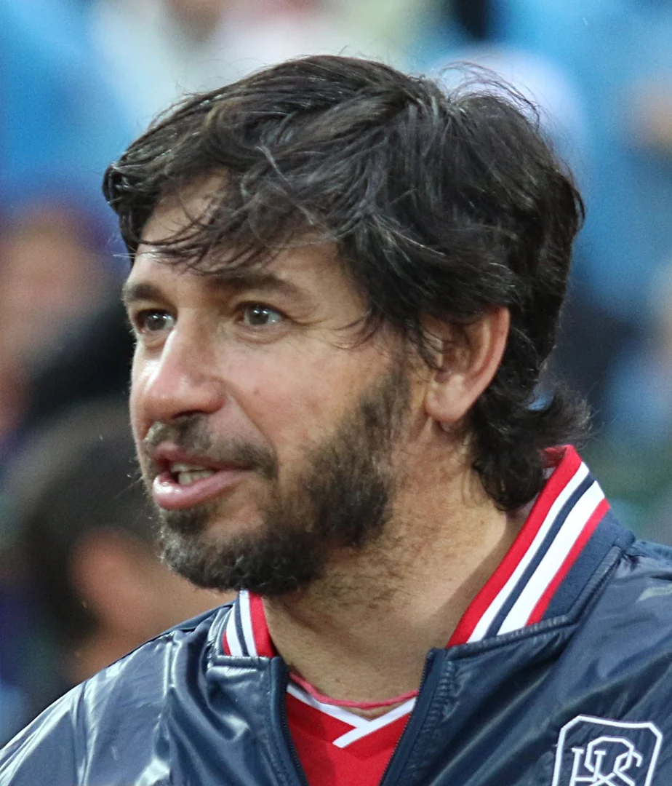 [source](https://upload.wikimedia.org/wikipedia/commons/8/8c/Demetrio_Albertini_in_2016.jpg) | _No Commons `Category:Demetrio Albertini` found._ |

### Dennis Bergkamp `dennis-bergkamp`

| Current | Candidates |
|---------|------------|
|  [source](https://upload.wikimedia.org/wikipedia/commons/3/33/Dennis_Bergkamp_Euro_%2796.jpg) | _No Commons `Category:Dennis Bergkamp` found._ |

### Didier Deschamps `didier-deschamps`

| Current | Candidates |
|---------|------------|
| 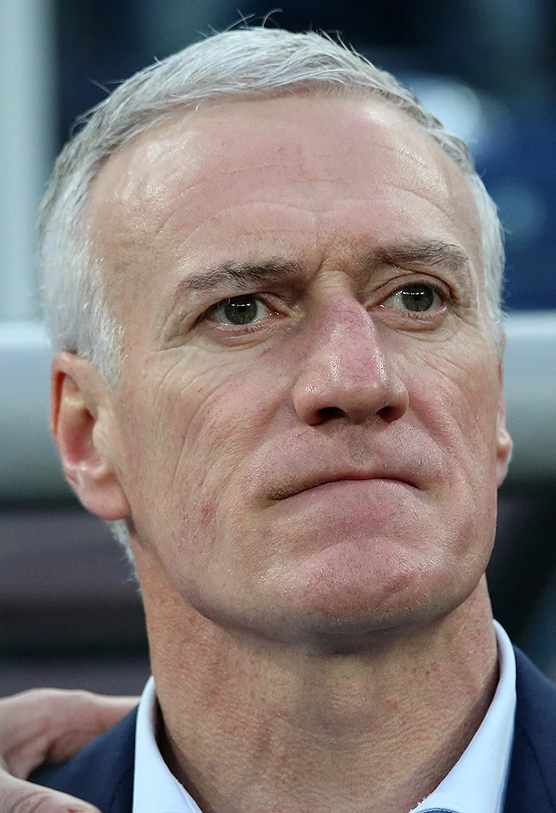 [source](https://upload.wikimedia.org/wikipedia/commons/a/ae/Didier_Deschamps_in_2018.jpg) | _No Commons `Category:Didier Deschamps` found._ |

### Diego Costa `diego-costa`

| Current | Candidates |
|---------|------------|
| 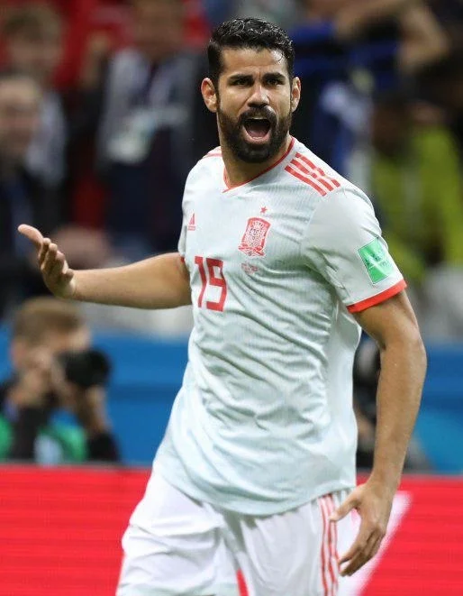 [source](https://upload.wikimedia.org/wikipedia/commons/5/5f/Iran_and_Spain_match_at_the_FIFA_World_Cup_23.jpg) | _No Commons `Category:Diego Costa` found._ |

### Diego Forlan `diego-forlan`

| Current | Candidates |
|---------|------------|
| 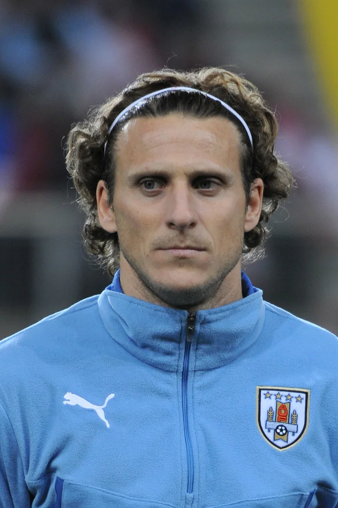 [source](https://upload.wikimedia.org/wikipedia/commons/f/f3/U10_Diego_Forl%C3%A1n_7524.jpg) | _No Commons `Category:Diego Forlan` found._ |

### Diego Maradona `diego-maradona`

| Current | Candidates |
|---------|------------|
| 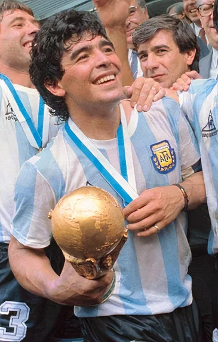 _(no batch-input)_ | _No Commons `Category:Diego Maradona` found._ |

### Diego Simeone `diego-simeone`

| Current | Candidates |
|---------|------------|
| 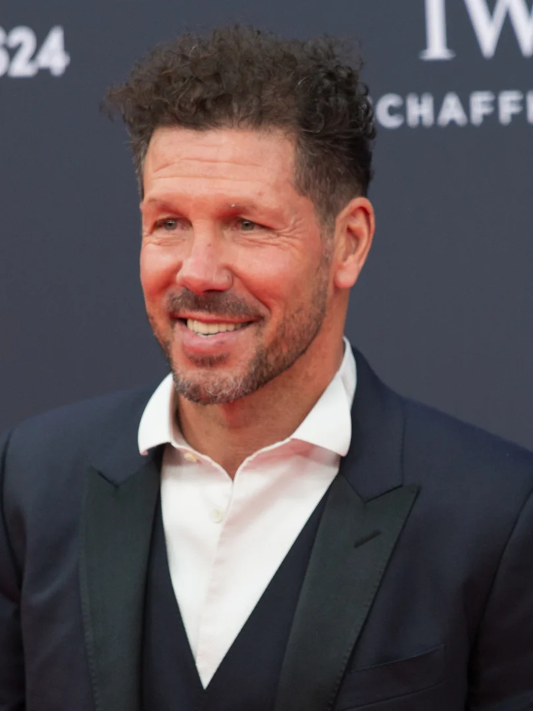 [source](https://upload.wikimedia.org/wikipedia/commons/9/9b/25th_Laureus_World_Sports_Awards_-_Red_Carpet_-_Diego_Simeone_-_240422_192621-2_%28cropped%29.jpg) | _No Commons `Category:Diego Simeone` found._ |

### Dino Zoff `dino-zoff`

| Current | Candidates |
|---------|------------|
|  [source](https://upload.wikimedia.org/wikipedia/commons/1/10/Dino_Zoff_-_1972_-_Juventus_FC.jpg) | _No Commons `Category:Dino Zoff` found._ |

### Dirk Kuyt `dirk-kuyt`

| Current | Candidates |
|---------|------------|
| 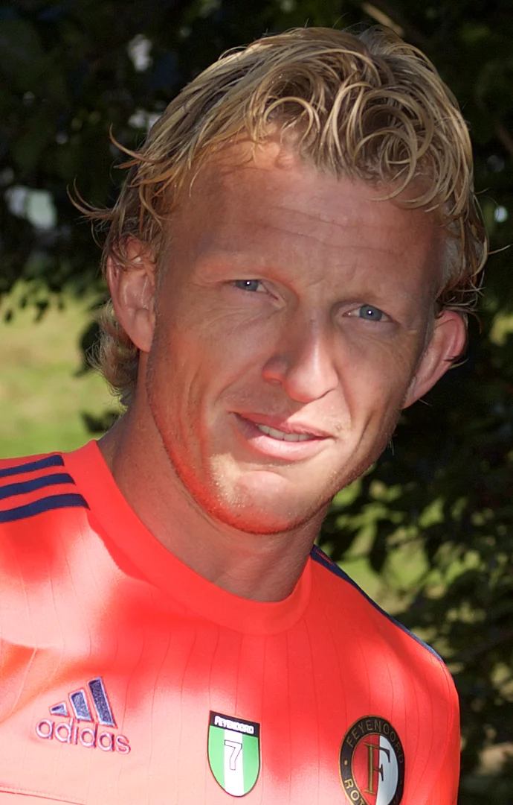 [source](https://upload.wikimedia.org/wikipedia/commons/9/98/Dirk_Kuijt-Feyenoord-DSC_0058_%28cropped%29.jpg) | _No Commons `Category:Dirk Kuyt` found._ |

### Djalma Santos `djalma-santos`

| Current | Candidates |
|---------|------------|
| 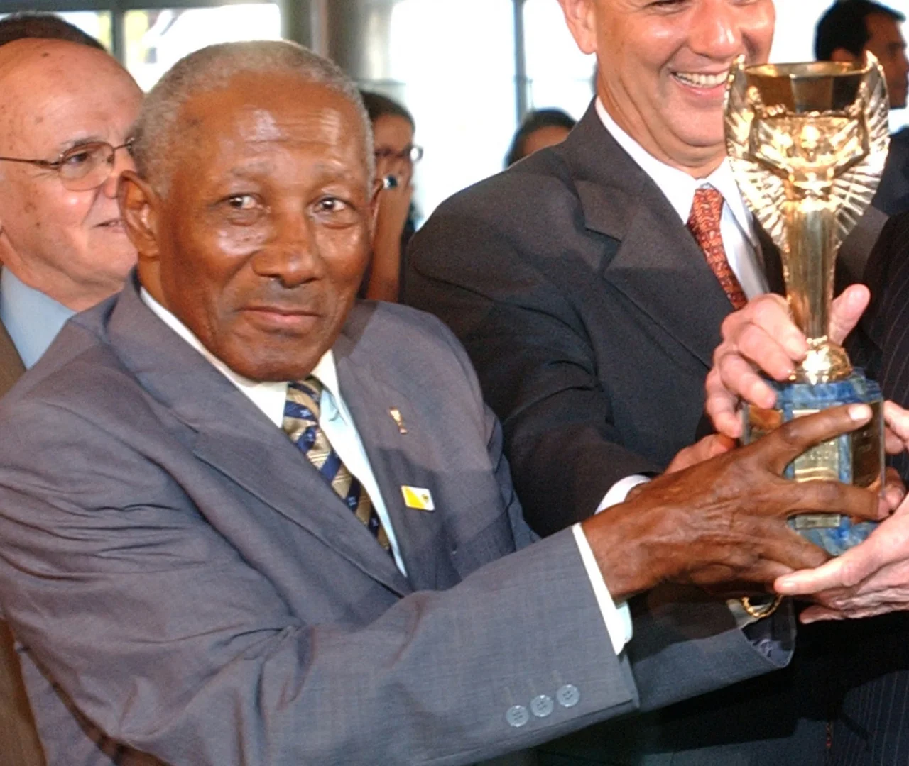 [source](https://upload.wikimedia.org/wikipedia/commons/3/36/Djalma_Santos.jpg) | _No Commons `Category:Djalma Santos` found._ |

### Dunga `dunga`

| Current | Candidates |
|---------|------------|
| 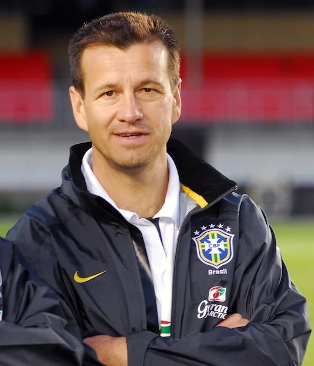 [source](https://upload.wikimedia.org/wikipedia/commons/6/66/Aecio_Neves_e_Dunga_-_17-06-2008_%288368243127%29_%28cropped%29.jpg) | _No Commons `Category:Dunga` found._ |

### Eden Hazard `eden-hazard`

| Current | Candidates |
|---------|------------|
| 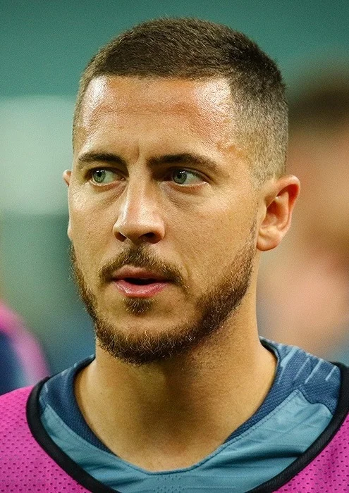 [source](https://upload.wikimedia.org/wikipedia/commons/4/46/Eden_Hazard_at_Baku_before_2019_UEFA_Europe_League_Final.jpg) | _No Commons `Category:Eden Hazard` found._ |

### Edgar Davids `edgar-davids`

| Current | Candidates |
|---------|------------|
| 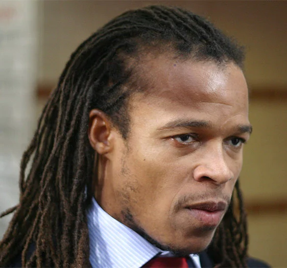 [source](https://upload.wikimedia.org/wikipedia/commons/e/ee/Edgar_Davids_%28cropped%29.jpg) | _No Commons `Category:Edgar Davids` found._ |

### Edinson Cavani `edinson-cavani`

| Current | Candidates |
|---------|------------|
| 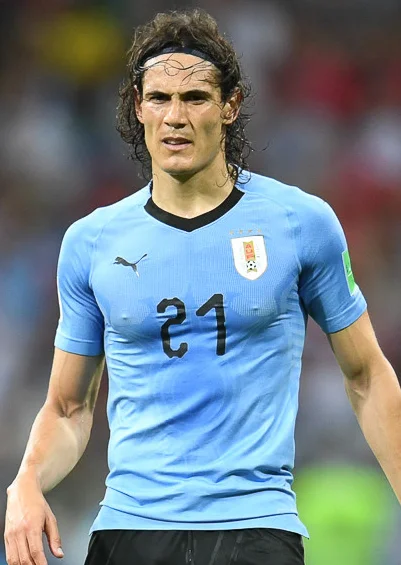 [source](https://upload.wikimedia.org/wikipedia/commons/9/9f/Edinson_Cavani_2018_%28cropped%29.jpg) | _No Commons `Category:Edinson Cavani` found._ |

### El Hadji Diouf `el-hadji-diouf`

| Current | Candidates |
|---------|------------|
| 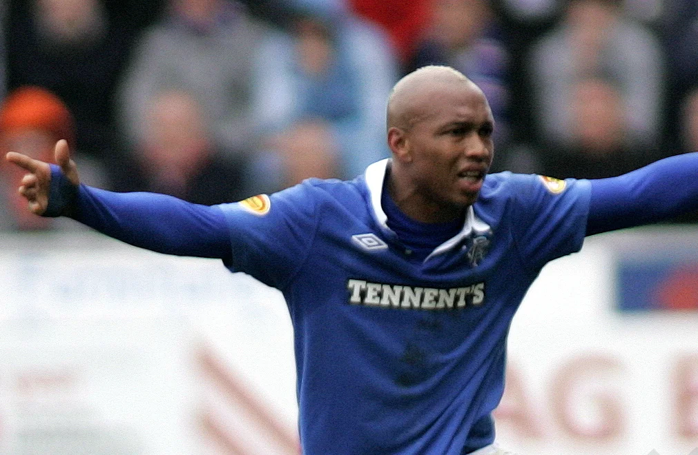 [source](https://upload.wikimedia.org/wikipedia/commons/f/f8/El_Hadji_Diouf.jpg) | _No Commons `Category:El Hadji Diouf` found._ |

### Emilio Butragueno `emilio-butragueno`

| Current | Candidates |
|---------|------------|
| 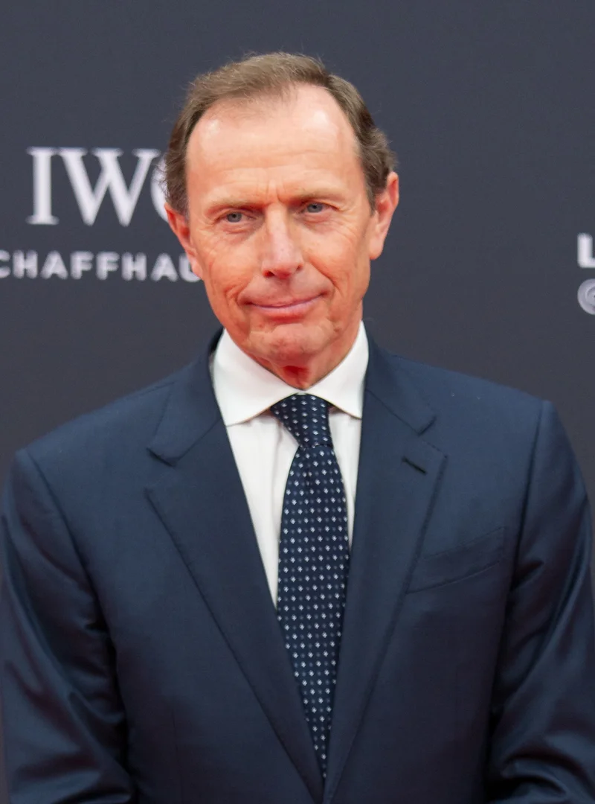 [source](https://upload.wikimedia.org/wikipedia/commons/8/8d/25th_Laureus_World_Sports_Awards_-_Red_Carpet_-_Emilio_Butrague%C3%B1o_-_240422_191751-2_%28cropped%29.jpg) | _No Commons `Category:Emilio Butragueno` found._ |

### Emmanuel Adebayor `emmanuel-adebayor`

| Current | Candidates |
|---------|------------|
| 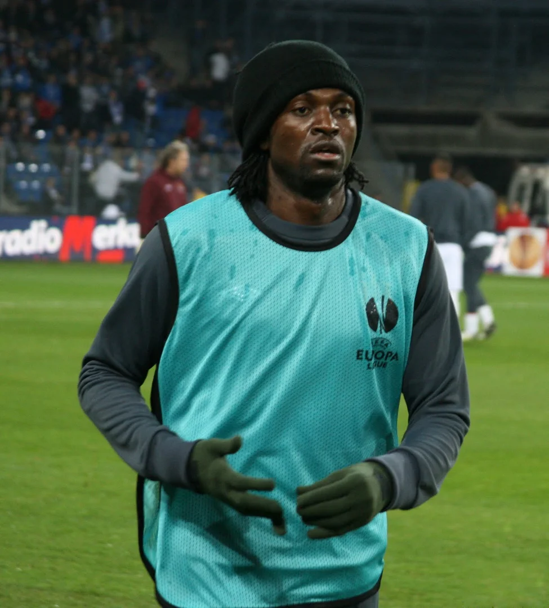 [source](https://upload.wikimedia.org/wikipedia/commons/4/47/Emmanuel_Adebayor_-_Lech_-_Manchester_026.jpg) | _No Commons `Category:Emmanuel Adebayor` found._ |

### Enzo Bearzot `enzo-bearzot`

| Current | Candidates |
|---------|------------|
| 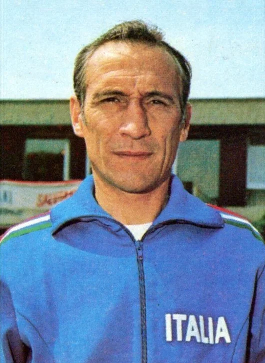 [source](https://upload.wikimedia.org/wikipedia/commons/4/40/Enzo_Bearzot_2.jpg) | _No Commons `Category:Enzo Bearzot` found._ |

### Erling Haaland `erling-haaland`

| Current | Candidates |
|---------|------------|
| 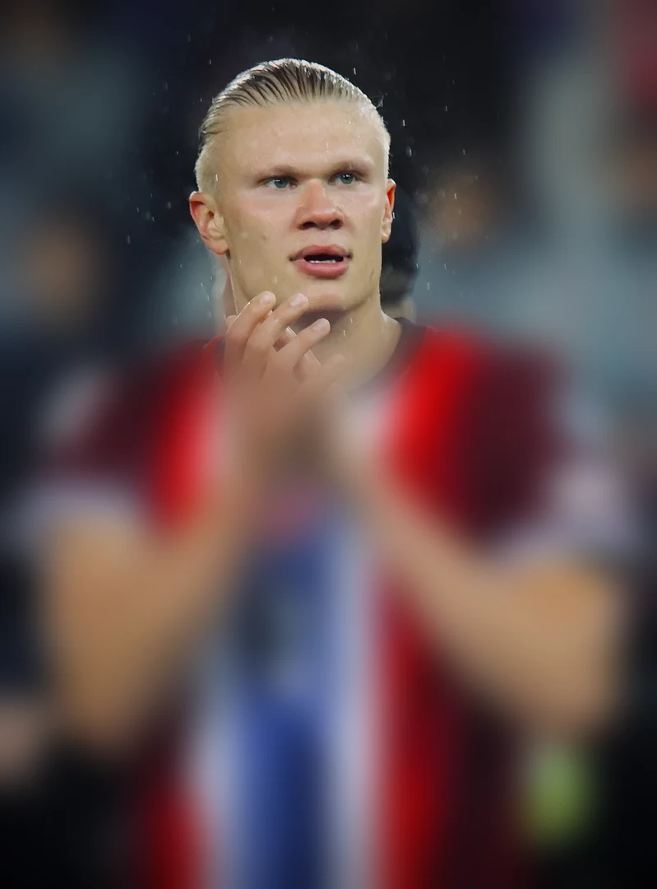 _(no batch-input)_ | _No Commons `Category:Erling Haaland` found._ |

### Esteban Cambiasso `esteban-cambiasso`

| Current | Candidates |
|---------|------------|
| 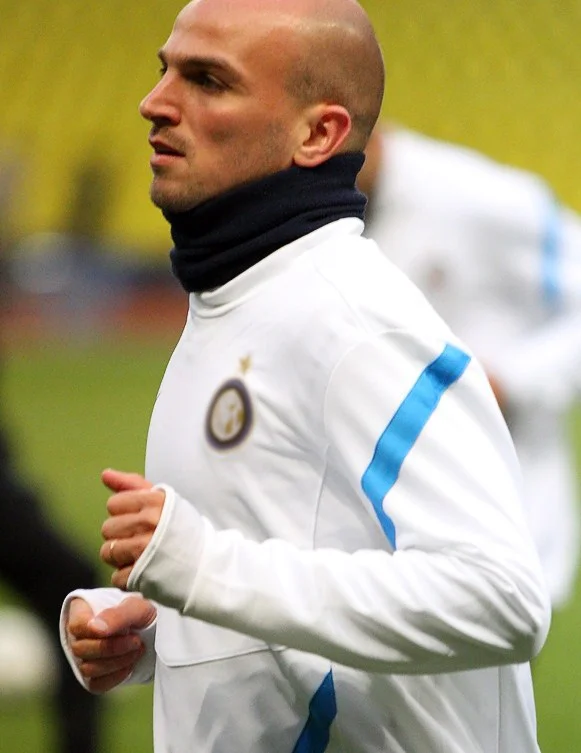 [source](https://upload.wikimedia.org/wikipedia/commons/0/08/Esteban_Cambiasso_FC_Internazionale.jpg) | _No Commons `Category:Esteban Cambiasso` found._ |

### Eusébio `eusebio`

| Current | Candidates |
|---------|------------|
| 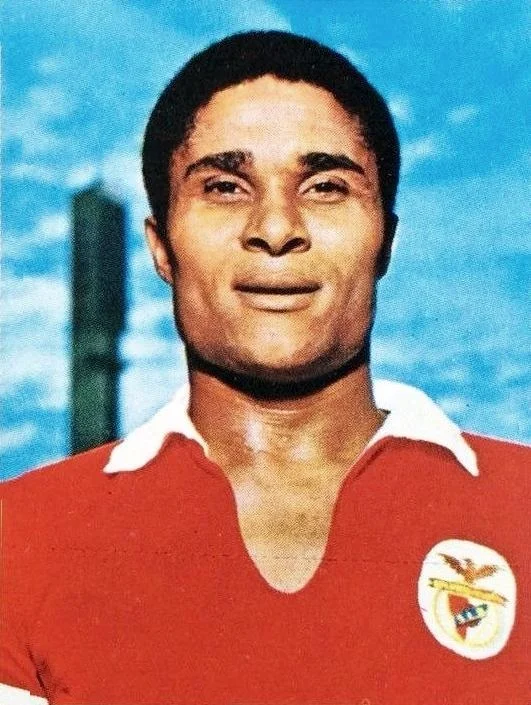 [source](https://upload.wikimedia.org/wikipedia/commons/5/55/Eusebio_en_1973.jpg) | _No Commons `Category:Eusébio` found._ |

### Fabio Cannavaro `fabio-cannavaro`

| Current | Candidates |
|---------|------------|
|  [source](https://upload.wikimedia.org/wikipedia/commons/5/50/Fabio_Cannavaro_in_world_cup_2006.jpg) | _No Commons `Category:Fabio Cannavaro` found._ |

### Fernando Hierro `fernando-hierro`

| Current | Candidates |
|---------|------------|
| 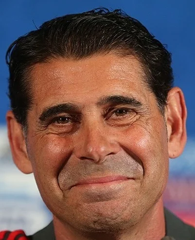 [source](https://upload.wikimedia.org/wikipedia/commons/2/29/Fernando_Hierro_in_Spain-Iran_press_conference_2018-06-19.jpg) | _No Commons `Category:Fernando Hierro` found._ |

### Fernando Santos `fernando-santos`

| Current | Candidates |
|---------|------------|
| 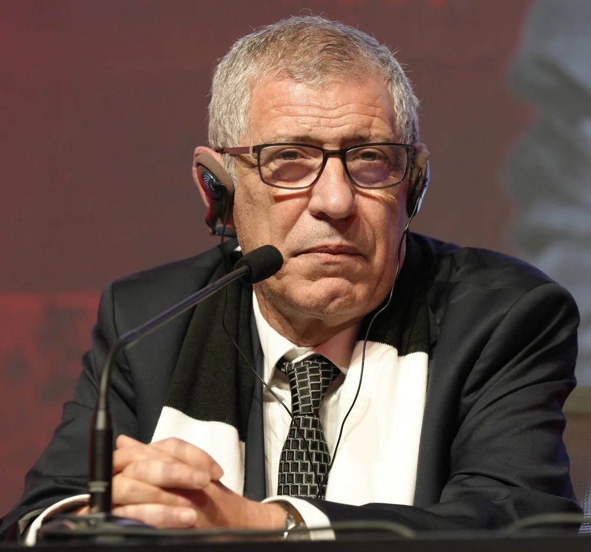 [source](https://upload.wikimedia.org/wikipedia/commons/a/ae/Fernando_Santos_20240116_1.jpg) | _No Commons `Category:Fernando Santos` found._ |

### Francesco Totti `francesco-totti`

| Current | Candidates |
|---------|------------|
|  [source](https://upload.wikimedia.org/wikipedia/commons/9/99/Italy_vs_France_-_FIFA_World_Cup_2006_final_-_Francesco_Totti.jpg) | _No Commons `Category:Francesco Totti` found._ |

### Franco Baresi `franco-baresi`

| Current | Candidates |
|---------|------------|
| 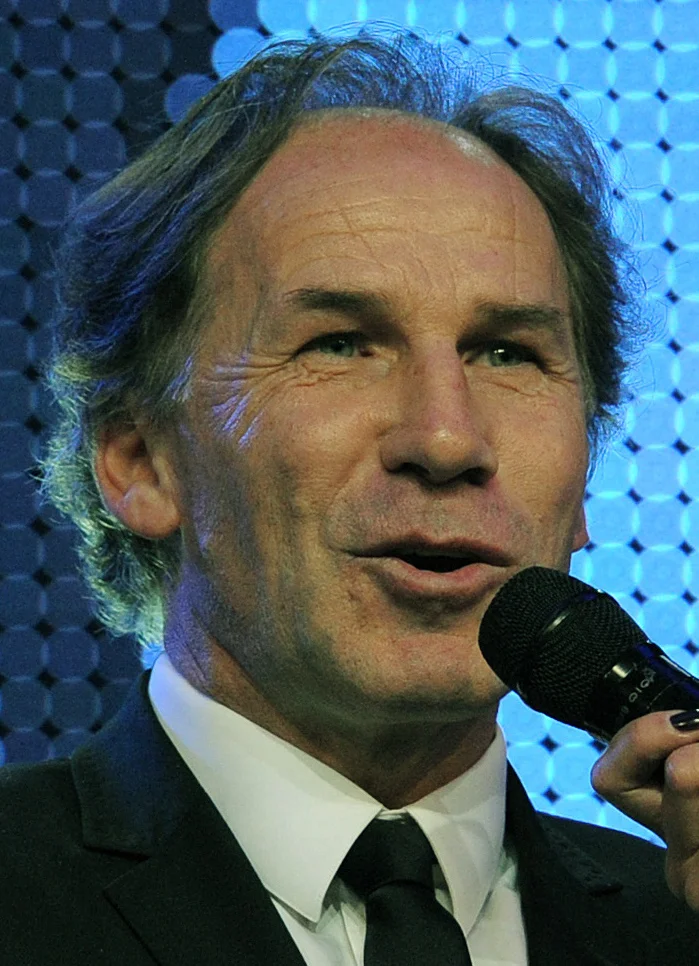 _(no batch-input)_ | _No Commons `Category:Franco Baresi` found._ |

### Frank Lampard `frank-lampard`

| Current | Candidates |
|---------|------------|
| 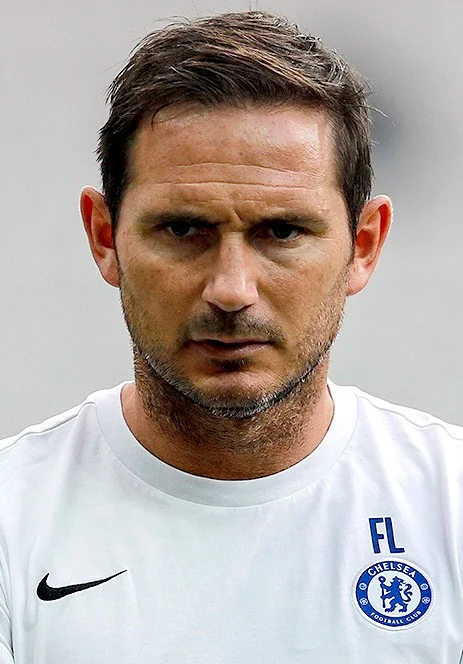 [source](https://upload.wikimedia.org/wikipedia/commons/8/8c/Frank_Lampard_2019.jpg) | _No Commons `Category:Frank Lampard` found._ |

### Frank Rijkaard `frank-rijkaard`

| Current | Candidates |
|---------|------------|
| 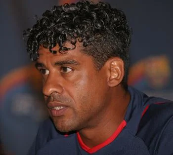 [source](https://upload.wikimedia.org/wikipedia/commons/4/4a/FrankRijkaard2.jpg) | _No Commons `Category:Frank Rijkaard` found._ |

### Franz Beckenbauer `franz-beckenbauer`

| Current | Candidates |
|---------|------------|
| 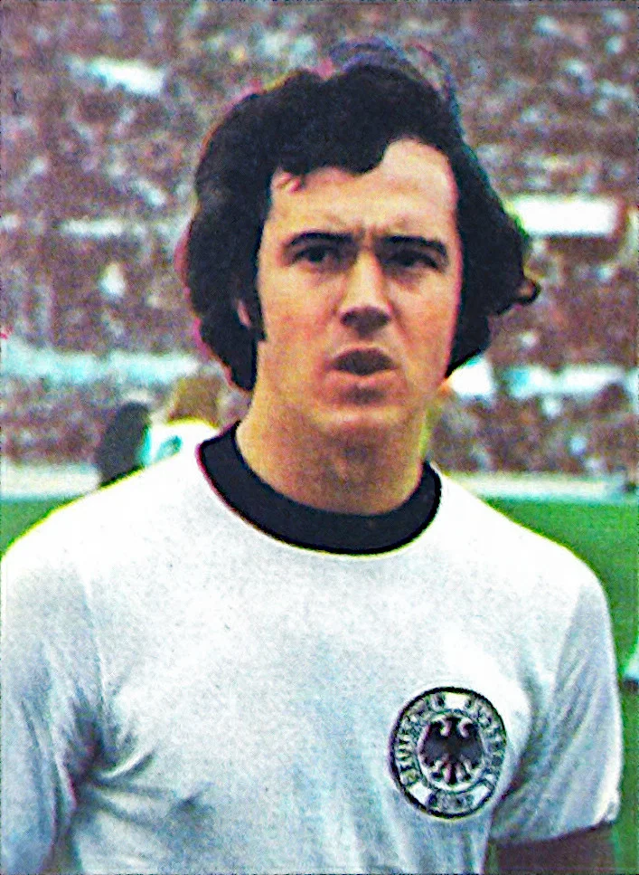 [source](https://upload.wikimedia.org/wikipedia/commons/5/56/Franz_Beckenbauer_%281975%29.jpg) | _No Commons `Category:Franz Beckenbauer` found._ |

### Fred `fred`

| Current | Candidates |
|---------|------------|
|  [source](https://upload.wikimedia.org/wikipedia/commons/b/ba/Fred_Silver_Boot%2C_Confederations_Cup_2013.jpg) | _No Commons `Category:Fred` found._ |

### Frenkie De Jong `frenkie-de-jong`

| Current | Candidates |
|---------|------------|
| 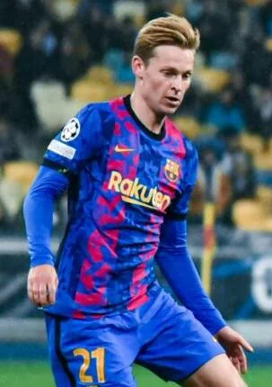 [source](https://upload.wikimedia.org/wikipedia/commons/4/42/%D0%9C%D0%B0%D1%82%D1%87_%C2%AB%D0%94%D0%B8%D0%BD%D0%B0%D0%BC%D0%BE%C2%BB_-_%C2%AB%D0%91%D0%B0%D1%80%D1%81%D0%B5%D0%BB%D0%BE%D0%BD%D0%B0%C2%BB_0-1._2_%D0%BD%D0%BE%D1%8F%D0%B1%D1%80%D1%8F_2021_%D0%B3%D0%BE%D0%B4%D0%B0._II_%E2%80%94_1289671_%28cropped%29.jpg) | _No Commons `Category:Frenkie De Jong` found._ |

### Fritz Walter `fritz-walter`

| Current | Candidates |
|---------|------------|
| 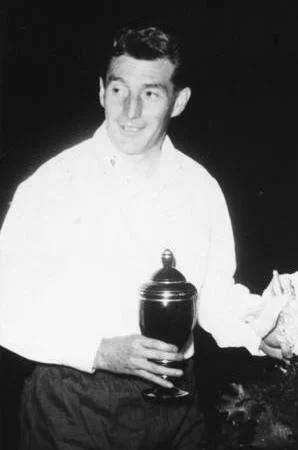 [source](https://upload.wikimedia.org/wikipedia/commons/a/aa/Fritz_Walter_cropped_2.JPG) | _No Commons `Category:Fritz Walter` found._ |

### Gaetano Scirea `gaetano-scirea`

| Current | Candidates |
|---------|------------|
| 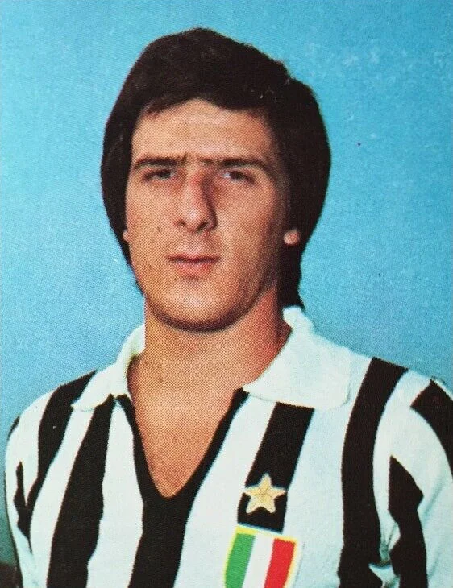 [source](https://upload.wikimedia.org/wikipedia/commons/5/5e/1975%E2%80%9376_Juventus_FC_-_Gaetano_Scirea.jpg) | _No Commons `Category:Gaetano Scirea` found._ |

### Gareth Bale `gareth-bale`

| Current | Candidates |
|---------|------------|
| 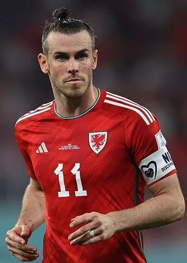 [source](https://upload.wikimedia.org/wikipedia/commons/1/1e/2022_FIFA_World_Cup_United_States_1%E2%80%931_Wales_-_%2832%29_%28cropped%29.jpg) | _No Commons `Category:Gareth Bale` found._ |

### Gennaro Gattuso `gennaro-gattuso`

| Current | Candidates |
|---------|------------|
| 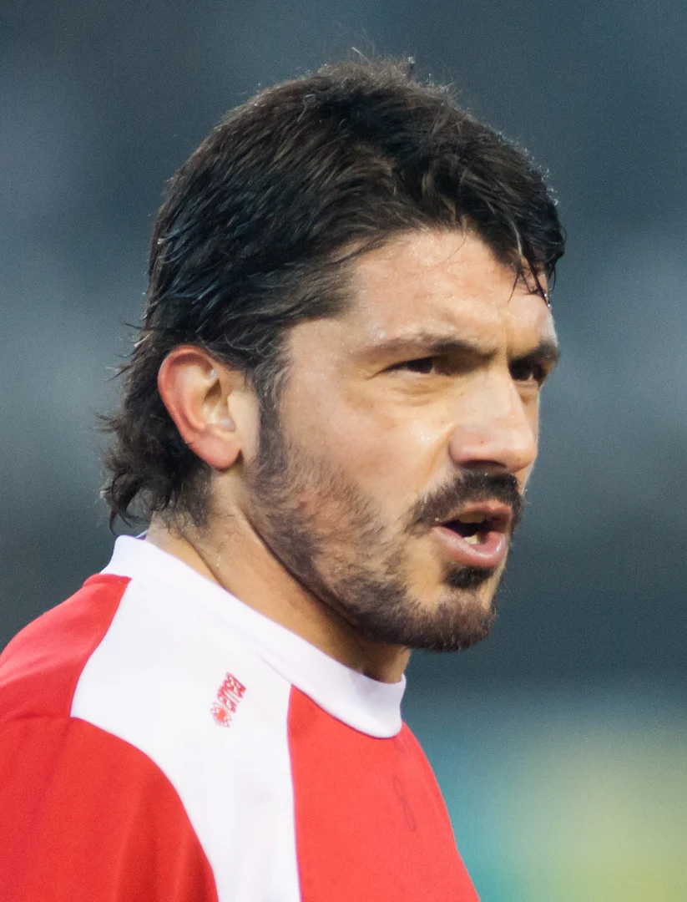 [source](https://upload.wikimedia.org/wikipedia/commons/0/01/Lausanne_vs_Sion_27_february_2013_-_Gennaro_Gattuso.jpg) | _No Commons `Category:Gennaro Gattuso` found._ |

### George Best `george-best`

| Current | Candidates |
|---------|------------|
| 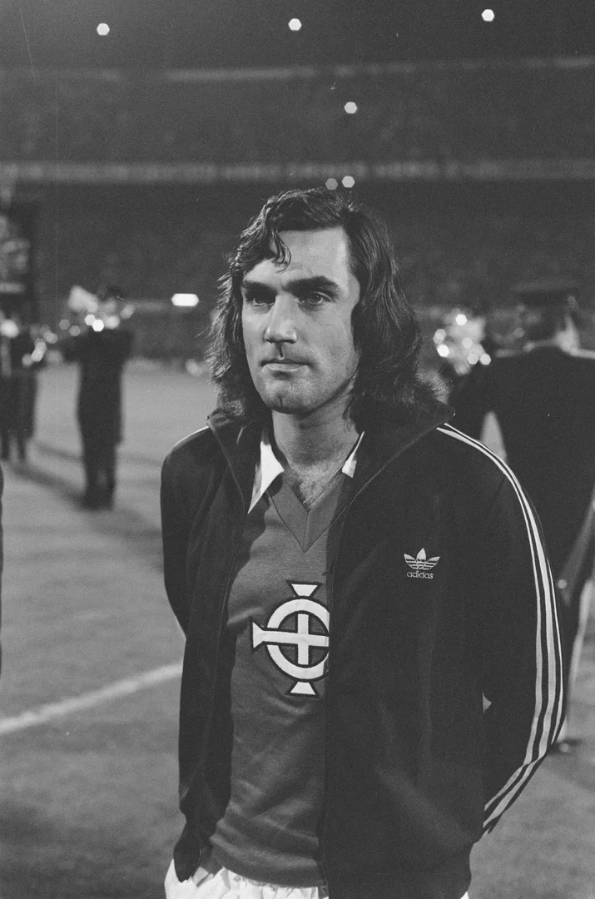 [source](https://upload.wikimedia.org/wikipedia/commons/b/b7/Nederland_tegen_Noord_Ierland_George_Best_%2C_kop%2C_Bestanddeelnr_928-8290.jpg) | _No Commons `Category:George Best` found._ |

### Gerard Piqué `gerard-pique`

| Current | Candidates |
|---------|------------|
| 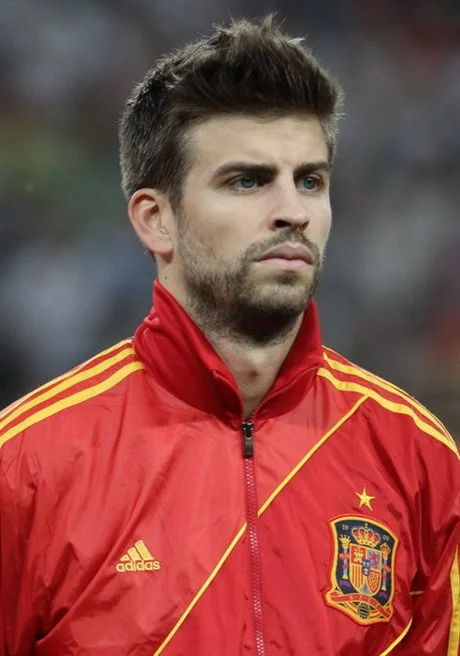 [source](https://upload.wikimedia.org/wikipedia/commons/f/f2/Gerard_Piqu%C3%A9_Euro_2012_vs_France_01.jpg) | _No Commons `Category:Gerard Piqué` found._ |

### Gerd Müller `gerd-muller`

| Current | Candidates |
|---------|------------|
| 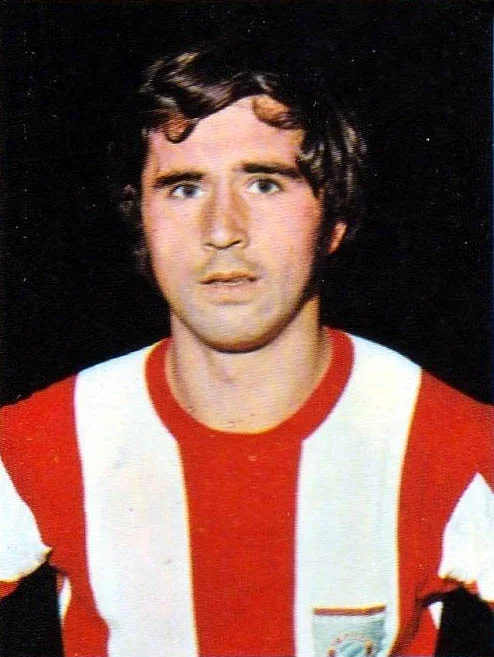 [source](https://upload.wikimedia.org/wikipedia/commons/9/9a/Gerd_M%C3%BCller_c1973_%28cropped%29.jpg) | _No Commons `Category:Gerd Müller` found._ |

### Gianluca Zambrotta `gianluca-zambrotta`

| Current | Candidates |
|---------|------------|
| 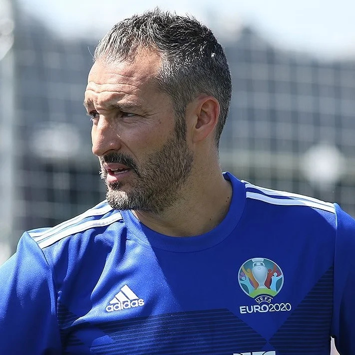 [source](https://upload.wikimedia.org/wikipedia/commons/2/24/Gianluca_Zambrotta_2019_%28cropped%29.jpg) | _No Commons `Category:Gianluca Zambrotta` found._ |

### Gianluigi Buffon `gianluigi-buffon`

| Current | Candidates |
|---------|------------|
| 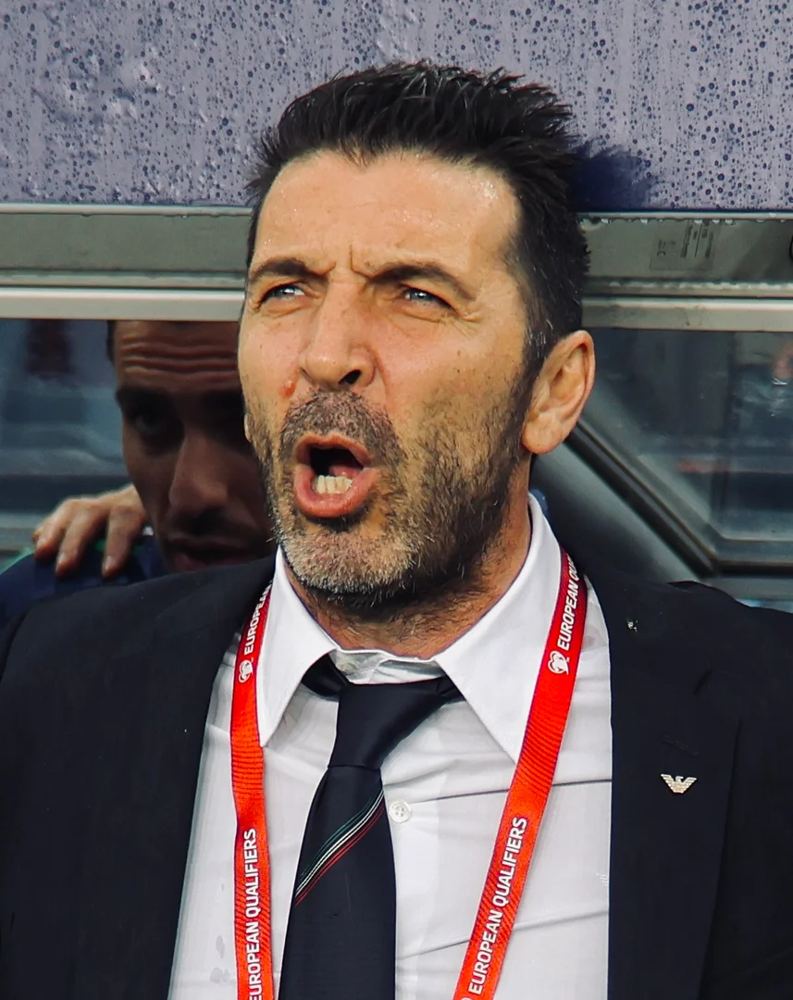 [source](https://upload.wikimedia.org/wikipedia/commons/d/d7/Norway_Italy_-_June_2025_A_44_%28Gianluigi_Buffon%29.jpg) | _No Commons `Category:Gianluigi Buffon` found._ |

### Giuseppe Meazza `giuseppe-meazza`

| Current | Candidates |
|---------|------------|
| 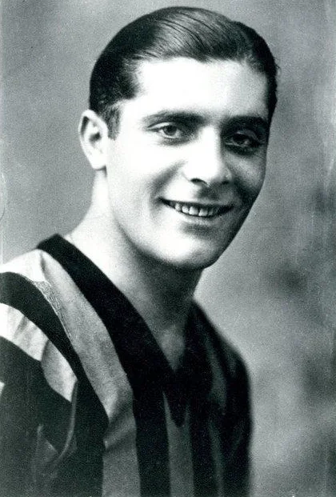 [source](https://upload.wikimedia.org/wikipedia/commons/1/19/Giuseppe_Meazza_1935.jpg) | _No Commons `Category:Giuseppe Meazza` found._ |

### Glenn Hoddle `glenn-hoddle`

| Current | Candidates |
|---------|------------|
| 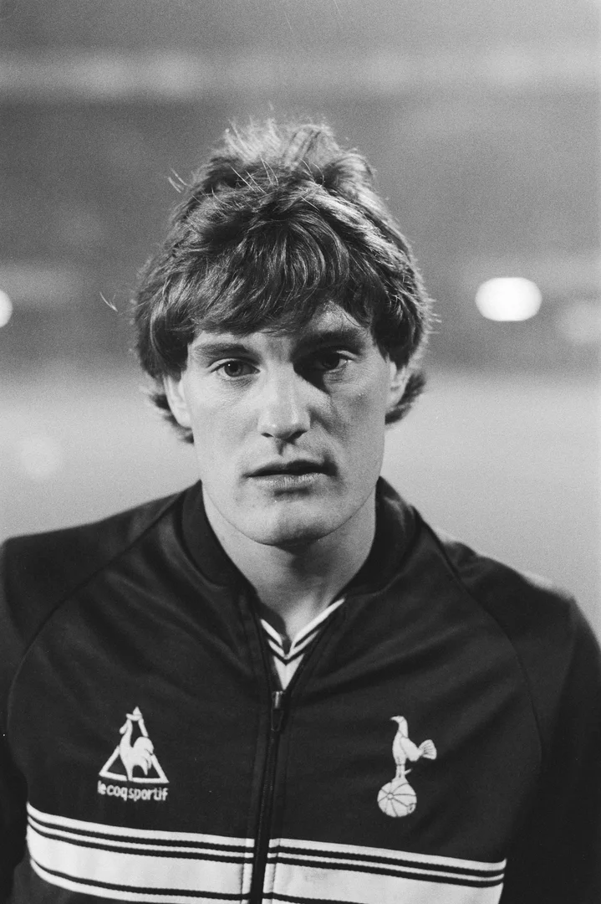 [source](https://upload.wikimedia.org/wikipedia/commons/e/e0/Glenn_Hoddle_2014_%28cropped%29.jpg) | _No Commons `Category:Glenn Hoddle` found._ |

### Gonzalo Higuain `gonzalo-higuain`

| Current | Candidates |
|---------|------------|
| 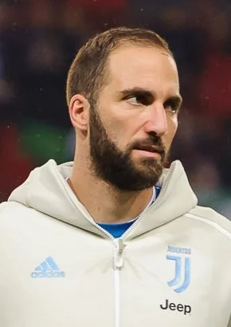 [source](https://upload.wikimedia.org/wikipedia/commons/7/72/Gonzalo_Higua%C3%ADn_2019.jpg) | _No Commons `Category:Gonzalo Higuain` found._ |

### Guillermo Ochoa `guillermo-ochoa`

| Current | Candidates |
|---------|------------|
| 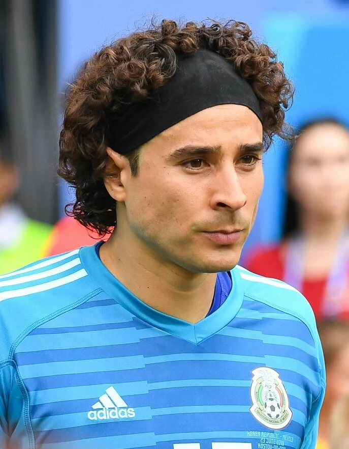 [source](https://upload.wikimedia.org/wikipedia/commons/2/2f/Mex-Kor_%281%29_%28cropped%29.jpg) | _No Commons `Category:Guillermo Ochoa` found._ |

### Guus Hiddink `guus-hiddink`

| Current | Candidates |
|---------|------------|
| 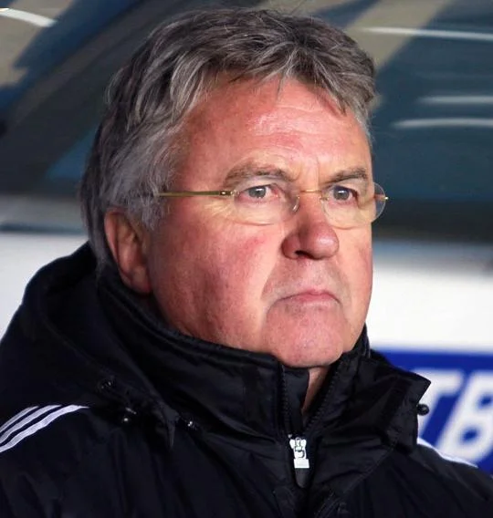 [source](https://upload.wikimedia.org/wikipedia/commons/5/5c/Guus_Hiddink_2012.jpg) | _No Commons `Category:Guus Hiddink` found._ |

### Hans Peter Briegel `hans-peter-briegel`

| Current | Candidates |
|---------|------------|
| 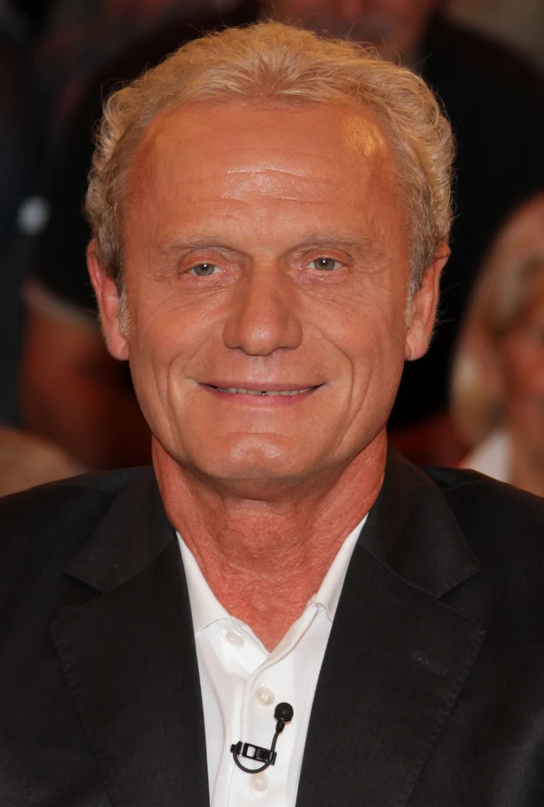 [source](https://upload.wikimedia.org/wikipedia/commons/d/d4/6633_Hans_Peter_Briegel_%28cropped%29.JPG) | _No Commons `Category:Hans Peter Briegel` found._ |

### Harry Kane `harry-kane`

| Current | Candidates |
|---------|------------|
| 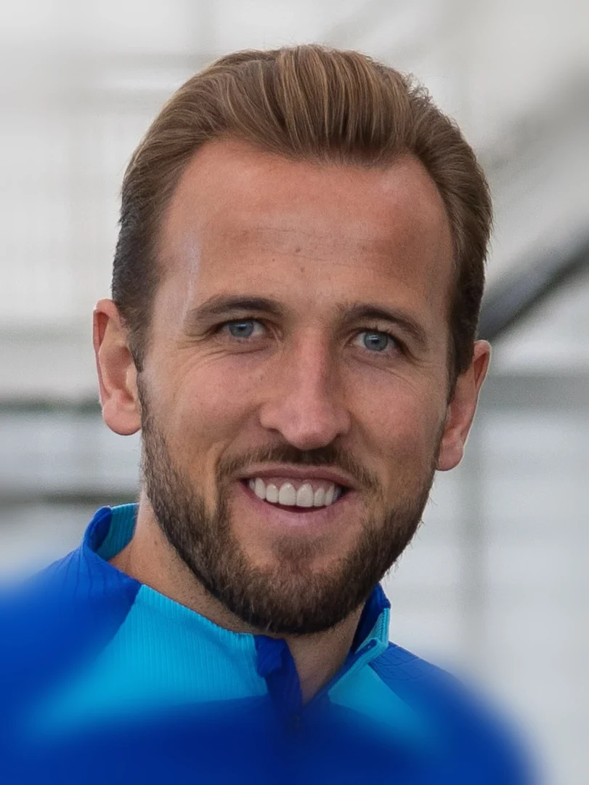 _(no batch-input)_ | _No Commons `Category:Harry Kane` found._ |

### Harry Kewell `harry-kewell`

| Current | Candidates |
|---------|------------|
| 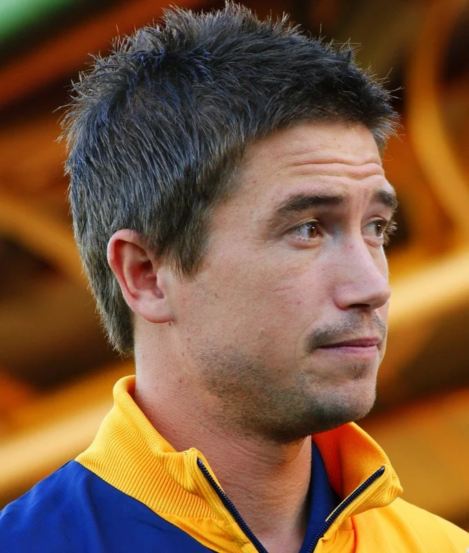 [source](https://upload.wikimedia.org/wikipedia/commons/b/b2/HarryKewell.jpg) | _No Commons `Category:Harry Kewell` found._ |

### Héctor Cúper `hector-cuper`

| Current | Candidates |
|---------|------------|
| 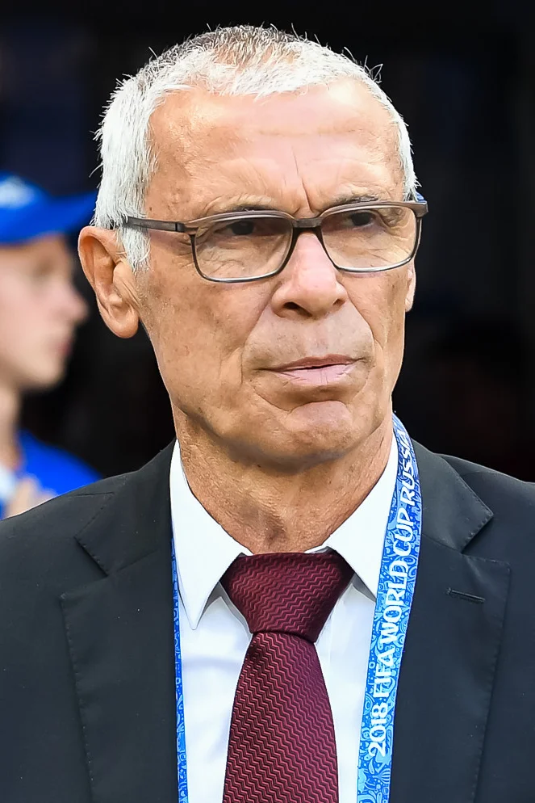 [source](https://upload.wikimedia.org/wikipedia/commons/5/54/H%C3%A9ctor_C%C3%BAper.jpg) | _No Commons `Category:Héctor Cúper` found._ |

### Helmut Rahn `helmut-rahn`

| Current | Candidates |
|---------|------------|
| 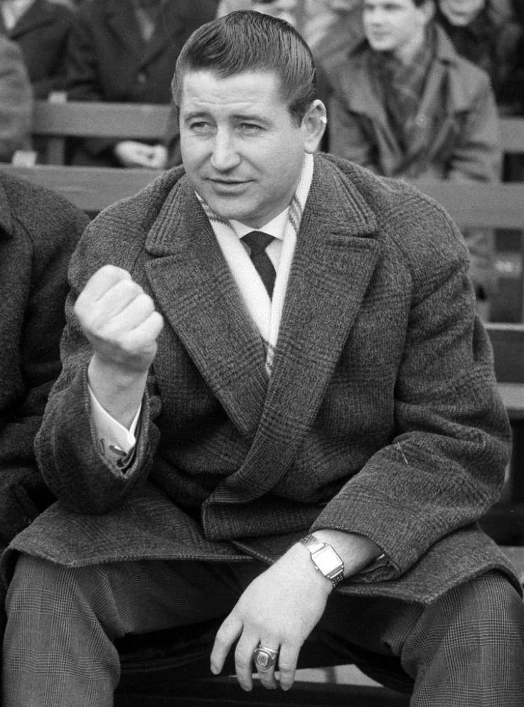 [source](https://upload.wikimedia.org/wikipedia/commons/4/4b/Helmut_Rahn.jpg) | _No Commons `Category:Helmut Rahn` found._ |

### Helmut Schön `helmut-schon`

| Current | Candidates |
|---------|------------|
| 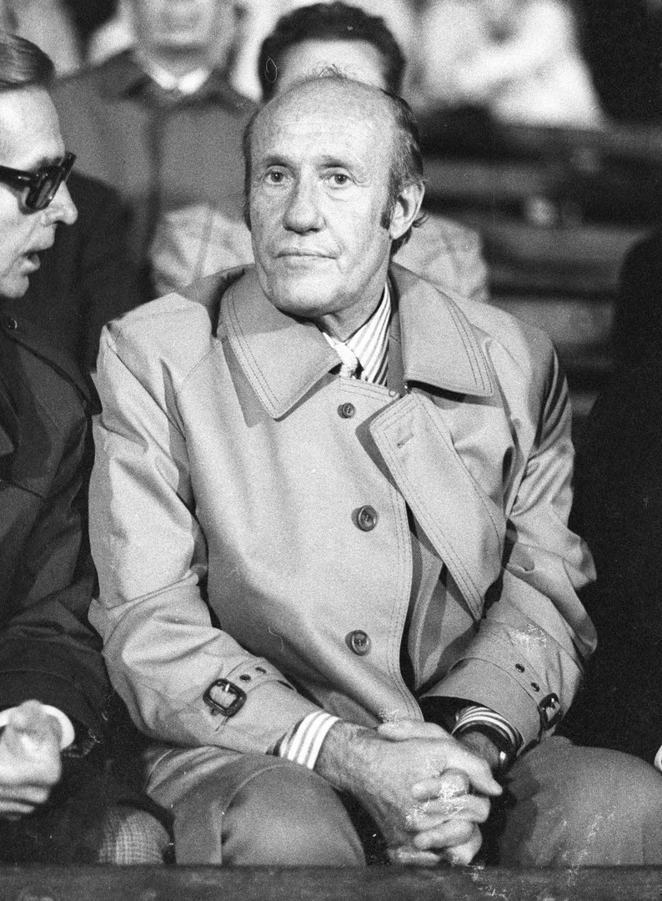 [source](https://upload.wikimedia.org/wikipedia/commons/9/92/Fu%C3%9Fball-Bundestrainer_Helmut_Sch%C3%B6n_%28Kiel_87.306%29.jpg) | _No Commons `Category:Helmut Schön` found._ |

### Henrik Larsson `henrik-larsson`

| Current | Candidates |
|---------|------------|
| 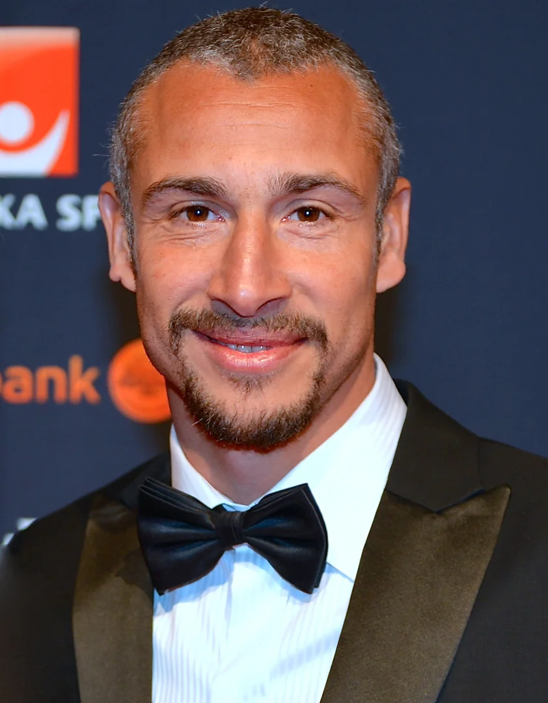 [source](https://upload.wikimedia.org/wikipedia/commons/8/86/Henrik_Larsson_Euro_2004.jpg) | _No Commons `Category:Henrik Larsson` found._ |

### Hernan Crespo `hernan-crespo`

| Current | Candidates |
|---------|------------|
| 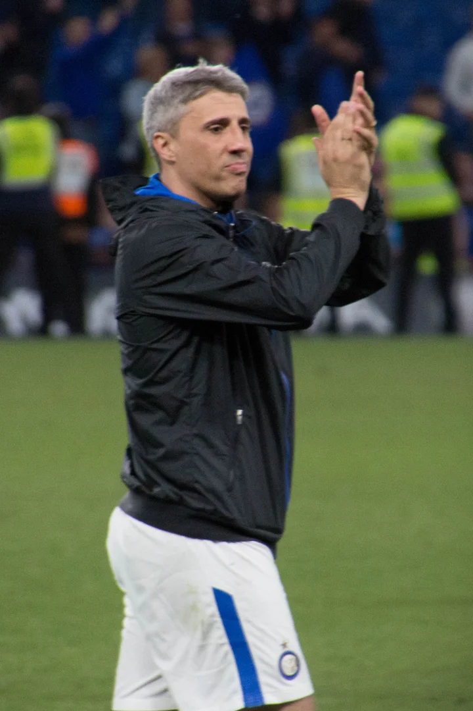 [source](https://upload.wikimedia.org/wikipedia/commons/9/9f/Chelsea_Legends_1_Inter_Forever_4_%2827457022797%29.jpg) | _No Commons `Category:Hernan Crespo` found._ |

### Hidetoshi Nakata `hidetoshi-nakata`

| Current | Candidates |
|---------|------------|
| 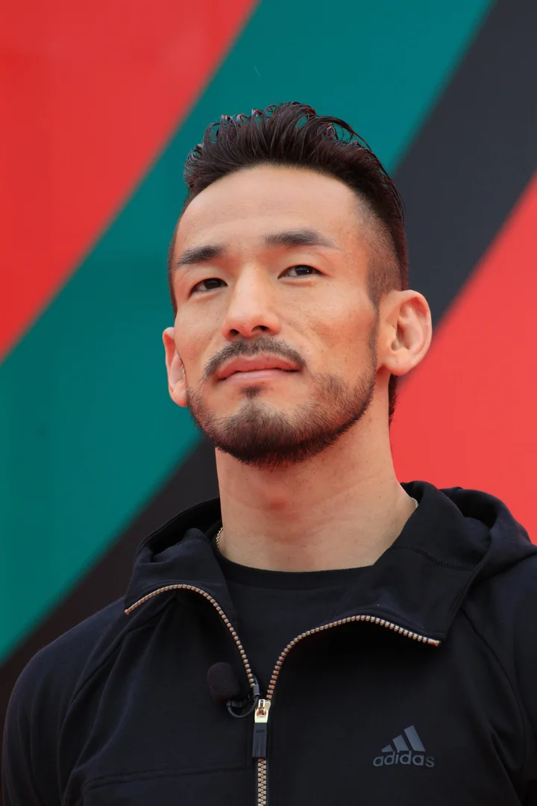 [source](https://upload.wikimedia.org/wikipedia/commons/e/eb/Hidetoshi_Nakata_in_Okinawa.jpg) | _No Commons `Category:Hidetoshi Nakata` found._ |

### Hugo Lloris `hugo-lloris`

| Current | Candidates |
|---------|------------|
| 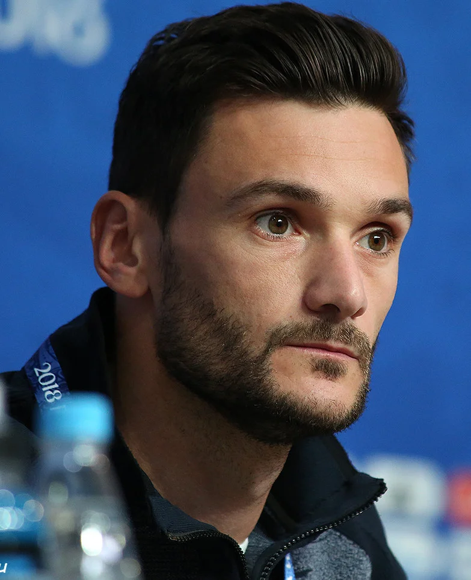 [source](https://upload.wikimedia.org/wikipedia/commons/c/ca/Lloris_2018_%28cropped%29.jpg) | _No Commons `Category:Hugo Lloris` found._ |

### Hugo Sanchez `hugo-sanchez`

| Current | Candidates |
|---------|------------|
| 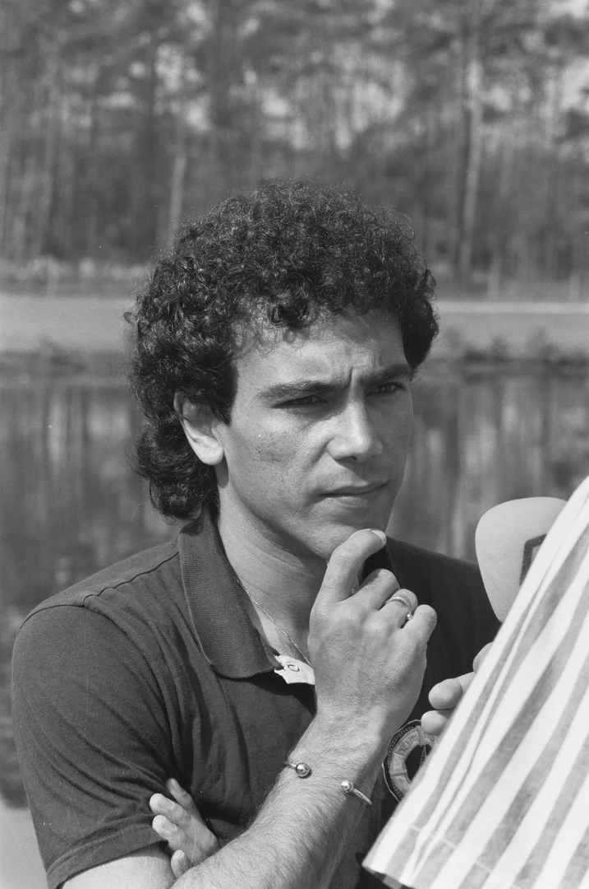 [source](https://upload.wikimedia.org/wikipedia/commons/9/9e/Huguito.jpg) | _No Commons `Category:Hugo Sanchez` found._ |

### Ian Rush `ian-rush`

| Current | Candidates |
|---------|------------|
| 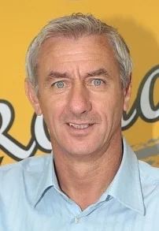 [source](https://upload.wikimedia.org/wikipedia/commons/9/9b/Ian_Rush_2012.jpg) | _No Commons `Category:Ian Rush` found._ |

### Iker Casillas `iker-casillas`

| Current | Candidates |
|---------|------------|
| 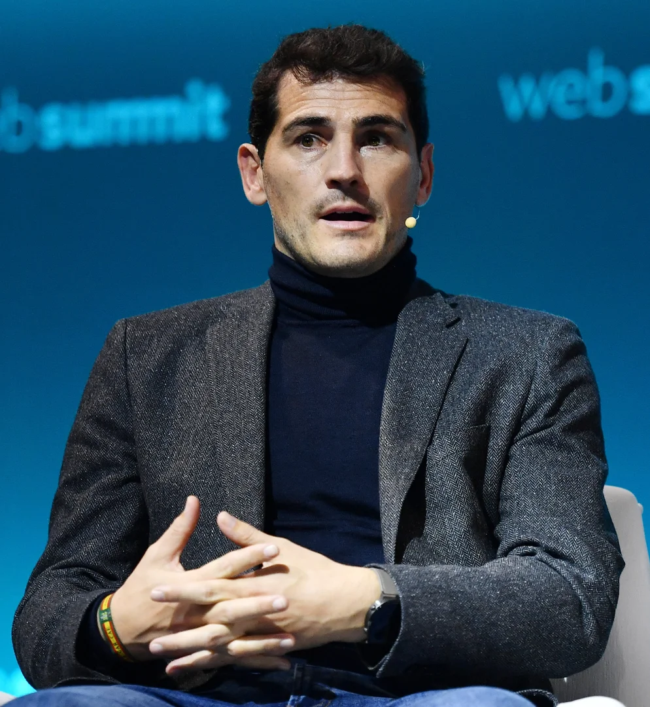 [source](https://upload.wikimedia.org/wikipedia/commons/3/33/Iker_Casillas_and_Xavi_Euro_2012_trophy.jpg) | _No Commons `Category:Iker Casillas` found._ |

### Ivan Rakitic `ivan-rakitic`

| Current | Candidates |
|---------|------------|
| 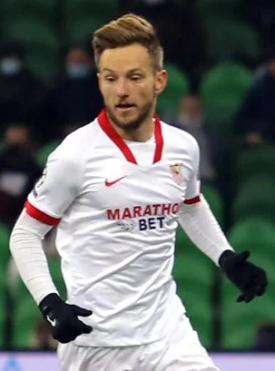 [source](https://upload.wikimedia.org/wikipedia/commons/f/f0/Ivan_Rakiti%C4%87_2020_%28cropped%29.jpg) | _No Commons `Category:Ivan Rakitic` found._ |

### Jairzinho `jairzinho`

| Current | Candidates |
|---------|------------|
| 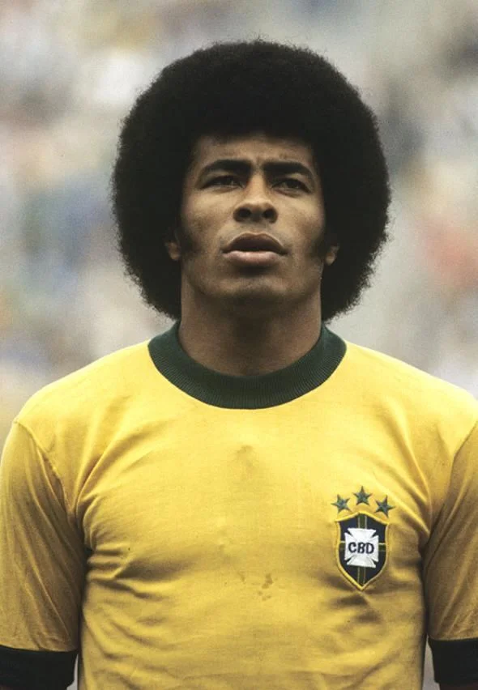 [source](https://upload.wikimedia.org/wikipedia/commons/8/8f/Jairzinho_1970s.jpg) | _No Commons `Category:Jairzinho` found._ |

### James Rodriguez `james-rodriguez`

| Current | Candidates |
|---------|------------|
|  [source](https://upload.wikimedia.org/wikipedia/commons/7/79/James_Rodriguez_2018.jpg) | _No Commons `Category:James Rodriguez` found._ |

### Jan Ceulemans `jan-ceulemans`

| Current | Candidates |
|---------|------------|
|  [source](https://upload.wikimedia.org/wikipedia/commons/c/c5/Jan_Ceulemans.jpg) | _No Commons `Category:Jan Ceulemans` found._ |

### Javier Aguirre `javier-aguirre`

| Current | Candidates |
|---------|------------|
|  [source](https://upload.wikimedia.org/wikipedia/commons/b/b4/Javier_Aguirre.png) | _No Commons `Category:Javier Aguirre` found._ |

### Javier Hernandez `javier-hernandez`

| Current | Candidates |
|---------|------------|
|  [source](https://upload.wikimedia.org/wikipedia/commons/9/95/Hertha_BSC_vs._West_Ham_United_20190731_%28139%29.jpg) | _No Commons `Category:Javier Hernandez` found._ |

### Javier Mascherano `javier-mascherano`

| Current | Candidates |
|---------|------------|
|  [source](https://upload.wikimedia.org/wikipedia/commons/9/9a/Javier_Mascherano_NE_Revolution_Inter_Miami_7.9.25-040_%28cropped%29.jpg) | _No Commons `Category:Javier Mascherano` found._ |

### Javier Zanetti `javier-zanetti`

| Current | Candidates |
|---------|------------|
|  [source](https://upload.wikimedia.org/wikipedia/commons/e/e7/Metalist-Inter_%282%29.jpg) | _No Commons `Category:Javier Zanetti` found._ |

### Joachim Löw `joachim-low`

| Current | Candidates |
|---------|------------|
|  [source](https://upload.wikimedia.org/wikipedia/commons/2/2d/20180602_FIFA_Friendly_Match_Austria_vs._Germany_Jogi_L%C3%B6w_850_1386.jpg) | _No Commons `Category:Joachim Löw` found._ |

### João Félix `joao-felix`

| Current | Candidates |
|---------|------------|
|  [source](https://upload.wikimedia.org/wikipedia/commons/5/55/Jo%C3%A3o_F%C3%A9lix_USMNT_v_Portugal_Mar_31_2026-22_%28cropped%29.jpg) | _No Commons `Category:João Félix` found._ |

### Joaquin `joaquin`

| Current | Candidates |
|---------|------------|
|  [source](https://upload.wikimedia.org/wikipedia/commons/f/ff/Joaquin_2022_%28cropped%29.jpg) | _No Commons `Category:Joaquin` found._ |

### Johan Cruyff `johan-cruyff`

| Current | Candidates |
|---------|------------|
|  [source](https://upload.wikimedia.org/wikipedia/commons/c/cb/Johan_Cruijff_%281974%29.jpg) | _No Commons `Category:Johan Cruyff` found._ |

### John Terry `john-terry`

| Current | Candidates |
|---------|------------|
|  [source](https://upload.wikimedia.org/wikipedia/commons/c/c3/John_Terry_at_pro-am_Wentworth_golf_course_September_2023_%28cropped%29.jpg) | _No Commons `Category:John Terry` found._ |

### José Pekerman `jose-pekerman`

| Current | Candidates |
|---------|------------|
|  [source](https://upload.wikimedia.org/wikipedia/commons/5/59/Jos%C3%A9_N%C3%A9stor_P%C3%A9kerman_and_Police_at_Colombia_vs_Uruguay_match_for_Russia_2018_%28cropped%29.jpg) | _No Commons `Category:José Pekerman` found._ |

### Juan Mata `juan-mata`

| Current | Candidates |
|---------|------------|
|  [source](https://upload.wikimedia.org/wikipedia/commons/6/63/Juan_Mata_Melbourne_Victory_Signing_Press_Conference.png) | _No Commons `Category:Juan Mata` found._ |

### Juan Sebastian Veron `juan-sebastian-veron`

| Current | Candidates |
|---------|------------|
|  [source](https://upload.wikimedia.org/wikipedia/commons/2/27/Juan_Sebastian_Veron_2017.jpg) | _No Commons `Category:Juan Sebastian Veron` found._ |

### Jules Kounde `jules-kounde`

| Current | Candidates |
|---------|------------|
|  [source](https://upload.wikimedia.org/wikipedia/commons/b/bd/Jules_Kound%C3%A9_2020.jpg) | _No Commons `Category:Jules Kounde` found._ |

### Julio Cesar `julio-cesar`

| Current | Candidates |
|---------|------------|
|  [source](https://upload.wikimedia.org/wikipedia/commons/a/a8/J%C3%BAlio_C%C3%A9sar_FC_Internazionale.jpg) | _No Commons `Category:Julio Cesar` found._ |

### Jupp Derwall `jupp-derwall`

| Current | Candidates |
|---------|------------|
|  [source](https://upload.wikimedia.org/wikipedia/commons/c/ce/Derwall1.jpg) | _No Commons `Category:Jupp Derwall` found._ |

### Jurgen Klinsmann `jurgen-klinsmann`

| Current | Candidates |
|---------|------------|
|  [source](https://upload.wikimedia.org/wikipedia/commons/a/af/J%C3%BCrgen_Klinsmann_14021113000678638425063004371092_64131.jpg) | _No Commons `Category:Jurgen Klinsmann` found._ |

### Karl Heinz Rummenigge `karl-heinz-rummenigge`

| Current | Candidates |
|---------|------------|
|  [source](https://upload.wikimedia.org/wikipedia/commons/f/fc/2015-02-06_Rummenigge_0370_%28cropped%29.JPG) | _No Commons `Category:Karl Heinz Rummenigge` found._ |

### Keisuke Honda `keisuke-honda`

| Current | Candidates |
|---------|------------|
| 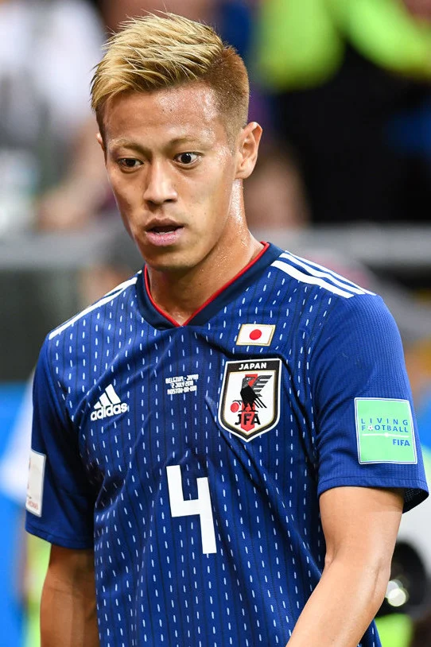 [source](https://upload.wikimedia.org/wikipedia/commons/7/79/Keisuke_Honda_2018_%28cropped%29_%28cropped%29.jpg) | _No Commons `Category:Keisuke Honda` found._ |

### Kenny Dalglish `kenny-dalglish`

| Current | Candidates |
|---------|------------|
| 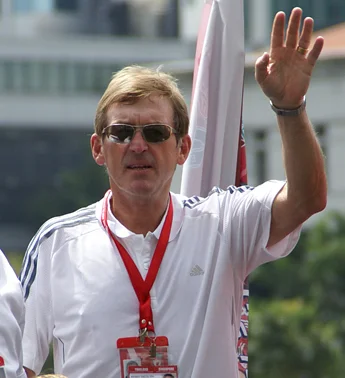 _(no batch-input)_ | _No Commons `Category:Kenny Dalglish` found._ |

### Kevin De Bruyne `kevin-de-bruyne`

| Current | Candidates |
|---------|------------|
| 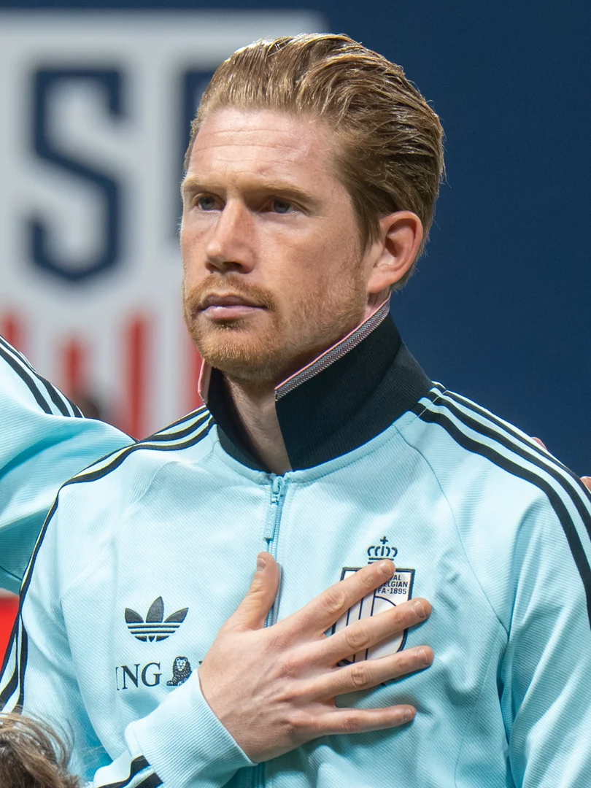 [source](https://upload.wikimedia.org/wikipedia/commons/4/40/Kevin_De_Bruyne_USMNT_v_Belgium_Mar_28_2026-64_%28cropped%29.jpg) | _No Commons `Category:Kevin De Bruyne` found._ |

### Keylor Navas `keylor-navas`

| Current | Candidates |
|---------|------------|
| 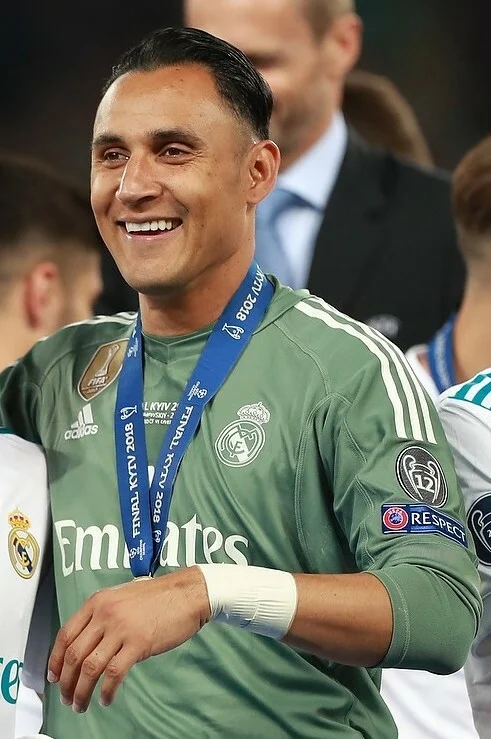 [source](https://upload.wikimedia.org/wikipedia/commons/d/dc/Keylor_Navas_2018_%28cropped%29.jpg) | _No Commons `Category:Keylor Navas` found._ |

### Kylian Mbappé `kylian-mbappe`

| Current | Candidates |
|---------|------------|
| 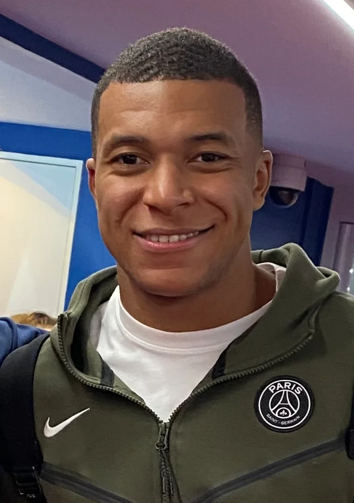 _(no batch-input)_ | _No Commons `Category:Kylian Mbappé` found._ |

### Lakhdar Belloumi `lakhdar-belloumi`

| Current | Candidates |
|---------|------------|
| 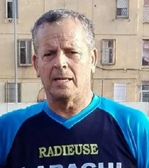 [source](https://upload.wikimedia.org/wikipedia/commons/1/1b/Lakhdar_Belloumi_%282017%29.jpg) | _No Commons `Category:Lakhdar Belloumi` found._ |

### Landon Donovan `landon-donovan`

| Current | Candidates |
|---------|------------|
| 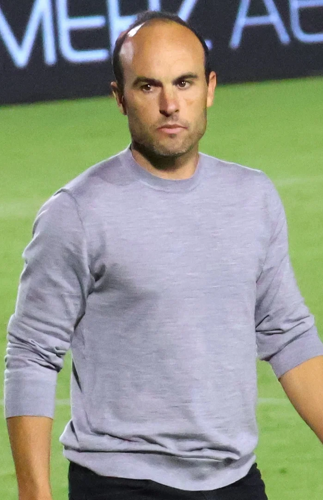 [source](https://upload.wikimedia.org/wikipedia/commons/6/6f/NC_Courage_vs_SD_Wave_%28Oct_2024%29_045.jpg) | _No Commons `Category:Landon Donovan` found._ |

### Lars Lagerbäck `lars-lagerback`

| Current | Candidates |
|---------|------------|
| 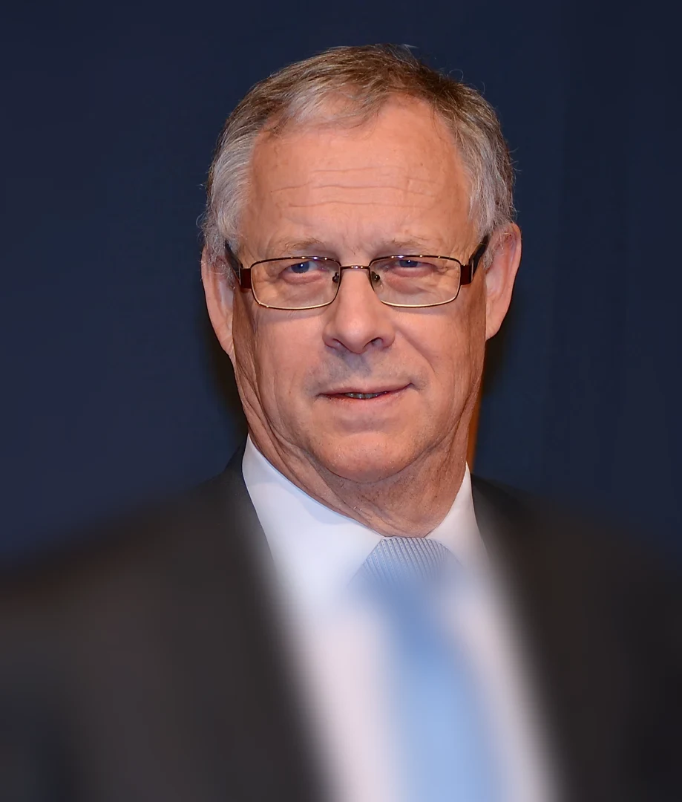 [source](https://upload.wikimedia.org/wikipedia/commons/8/85/Lars_Lagerb%C3%A4ck_in_Jan_2014.jpg) | _No Commons `Category:Lars Lagerbäck` found._ |

### Lev Yashin `lev-yashin`

| Current | Candidates |
|---------|------------|
| 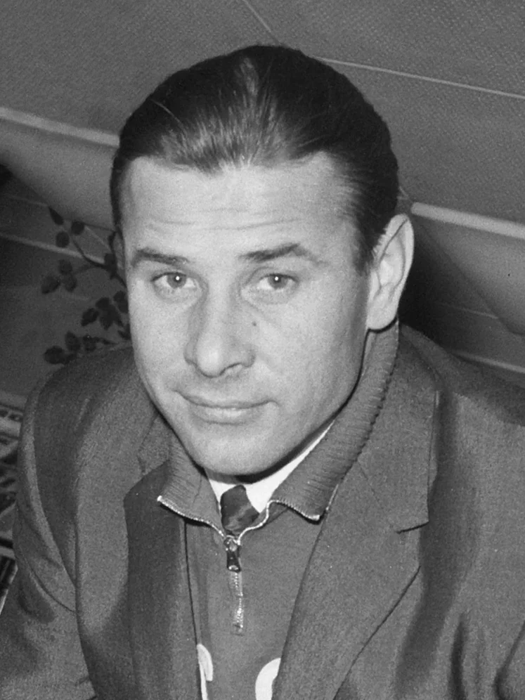 [source](https://upload.wikimedia.org/wikipedia/commons/f/f5/LevYashin.JPG) | _No Commons `Category:Lev Yashin` found._ |

### Lilian Thuram `lilian-thuram`

| Current | Candidates |
|---------|------------|
| 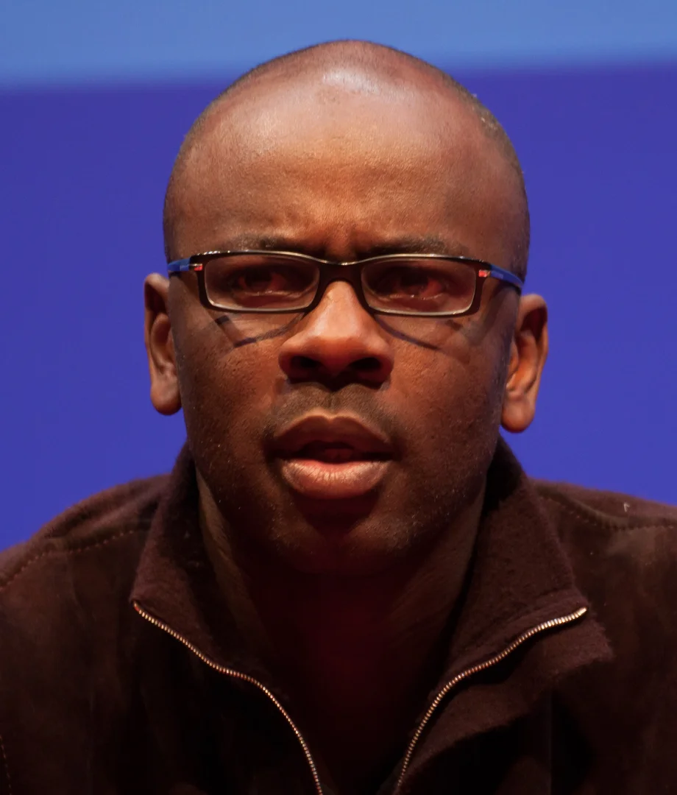 [source](https://upload.wikimedia.org/wikipedia/commons/2/24/Lilian_Thuram_-_F%C3%A9vrier_2013.jpg) | _No Commons `Category:Lilian Thuram` found._ |

### Lionel Messi `lionel-messi`

| Current | Candidates |
|---------|------------|
| 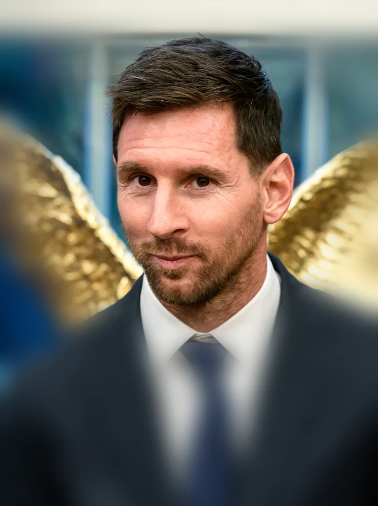 _(no batch-input)_ | _No Commons `Category:Lionel Messi` found._ |

### Lionel Scaloni `lionel-scaloni`

| Current | Candidates |
|---------|------------|
| 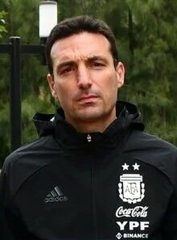 [source](https://upload.wikimedia.org/wikipedia/commons/7/7c/Lionel_Scaloni_-_2022.jpg) | _No Commons `Category:Lionel Scaloni` found._ |

### Lothar Matthaus `lothar-matthaus`

| Current | Candidates |
|---------|------------|
| 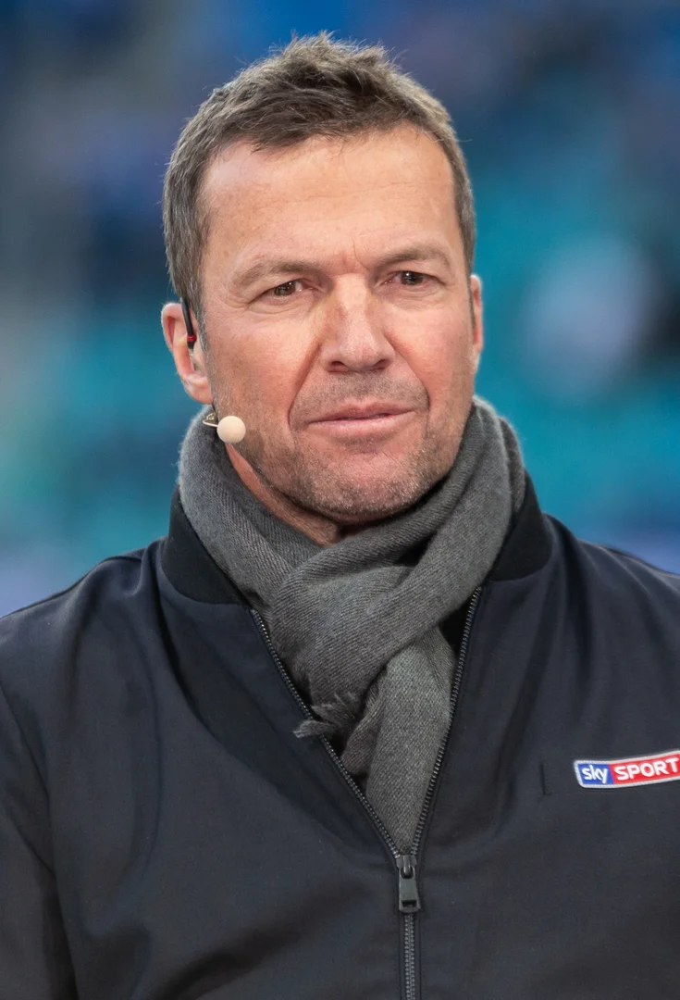 [source](https://upload.wikimedia.org/wikipedia/commons/8/84/2019_Lothar_Matth%C3%A4us.jpg) | _No Commons `Category:Lothar Matthaus` found._ |

### Louis van Gaal `louis-van-gaal`

| Current | Candidates |
|---------|------------|
| 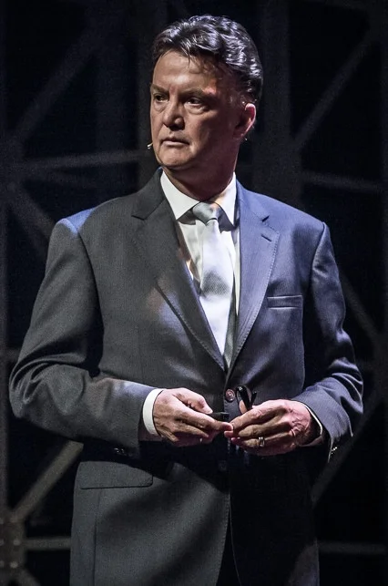 [source](https://upload.wikimedia.org/wikipedia/commons/0/09/Louis_van_Gaal_2014.jpg) | _No Commons `Category:Louis van Gaal` found._ |

### Luigi Riva `luigi-riva`

| Current | Candidates |
|---------|------------|
| 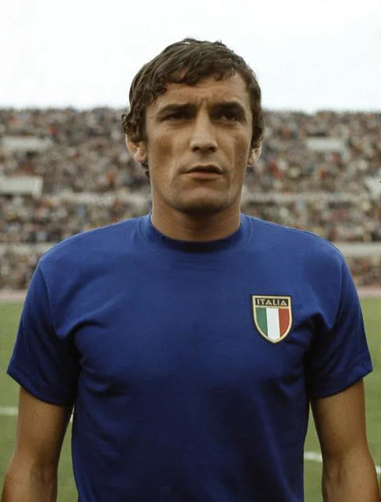 [source](https://upload.wikimedia.org/wikipedia/commons/5/5c/Gigi_Riva%2C_Italia%2C_1968_%28cropped%29.JPG) | _No Commons `Category:Luigi Riva` found._ |

### Luis Aragones `luis-aragones`

| Current | Candidates |
|---------|------------|
| 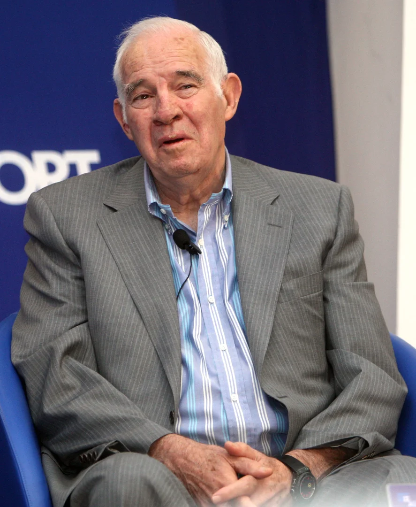 [source](https://upload.wikimedia.org/wikipedia/commons/4/40/Luis_Aragones_2011.jpg) | _No Commons `Category:Luis Aragones` found._ |

### Luis Figo `luis-figo`

| Current | Candidates |
|---------|------------|
| 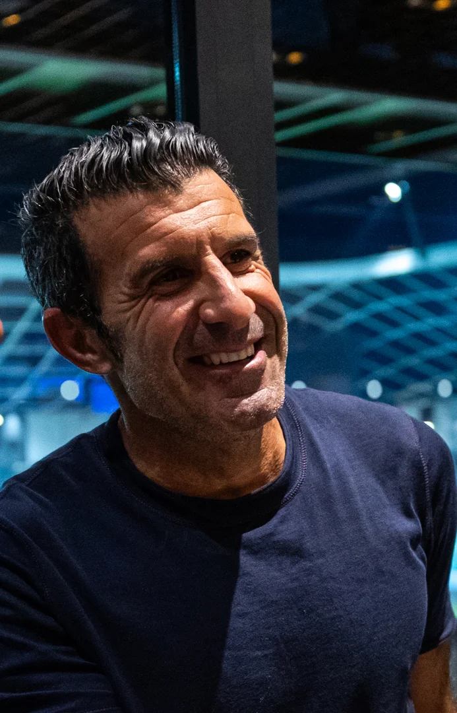 [source](https://upload.wikimedia.org/wikipedia/commons/1/15/Luis_Figo_2023.jpg) | _No Commons `Category:Luis Figo` found._ |

### Luis Suarez `luis-suarez`

| Current | Candidates |
|---------|------------|
| 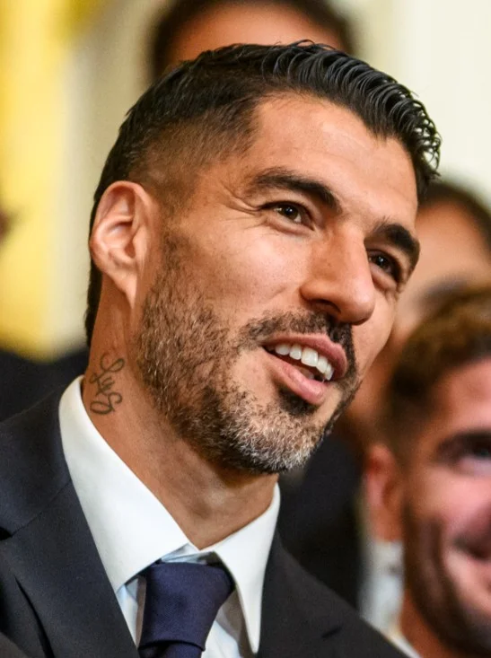 [source](https://upload.wikimedia.org/wikipedia/commons/f/f7/Luis_Su%C3%A1rez_2026_%28cropped%29.jpg) | _No Commons `Category:Luis Suarez` found._ |

### Luiz Felipe Scolari `luiz-felipe-scolari`

| Current | Candidates |
|---------|------------|
| 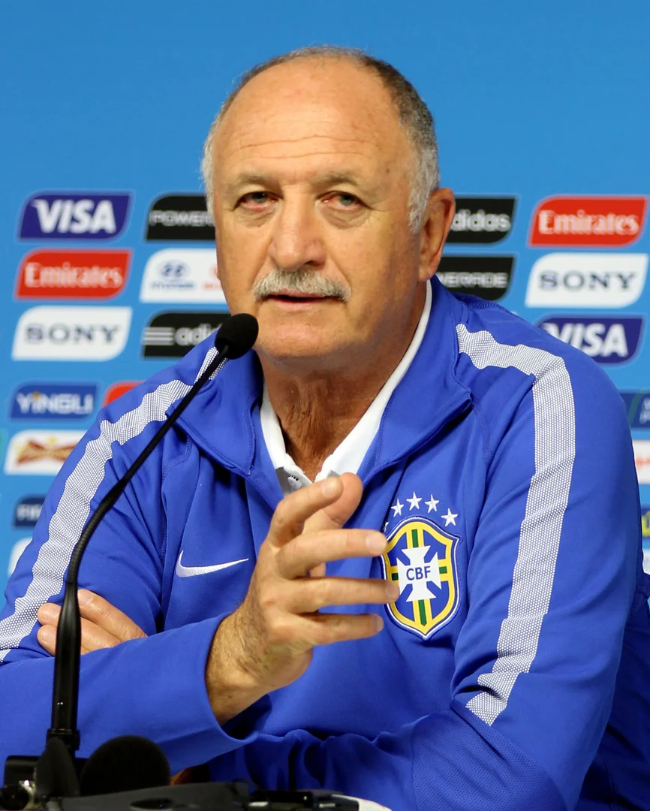 [source](https://upload.wikimedia.org/wikipedia/commons/1/19/Felip%C3%A3o_cropped.jpg) | _No Commons `Category:Luiz Felipe Scolari` found._ |

### Luka Modrić `luka-modric`

| Current | Candidates |
|---------|------------|
| 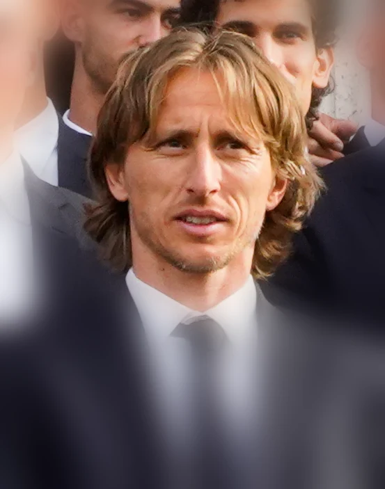 _(no batch-input)_ | _No Commons `Category:Luka Modrić` found._ |

### Manuel Neuer `manuel-neuer`

| Current | Candidates |
|---------|------------|
| 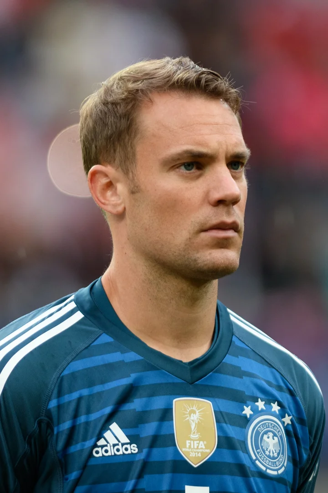 _(no batch-input)_ | _No Commons `Category:Manuel Neuer` found._ |

### Marcello Lippi `marcello-lippi`

| Current | Candidates |
|---------|------------|
| 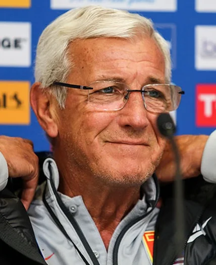 [source](https://upload.wikimedia.org/wikipedia/commons/8/8d/Marcello_Lippi_at_China-Iran_press_conference_20190123.jpg) | _No Commons `Category:Marcello Lippi` found._ |

### Marcelo `marcelo`

| Current | Candidates |
|---------|------------|
|  [source](https://upload.wikimedia.org/wikipedia/commons/e/e4/MarceloRealMadrid.JPG) | _No Commons `Category:Marcelo` found._ |

### Marcelo Brozovic `marcelo-brozovic`

| Current | Candidates |
|---------|------------|
| 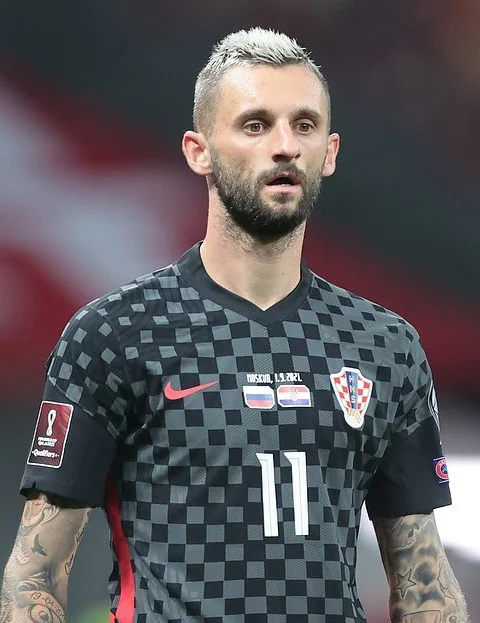 [source](https://upload.wikimedia.org/wikipedia/commons/c/c9/Marcelo_Brozovi%C4%87_2021_%28cropped%29.jpg) | _No Commons `Category:Marcelo Brozovic` found._ |

### Marcelo Salas `marcelo-salas`

| Current | Candidates |
|---------|------------|
| 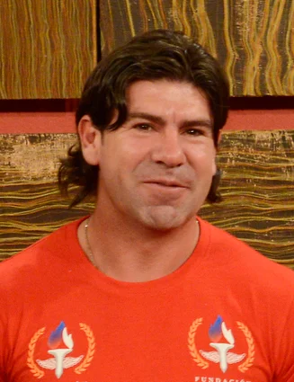 [source](https://upload.wikimedia.org/wikipedia/commons/6/61/Marcelo_Salas_2015.jpg) | _No Commons `Category:Marcelo Salas` found._ |

### Marco Materazzi `marco-materazzi`

| Current | Candidates |
|---------|------------|
| 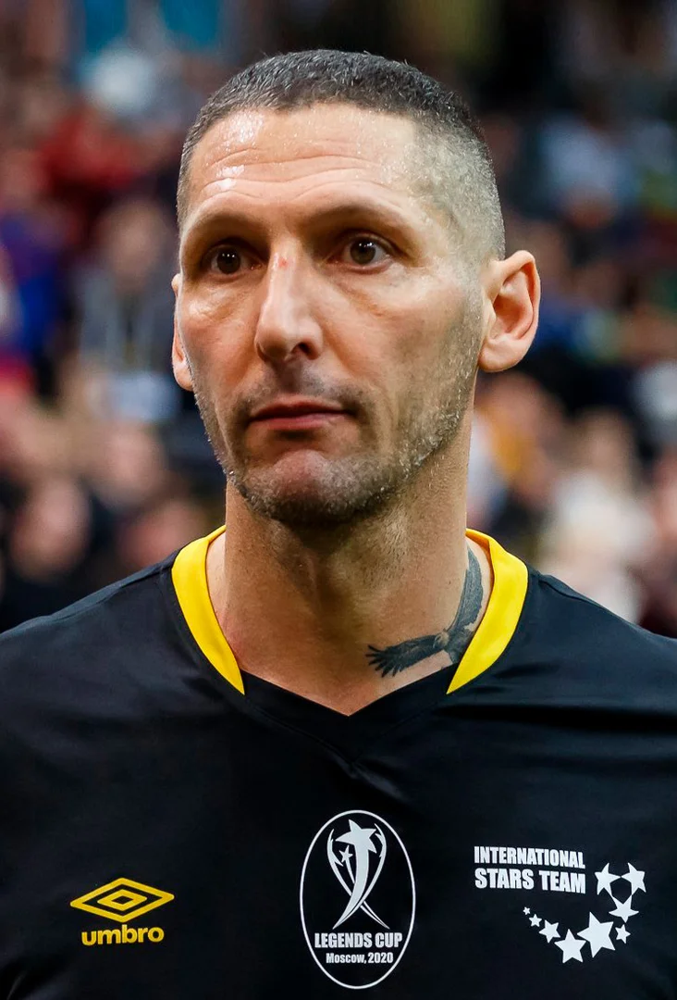 [source](https://upload.wikimedia.org/wikipedia/commons/0/0d/Marco_Materazzi_2020.jpg) | _No Commons `Category:Marco Materazzi` found._ |

### Marco Tardelli `marco-tardelli`

| Current | Candidates |
|---------|------------|
| 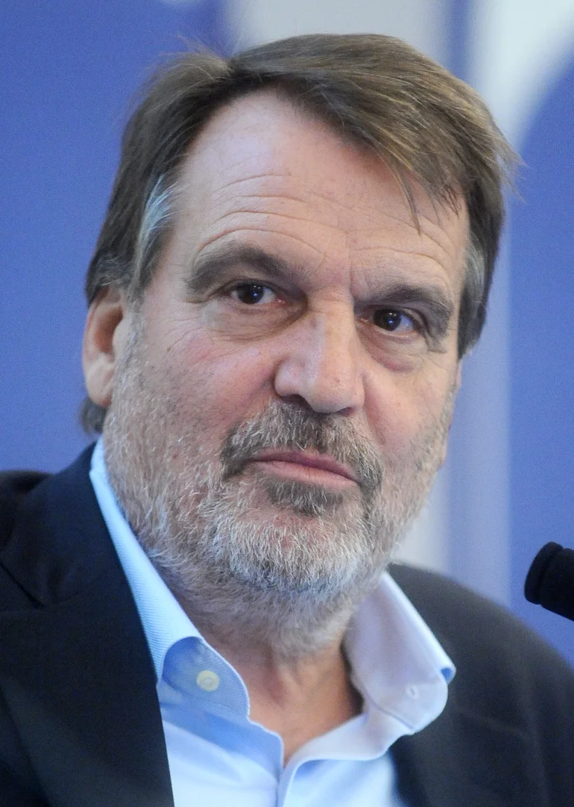 [source](https://upload.wikimedia.org/wikipedia/commons/0/07/Marco_Tardelli_-_Lucca_Comics_%26_Games_2016.jpg) | _No Commons `Category:Marco Tardelli` found._ |

### Mario Kempes `mario-kempes`

| Current | Candidates |
|---------|------------|
|  [source](https://upload.wikimedia.org/wikipedia/commons/e/e4/Mario_Kempes_Argentina_vs._Holanda.JPG) | _No Commons `Category:Mario Kempes` found._ |

### Mario Mandzukic `mario-mandzukic`

| Current | Candidates |
|---------|------------|
| 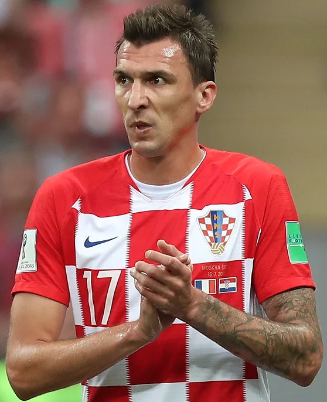 [source](https://upload.wikimedia.org/wikipedia/commons/4/47/Mario_Mand%C5%BEuki%C4%87_in_2018.jpg) | _No Commons `Category:Mario Mandzukic` found._ |

### Mário Zagallo `mario-zagallo`

| Current | Candidates |
|---------|------------|
| 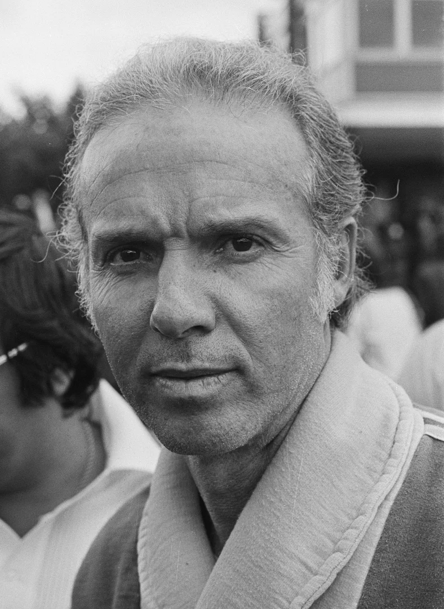 [source](https://upload.wikimedia.org/wikipedia/commons/8/88/M%C3%A1rio_Zagallo_1974.jpg) | _No Commons `Category:Mário Zagallo` found._ |

### Martin Dahlin `martin-dahlin`

| Current | Candidates |
|---------|------------|
| 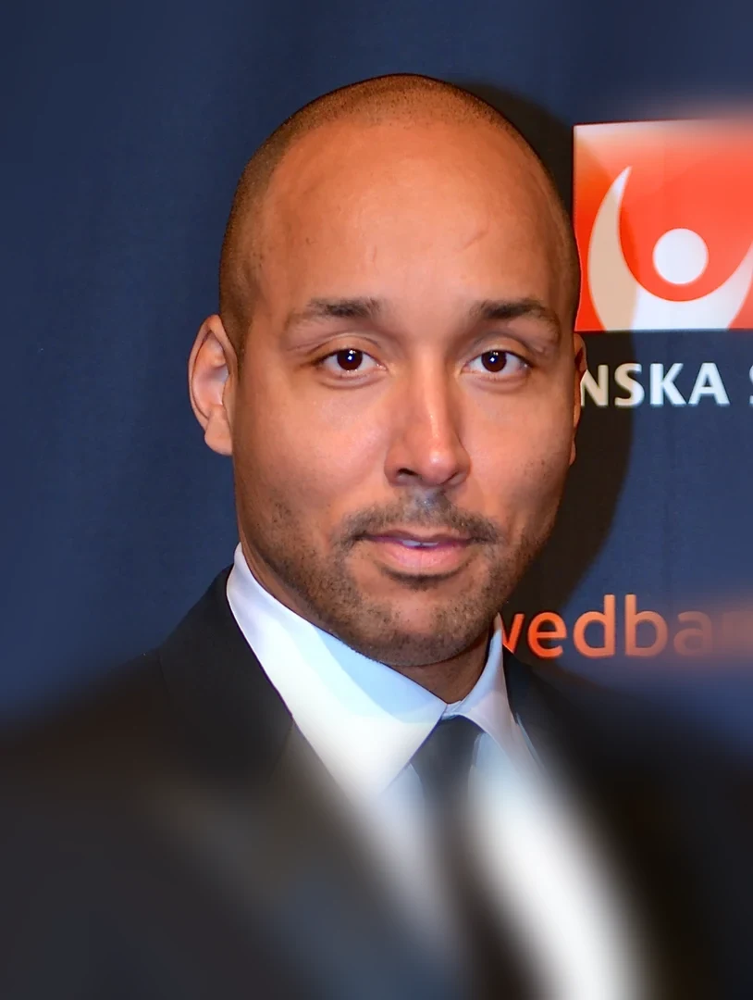 [source](https://upload.wikimedia.org/wikipedia/commons/4/40/Martin_Dahlin_in_Jan_2014.jpg) | _No Commons `Category:Martin Dahlin` found._ |

### Martin Ødegaard `martin-odegaard`

| Current | Candidates |
|---------|------------|
| 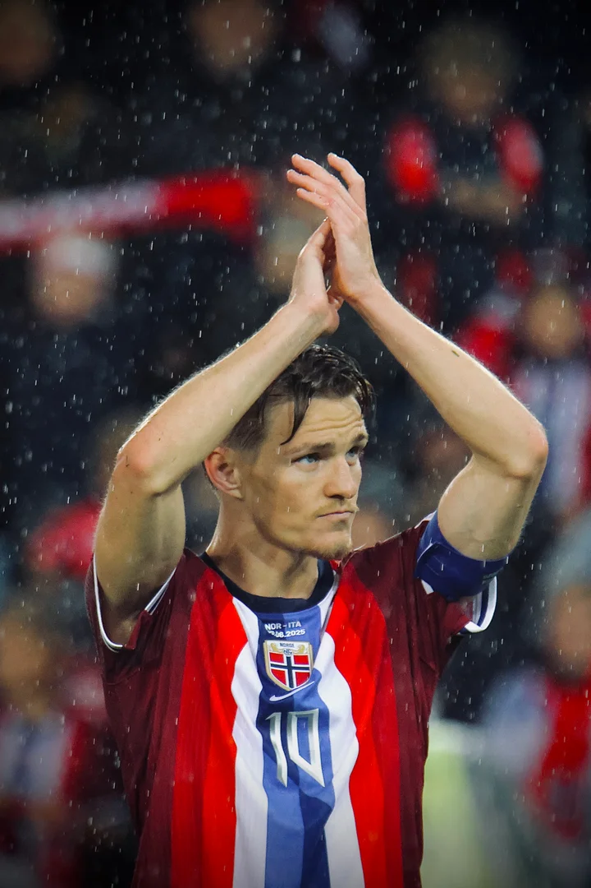 [source](https://upload.wikimedia.org/wikipedia/commons/a/aa/Norway_Italy_-_June_2025_E_04.jpg) | _No Commons `Category:Martin Ødegaard` found._ |

### Matthijs De Ligt `matthijs-de-ligt`

| Current | Candidates |
|---------|------------|
| 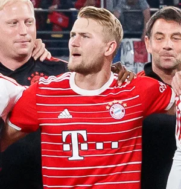 [source](https://upload.wikimedia.org/wikipedia/commons/c/c9/2022-07-30_Fu%C3%9Fball%2C_M%C3%A4nner%2C_DFL-Supercup%2C_RB_Leipzig_-_FC_Bayern_M%C3%BCnchen_Matthijs_de_Ligt_%28cropped%29.jpg) | _No Commons `Category:Matthijs De Ligt` found._ |

### Memphis Depay `memphis-depay`

| Current | Candidates |
|---------|------------|
| 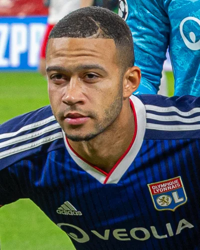 [source](https://upload.wikimedia.org/wikipedia/commons/1/1c/Memphis_Depay_2019.jpg) | _No Commons `Category:Memphis Depay` found._ |

### Mesut Özil `mesut-ozil`

| Current | Candidates |
|---------|------------|
|  [source](https://upload.wikimedia.org/wikipedia/commons/e/ea/%C3%96zil_podolski.JPG) | _No Commons `Category:Mesut Özil` found._ |

### Michael Essien `michael-essien`

| Current | Candidates |
|---------|------------|
|  [source](https://upload.wikimedia.org/wikipedia/commons/4/4f/Essien_Real_Madrid.JPG) | _No Commons `Category:Michael Essien` found._ |

### Michael Owen `michael-owen`

| Current | Candidates |
|---------|------------|
| 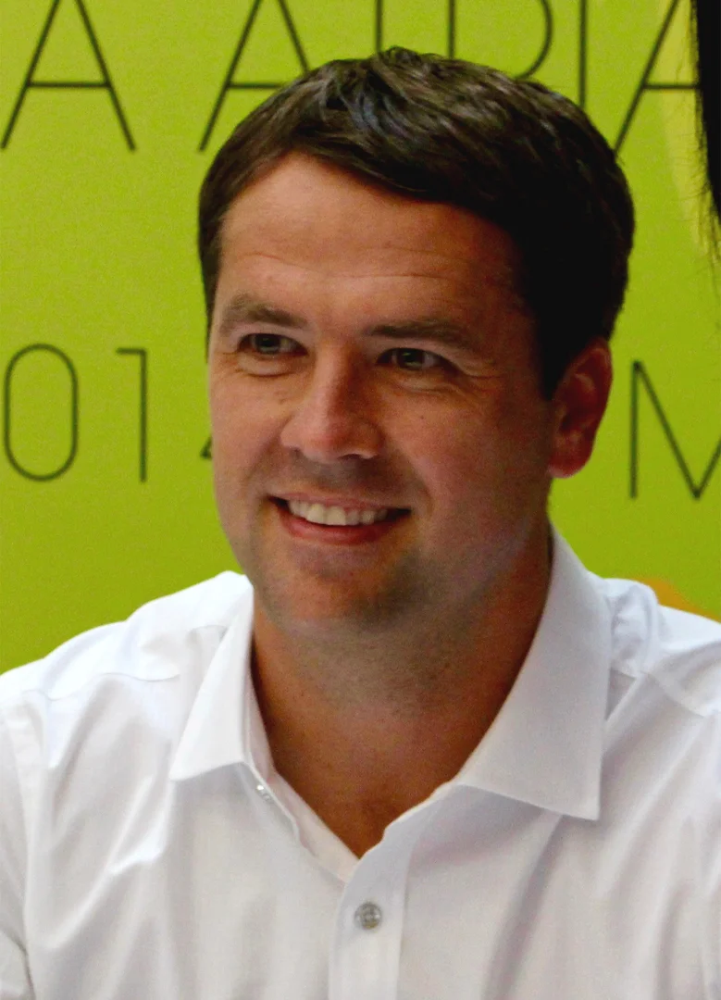 [source](https://upload.wikimedia.org/wikipedia/commons/2/24/Michael_Owen.jpg) | _No Commons `Category:Michael Owen` found._ |

### Michel Platini `michel-platini`

| Current | Candidates |
|---------|------------|
| 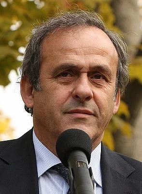 [source](https://upload.wikimedia.org/wikipedia/commons/6/66/Michel_Platini_2010_%28cropped%29.jpg) | _No Commons `Category:Michel Platini` found._ |

### Miroslav Klose `miroslav-klose`

| Current | Candidates |
|---------|------------|
| 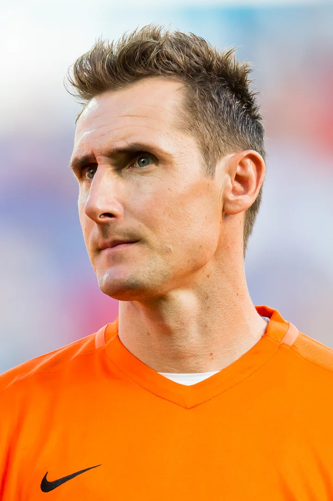 [source](https://upload.wikimedia.org/wikipedia/commons/8/8c/2016209185719_2016-07-27_Champions_for_Charity_-_Sven_-_1D_X_-_0149_-_DV3P4742_mod.jpg) | _No Commons `Category:Miroslav Klose` found._ |

### Mladen Ramljak `mladen-ramljak`

| Current | Candidates |
|---------|------------|
| 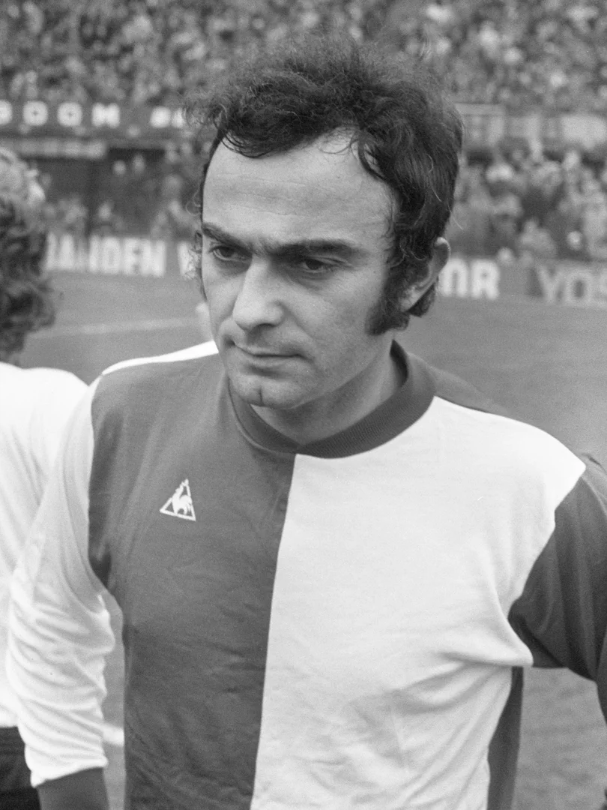 [source](https://upload.wikimedia.org/wikipedia/commons/b/bf/Mladen_Ramljak.jpg) | _No Commons `Category:Mladen Ramljak` found._ |

### Mohamed Salah `mohamed-salah`

| Current | Candidates |
|---------|------------|
| 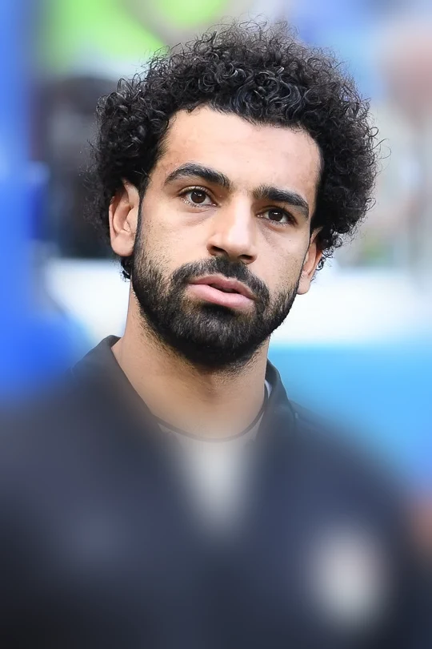 [source](https://upload.wikimedia.org/wikipedia/commons/4/4a/Mohamed_Salah_2018.jpg) | _No Commons `Category:Mohamed Salah` found._ |

### Morten Olsen `morten-olsen`

| Current | Candidates |
|---------|------------|
| 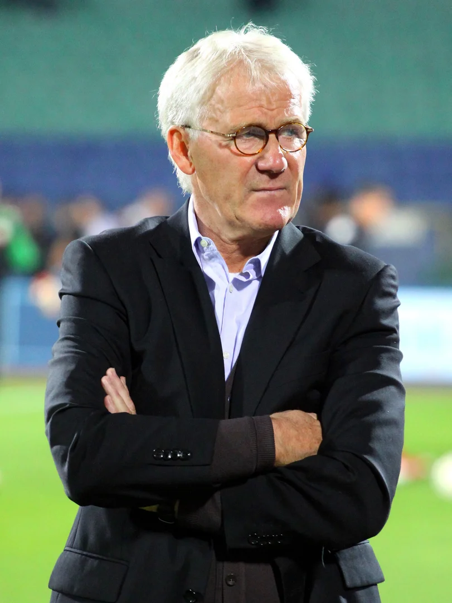 [source](https://upload.wikimedia.org/wikipedia/commons/e/e6/Morten_Olsen_2012_%28cropped%29.jpg) | _No Commons `Category:Morten Olsen` found._ |

### Nani `nani`

| Current | Candidates |
|---------|------------|
| 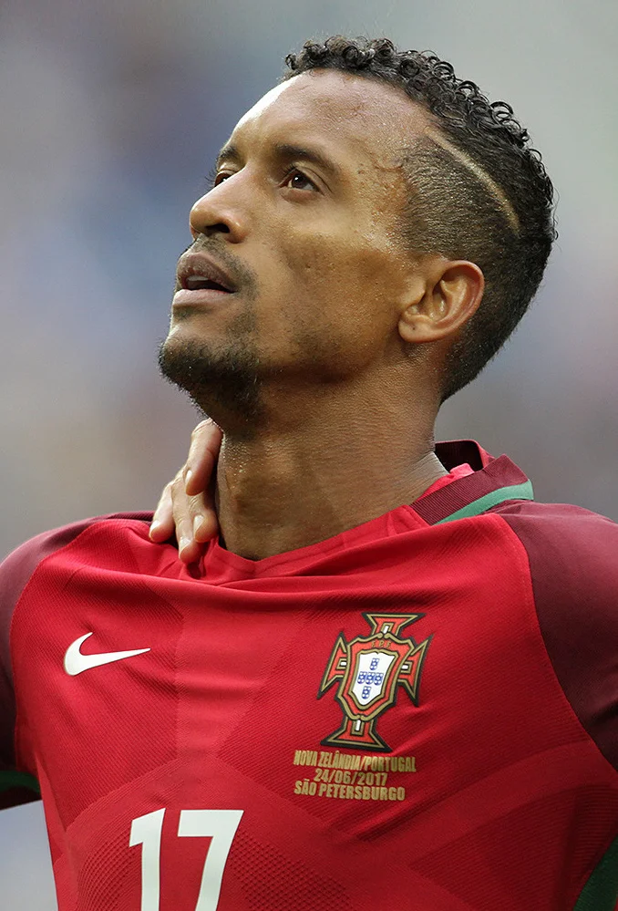 [source](https://upload.wikimedia.org/wikipedia/commons/3/3a/New_Zealand-Portugal_Nani.jpg) | _No Commons `Category:Nani` found._ |

### Neymar `neymar`

| Current | Candidates |
|---------|------------|
| 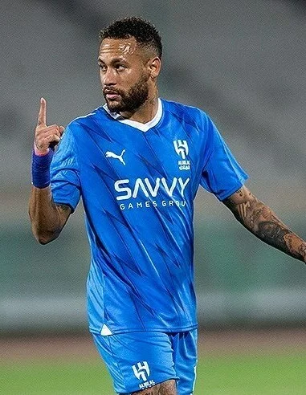 _(no batch-input)_ | _No Commons `Category:Neymar` found._ |

### Ngolo Kante `ngolo-kante`

| Current | Candidates |
|---------|------------|
| 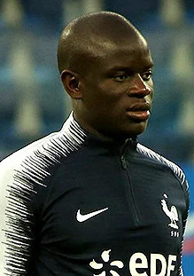 [source](https://upload.wikimedia.org/wikipedia/commons/0/05/N%27Golo_Kant%C3%A9_%28cropped%29.jpg) | _No Commons `Category:Ngolo Kante` found._ |

### Nils Liedholm `nils-liedholm`

| Current | Candidates |
|---------|------------|
| 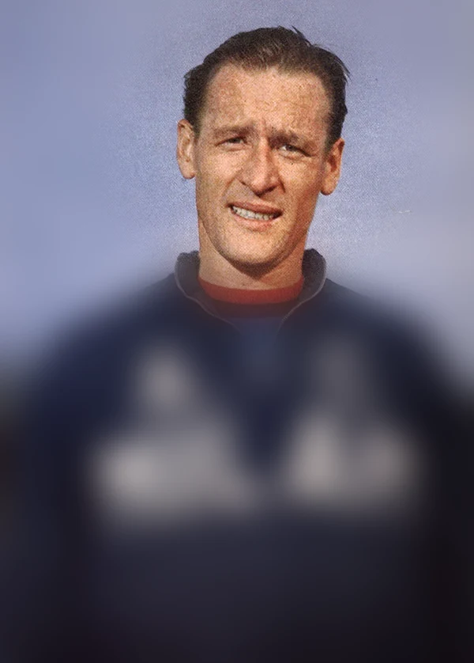 [source](https://upload.wikimedia.org/wikipedia/commons/6/67/Nils_Liedholm-1959.jpg) | _No Commons `Category:Nils Liedholm` found._ |

### Nilton Santos `nilton-santos`

| Current | Candidates |
|---------|------------|
| 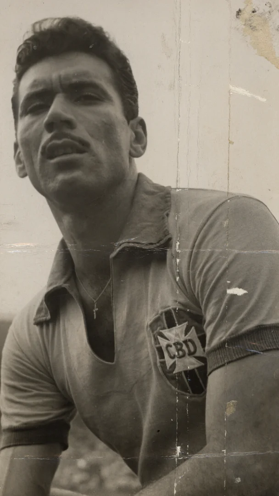 [source](https://upload.wikimedia.org/wikipedia/commons/2/2e/Nilton_Santos_1_%281956%29.tif) | _No Commons `Category:Nilton Santos` found._ |

### Oliver Kahn `oliver-kahn`

| Current | Candidates |
|---------|------------|
| 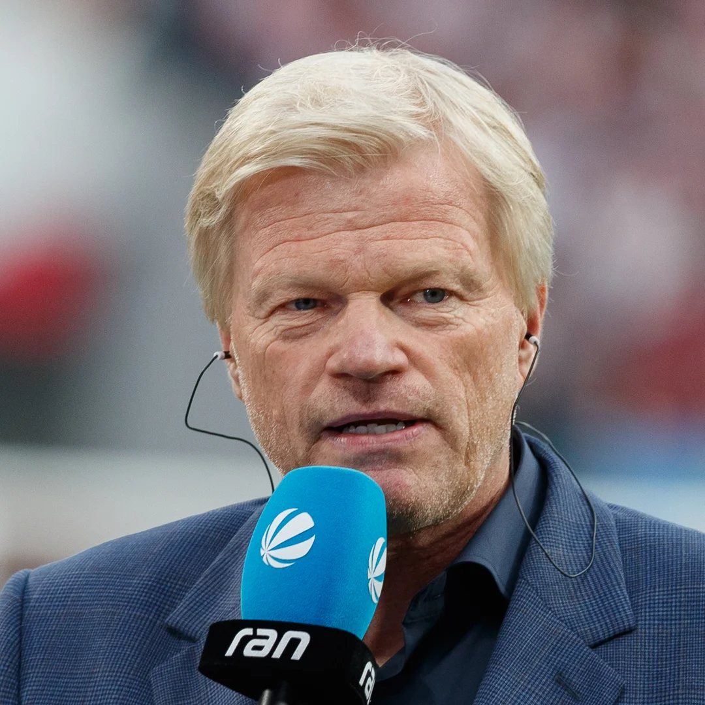 [source](https://upload.wikimedia.org/wikipedia/commons/4/4b/2022-07-30_Fu%C3%9Fball%2C_M%C3%A4nner%2C_DFL-Supercup%2C_RB_Leipzig_-_FC_Bayern_M%C3%BCnchen_1DX_3179_by_Stepro.jpg) | _No Commons `Category:Oliver Kahn` found._ |

### Olivier Giroud `olivier-giroud`

| Current | Candidates |
|---------|------------|
|  [source](https://upload.wikimedia.org/wikipedia/commons/9/9f/France_champion_of_the_Football_World_Cup_Russia_2018_%28cropped%29_%28Giroud_with_Trophy%29.jpg) | _No Commons `Category:Olivier Giroud` found._ |

### Oscar `oscar`

| Current | Candidates |
|---------|------------|
|  [source](https://upload.wikimedia.org/wikipedia/commons/c/c5/20141118_AUTBRA_5022.jpg) | _No Commons `Category:Oscar` found._ |

### Otto Rehhagel `otto-rehhagel`

| Current | Candidates |
|---------|------------|
| 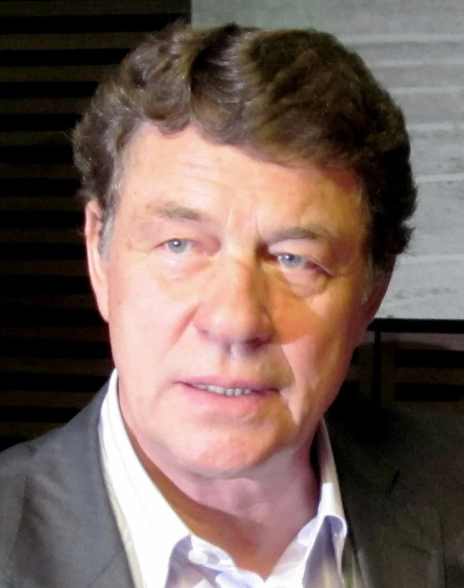 [source](https://upload.wikimedia.org/wikipedia/commons/0/0c/Otto_Rehhagel_01-2.jpg) | _No Commons `Category:Otto Rehhagel` found._ |

### Pablo Aimar `pablo-aimar`

| Current | Candidates |
|---------|------------|
| 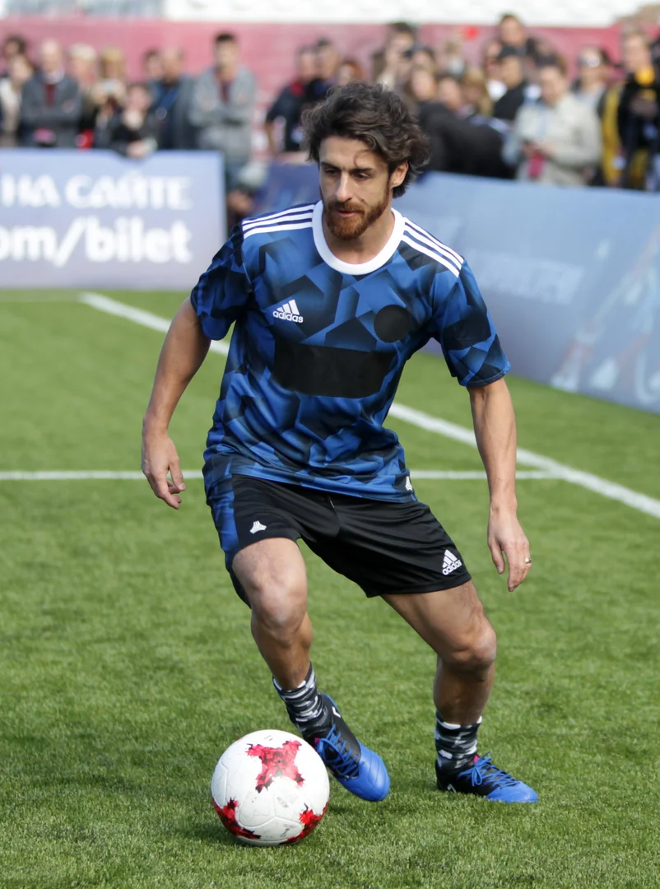 [source](https://upload.wikimedia.org/wikipedia/commons/8/80/Match_legends_2017_CC_%284%29.jpg) | _No Commons `Category:Pablo Aimar` found._ |

### Paolo Guerrero `paolo-guerrero`

| Current | Candidates |
|---------|------------|
| 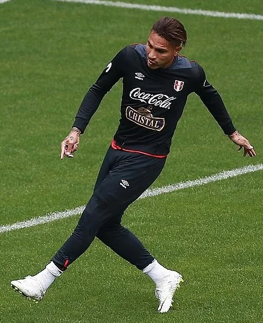 [source](https://upload.wikimedia.org/wikipedia/commons/6/6d/Paolo_Guerrero_Mundial_2018.jpg) | _No Commons `Category:Paolo Guerrero` found._ |

### Paolo Maldini `paolo-maldini`

| Current | Candidates |
|---------|------------|
|  [source](https://upload.wikimedia.org/wikipedia/commons/6/60/Maldini_Italia.jpg) | _No Commons `Category:Paolo Maldini` found._ |

### Paolo Rossi `paolo-rossi`

| Current | Candidates |
|---------|------------|
| 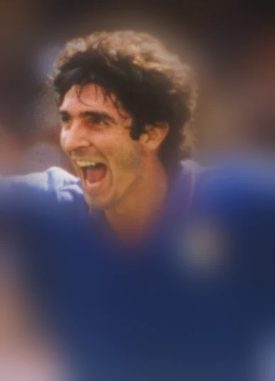 [source](https://upload.wikimedia.org/wikipedia/commons/b/b7/Paolo_Rossi_at_the_1982_FIFA_World_Cup_%28cropped%29.jpg) | _No Commons `Category:Paolo Rossi` found._ |

### Park Ji Sung `park-ji-sung`

| Current | Candidates |
|---------|------------|
| 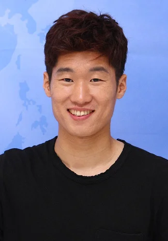 [source](https://upload.wikimedia.org/wikipedia/commons/4/4a/Park_Ji-sung_G20_Seoul_Summit_Ambassador_%28cropped%29.jpg) | _No Commons `Category:Park Ji Sung` found._ |

### Pat Jennings `pat-jennings`

| Current | Candidates |
|---------|------------|
| 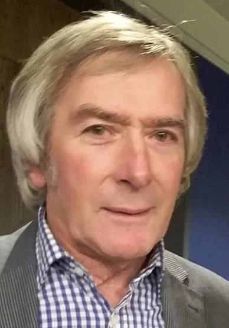 [source](https://upload.wikimedia.org/wikipedia/commons/9/9a/Pat_Jennings_%282018%29.jpg) | _No Commons `Category:Pat Jennings` found._ |

### Patrick Vieira `patrick-vieira`

| Current | Candidates |
|---------|------------|
| 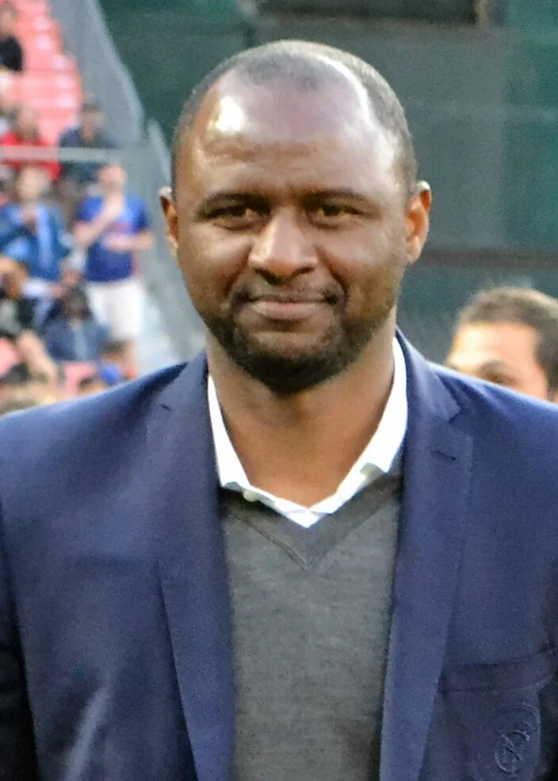 [source](https://upload.wikimedia.org/wikipedia/commons/6/6c/Patrick_Vieira_NYCFC_%28cropped%29.JPG) | _No Commons `Category:Patrick Vieira` found._ |

### Paul Pogba `paul-pogba`

| Current | Candidates |
|---------|------------|
| 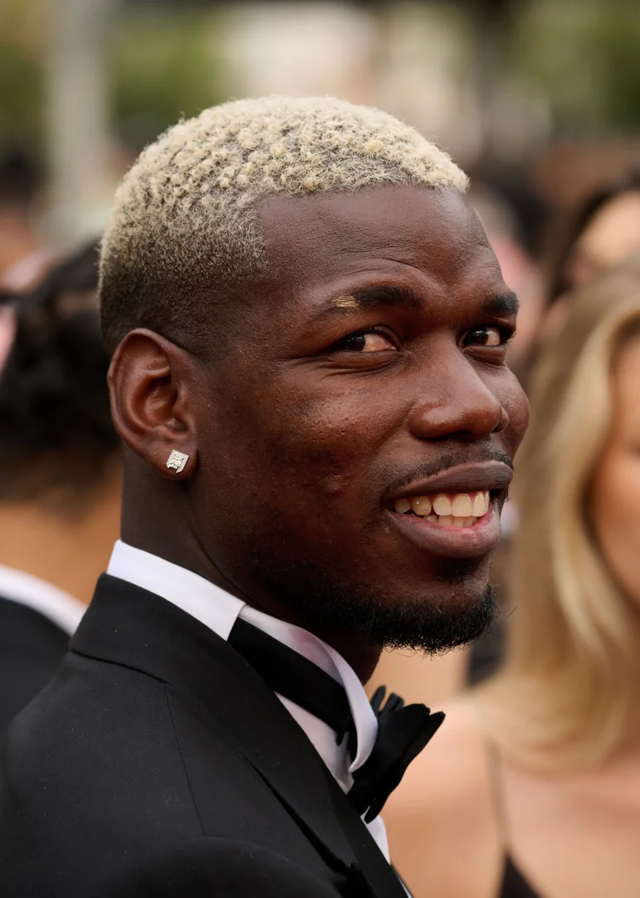 [source](https://upload.wikimedia.org/wikipedia/commons/e/ec/Paul_Pogba_at_the_2025_Cannes_Film_Festival_02.jpg) | _No Commons `Category:Paul Pogba` found._ |

### Paulo Bento `paulo-bento`

| Current | Candidates |
|---------|------------|
| 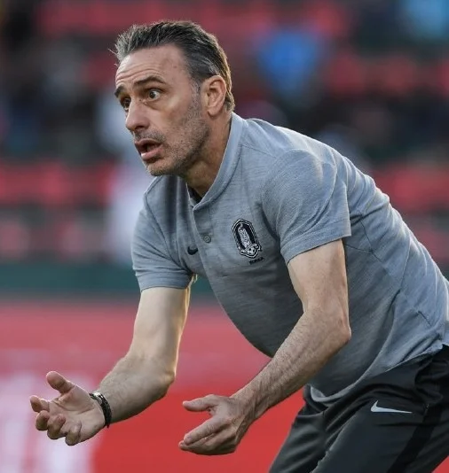 [source](https://upload.wikimedia.org/wikipedia/commons/3/39/Paulo_Bento_managing_South_Korea_at_2019_AFC_Asian_Cup.jpg) | _No Commons `Category:Paulo Bento` found._ |

### Pavel Nedved `pavel-nedved`

| Current | Candidates |
|---------|------------|
| 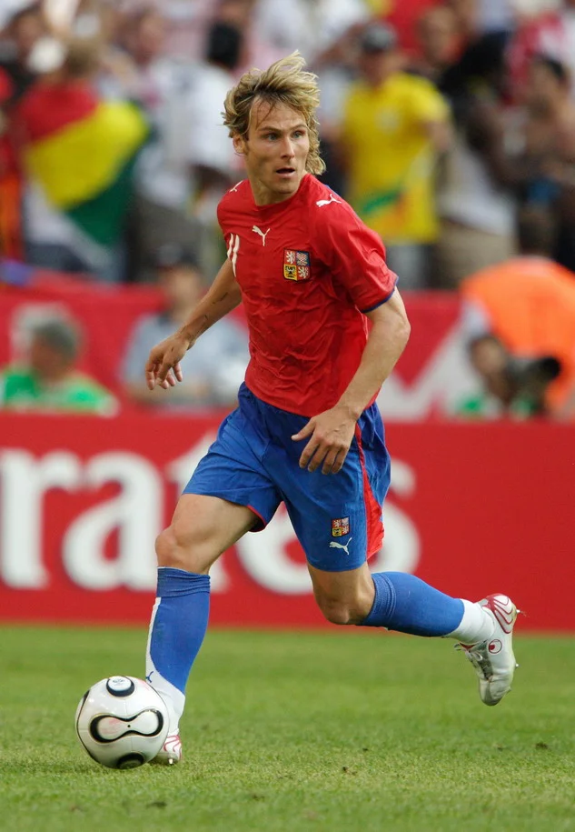 [source](https://upload.wikimedia.org/wikipedia/commons/4/46/Pavel_Nedv%C4%9Bd.jpg) | _No Commons `Category:Pavel Nedved` found._ |

### Pedro Rodriguez `pedro-rodriguez`

| Current | Candidates |
|---------|------------|
| 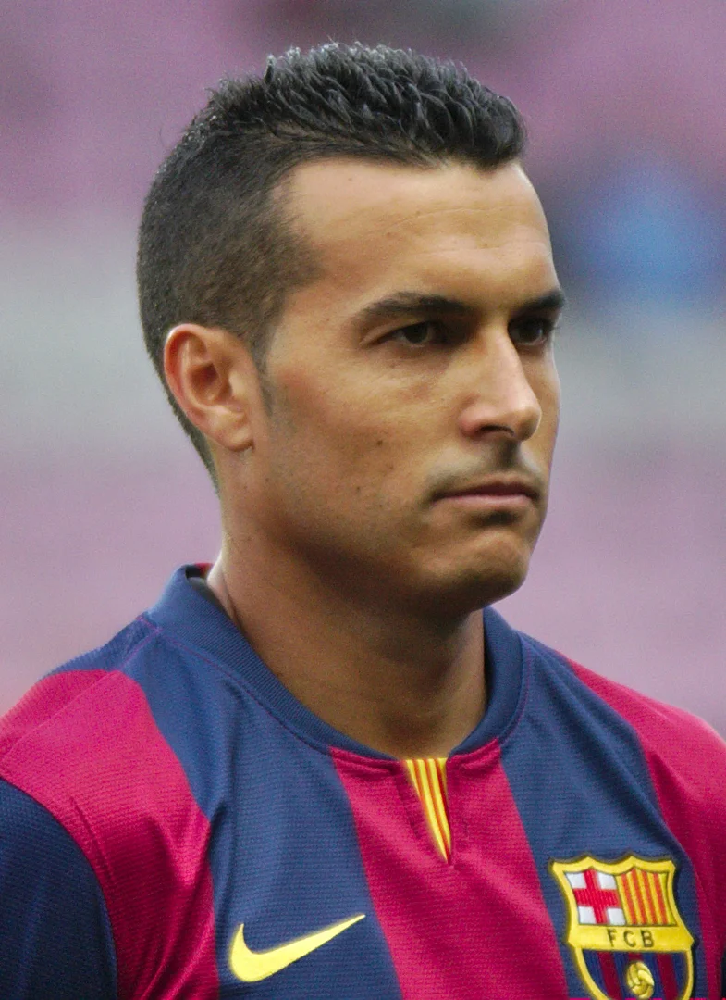 [source](https://upload.wikimedia.org/wikipedia/commons/3/30/Bar%C3%A7a_-_Napoli_-_20140806_-_Pedro_Rodriguez_%28cropped%29.jpg) | _No Commons `Category:Pedro Rodriguez` found._ |

### Pelé `pele`

| Current | Candidates |
|---------|------------|
| 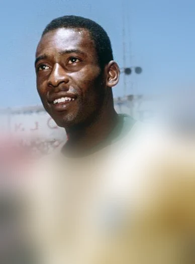 [source](https://upload.wikimedia.org/wikipedia/commons/5/5e/Pele_con_brasil_%28cropped%29.jpg) | _No Commons `Category:Pelé` found._ |

### Pepe `pepe`

| Current | Candidates |
|---------|------------|
| 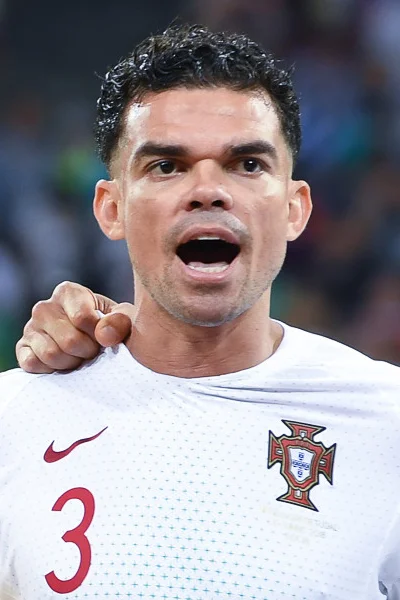 [source](https://upload.wikimedia.org/wikipedia/commons/5/55/Pepe_2018.jpg) | _No Commons `Category:Pepe` found._ |

### Petr Cech `petr-cech`

| Current | Candidates |
|---------|------------|
| 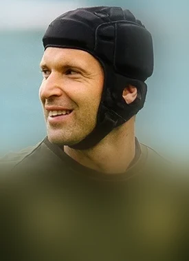 [source](https://upload.wikimedia.org/wikipedia/commons/7/75/Arsenal_players_training_before_2019_UEFA_Europa_League_final_07_%28cropped%29.jpg) | _No Commons `Category:Petr Cech` found._ |

### Phil Foden `phil-foden`

| Current | Candidates |
|---------|------------|
| 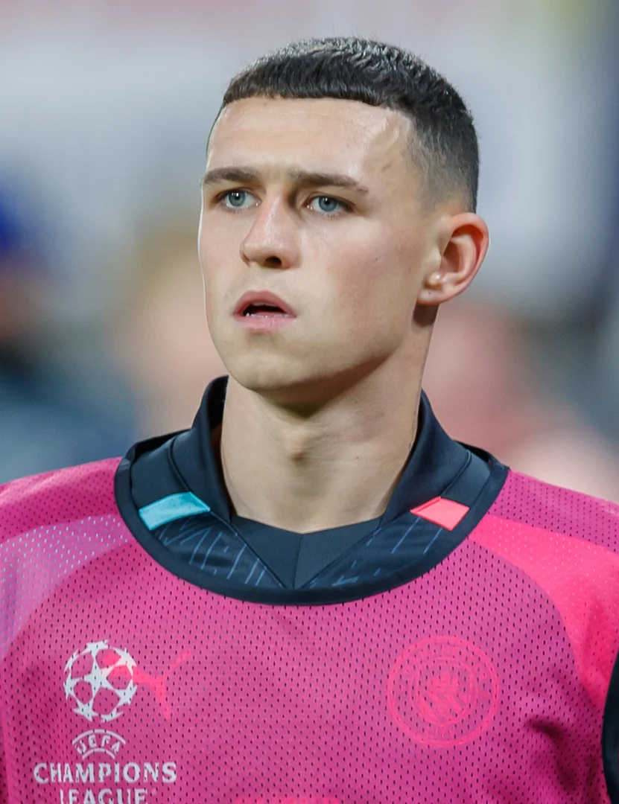 [source](https://upload.wikimedia.org/wikipedia/commons/5/53/2023-10-04_Fu%C3%9Fball%2C_M%C3%A4nner%2C_UEFA_Champions_League%2C_RB_Leipzig_-_Manchester_City_FC_1DX_2613%2C_Phil_Foden.jpg) | _No Commons `Category:Phil Foden` found._ |

### Philipp Lahm `philipp-lahm`

| Current | Candidates |
|---------|------------|
|  [source](https://upload.wikimedia.org/wikipedia/commons/c/c1/Philipp_Lahm_com_o_trof%C3%A9u_de_Campe%C3%A3o_do_Mundo_em_2014.jpg) | _No Commons `Category:Philipp Lahm` found._ |

### Rabah Madjer `rabah-madjer`

| Current | Candidates |
|---------|------------|
| 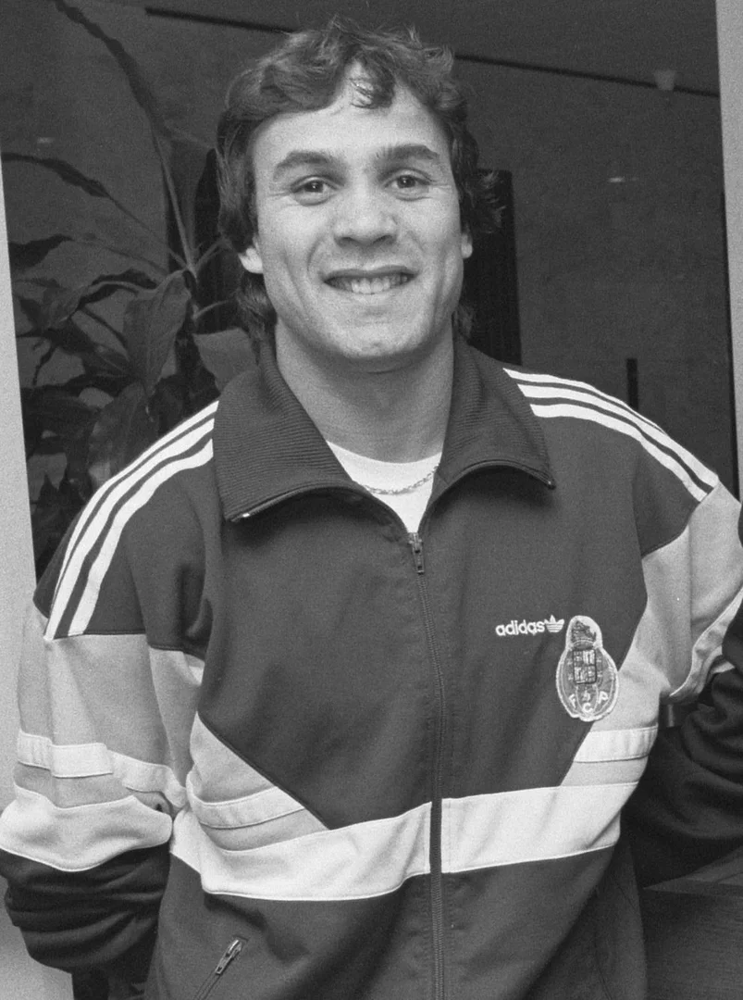 [source](https://upload.wikimedia.org/wikipedia/commons/a/a0/FC_Porto_%28in_verband_met_wedstrijd_om_Super_Cup_tegen_Ajax%29_speler_Madjer_%28l%29_e%2C_Bestanddeelnr_934-1340_%28cropped%29.jpg) | _No Commons `Category:Rabah Madjer` found._ |

### Radamel Falcao `radamel-falcao`

| Current | Candidates |
|---------|------------|
| 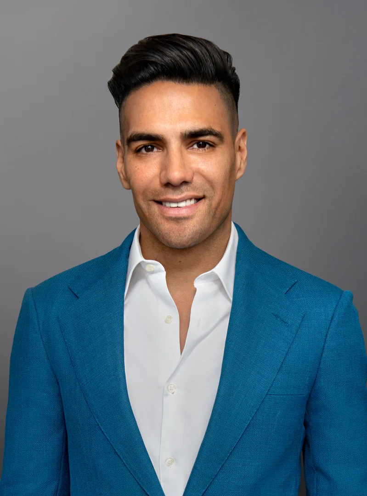 [source](https://upload.wikimedia.org/wikipedia/commons/9/98/Radamel_Falcao_Garc%C3%ADa_%28cropped%29.jpg) | _No Commons `Category:Radamel Falcao` found._ |

### Rafael Márquez `rafa-marquez`

| Current | Candidates |
|---------|------------|
| 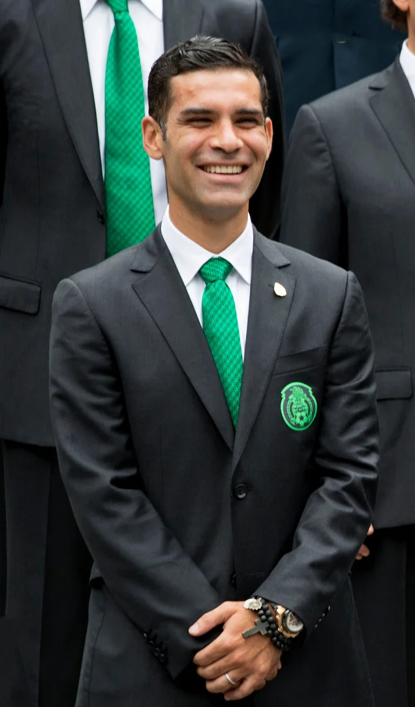 [source](https://upload.wikimedia.org/wikipedia/commons/2/26/Rafael_M%C3%A1rquez_2014.jpg) | _No Commons `Category:Rafael Márquez` found._ |

### Raphael Varane `raphael-varane`

| Current | Candidates |
|---------|------------|
| 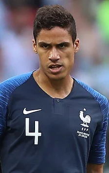 [source](https://upload.wikimedia.org/wikipedia/commons/c/cc/Rapha%C3%ABl_Varane_2018_%28cropped%29.jpg) | _No Commons `Category:Raphael Varane` found._ |

### Raul `raul`

| Current | Candidates |
|---------|------------|
|  [source](https://upload.wikimedia.org/wikipedia/commons/5/5a/25th_Laureus_World_Sports_Awards_-_Ra%C3%BAl_-_240422_132916-2_%28cropped%29.jpg) | _No Commons `Category:Raul` found._ |

### Raymond Domenech `raymond-domenech`

| Current | Candidates |
|---------|------------|
| 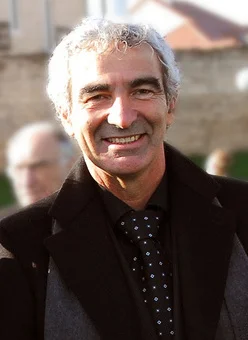 [source](https://upload.wikimedia.org/wikipedia/commons/0/01/Raymond_Domenech.jpg) | _No Commons `Category:Raymond Domenech` found._ |

### René Simões `rene-simoes`

| Current | Candidates |
|---------|------------|
| 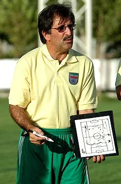 [source](https://upload.wikimedia.org/wikipedia/commons/a/a1/Ren%C3%A9_Sim%C3%B5es_2006-08-20.jpg) | _No Commons `Category:René Simões` found._ |

### Ricardo La Volpe `ricardo-la-volpe`

| Current | Candidates |
|---------|------------|
| 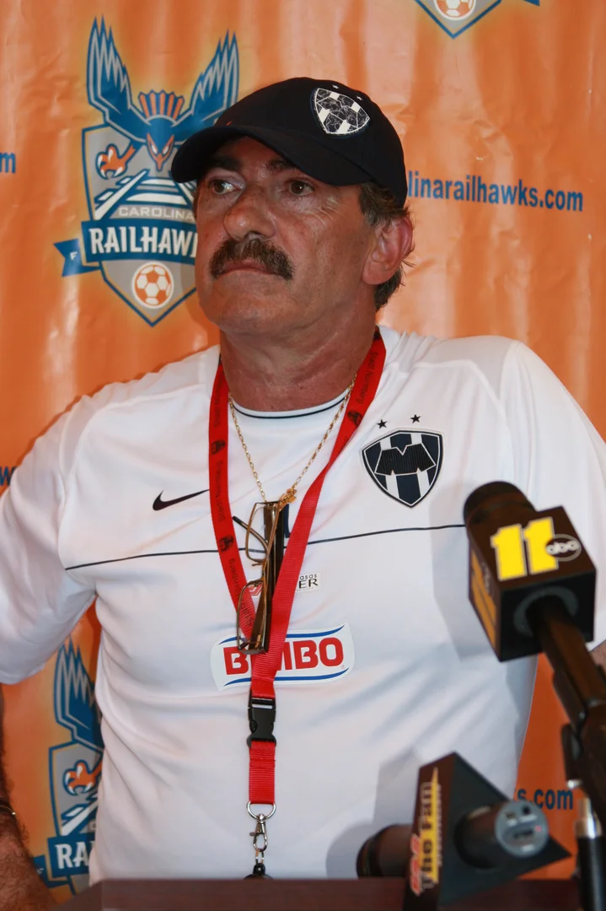 [source](https://upload.wikimedia.org/wikipedia/commons/9/94/RicardoLavolpe.jpg) | _No Commons `Category:Ricardo La Volpe` found._ |

### Ricardo Quaresma `ricardo-quaresma`

| Current | Candidates |
|---------|------------|
| 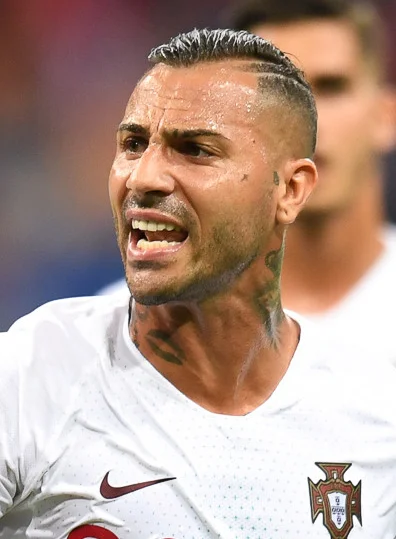 [source](https://upload.wikimedia.org/wikipedia/commons/b/be/Ricardo_Quaresma_%28cropped%29_2.jpg) | _No Commons `Category:Ricardo Quaresma` found._ |

### Rio Ferdinand `rio-ferdinand`

| Current | Candidates |
|---------|------------|
| 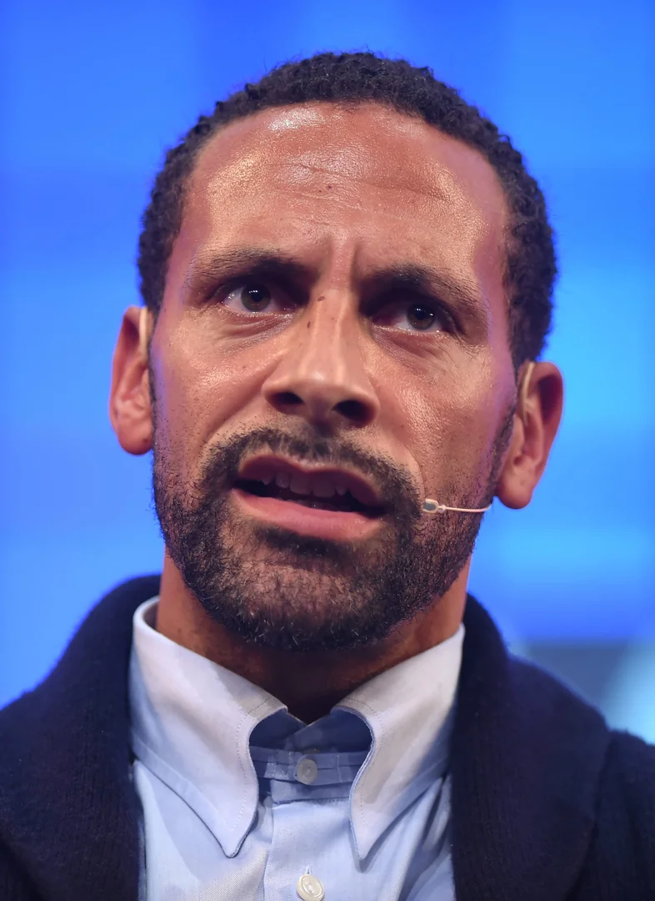 [source](https://upload.wikimedia.org/wikipedia/commons/4/4c/Web_Summit_2015_-_Dublin%2C_Ireland_-_22183056474_%28cropped%29.jpg) | _No Commons `Category:Rio Ferdinand` found._ |

### Rivaldo `rivaldo`

| Current | Candidates |
|---------|------------|
| 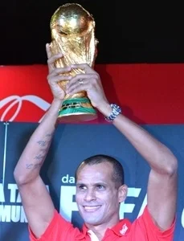 [source](https://upload.wikimedia.org/wikipedia/commons/8/8e/Rivaldo.jpg) | _No Commons `Category:Rivaldo` found._ |

### Rivellino `rivellino`

| Current | Candidates |
|---------|------------|
| 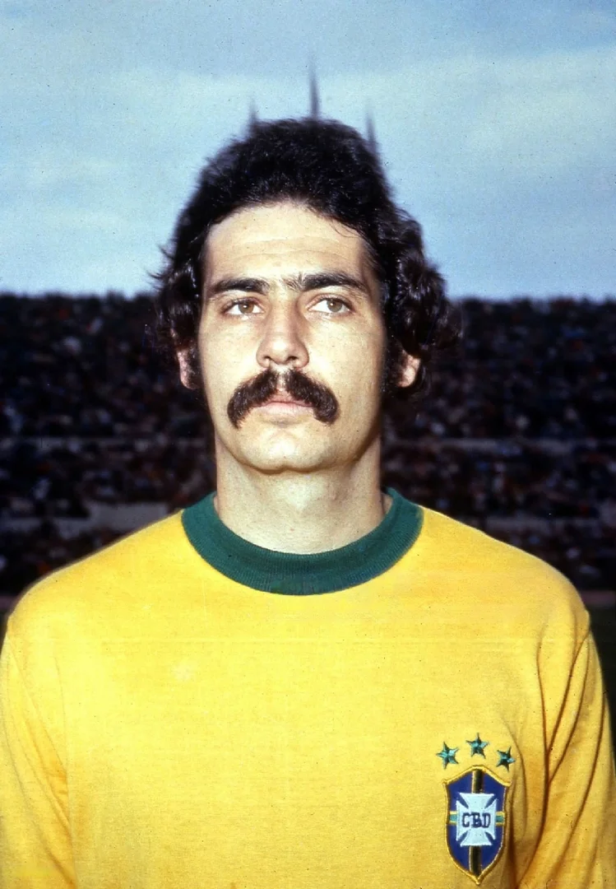 [source](https://upload.wikimedia.org/wikipedia/commons/e/ea/Rivellino_1970.jpg) | _No Commons `Category:Rivellino` found._ |

### Riyad Mahrez `riyad-mahrez`

| Current | Candidates |
|---------|------------|
| 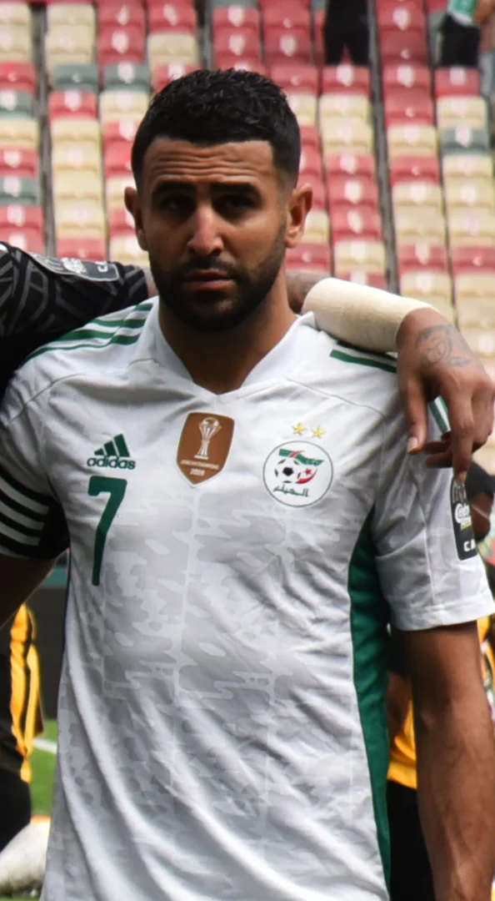 [source](https://upload.wikimedia.org/wikipedia/commons/4/45/Mahrez_2021.jpg) | _No Commons `Category:Riyad Mahrez` found._ |

### Robbie Keane `robbie-keane`

| Current | Candidates |
|---------|------------|
| 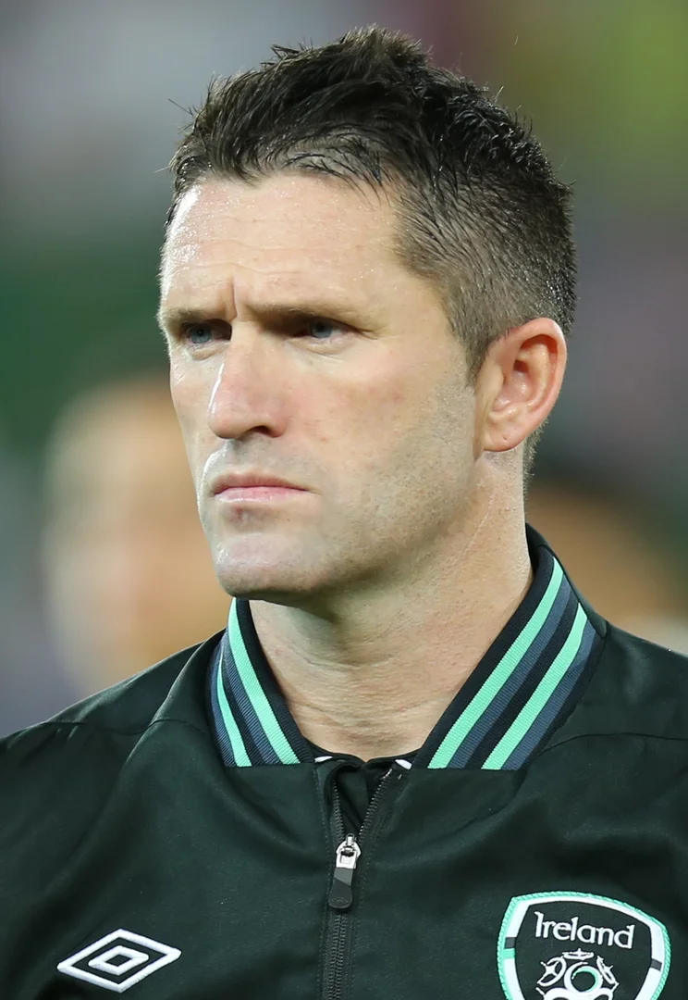 [source](https://upload.wikimedia.org/wikipedia/commons/3/30/2013_Robbie_Keane_%28cropped%29.jpg) | _No Commons `Category:Robbie Keane` found._ |

### Robert Lewandowski `robert-lewandowski`

| Current | Candidates |
|---------|------------|
| 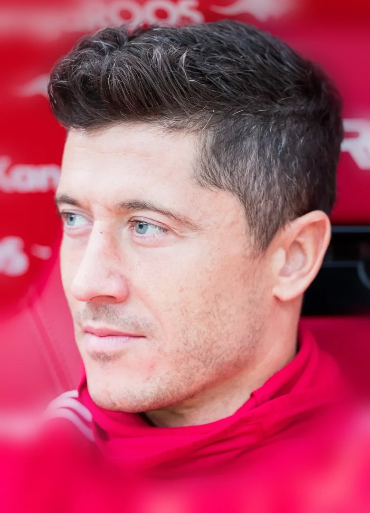 _(no batch-input)_ | _No Commons `Category:Robert Lewandowski` found._ |

### Robert Prosinecki `robert-prosinecki`

| Current | Candidates |
|---------|------------|
| 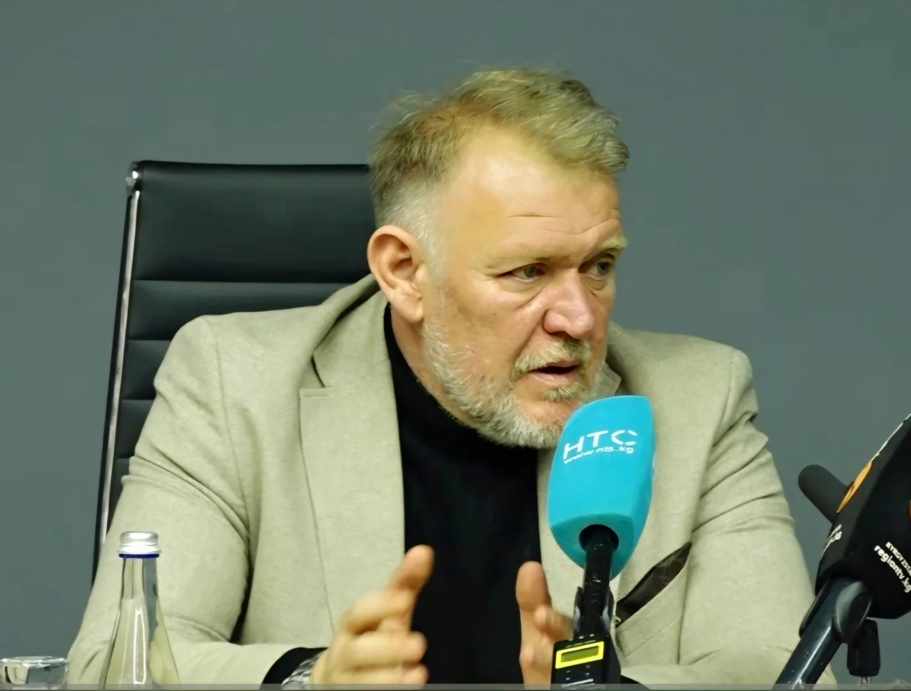 [source](https://upload.wikimedia.org/wikipedia/commons/d/df/Prosinecki_in_2025.jpg) | _No Commons `Category:Robert Prosinecki` found._ |

### Roberto Baggio `roberto-baggio`

| Current | Candidates |
|---------|------------|
| 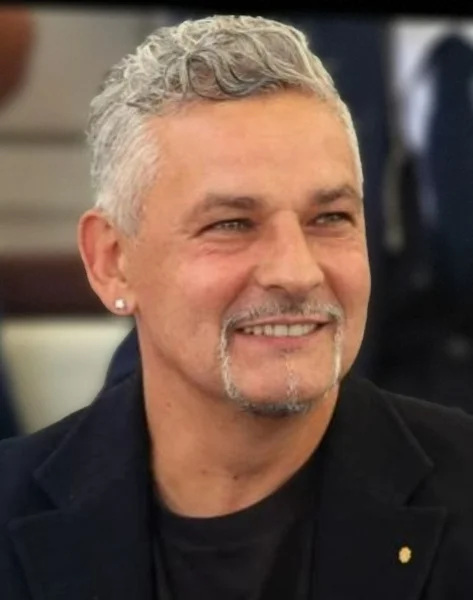 [source](https://upload.wikimedia.org/wikipedia/commons/1/1b/Roberto_Baggio_-_Italia_%2790.jpg) | _No Commons `Category:Roberto Baggio` found._ |

### Roberto Donadoni `roberto-donadoni`

| Current | Candidates |
|---------|------------|
| 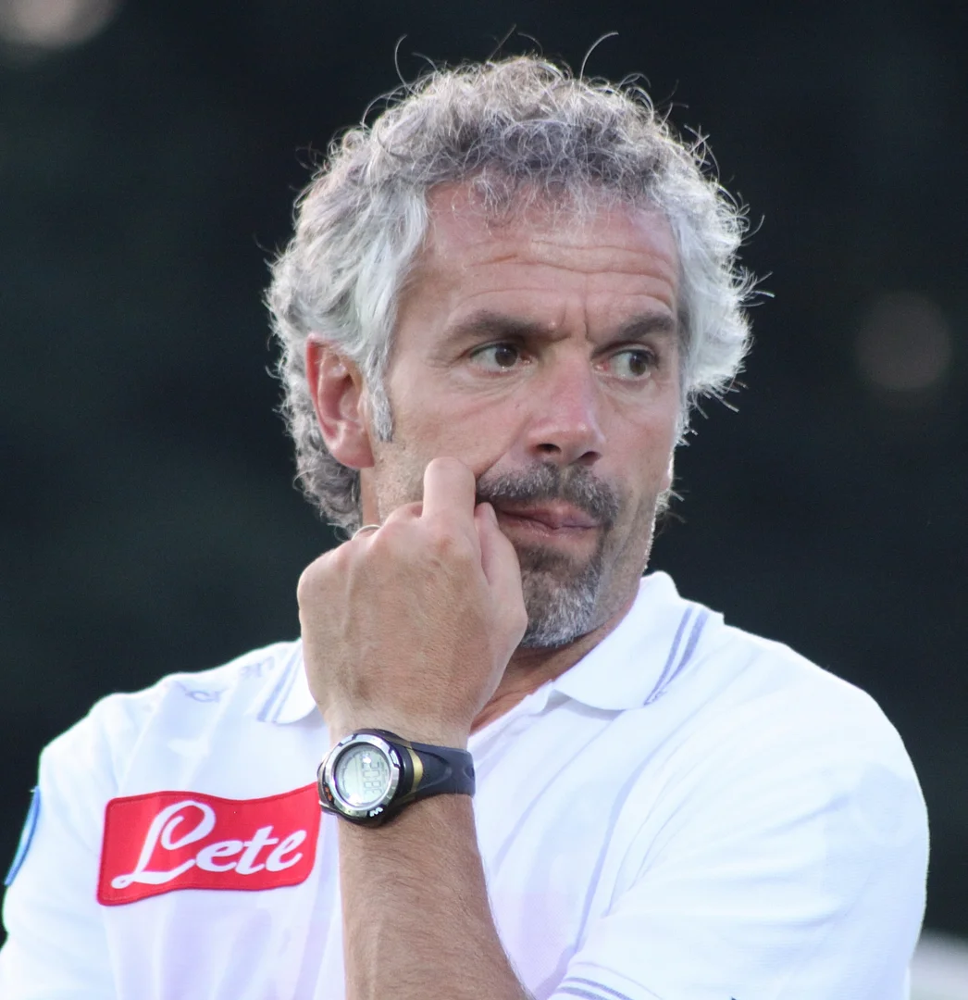 [source](https://upload.wikimedia.org/wikipedia/commons/f/f2/Roberto_Donadoni_-_SSC_Neapel_%282%29_%28cropped%29.jpg) | _No Commons `Category:Roberto Donadoni` found._ |

### Roberto Martínez `roberto-martinez`

| Current | Candidates |
|---------|------------|
| 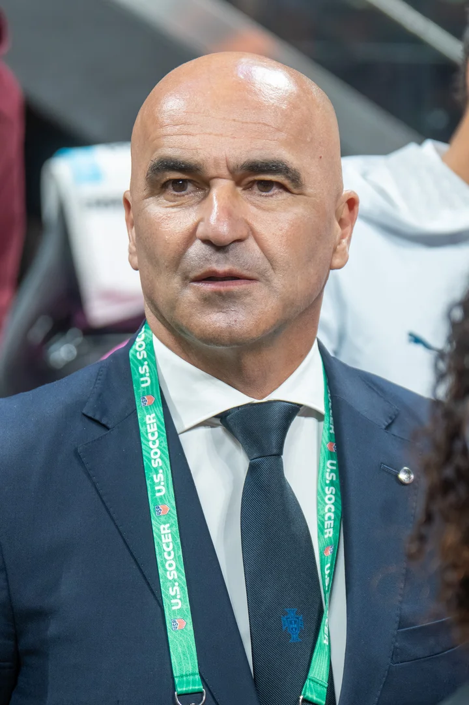 [source](https://upload.wikimedia.org/wikipedia/commons/6/62/Roberto_Mart%C3%ADnez_USMNT_v_Portugal_Mar_31_2026-35.jpg) | _No Commons `Category:Roberto Martínez` found._ |

### Robin Van Persie `robin-van-persie`

| Current | Candidates |
|---------|------------|
| 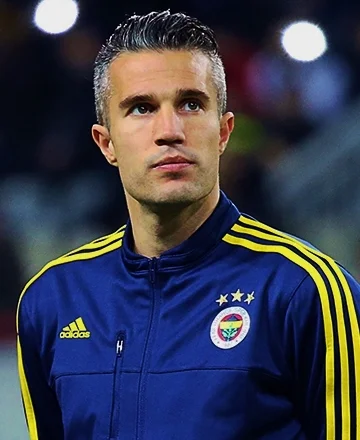 [source](https://upload.wikimedia.org/wikipedia/commons/6/65/Loco-Fener_%2810%29.jpg) | _No Commons `Category:Robin Van Persie` found._ |

### Robinho `robinho`

| Current | Candidates |
|---------|------------|
|  [source](https://upload.wikimedia.org/wikipedia/commons/2/20/Robinho_at_Brazil_%26_Chile_match_at_World_Cup_2010-06-28.jpg) | _No Commons `Category:Robinho` found._ |

### Roger Lemerre `roger-lemerre`

| Current | Candidates |
|---------|------------|
|  [source](https://upload.wikimedia.org/wikipedia/commons/8/8a/Morocco_vs_Gabon%2C_Roger_Lemerre%2C_March_28_2009.jpg) | _No Commons `Category:Roger Lemerre` found._ |

### Rogerio Ceni `rogerio-ceni`

| Current | Candidates |
|---------|------------|
|  [source](https://upload.wikimedia.org/wikipedia/commons/4/4e/Rogerio-Ceni-Sao-Paulo-Juventude-jun-2022_%28cropped%29.jpg) | _No Commons `Category:Rogerio Ceni` found._ |

### Romelu Lukaku `romelu-lukaku`

| Current | Candidates |
|---------|------------|
|  [source](https://upload.wikimedia.org/wikipedia/commons/d/dc/Romelu_Lukaku_2021.jpg) | _No Commons `Category:Romelu Lukaku` found._ |

### Ronaldinho `ronaldinho`

| Current | Candidates |
|---------|------------|
|  [source](https://upload.wikimedia.org/wikipedia/commons/1/10/Ronaldinho_corner_brazil.jpg) | _No Commons `Category:Ronaldinho` found._ |

### Ronaldo Nazário `ronaldo-nazario`

| Current | Candidates |
|---------|------------|
|  [source](https://upload.wikimedia.org/wikipedia/commons/1/11/Ronaldo_2002_cropped2.jpg) | _No Commons `Category:Ronaldo Nazário` found._ |

### Rui Costa `rui-costa`

| Current | Candidates |
|---------|------------|
|  [source](https://upload.wikimedia.org/wikipedia/commons/e/ea/Rui_Costa_2019.png) | _No Commons `Category:Rui Costa` found._ |

### Ruud Gullit `ruud-gullit`

| Current | Candidates |
|---------|------------|
|  [source](https://upload.wikimedia.org/wikipedia/commons/4/4b/Selectie_Nederlands_elftal_in_Zeist_Ruud_Gullit_%2C_kop%2C_Bestanddeelnr_934-2142.jpg) | _No Commons `Category:Ruud Gullit` found._ |

### Ruud Krol `ruud-krol`

| Current | Candidates |
|---------|------------|
|  [source](https://upload.wikimedia.org/wikipedia/commons/7/7a/Ruud_Krol_2005.jpg) | _No Commons `Category:Ruud Krol` found._ |

### Ruud Van Nistelrooy `ruud-van-nistelrooy`

| Current | Candidates |
|---------|------------|
|  [source](https://upload.wikimedia.org/wikipedia/commons/9/9d/Ruud_van_Nistelrooy_2017.jpg) | _No Commons `Category:Ruud Van Nistelrooy` found._ |

### Ryan Giggs `ryan-giggs`

| Current | Candidates |
|---------|------------|
|  [source](https://upload.wikimedia.org/wikipedia/commons/1/13/Ryan_Giggs_2015_%28cropped%29.jpg) | _No Commons `Category:Ryan Giggs` found._ |

### Samuel Eto'o `samuel-etoo`

| Current | Candidates |
|---------|------------|
|  [source](https://upload.wikimedia.org/wikipedia/commons/b/bf/FIFA_World_Cup_2010_Netherlands_Cameroon5.jpg) | _No Commons `Category:Samuel Eto'o` found._ |

### Sandro Mazzola `sandro-mazzola`

| Current | Candidates |
|---------|------------|
|  [source](https://upload.wikimedia.org/wikipedia/commons/c/cb/Inter_Milan_1971-1972_Sandro_Mazzola.jpg) | _No Commons `Category:Sandro Mazzola` found._ |

### Sepp Maier `sepp-maier`

| Current | Candidates |
|---------|------------|
|  [source](https://upload.wikimedia.org/wikipedia/commons/5/51/6137Sepp_Maier_Torwart-Legende.JPG) | _No Commons `Category:Sepp Maier` found._ |

### Sergio Aguero `sergio-aguero`

| Current | Candidates |
|---------|------------|
|  [source](https://upload.wikimedia.org/wikipedia/commons/7/7b/Ag%C3%BCero_in_2018.jpg) | _No Commons `Category:Sergio Aguero` found._ |

### Sergio Busquets `sergio-busquets`

| Current | Candidates |
|---------|------------|
|  [source](https://upload.wikimedia.org/wikipedia/commons/4/40/Sergio_Busquets_NYCFC_Miami_24_Sep_2025-020_%28cropped%29.jpg) | _No Commons `Category:Sergio Busquets` found._ |

### Sergio Ramos `sergio-ramos`

| Current | Candidates |
|---------|------------|
|  [source](https://upload.wikimedia.org/wikipedia/commons/7/7c/Sergio_Ramos_Real_Madrid_4_-_Valencia_2.jpg) | _No Commons `Category:Sergio Ramos` found._ |

### Shinji Kagawa `shinji-kagawa`

| Current | Candidates |
|---------|------------|
|  [source](https://upload.wikimedia.org/wikipedia/commons/8/81/Shinji_Kagawa_2018_%28cropped%29.jpg) | _No Commons `Category:Shinji Kagawa` found._ |

### Shunsuke Nakamura `shunsuke-nakamura`

| Current | Candidates |
|---------|------------|
|  [source](https://upload.wikimedia.org/wikipedia/commons/e/e4/Shunsuke2_20080622.png) | _No Commons `Category:Shunsuke Nakamura` found._ |

### Sócrates `socrates`

| Current | Candidates |
|---------|------------|
|  [source](https://upload.wikimedia.org/wikipedia/commons/5/56/Socrates_elgrafico_1983.jpg) | _No Commons `Category:Sócrates` found._ |

### Sol Campbell `sol-campbell`

| Current | Candidates |
|---------|------------|
|  [source](https://upload.wikimedia.org/wikipedia/commons/1/1f/Sol_Campbell_%2854921202604%29_%28cropped%29.jpg) | _No Commons `Category:Sol Campbell` found._ |

### Son Heung-min `son-heung-min`

| Current | Candidates |
|---------|------------|
|  [source](https://upload.wikimedia.org/wikipedia/commons/4/42/Iran%2C_S._Korea_Closer_to_Securing_Spot_in_World_Cup_Tournament_after_Draw_2021-7_%28cropped%29.jpg) | _No Commons `Category:Son Heung-min` found._ |

### Steven Gerrard `steven-gerrard`

| Current | Candidates |
|---------|------------|
|  [source](https://upload.wikimedia.org/wikipedia/commons/d/d5/Steven_Gerrard_2018.jpg) | _No Commons `Category:Steven Gerrard` found._ |

### Sven-Göran Eriksson `sven-goran-eriksson`

| Current | Candidates |
|---------|------------|
|  [source](https://upload.wikimedia.org/wikipedia/commons/a/ad/Sven-Goran_Eriksson_2012.jpg) | _No Commons `Category:Sven-Göran Eriksson` found._ |

### Teófilo Cubillas `teofilo-cubillas`

| Current | Candidates |
|---------|------------|
|  [source](https://upload.wikimedia.org/wikipedia/commons/0/0b/Te%C3%B3filo_Cubillas_1978.jpg) | _No Commons `Category:Teófilo Cubillas` found._ |

### Thiago Silva `thiago-silva`

| Current | Candidates |
|---------|------------|
|  [source](https://upload.wikimedia.org/wikipedia/commons/c/c8/20180610_FIFA_Friendly_Match_Austria_vs._Brazil_Thiago_Silva_850_1582.jpg) | _No Commons `Category:Thiago Silva` found._ |

### Thierry Henry `thierry-henry`

| Current | Candidates |
|---------|------------|
|  [source](https://upload.wikimedia.org/wikipedia/commons/4/44/Henry_in_world_cup_final_2006.jpg) | _No Commons `Category:Thierry Henry` found._ |

### Thomas Muller `thomas-muller`

| Current | Candidates |
|---------|------------|
|  [source](https://upload.wikimedia.org/wikipedia/commons/a/aa/FC_Red_Bull_Salzburg_gegen_Bayern_M%C3%BCnchen_%282025-01-06_Testspiel%29_19.jpg) | _No Commons `Category:Thomas Muller` found._ |

### Thomas Ravelli `thomas-ravelli`

| Current | Candidates |
|---------|------------|
|  [source](https://upload.wikimedia.org/wikipedia/commons/4/41/Thomas_Ravelli_in_January_2014.jpg) | _No Commons `Category:Thomas Ravelli` found._ |

### Tim Cahill `tim-cahill`

| Current | Candidates |
|---------|------------|
|  [source](https://upload.wikimedia.org/wikipedia/commons/d/dc/Tim_Cahill_%2853557484101%29.jpg) | _No Commons `Category:Tim Cahill` found._ |

### Tim Howard `tim-howard`

| Current | Candidates |
|---------|------------|
| 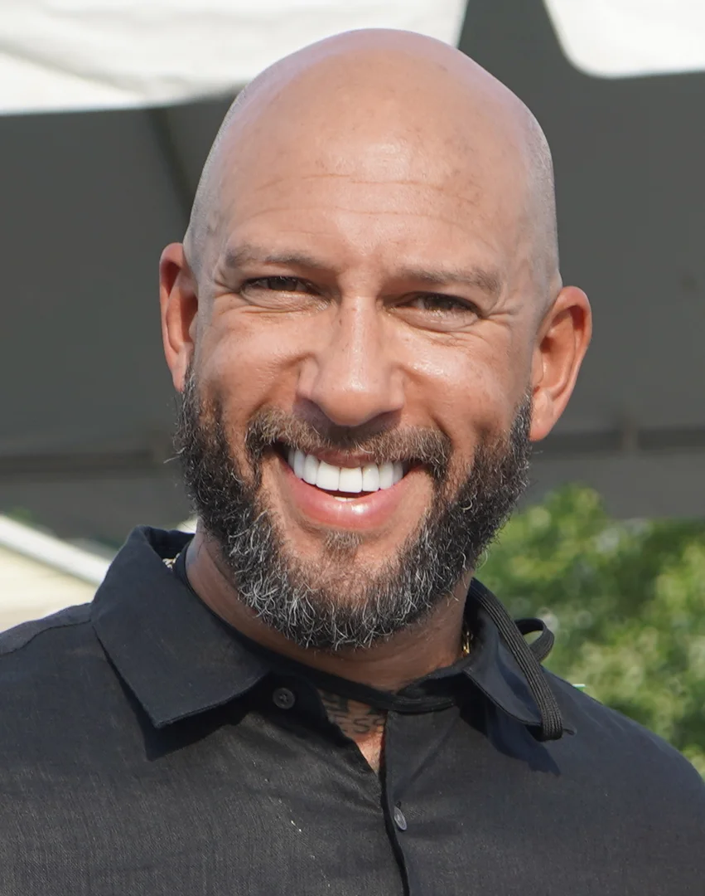 [source](https://upload.wikimedia.org/wikipedia/commons/2/26/Tim_Howard_2023.jpg) | _No Commons `Category:Tim Howard` found._ |

### Tite `tite`

| Current | Candidates |
|---------|------------|
|  [source](https://upload.wikimedia.org/wikipedia/commons/f/f7/20180610_FIFA_Friendly_Match_Austria_vs._Brazil_Tite_850_0231.jpg) | _No Commons `Category:Tite` found._ |

### Tomislav Ivić `tomislav-ivic`

| Current | Candidates |
|---------|------------|
| 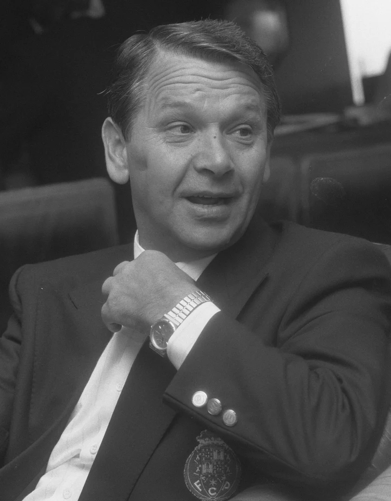 [source](https://upload.wikimedia.org/wikipedia/commons/7/70/FC_Porto_%28in_verband_met_wedstrijd_om_Super_Cup_tegen_Ajax%29_trainer_Ivic%2C_Bestanddeelnr_934-1341_%28cropped%29.jpg) | _No Commons `Category:Tomislav Ivić` found._ |

### Toni Kroos `toni-kroos`

| Current | Candidates |
|---------|------------|
| 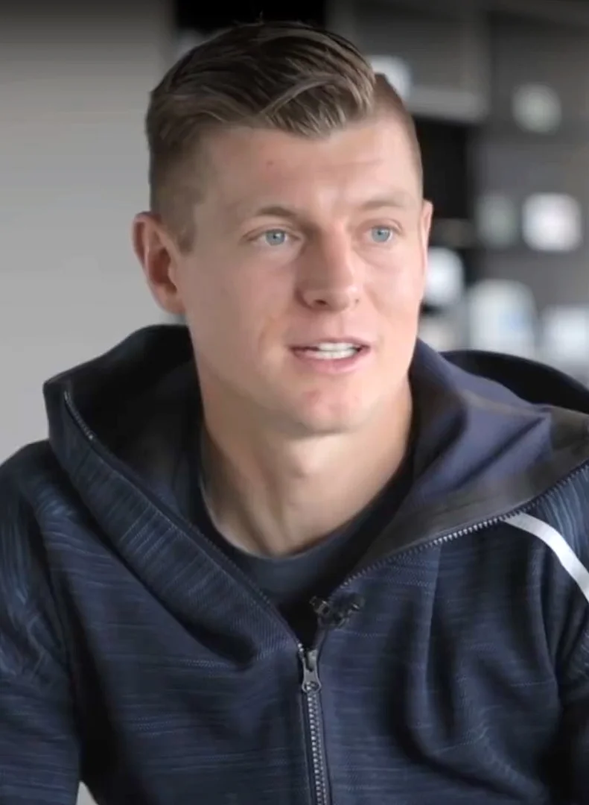 _(no batch-input)_ | _No Commons `Category:Toni Kroos` found._ |

### Tostão `tostao`

| Current | Candidates |
|---------|------------|
| 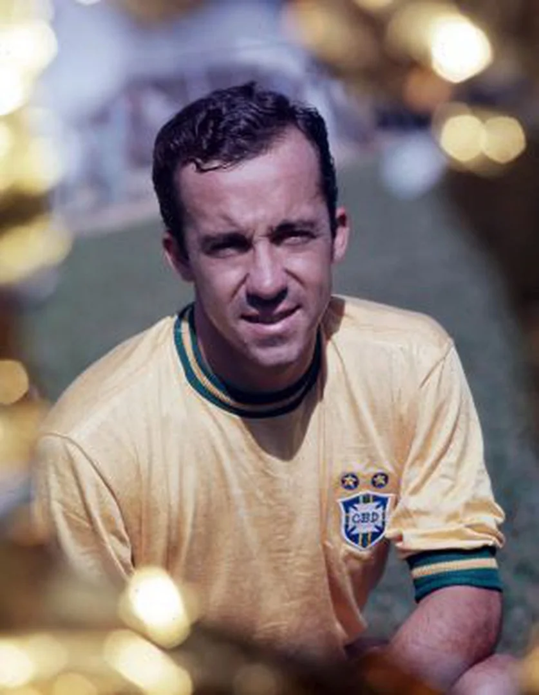 [source](https://upload.wikimedia.org/wikipedia/commons/4/4d/Tost%C3%A3o_1970.jpg) | _No Commons `Category:Tostão` found._ |

### Uwe Seeler `uwe-seeler`

| Current | Candidates |
|---------|------------|
| 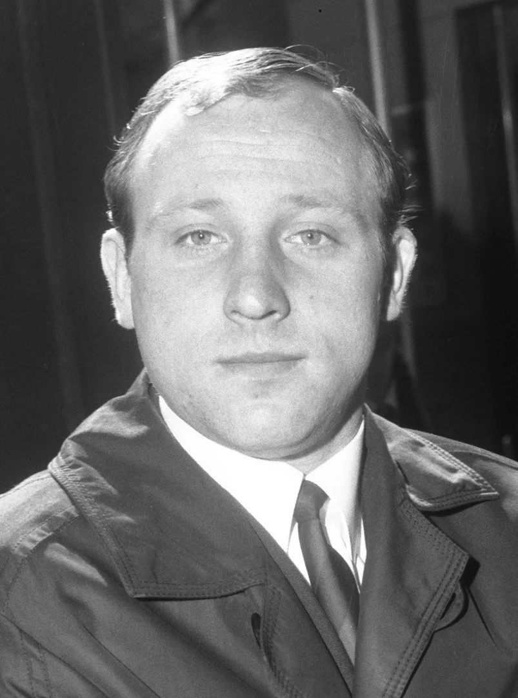 [source](https://upload.wikimedia.org/wikipedia/commons/4/42/Uwe_Seeler_1966_%28cropped%29.jpg) | _No Commons `Category:Uwe Seeler` found._ |

### Valeriy Lobanovskyi `valeriy-lobanovskyi`

| Current | Candidates |
|---------|------------|
| 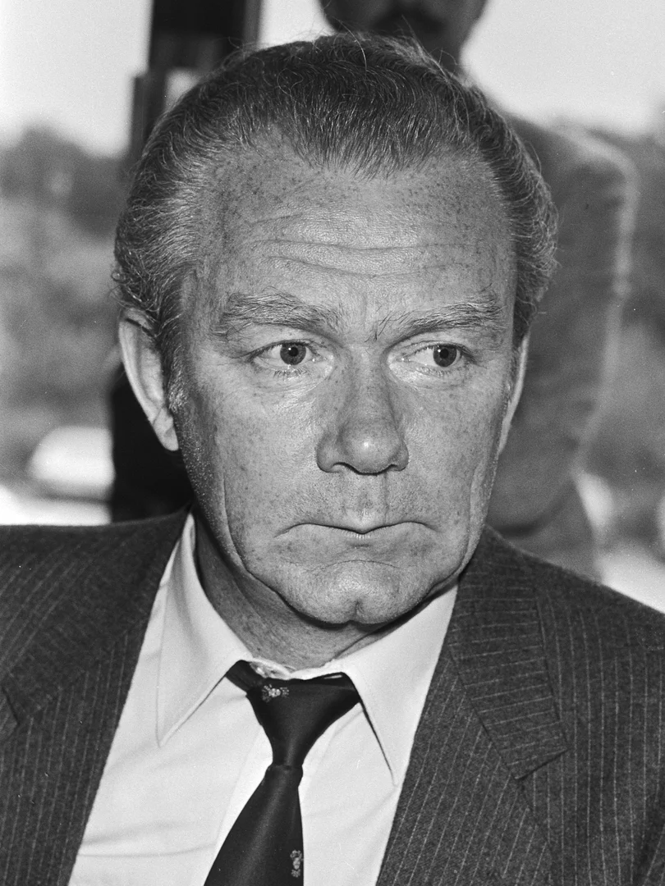 [source](https://upload.wikimedia.org/wikipedia/commons/f/f0/Valeri_Lobanovsky.jpg) | _No Commons `Category:Valeriy Lobanovskyi` found._ |

### Vavá `vava`

| Current | Candidates |
|---------|------------|
| 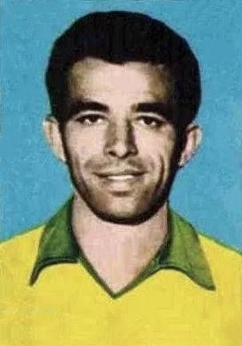 [source](https://upload.wikimedia.org/wikipedia/commons/e/ec/Vav%C3%A1_en_1962.jpg) | _No Commons `Category:Vavá` found._ |

### Vicente del Bosque `vicente-del-bosque`

| Current | Candidates |
|---------|------------|
| 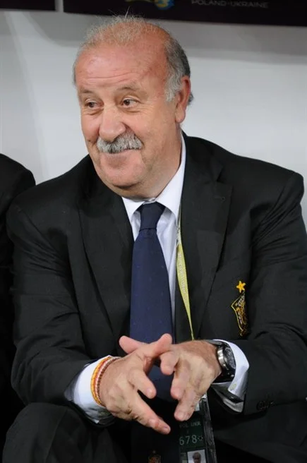 [source](https://upload.wikimedia.org/wikipedia/commons/b/b7/Vicente_del_Bosque_Euro_2012_final.jpg) | _No Commons `Category:Vicente del Bosque` found._ |

### Vinícius Júnior `vinicius-junior`

| Current | Candidates |
|---------|------------|
|  [source](https://upload.wikimedia.org/wikipedia/commons/3/34/Vinicius_Junior_WC2022.jpg) | _No Commons `Category:Vinícius Júnior` found._ |

### Virgil van Dijk `virgil-van-dijk`

| Current | Candidates |
|---------|------------|
| 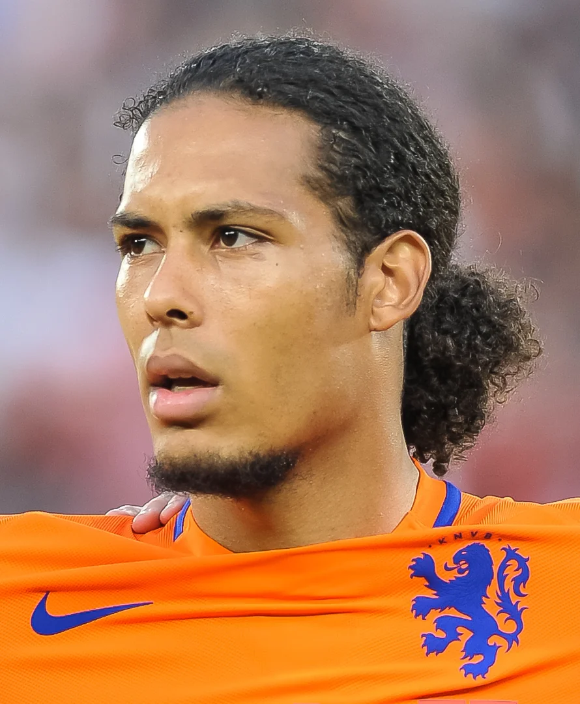 [source](https://upload.wikimedia.org/wikipedia/commons/5/5d/20160604_AUT_NED_8876_%28cropped%29.jpg) | _No Commons `Category:Virgil van Dijk` found._ |

### Vittorio Pozzo `vittorio-pozzo`

| Current | Candidates |
|---------|------------|
| 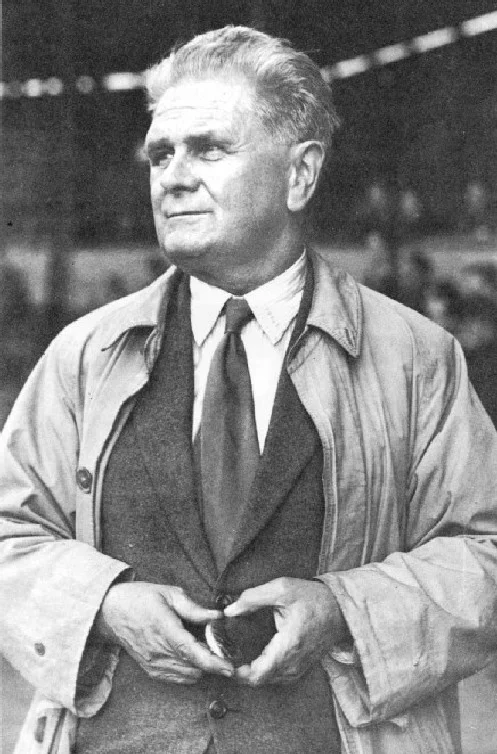 [source](https://upload.wikimedia.org/wikipedia/commons/6/68/Vittorio_Pozzo_allenatore.jpg) | _No Commons `Category:Vittorio Pozzo` found._ |

### Wayne Rooney `wayne-rooney`

| Current | Candidates |
|---------|------------|
| 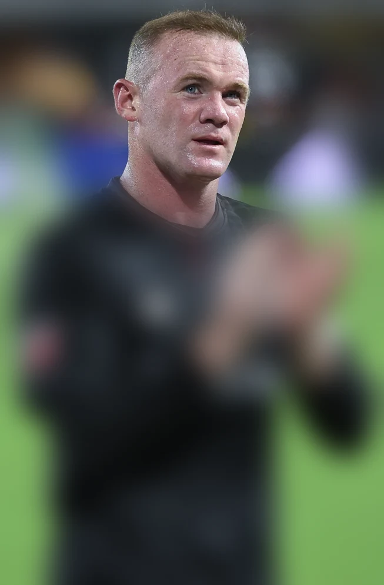 [source](https://upload.wikimedia.org/wikipedia/commons/9/9d/Wayne_Rooney_%2850121495731%29_%28cropped%29.jpg) | _No Commons `Category:Wayne Rooney` found._ |

### Wesley Sneijder `wesley-sneijder`

| Current | Candidates |
|---------|------------|
| 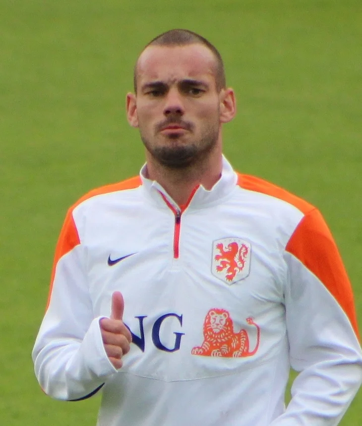 [source](https://upload.wikimedia.org/wikipedia/commons/4/42/Wesley_Sneijder_%2815487233555%29_%28cropped%29.jpg) | _No Commons `Category:Wesley Sneijder` found._ |

### Wolfgang Overath `wolfgang-overath`

| Current | Candidates |
|---------|------------|
| 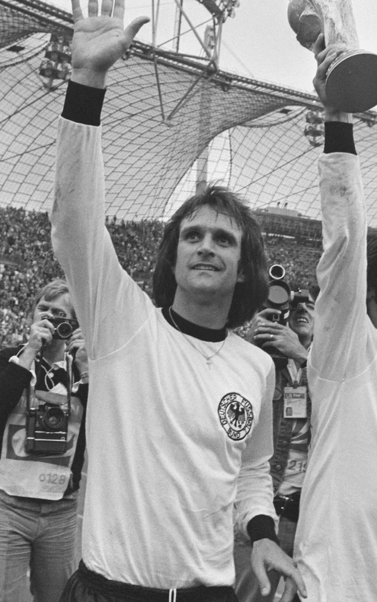 [source](https://upload.wikimedia.org/wikipedia/commons/4/40/Wolfgang_Overath_1974.jpg) | _No Commons `Category:Wolfgang Overath` found._ |

### Xabi Alonso `xabi-alonso`

| Current | Candidates |
|---------|------------|
| 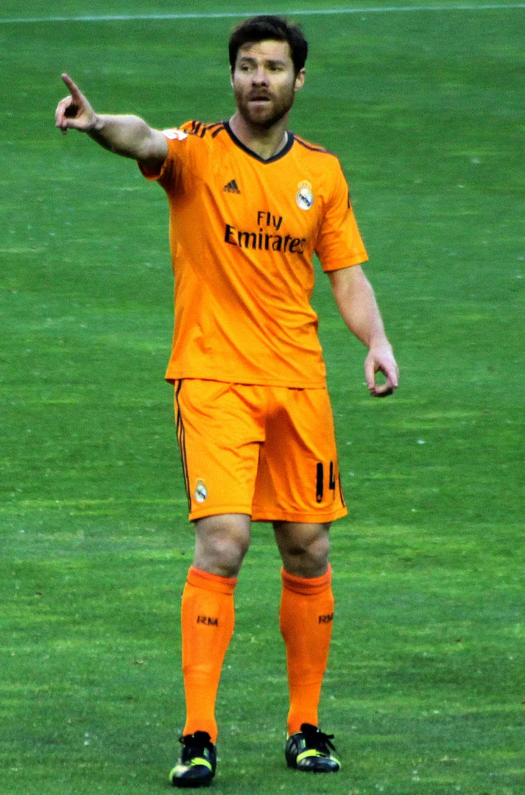 [source](https://upload.wikimedia.org/wikipedia/commons/b/b6/Los_Caminos_del_f%C3%BAtbol._Xabi_Alonso_%2839666778464%29_%28cropped%29.jpg) | _No Commons `Category:Xabi Alonso` found._ |

### Yaya Touré `yaya-toure`

| Current | Candidates |
|---------|------------|
|  [source](https://upload.wikimedia.org/wikipedia/commons/7/79/Yaya_Toure_ACON_trophy_2015.jpg) | _No Commons `Category:Yaya Touré` found._ |

### Yoshikatsu Kawaguchi `yoshikatsu-kawaguchi`

| Current | Candidates |
|---------|------------|
| 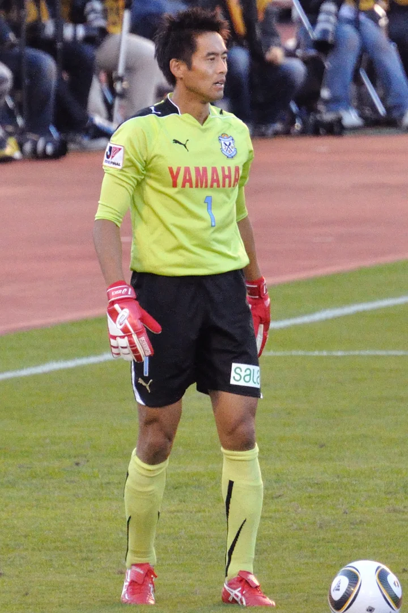 [source](https://upload.wikimedia.org/wikipedia/commons/9/96/Yoshikatsu_Kawaguchi.jpg) | _No Commons `Category:Yoshikatsu Kawaguchi` found._ |

### Zbigniew Boniek `zbigniew-boniek`

| Current | Candidates |
|---------|------------|
| 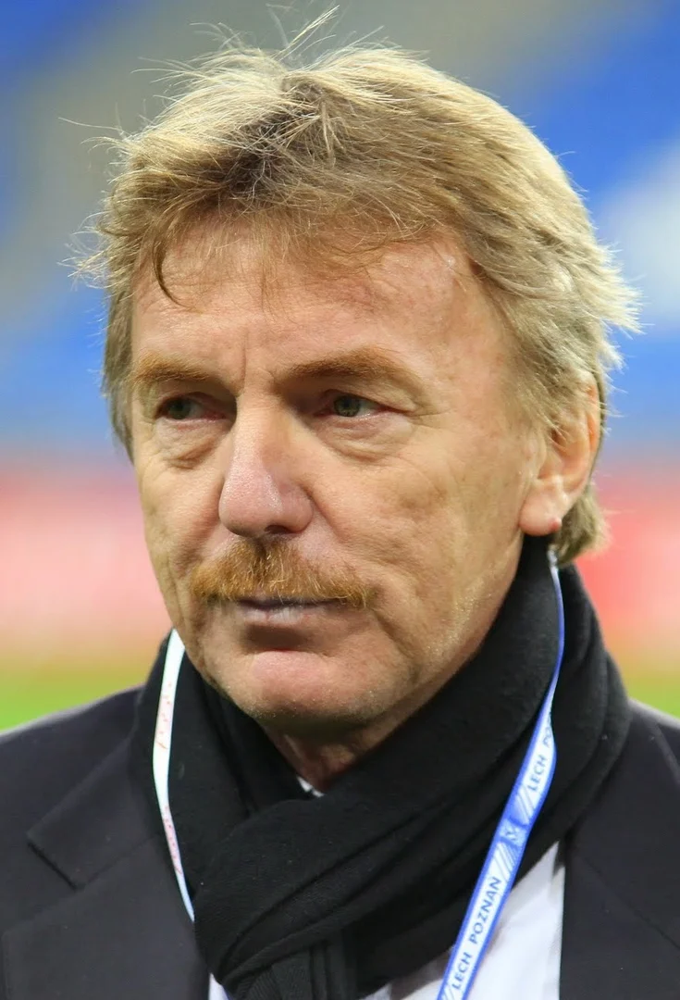 [source](https://upload.wikimedia.org/wikipedia/commons/6/64/Zbigniew_Boniek_2015.jpg) | _No Commons `Category:Zbigniew Boniek` found._ |

### Zico `zico`

| Current | Candidates |
|---------|------------|
| 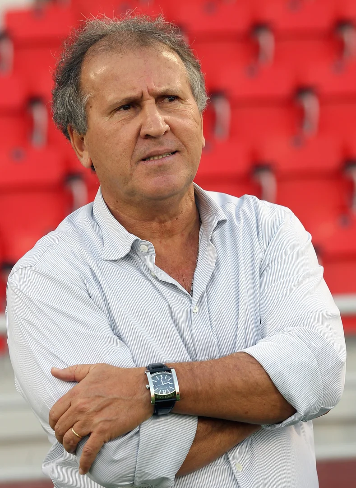 [source](https://upload.wikimedia.org/wikipedia/commons/e/e3/Zico_2012_3.jpg) | _No Commons `Category:Zico` found._ |

### Zinédine Zidane `zinedine-zidane`

| Current | Candidates |
|---------|------------|
| 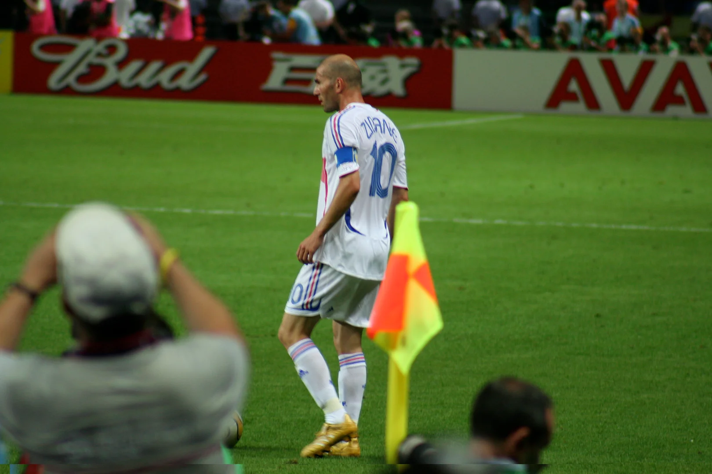 [source](https://upload.wikimedia.org/wikipedia/commons/9/92/Zinedine_zidane_wcf_2006.jpg) | _No Commons `Category:Zinédine Zidane` found._ |

### Zlatan Ibrahimović `zlatan-ibrahimovic`

| Current | Candidates |
|---------|------------|
| 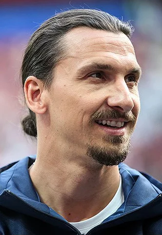 _(no batch-input)_ | _No Commons `Category:Zlatan Ibrahimović` found._ |
