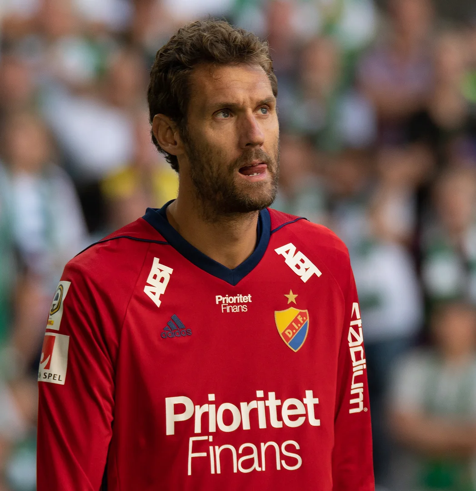
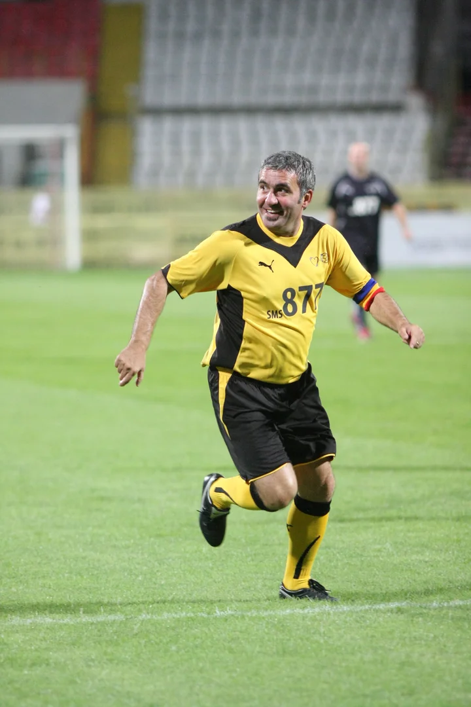
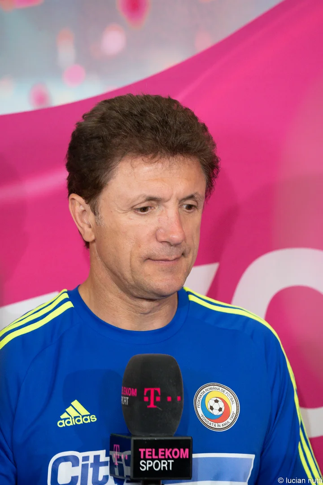
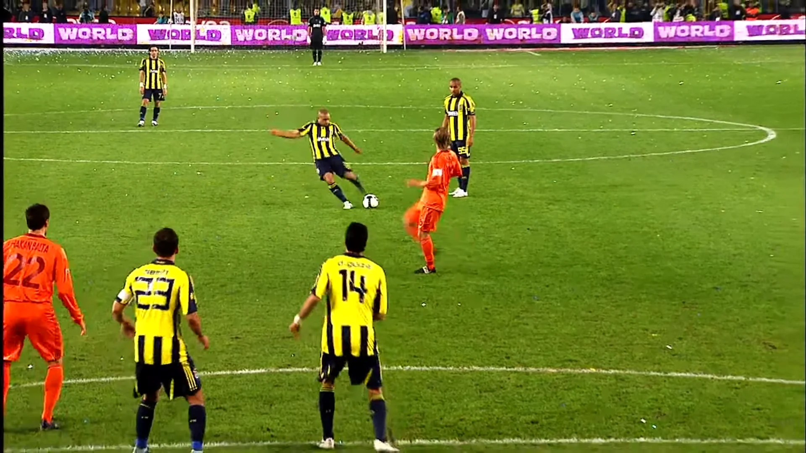
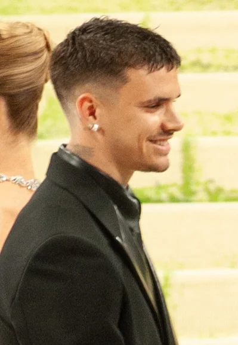
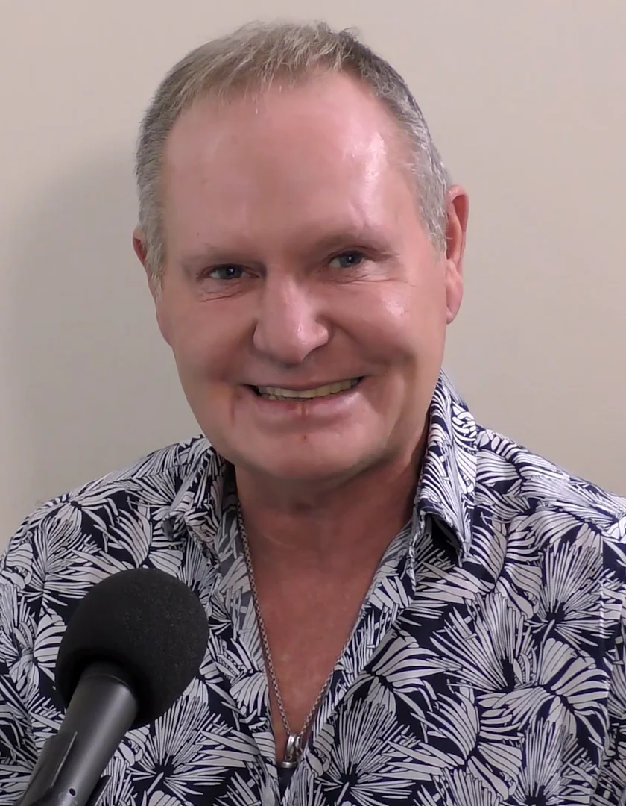
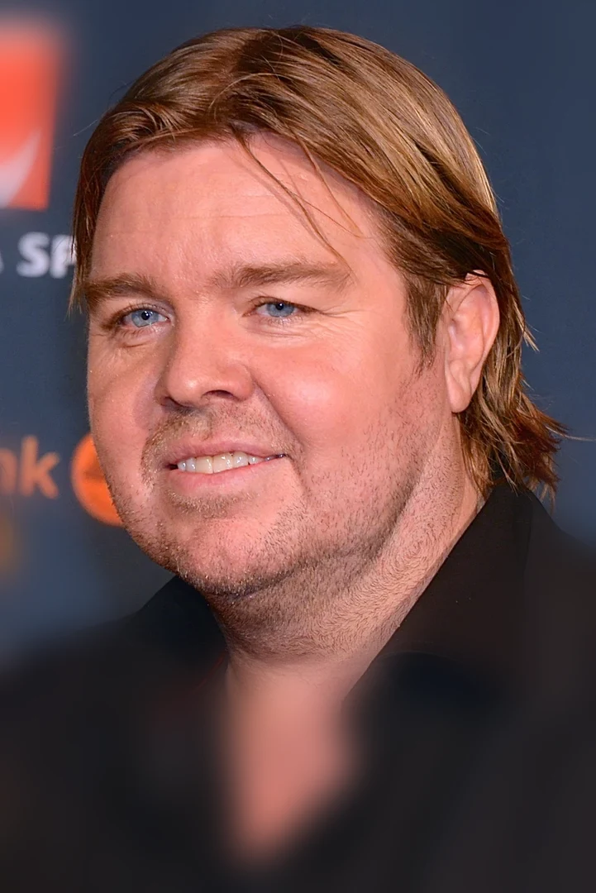
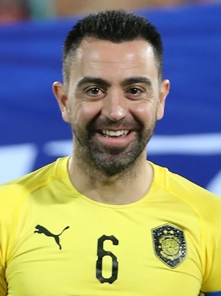

# FIFA WC — smart-flagged image audit

Total: 328 items, 67 flagged
- HIGH severity: 0 (disambig/svg/pdf = sannolikt felmatch)
- MEDIUM: 39 (source filename matchar inte item-namn — kolla manuellt)
- LOW: 28 (existing items från tidigare sessions utan source-URL — fortsätt att verifiera visuellt om critical)

**HIGH och MEDIUM är prioritet 1.** LOW = bara verifiera om de visuellt ser tveksamma ut i validation-filen.

| # | Sev | Webp | ID | Display | Current source | Reason |
|---|-----|------|----|---------|----------------|--------|
| 1 | MEDIUM |  | `andreas-isaksson` | Andreas Isaksson | [link](https://upload.wikimedia.org/wikipedia/commons/3/3f/Hammarby-Djurg%C3%A5rden-25.jpg) | source filename "Hammarby-Djurgården-25.jpg" contains none of: andreas, isaksson |
| 2 | MEDIUM |  | `andriy-shevchenko` | Andriy Shevchenko | [link](https://upload.wikimedia.org/wikipedia/commons/2/25/%D0%90%D0%BD%D0%B4%D1%80%D1%96%D0%B9_%D0%A8%D0%B5%D0%B2%D1%87%D0%B5%D0%BD%D0%BA%D0%BE_2024_%28cropped%29.png) | source filename "Андрій_Шевченко_2024_(cropped).png" contains none of: andriy, shevchenko |
| 3 | MEDIUM |  | `angel-di-maria` | Ángel Di María | [link](https://upload.wikimedia.org/wikipedia/commons/8/8c/NIG-ARG_%285%29.jpg) | source filename "NIG-ARG_(5).jpg" contains none of: angel, maria |
| 4 | MEDIUM |  | `antoine-griezmann` | Antoine Griezmann | [link](https://upload.wikimedia.org/wikipedia/commons/6/6e/FRA-ARG_%2810%29_%28cropped%29.jpg) | source filename "FRA-ARG_(10)_(cropped).jpg" contains none of: antoine, griezmann |
| 5 | MEDIUM |  | `cafu` | Cafu | [link](https://upload.wikimedia.org/wikipedia/commons/7/7a/14_06_2019_Abertura_da_Copa_Am%C3%A9rica_Brasil_2019_%2848064408836%29_%28cropped%29.jpg) | source filename "14_06_2019_Abertura_da_Copa_América_Brasil_2019_(48064408836)_(cropped).jpg" contains none of: cafu |
| 6 | MEDIUM |  | `carles-puyol` | Carles Puyol | [link](https://upload.wikimedia.org/wikipedia/commons/0/06/FIFA_World_Cup_2010_Spain_with_cup.jpg) | source filename "FIFA_World_Cup_2010_Spain_with_cup.jpg" contains none of: carles, puyol |
| 7 | MEDIUM |  | `dani-alves` | Dani Alves | [link](https://upload.wikimedia.org/wikipedia/commons/d/dd/07_07_2019_Final_da_Copa_Am%C3%A9rica_2019_%2848226649586%29_%28cropped%29.jpg) | source filename "07_07_2019_Final_da_Copa_América_2019_(48226649586)_(cropped).jpg" contains none of: dani, alves |
| 8 | MEDIUM |  | `davor-suker` | Davor Šuker | [link](https://upload.wikimedia.org/wikipedia/commons/a/ab/Croatia%27s_post-match_huddle_after_the_2018_FIFA_World_Cup_Final.jpg) | source filename "Croatia's_post-match_huddle_after_the_2018_FIFA_World_Cup_Final.jpg" contains none of: davor, suker |
| 9 | MEDIUM |  | `didier-drogba` | Didier Drogba | [link](https://upload.wikimedia.org/wikipedia/commons/5/53/Ivory_Coast_players_2013-01-10_001.jpg) | source filename "Ivory_Coast_players_2013-01-10_001.jpg" contains none of: didier, drogba |
| 10 | MEDIUM |  | `diego-costa` | Diego Costa | [link](https://upload.wikimedia.org/wikipedia/commons/5/5f/Iran_and_Spain_match_at_the_FIFA_World_Cup_23.jpg) | source filename "Iran_and_Spain_match_at_the_FIFA_World_Cup_23.jpg" contains none of: diego, costa |
| 11 | MEDIUM |  | `frenkie-de-jong` | Frenkie De Jong | [link](https://upload.wikimedia.org/wikipedia/commons/4/42/%D0%9C%D0%B0%D1%82%D1%87_%C2%AB%D0%94%D0%B8%D0%BD%D0%B0%D0%BC%D0%BE%C2%BB_-_%C2%AB%D0%91%D0%B0%D1%80%D1%81%D0%B5%D0%BB%D0%BE%D0%BD%D0%B0%C2%BB_0-1._2_%D0%BD%D0%BE%D1%8F%D0%B1%D1%80%D1%8F_2021_%D0%B3%D0%BE%D0%B4%D0%B0._II_%E2%80%94_1289671_%28cropped%29.jpg) | source filename "Матч_«Динамо»_-_«Барселона»_0-1._2_ноября_2021_года._II_—_1289671_(cropped).jpg" contains none of: frenkie, jong |
| 12 | MEDIUM |  | `gareth-bale` | Gareth Bale | [link](https://upload.wikimedia.org/wikipedia/commons/1/1e/2022_FIFA_World_Cup_United_States_1%E2%80%931_Wales_-_%2832%29_%28cropped%29.jpg) | source filename "2022_FIFA_World_Cup_United_States_1–1_Wales_-_(32)_(cropped).jpg" contains none of: gareth, bale |
| 13 | MEDIUM |  | `gheorghe-hagi` | Gheorghe Hagi | [link](https://upload.wikimedia.org/wikipedia/commons/4/49/Lansarea_candidaturii_Gabrielei_Szabo_pentru_Camera_Deputatilor%2C_Voluntari_-_04.05_%2848%29_%2814270956179%29_%28cropped%29.jpg) | source filename "Lansarea_candidaturii_Gabrielei_Szabo_pentru_Camera_Deputatilor,_Voluntari_-_04.05_(48)_(14270956179)_(cropped).jpg" contains none of: gheorghe, hagi |
| 14 | MEDIUM |  | `gheorghe-popescu` | Gheorghe Popescu | [link](https://upload.wikimedia.org/wikipedia/commons/1/18/Genera%C8%9Bia_de_Aur_vs_Barcelona_Legends_%280-2%29_2018_Sports_Festival_-_meciul_amintirilor._%2852809831697%29.jpg) | source filename "Generația_de_Aur_vs_Barcelona_Legends_(0-2)_2018_Sports_Festival_-_meciul_amintirilor._(52809831697).jpg" contains none of: gheorghe, popescu |
| 15 | MEDIUM |  | `guillermo-ochoa` | Guillermo Ochoa | [link](https://upload.wikimedia.org/wikipedia/commons/2/2f/Mex-Kor_%281%29_%28cropped%29.jpg) | source filename "Mex-Kor_(1)_(cropped).jpg" contains none of: guillermo, ochoa |
| 16 | MEDIUM |  | `hernan-crespo` | Hernan Crespo | [link](https://upload.wikimedia.org/wikipedia/commons/9/9f/Chelsea_Legends_1_Inter_Forever_4_%2827457022797%29.jpg) | source filename "Chelsea_Legends_1_Inter_Forever_4_(27457022797).jpg" contains none of: hernan, crespo |
| 17 | MEDIUM |  | `hugo-sanchez` | Hugo Sanchez | [link](https://upload.wikimedia.org/wikipedia/commons/9/9e/Huguito.jpg) | source filename "Huguito.jpg" contains none of: hugo, sanchez |
| 18 | MEDIUM |  | `javier-hernandez` | Javier Hernandez | [link](https://upload.wikimedia.org/wikipedia/commons/9/95/Hertha_BSC_vs._West_Ham_United_20190731_%28139%29.jpg) | source filename "Hertha_BSC_vs._West_Ham_United_20190731_(139).jpg" contains none of: javier, hernandez |
| 19 | MEDIUM |  | `javier-zanetti` | Javier Zanetti | [link](https://upload.wikimedia.org/wikipedia/commons/e/e7/Metalist-Inter_%282%29.jpg) | source filename "Metalist-Inter_(2).jpg" contains none of: javier, zanetti |
| 20 | MEDIUM |  | `karl-heinz-forster` | Karl Heinz Forster | [link](https://upload.wikimedia.org/wikipedia/commons/7/7e/2015-02-06_Rummenigge_0400.JPG) | source filename "2015-02-06_Rummenigge_0400.JPG" contains none of: karl, heinz, forster |
| 21 | MEDIUM |  | `landon-donovan` | Landon Donovan | [link](https://upload.wikimedia.org/wikipedia/commons/6/6f/NC_Courage_vs_SD_Wave_%28Oct_2024%29_045.jpg) | source filename "NC_Courage_vs_SD_Wave_(Oct_2024)_045.jpg" contains none of: landon, donovan |
| 22 | MEDIUM |  | `luiz-felipe-scolari` | Luiz Felipe Scolari | [link](https://upload.wikimedia.org/wikipedia/commons/1/19/Felip%C3%A3o_cropped.jpg) | source filename "Felipão_cropped.jpg" contains none of: luiz, felipe, scolari |
| 23 | MEDIUM |  | `marcelo` | Marcelo | [link](https://upload.wikimedia.org/wikipedia/commons/b/b8/Brazil_and_Croatia_match_at_the_FIFA_World_Cup_2014-06-12_%2824%29.jpg) | source filename "Brazil_and_Croatia_match_at_the_FIFA_World_Cup_2014-06-12_(24).jpg" contains none of: marcelo |
| 24 | MEDIUM |  | `martin-odegaard` | Martin Ødegaard | [link](https://upload.wikimedia.org/wikipedia/commons/a/aa/Norway_Italy_-_June_2025_E_04.jpg) | source filename "Norway_Italy_-_June_2025_E_04.jpg" contains none of: martin, degaard |
| 25 | MEDIUM |  | `michael-essien` | Michael Essien | [link](https://upload.wikimedia.org/wikipedia/commons/5/55/Flickr_-_tpower1978_-_International_friendly_match_%281%29.jpg) | source filename "Flickr_-_tpower1978_-_International_friendly_match_(1).jpg" contains none of: michael, essien |
| 26 | MEDIUM |  | `miroslav-klose` | Miroslav Klose | [link](https://upload.wikimedia.org/wikipedia/commons/8/8c/2016209185719_2016-07-27_Champions_for_Charity_-_Sven_-_1D_X_-_0149_-_DV3P4742_mod.jpg) | source filename "2016209185719_2016-07-27_Champions_for_Charity_-_Sven_-_1D_X_-_0149_-_DV3P4742_mod.jpg" contains none of: miroslav, klose |
| 27 | MEDIUM |  | `oliver-kahn` | Oliver Kahn | [link](https://upload.wikimedia.org/wikipedia/commons/4/4b/2022-07-30_Fu%C3%9Fball%2C_M%C3%A4nner%2C_DFL-Supercup%2C_RB_Leipzig_-_FC_Bayern_M%C3%BCnchen_1DX_3179_by_Stepro.jpg) | source filename "2022-07-30_Fußball,_Männer,_DFL-Supercup,_RB_Leipzig_-_FC_Bayern_München_1DX_3179_by_Stepro.jpg" contains none of: oliver, kahn |
| 28 | MEDIUM |  | `oscar` | Oscar | [link](https://upload.wikimedia.org/wikipedia/commons/c/c5/20141118_AUTBRA_5022.jpg) | source filename "20141118_AUTBRA_5022.jpg" contains none of: oscar |
| 29 | MEDIUM |  | `pablo-aimar` | Pablo Aimar | [link](https://upload.wikimedia.org/wikipedia/commons/8/80/Match_legends_2017_CC_%284%29.jpg) | source filename "Match_legends_2017_CC_(4).jpg" contains none of: pablo, aimar |
| 30 | MEDIUM |  | `petr-cech` | Petr Cech | [link](https://upload.wikimedia.org/wikipedia/commons/7/75/Arsenal_players_training_before_2019_UEFA_Europa_League_final_07_%28cropped%29.jpg) | source filename "Arsenal_players_training_before_2019_UEFA_Europa_League_final_07_(cropped).jpg" contains none of: petr, cech |
| 31 | MEDIUM |  | `rio-ferdinand` | Rio Ferdinand | [link](https://upload.wikimedia.org/wikipedia/commons/4/4c/Web_Summit_2015_-_Dublin%2C_Ireland_-_22183056474_%28cropped%29.jpg) | source filename "Web_Summit_2015_-_Dublin,_Ireland_-_22183056474_(cropped).jpg" contains none of: rio, ferdinand |
| 32 | MEDIUM |  | `roberto-carlos` | Roberto Carlos | [link](https://upload.wikimedia.org/wikipedia/commons/a/a8/LS3_1288_%2853332367864%29_%28cropped%29.jpg) | source filename "LS3_1288_(53332367864)_(cropped).jpg" contains none of: roberto, carlos |
| 33 | MEDIUM |  | `robin-van-persie` | Robin Van Persie | [link](https://upload.wikimedia.org/wikipedia/commons/6/65/Loco-Fener_%2810%29.jpg) | source filename "Loco-Fener_(10).jpg" contains none of: robin, van, persie |
| 34 | MEDIUM |  | `samuel-etoo` | Samuel Eto'o | [link](https://upload.wikimedia.org/wikipedia/commons/b/bf/FIFA_World_Cup_2010_Netherlands_Cameroon5.jpg) | source filename "FIFA_World_Cup_2010_Netherlands_Cameroon5.jpg" contains none of: samuel, eto |
| 35 | MEDIUM |  | `son-heung-min` | Son Heung-min | [link](https://upload.wikimedia.org/wikipedia/commons/4/42/Iran%2C_S._Korea_Closer_to_Securing_Spot_in_World_Cup_Tournament_after_Draw_2021-7_%28cropped%29.jpg) | source filename "Iran,_S._Korea_Closer_to_Securing_Spot_in_World_Cup_Tournament_after_Draw_2021-7_(cropped).jpg" contains none of: son, heung, min |
| 36 | MEDIUM |  | `thomas-muller` | Thomas Muller | [link](https://upload.wikimedia.org/wikipedia/commons/a/aa/FC_Red_Bull_Salzburg_gegen_Bayern_M%C3%BCnchen_%282025-01-06_Testspiel%29_19.jpg) | source filename "FC_Red_Bull_Salzburg_gegen_Bayern_München_(2025-01-06_Testspiel)_19.jpg" contains none of: thomas, muller |
| 37 | MEDIUM |  | `valeriy-lobanovskyi` | Valeriy Lobanovskyi | [link](https://upload.wikimedia.org/wikipedia/commons/f/f0/Valeri_Lobanovsky.jpg) | source filename "Valeri_Lobanovsky.jpg" contains none of: valeriy, lobanovskyi |
| 38 | MEDIUM |  | `virgil-van-dijk` | Virgil van Dijk | [link](https://upload.wikimedia.org/wikipedia/commons/5/5d/20160604_AUT_NED_8876_%28cropped%29.jpg) | source filename "20160604_AUT_NED_8876_(cropped).jpg" contains none of: virgil, van, dijk |
| 39 | MEDIUM |  | `yaya-toure` | Yaya Touré | [link](https://upload.wikimedia.org/wikipedia/commons/5/53/Ivory_Coast_players_2013-01-10_001.jpg) | source filename "Ivory_Coast_players_2013-01-10_001.jpg" contains none of: yaya, toure |
| 40 | LOW |  | `andres-iniesta` | Andrés Iniesta | _(none)_ | no batch-input source — existing item from earlier sessions, verify manually |
| 41 | LOW |  | `bastian-schweinsteiger` | Bastian Schweinsteiger | _(none)_ | no batch-input source — existing item from earlier sessions, verify manually |
| 42 | LOW |  | `cristiano-ronaldo` | Cristiano Ronaldo | _(none)_ | no batch-input source — existing item from earlier sessions, verify manually |
| 43 | LOW |  | `david-beckham` | David Beckham | _(none)_ | no batch-input source — existing item from earlier sessions, verify manually |
| 44 | LOW |  | `diego-maradona` | Diego Maradona | _(none)_ | no batch-input source — existing item from earlier sessions, verify manually |
| 45 | LOW |  | `erling-haaland` | Erling Haaland | _(none)_ | no batch-input source — existing item from earlier sessions, verify manually |
| 46 | LOW |  | `franco-baresi` | Franco Baresi | _(none)_ | no batch-input source — existing item from earlier sessions, verify manually |
| 47 | LOW |  | `george-best` | George Best | _(none)_ | no batch-input source — existing item from earlier sessions, verify manually |
| 48 | LOW |  | `harry-kane` | Harry Kane | _(none)_ | no batch-input source — existing item from earlier sessions, verify manually |
| 49 | LOW |  | `henrik-larsson` | Henrik Larsson | _(none)_ | no batch-input source — existing item from earlier sessions, verify manually |
| 50 | LOW |  | `ian-rush` | Ian Rush | _(none)_ | no batch-input source — existing item from earlier sessions, verify manually |
| 51 | LOW |  | `iker-casillas` | Iker Casillas | _(none)_ | no batch-input source — existing item from earlier sessions, verify manually |
| 52 | LOW |  | `kenny-dalglish` | Kenny Dalglish | _(none)_ | no batch-input source — existing item from earlier sessions, verify manually |
| 53 | LOW |  | `kylian-mbappe` | Kylian Mbappé | _(none)_ | no batch-input source — existing item from earlier sessions, verify manually |
| 54 | LOW |  | `lionel-messi` | Lionel Messi | _(none)_ | no batch-input source — existing item from earlier sessions, verify manually |
| 55 | LOW |  | `luka-modric` | Luka Modrić | _(none)_ | no batch-input source — existing item from earlier sessions, verify manually |
| 56 | LOW |  | `manuel-neuer` | Manuel Neuer | _(none)_ | no batch-input source — existing item from earlier sessions, verify manually |
| 57 | LOW |  | `neymar` | Neymar | _(none)_ | no batch-input source — existing item from earlier sessions, verify manually |
| 58 | LOW |  | `paul-gascoigne` | Paul Gascoigne | _(none)_ | no batch-input source — existing item from earlier sessions, verify manually |
| 59 | LOW |  | `robert-lewandowski` | Robert Lewandowski | _(none)_ | no batch-input source — existing item from earlier sessions, verify manually |
| 60 | LOW |  | `roberto-baggio` | Roberto Baggio | _(none)_ | no batch-input source — existing item from earlier sessions, verify manually |
| 61 | LOW |  | `romario` | Romário | _(none)_ | no batch-input source — existing item from earlier sessions, verify manually |
| 62 | LOW |  | `sergio-ramos` | Sergio Ramos | _(none)_ | no batch-input source — existing item from earlier sessions, verify manually |
| 63 | LOW |  | `tomas-brolin` | Tomas Brolin | _(none)_ | no batch-input source — existing item from earlier sessions, verify manually |
| 64 | LOW |  | `toni-kroos` | Toni Kroos | _(none)_ | no batch-input source — existing item from earlier sessions, verify manually |
| 65 | LOW |  | `xavi` | Xavi | _(none)_ | no batch-input source — existing item from earlier sessions, verify manually |
| 66 | LOW |  | `zinedine-zidane` | Zinédine Zidane | _(none)_ | no batch-input source — existing item from earlier sessions, verify manually |
| 67 | LOW |  | `zlatan-ibrahimovic` | Zlatan Ibrahimović | _(none)_ | no batch-input source — existing item from earlier sessions, verify manually |