# FIFA WC — flagged image discrepancies

Total flagged: 94 of 328

| # | Webp (current) | ID | Display | Current source | Probe says | Reason |
|---|----------------|----|---------|----------------|------------|--------|
| 1 | 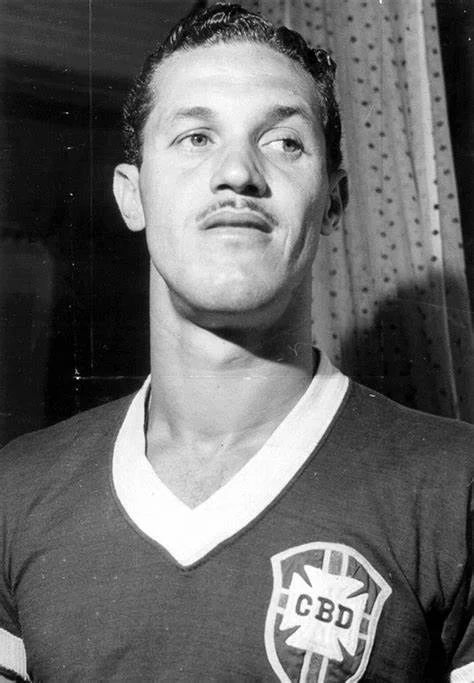 | `ademir` | Ademir | [link](https://upload.wikimedia.org/wikipedia/commons/4/4a/Ademir_de_Menezes.jpg) | [link](https://upload.wikimedia.org/wikipedia/commons/thumb/3/35/Ademir_Marques_de_Menezes.png/500px-Ademir_Marques_de_Menezes.png) | mismatch: source=ademir_de_menezes.jpg vs probe=ademir_marques_de_menezes.png |
| 2 | 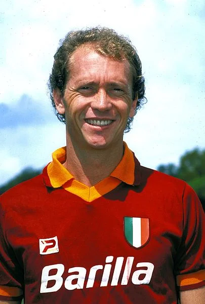 | `cafu-falcao` | Cafu Falcao | [link](https://upload.wikimedia.org/wikipedia/commons/7/73/Paulo_Roberto_Falc%C3%A3o%2C_Roma_1983-84.jpg) | [link](https://upload.wikimedia.org/wikipedia/commons/thumb/2/25/Caf%C3%BA_%281%29_%28cropped%29.jpg/500px-Caf%C3%BA_%281%29_%28cropped%29.jpg) | mismatch: source=paulo_roberto_falcão,_roma_1983-84.jpg vs probe=cafú_(1)_(cropped).jpg |
| 3 |  | `carles-puyol` | Carles Puyol | [link](https://upload.wikimedia.org/wikipedia/commons/0/06/FIFA_World_Cup_2010_Spain_with_cup.jpg) | [link](https://upload.wikimedia.org/wikipedia/commons/thumb/6/65/Premios_Goya_2020_-_Carles_Pujol.jpg/500px-Premios_Goya_2020_-_Carles_Pujol.jpg) | mismatch: source=fifa_world_cup_2010_spain_with_cup.jpg vs probe=premios_goya_2020_-_carles_pujol.jpg |
| 4 | 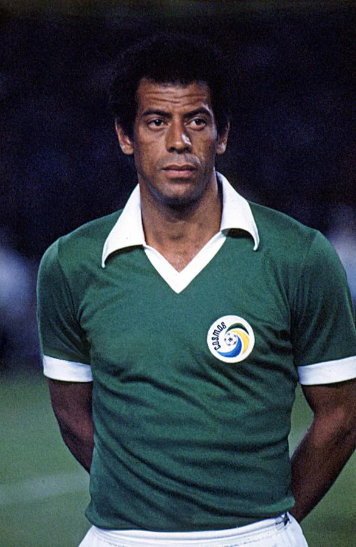 | `carlos-alberto` | Carlos Alberto | [link](https://upload.wikimedia.org/wikipedia/commons/9/9b/Carlos_alberto_cosmos.jpg) | [link](https://upload.wikimedia.org/wikipedia/commons/thumb/4/4a/Disambig_grey.svg/500px-Disambig_grey.svg.png) | mismatch: source=carlos_alberto_cosmos.jpg vs probe=disambig_grey.svg |
| 5 |  | `davor-suker` | Davor Šuker | [link](https://upload.wikimedia.org/wikipedia/commons/a/ab/Croatia%27s_post-match_huddle_after_the_2018_FIFA_World_Cup_Final.jpg) | [link](https://upload.wikimedia.org/wikipedia/commons/a/af/XVIII_%D0%9A%D0%BE%D0%BD%D0%B3%D1%80%D0%B5%D1%81%D1%81_%D0%A4%D0%A4%D0%A3._11_%D0%BC%D0%B0%D1%80%D1%82%D0%B0_2016_%D0%B3%D0%BE%D0%B4%D0%B0_%E2%80%94_672209_%28cropped%29.jpg) | mismatch: source=croatia's_post-match_huddle_after_the_2018_fifa_world_cup_final.jpg vs probe=xviii_конгресс_ффу._11_марта_2016_года_—_672209_(cropped).jpg |
| 6 | 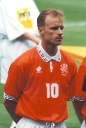 | `dennis-bergkamp` | Dennis Bergkamp | [link](https://upload.wikimedia.org/wikipedia/commons/3/33/Dennis_Bergkamp_Euro_%2796.jpg) | [link](https://upload.wikimedia.org/wikipedia/commons/7/75/Dennis_Bergkamp_2014_%28cropped%29.jpg) | mismatch: source=dennis_bergkamp_euro_'96.jpg vs probe=dennis_bergkamp_2014_(cropped).jpg |
| 7 | 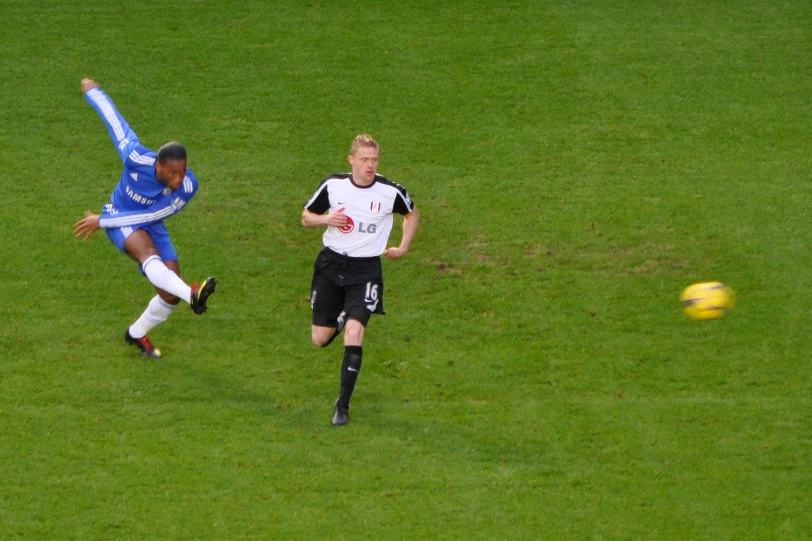 | `didier-drogba` | Didier Drogba | [link](https://upload.wikimedia.org/wikipedia/commons/5/53/Ivory_Coast_players_2013-01-10_001.jpg) | [link](https://upload.wikimedia.org/wikipedia/commons/thumb/7/77/Didier_Drogba_%282019%29_%28cropped2%29.jpg/500px-Didier_Drogba_%282019%29_%28cropped2%29.jpg) | mismatch: source=ivory_coast_players_2013-01-10_001.jpg vs probe=didier_drogba_(2019)_(cropped2).jpg |
| 8 | 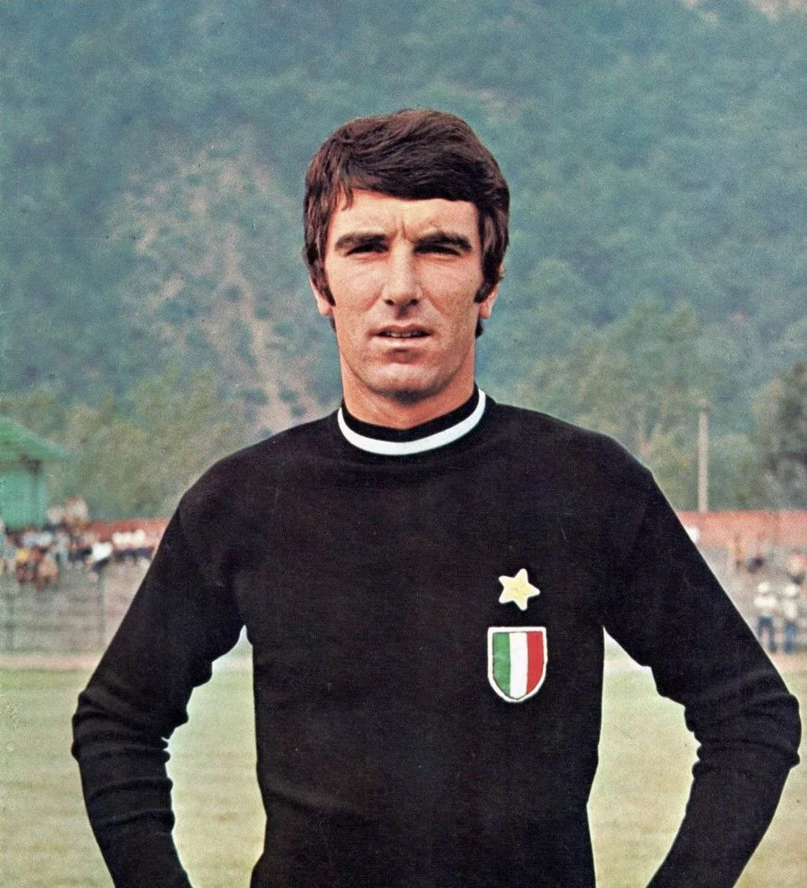 | `dino-zoff` | Dino Zoff | [link](https://upload.wikimedia.org/wikipedia/commons/4/48/Zoff%2C_Causio%2C_Pertini%2C_Bearzot_-_Mondiale_1982.jpg) | [link](https://upload.wikimedia.org/wikipedia/commons/thumb/a/a9/Dino_Zoff_-_1972_-_Juventus_FC_%28cropped%29.jpg/500px-Dino_Zoff_-_1972_-_Juventus_FC_%28cropped%29.jpg) | mismatch: source=zoff,_causio,_pertini,_bearzot_-_mondiale_1982.jpg vs probe=dino_zoff_-_1972_-_juventus_fc_(cropped).jpg |
| 9 | 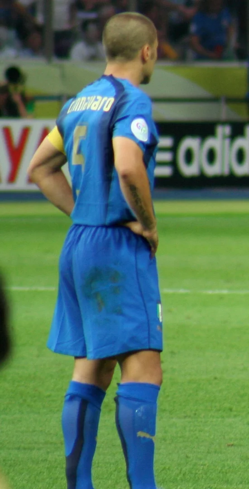 | `fabio-cannavaro` | Fabio Cannavaro | [link](https://upload.wikimedia.org/wikipedia/commons/5/50/Fabio_Cannavaro_in_world_cup_2006.jpg) | [link](https://upload.wikimedia.org/wikipedia/commons/thumb/0/09/Fabio_Cannavaro_2011.jpg/500px-Fabio_Cannavaro_2011.jpg) | mismatch: source=fabio_cannavaro_in_world_cup_2006.jpg vs probe=fabio_cannavaro_2011.jpg |
| 10 | 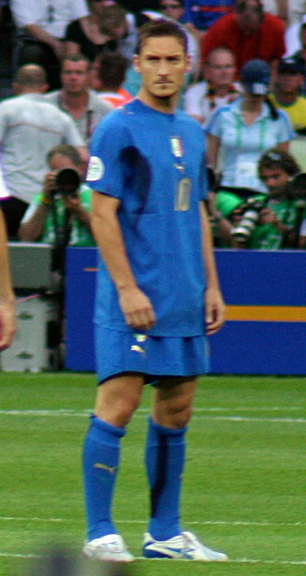 | `francesco-totti` | Francesco Totti | [link](https://upload.wikimedia.org/wikipedia/commons/9/99/Italy_vs_France_-_FIFA_World_Cup_2006_final_-_Francesco_Totti.jpg) | [link](https://upload.wikimedia.org/wikipedia/commons/4/42/KL-2018_%284%29.jpg) | mismatch: source=italy_vs_france_-_fifa_world_cup_2006_final_-_francesco_totti.jpg vs probe=kl-2018_(4).jpg |
| 11 | 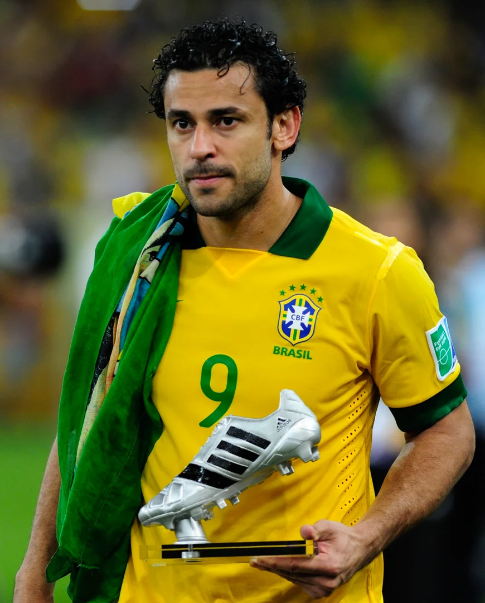 | `fred` | Fred | [link](https://upload.wikimedia.org/wikipedia/commons/b/ba/Fred_Silver_Boot%2C_Confederations_Cup_2013.jpg) | [link](https://upload.wikimedia.org/wikipedia/commons/thumb/8/88/Peace_symbol_%28fixed_width%29.svg/500px-Peace_symbol_%28fixed_width%29.svg.png) | mismatch: source=fred_silver_boot,_confederations_cup_2013.jpg vs probe=peace_symbol_(fixed_width).svg |
| 12 | 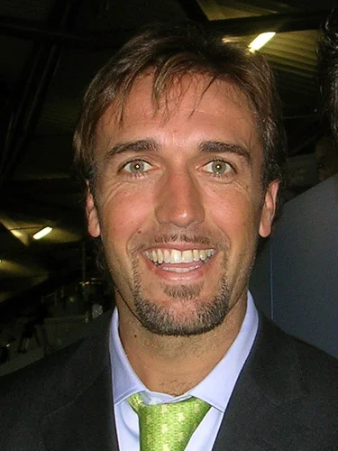 | `gabriel-batistuta` | Gabriel Batistuta | [link](https://upload.wikimedia.org/wikipedia/commons/e/e4/Gabriel_batistuta.jpg) | [link](https://upload.wikimedia.org/wikipedia/commons/1/13/Omar_Batistuta_%282%29.jpg) | mismatch: source=gabriel_batistuta.jpg vs probe=omar_batistuta_(2).jpg |
| 13 | 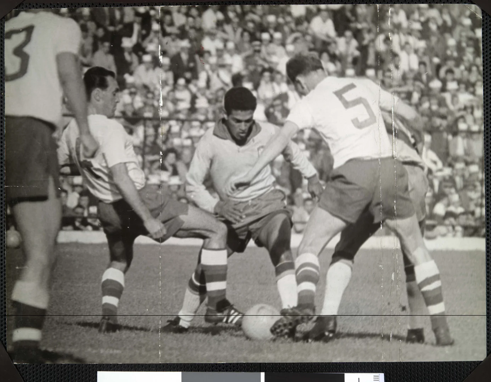 | `garrincha` | Garrincha | [link](https://upload.wikimedia.org/wikipedia/commons/e/e3/Garrincha_na_copa_de_1962.jpg) | [link](https://upload.wikimedia.org/wikipedia/commons/thumb/3/3f/Manoel_Francisco_dos_Santos-Garrincha.jpg/500px-Manoel_Francisco_dos_Santos-Garrincha.jpg) | mismatch: source=garrincha_na_copa_de_1962.jpg vs probe=manoel_francisco_dos_santos-garrincha.jpg |
| 14 | 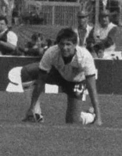 | `gary-lineker` | Gary Lineker | [link](https://upload.wikimedia.org/wikipedia/commons/2/2e/Lineker_Nederland_1-3%2C_Bestanddeelnr_934-2662_%28cropped%29.jpg) | [link](https://upload.wikimedia.org/wikipedia/commons/thumb/c/c1/Prime_Minister_Keir_Starmer_hosts_St_George%27s_Day_Reception_%2854470857860%29_%28cropped%29.jpg/500px-Prime_Minister_Keir_Starmer_hosts_St_George%27s_Day_Reception_%2854470857860%29_%28cropped%29.jpg) | mismatch: source=lineker_nederland_1-3,_bestanddeelnr_934-2662_(cropped).jpg vs probe=prime_minister_keir_starmer_hosts_st_george's_day_reception_(54470857860)_(cropped).jpg |
| 15 | 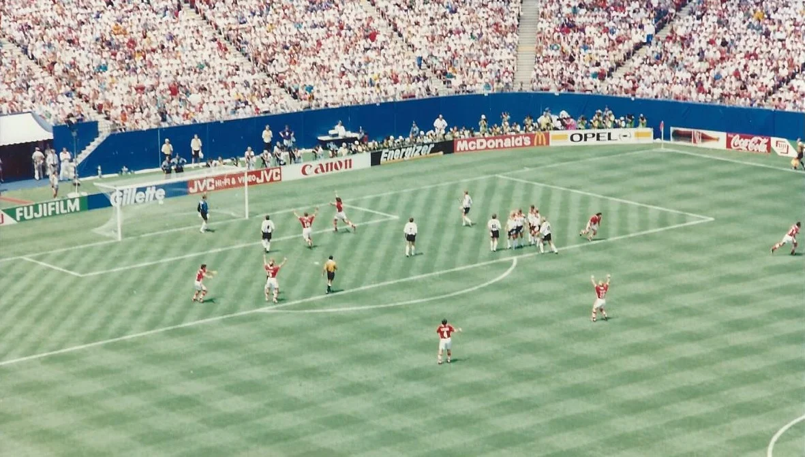 | `hristo-stoichkov` | Hristo Stoichkov | [link](https://upload.wikimedia.org/wikipedia/commons/2/20/World_Cup_1994_-_Bulgaria_v_Germany_-_Stoichkov_has_scored_in_75th_minute.jpg) | [link](https://upload.wikimedia.org/wikipedia/commons/thumb/f/f3/Stoichkov_in_2016.jpg/500px-Stoichkov_in_2016.jpg) | mismatch: source=world_cup_1994_-_bulgaria_v_germany_-_stoichkov_has_scored_in_75th_minute.jpg vs probe=stoichkov_in_2016.jpg |
| 16 | 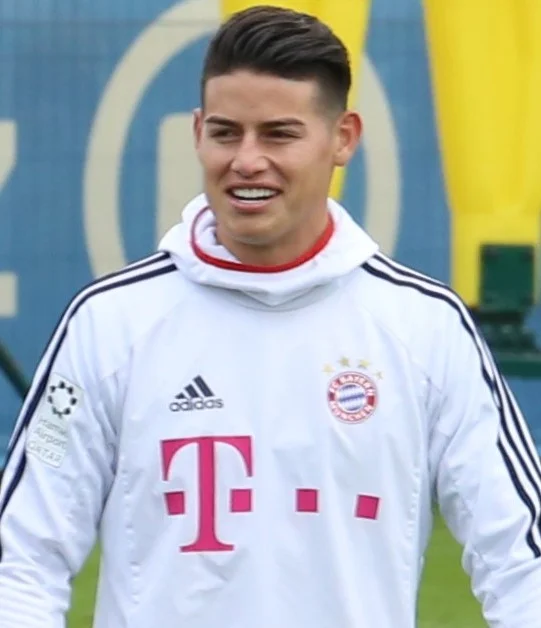 | `james-rodriguez` | James Rodriguez | [link](https://upload.wikimedia.org/wikipedia/commons/7/79/James_Rodriguez_2018.jpg) | _(none)_ | no pageimage for displayName (likely renamed or removed) |
| 17 | 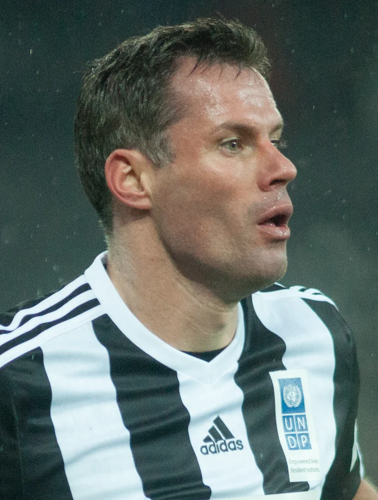 | `jamie-carragher` | Jamie Carragher | [link](https://upload.wikimedia.org/wikipedia/commons/c/c8/Football_against_poverty_2014_-_Jamie_Carragher_%28cropped%29.jpg) | _(none)_ | no pageimage for displayName (likely renamed or removed) |
| 18 | 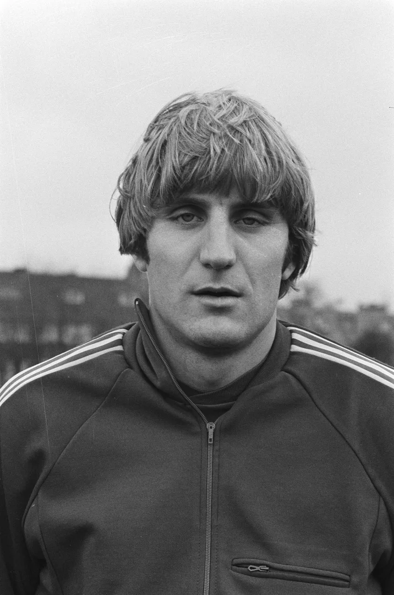 | `jan-ceulemans` | Jan Ceulemans | [link](https://upload.wikimedia.org/wikipedia/commons/c/c5/Jan_Ceulemans.jpg) | _(none)_ | no pageimage for displayName (likely renamed or removed) |
| 19 | 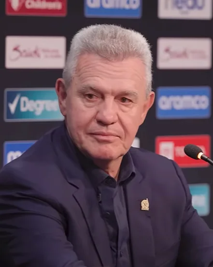 | `javier-aguirre` | Javier Aguirre | [link](https://upload.wikimedia.org/wikipedia/commons/b/b4/Javier_Aguirre.png) | _(none)_ | no pageimage for displayName (likely renamed or removed) |
| 20 | 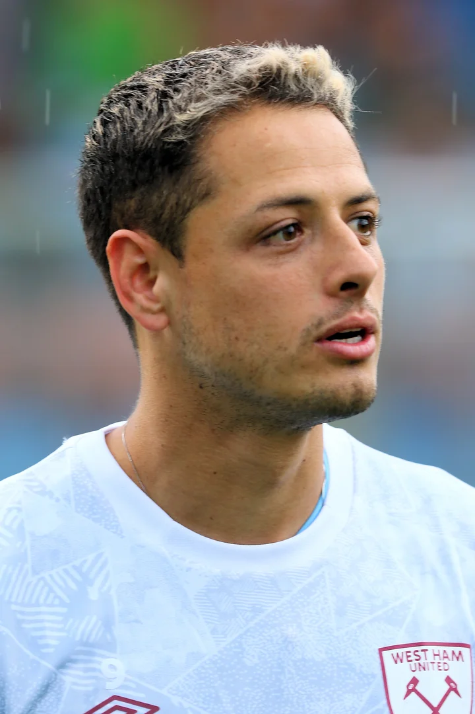 | `javier-hernandez` | Javier Hernandez | [link](https://upload.wikimedia.org/wikipedia/commons/9/95/Hertha_BSC_vs._West_Ham_United_20190731_%28139%29.jpg) | _(none)_ | no pageimage for displayName (likely renamed or removed) |
| 21 | 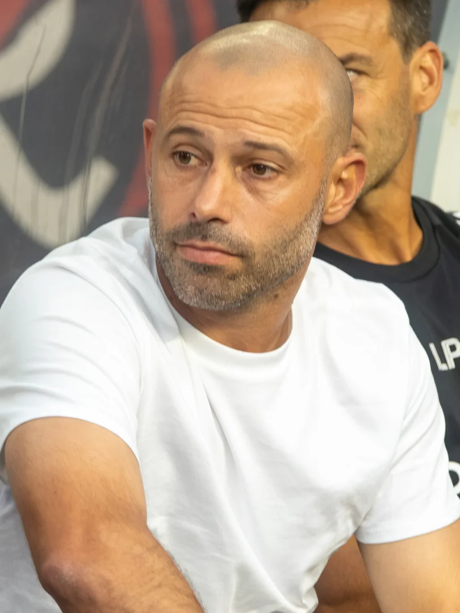 | `javier-mascherano` | Javier Mascherano | [link](https://upload.wikimedia.org/wikipedia/commons/9/9a/Javier_Mascherano_NE_Revolution_Inter_Miami_7.9.25-040_%28cropped%29.jpg) | _(none)_ | no pageimage for displayName (likely renamed or removed) |
| 22 | 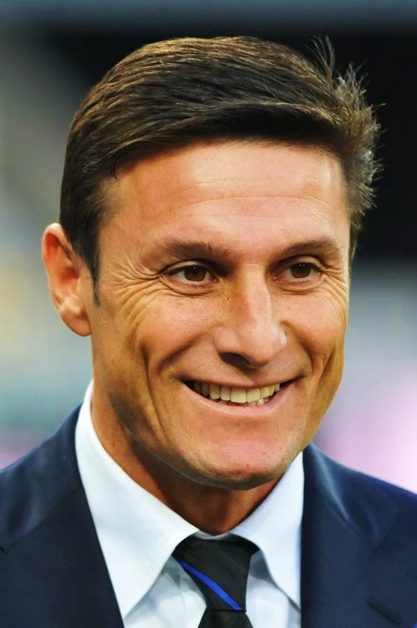 | `javier-zanetti` | Javier Zanetti | [link](https://upload.wikimedia.org/wikipedia/commons/e/e7/Metalist-Inter_%282%29.jpg) | _(none)_ | no pageimage for displayName (likely renamed or removed) |
| 23 | 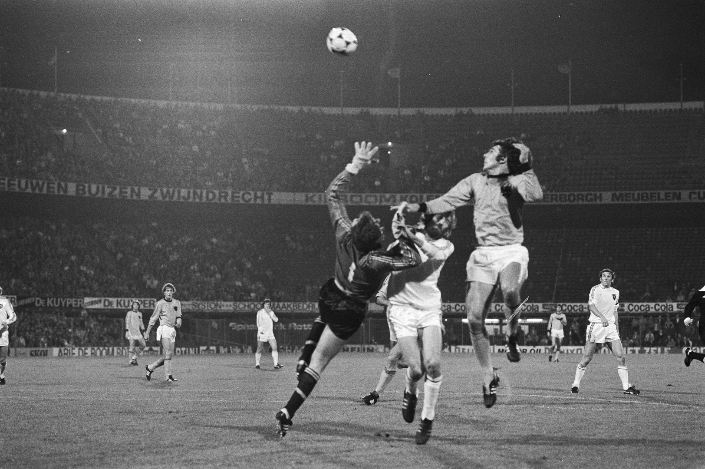 | `jean-marie-pfaff` | Jean Marie Pfaff | [link](https://upload.wikimedia.org/wikipedia/commons/1/16/Jean-Marie_Pfaff_at_Runa_Ralley_2007_cropped.jpg) | _(none)_ | no pageimage for displayName (likely renamed or removed) |
| 24 | 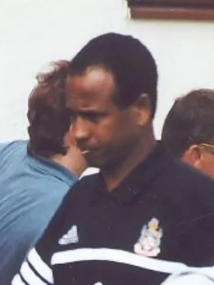 | `jean-tigana` | Jean Tigana | [link](https://upload.wikimedia.org/wikipedia/commons/5/59/Jean_Tigana_cropped.jpg) | _(none)_ | no pageimage for displayName (likely renamed or removed) |
| 25 | 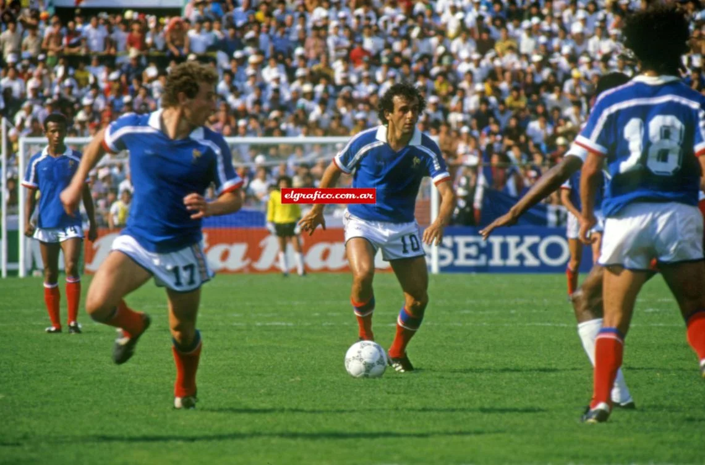 | `jean-pierre-papin` | Jean-Pierre Papin | [link](https://upload.wikimedia.org/wikipedia/commons/a/a6/PapinJP1997_%28cropped%29.jpg) | _(none)_ | no pageimage for displayName (likely renamed or removed) |
| 26 | 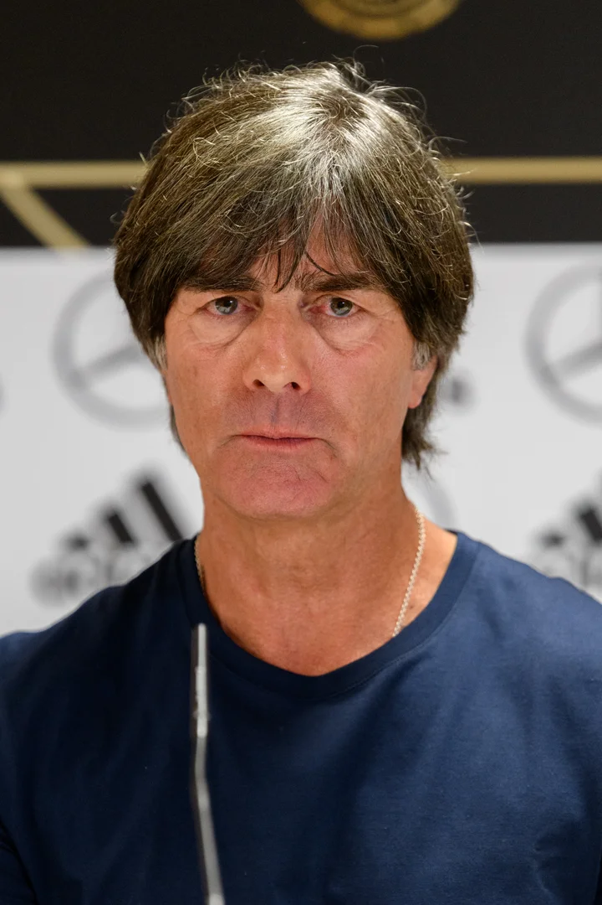 | `joachim-low` | Joachim Löw | [link](https://upload.wikimedia.org/wikipedia/commons/2/2d/20180602_FIFA_Friendly_Match_Austria_vs._Germany_Jogi_L%C3%B6w_850_1386.jpg) | _(none)_ | no pageimage for displayName (likely renamed or removed) |
| 27 | 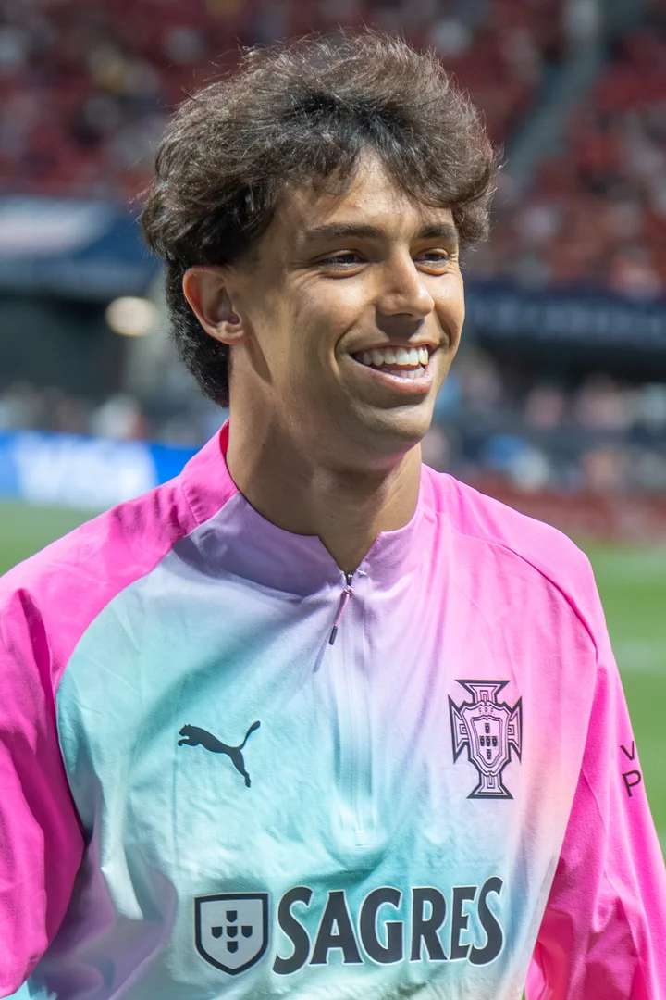 | `joao-felix` | João Félix | [link](https://upload.wikimedia.org/wikipedia/commons/5/55/Jo%C3%A3o_F%C3%A9lix_USMNT_v_Portugal_Mar_31_2026-22_%28cropped%29.jpg) | _(none)_ | no pageimage for displayName (likely renamed or removed) |
| 28 | 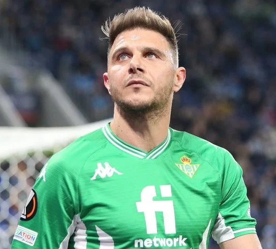 | `joaquin` | Joaquin | [link](https://upload.wikimedia.org/wikipedia/commons/f/ff/Joaquin_2022_%28cropped%29.jpg) | _(none)_ | no pageimage for displayName (likely renamed or removed) |
| 29 | 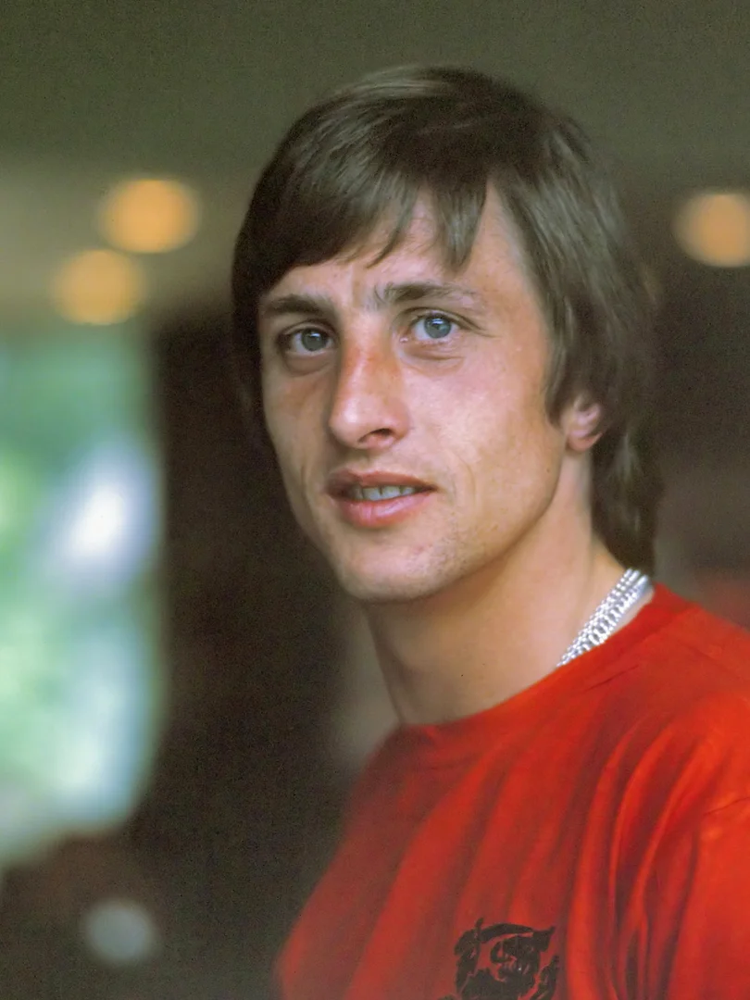 | `johan-cruyff` | Johan Cruyff | [link](https://upload.wikimedia.org/wikipedia/commons/c/cb/Johan_Cruijff_%281974%29.jpg) | _(none)_ | no pageimage for displayName (likely renamed or removed) |
| 30 | 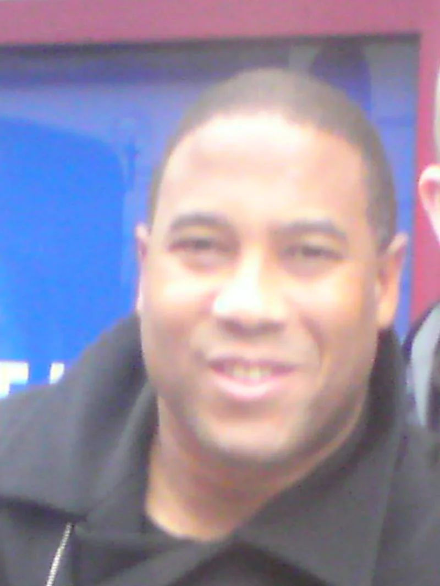 | `john-barnes` | John Barnes | [link](https://upload.wikimedia.org/wikipedia/commons/e/e4/John_Barnes_in_Singapore%2C_2023_01.jpg) | _(none)_ | no pageimage for displayName (likely renamed or removed) |
| 31 | 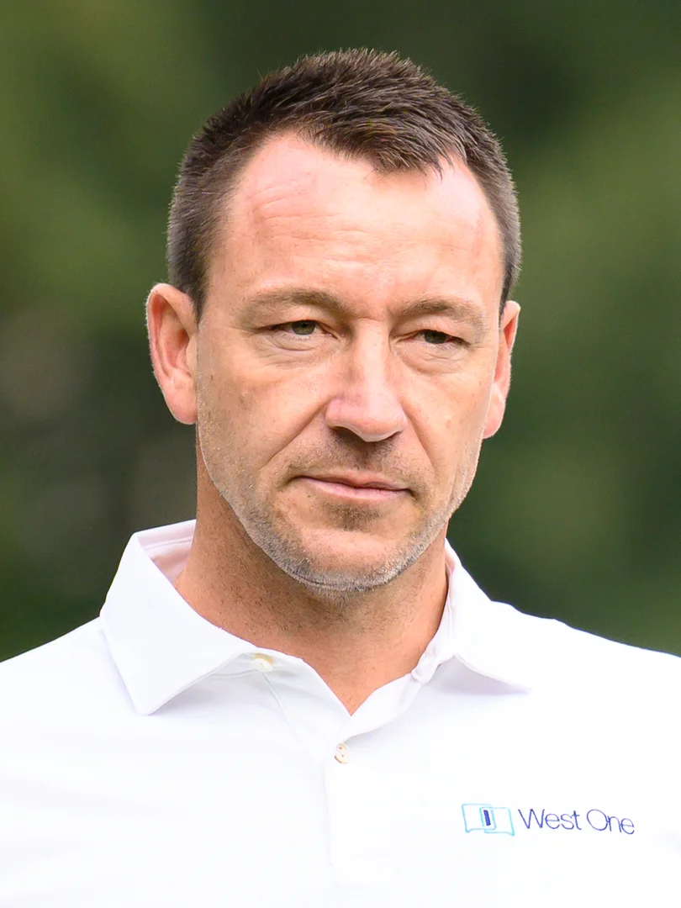 | `john-terry` | John Terry | [link](https://upload.wikimedia.org/wikipedia/commons/c/c3/John_Terry_at_pro-am_Wentworth_golf_course_September_2023_%28cropped%29.jpg) | _(none)_ | no pageimage for displayName (likely renamed or removed) |
| 32 | 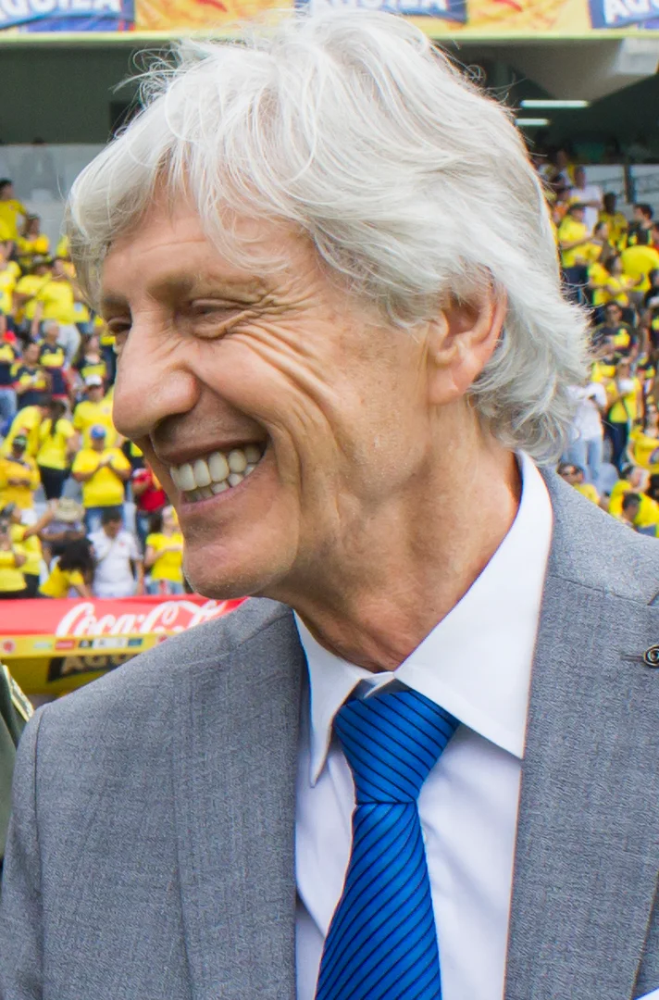 | `jose-pekerman` | José Pekerman | [link](https://upload.wikimedia.org/wikipedia/commons/5/59/Jos%C3%A9_N%C3%A9stor_P%C3%A9kerman_and_Police_at_Colombia_vs_Uruguay_match_for_Russia_2018_%28cropped%29.jpg) | _(none)_ | no pageimage for displayName (likely renamed or removed) |
| 33 | 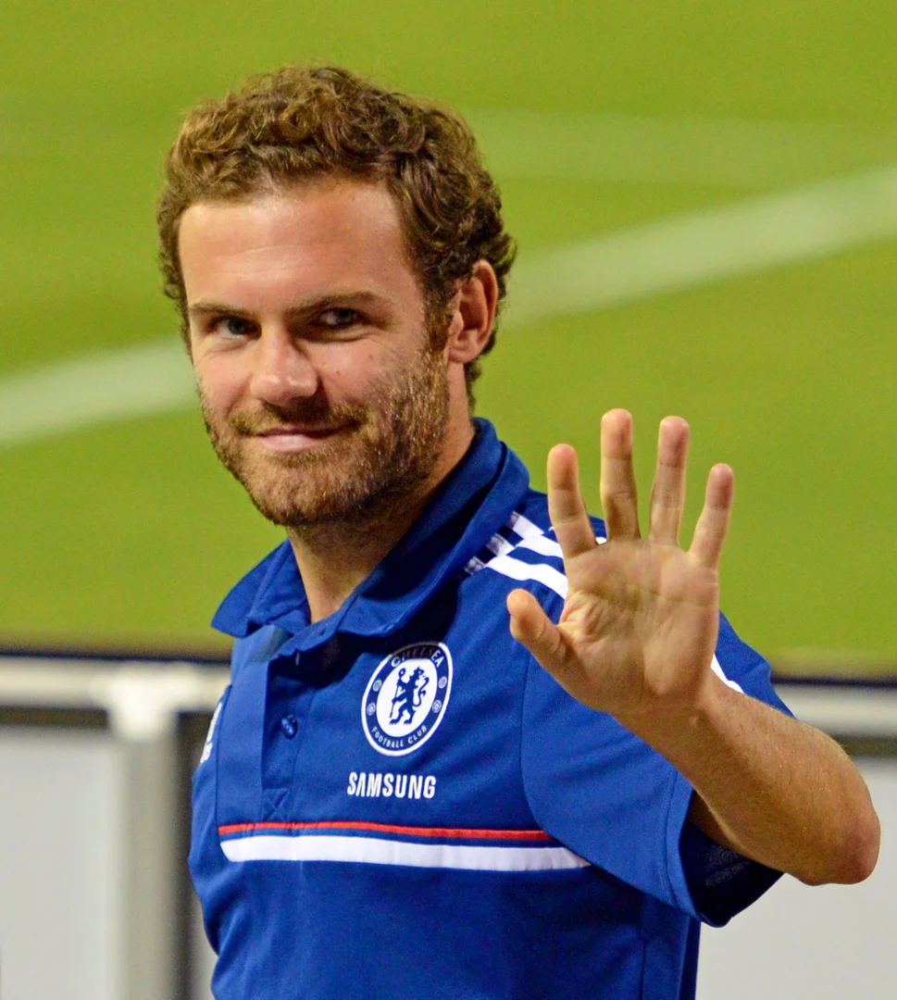 | `juan-mata` | Juan Mata | [link](https://upload.wikimedia.org/wikipedia/commons/6/63/Juan_Mata_Melbourne_Victory_Signing_Press_Conference.png) | _(none)_ | no pageimage for displayName (likely renamed or removed) |
| 34 | 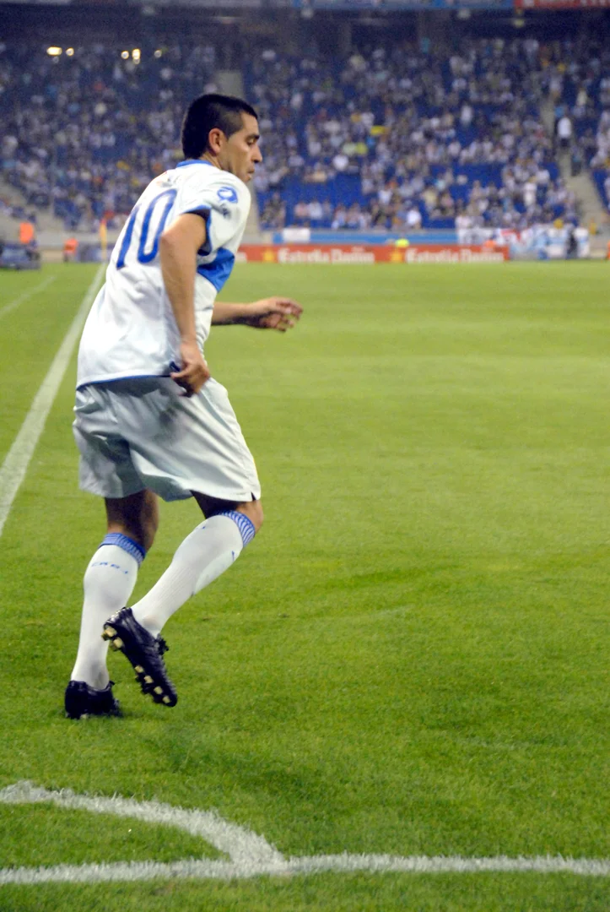 | `juan-roman-riquelme` | Juan Roman Riquelme | [link](https://upload.wikimedia.org/wikipedia/commons/b/ba/Juan_Rom%C3%A1n_Riquelme_-_2019.jpg) | _(none)_ | no pageimage for displayName (likely renamed or removed) |
| 35 | 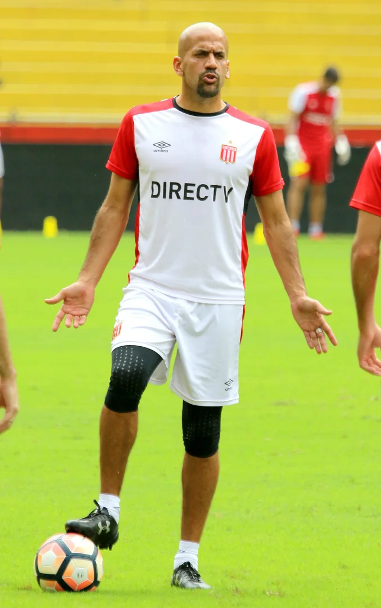 | `juan-sebastian-veron` | Juan Sebastian Veron | [link](https://upload.wikimedia.org/wikipedia/commons/2/27/Juan_Sebastian_Veron_2017.jpg) | _(none)_ | no pageimage for displayName (likely renamed or removed) |
| 36 | 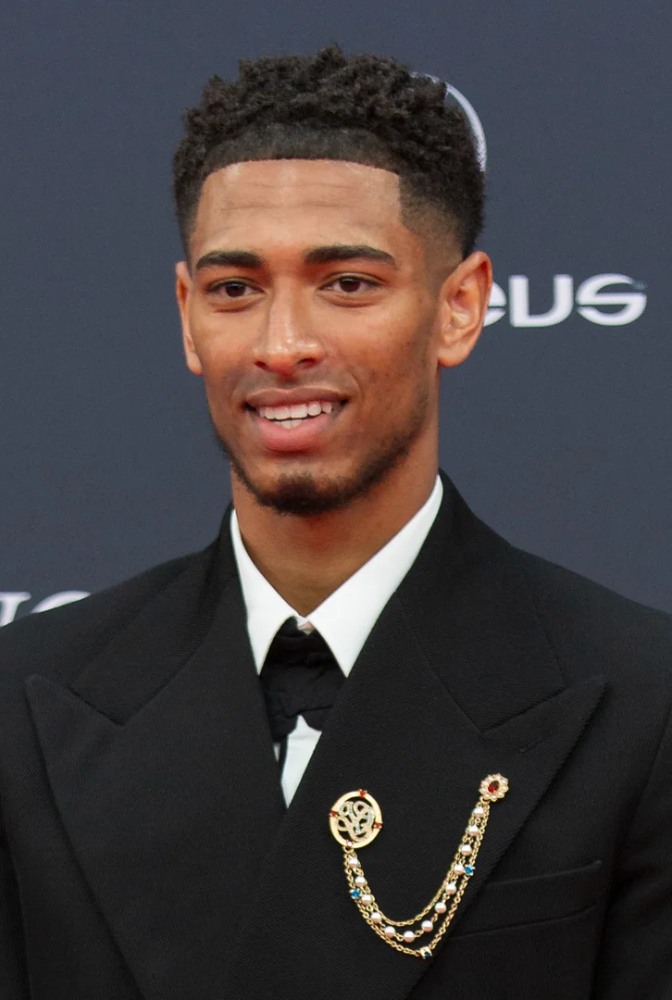 | `jude-bellingham` | Jude Bellingham | [link](https://upload.wikimedia.org/wikipedia/commons/f/f9/25th_Laureus_World_Sports_Awards_-_Red_Carpet_-_Jude_Bellingham_-_240422_190551-2_%28cropped%29.jpg) | _(none)_ | no pageimage for displayName (likely renamed or removed) |
| 37 | 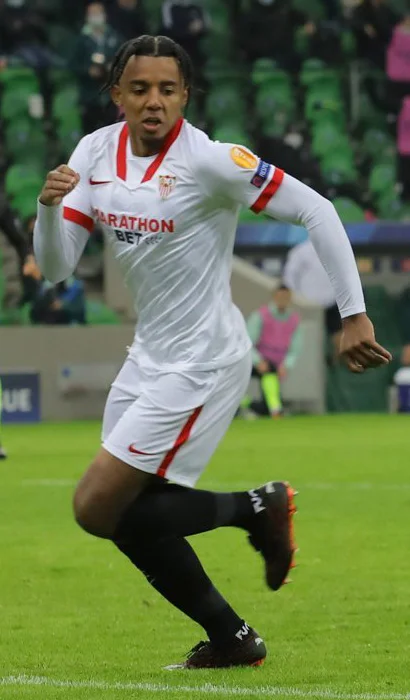 | `jules-kounde` | Jules Kounde | [link](https://upload.wikimedia.org/wikipedia/commons/b/bd/Jules_Kound%C3%A9_2020.jpg) | _(none)_ | no pageimage for displayName (likely renamed or removed) |
| 38 | 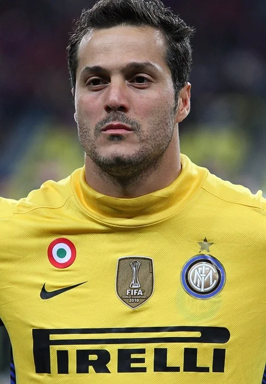 | `julio-cesar` | Julio Cesar | [link](https://upload.wikimedia.org/wikipedia/commons/a/a8/J%C3%BAlio_C%C3%A9sar_FC_Internazionale.jpg) | _(none)_ | no pageimage for displayName (likely renamed or removed) |
| 39 | 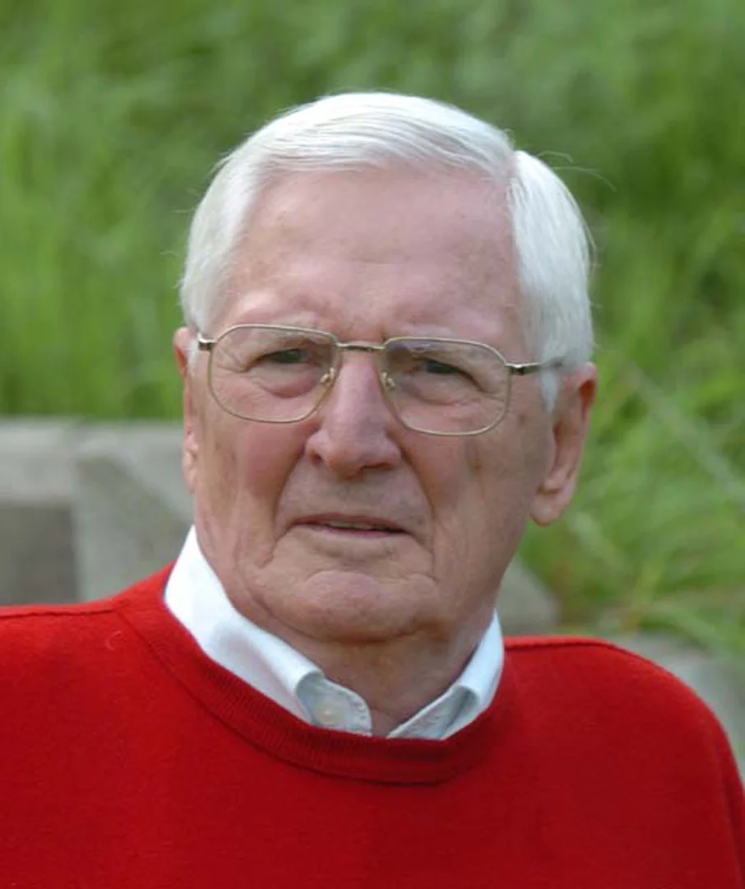 | `jupp-derwall` | Jupp Derwall | [link](https://upload.wikimedia.org/wikipedia/commons/c/ce/Derwall1.jpg) | _(none)_ | no pageimage for displayName (likely renamed or removed) |
| 40 | 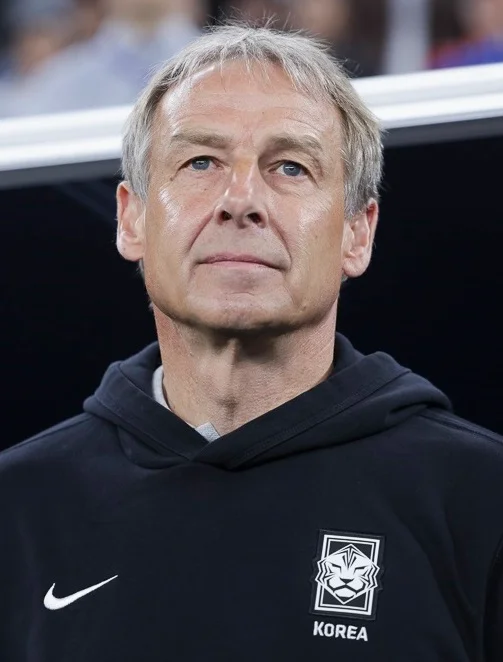 | `jurgen-klinsmann` | Jurgen Klinsmann | [link](https://upload.wikimedia.org/wikipedia/commons/a/af/J%C3%BCrgen_Klinsmann_14021113000678638425063004371092_64131.jpg) | _(none)_ | no pageimage for displayName (likely renamed or removed) |
| 41 | 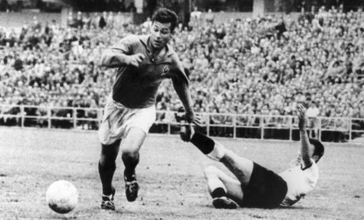 | `just-fontaine` | Just Fontaine | [link](https://upload.wikimedia.org/wikipedia/commons/7/7f/Fontaine1958.jpg) | _(none)_ | no pageimage for displayName (likely renamed or removed) |
| 42 | 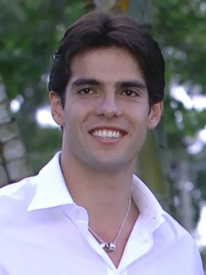 | `kaka` | Kaká | [link](https://upload.wikimedia.org/wikipedia/commons/2/27/Kak%C3%A1_after_Brazil_national_team_training_at_Randburg_High_School_2010-06-06.jpg) | _(none)_ | no pageimage for displayName (likely renamed or removed) |
| 43 | 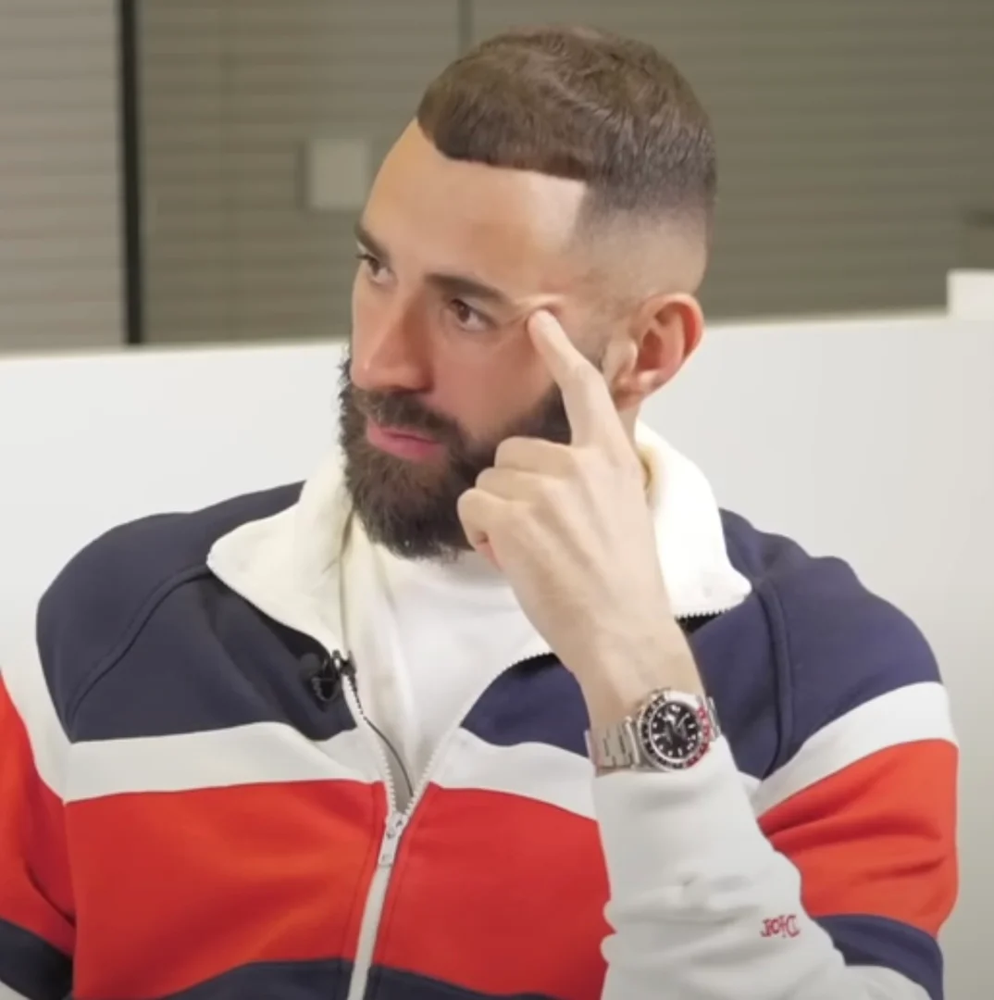 | `karim-benzema` | Karim Benzema | [link](https://upload.wikimedia.org/wikipedia/commons/5/5f/Karim_Benzema_Pick.jpg) | _(none)_ | no pageimage for displayName (likely renamed or removed) |
| 44 |  | `karl-heinz-forster` | Karl Heinz Forster | [link](https://upload.wikimedia.org/wikipedia/commons/7/7e/2015-02-06_Rummenigge_0400.JPG) | _(none)_ | no pageimage for displayName (likely renamed or removed) |
| 45 | 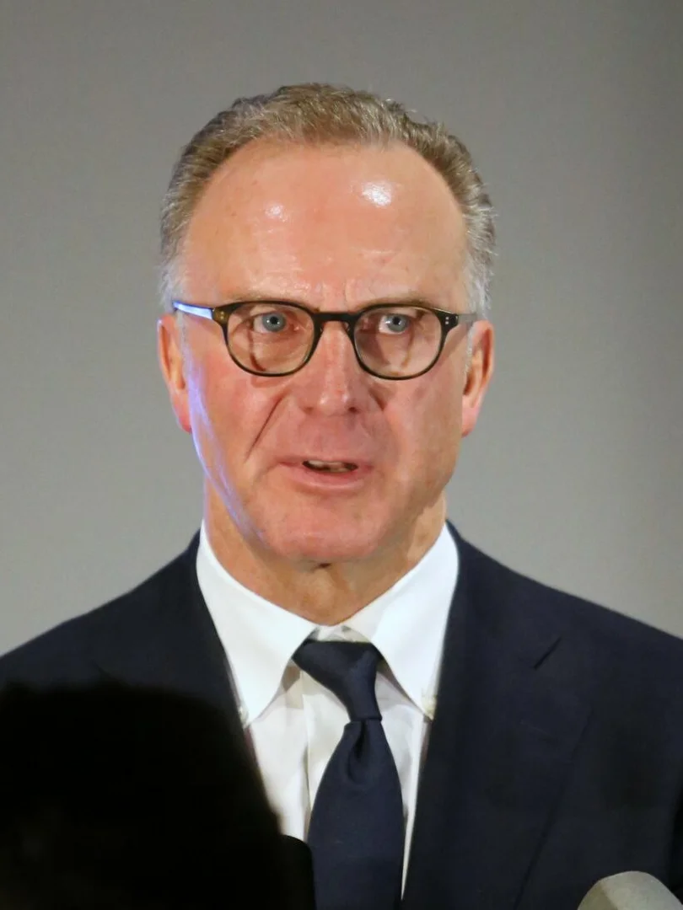 | `karl-heinz-rummenigge` | Karl Heinz Rummenigge | [link](https://upload.wikimedia.org/wikipedia/commons/f/fc/2015-02-06_Rummenigge_0370_%28cropped%29.JPG) | _(none)_ | no pageimage for displayName (likely renamed or removed) |
| 46 | 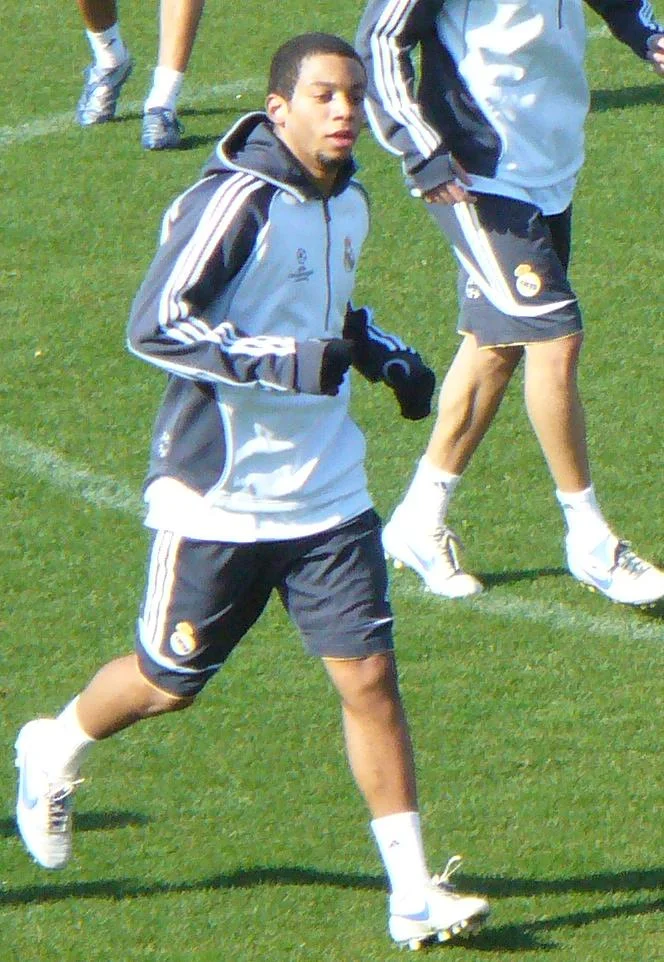 | `marcelo` | Marcelo | [link](https://upload.wikimedia.org/wikipedia/commons/b/b8/Brazil_and_Croatia_match_at_the_FIFA_World_Cup_2014-06-12_%2824%29.jpg) | [link](https://upload.wikimedia.org/wikipedia/commons/thumb/c/cd/Bra-Cos_%286%29.jpg/500px-Bra-Cos_%286%29.jpg) | mismatch: source=brazil_and_croatia_match_at_the_fifa_world_cup_2014-06-12_(24).jpg vs probe=bra-cos_(6).jpg |
| 47 | 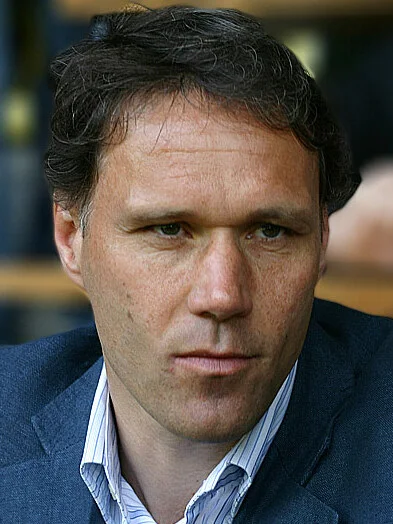 | `marco-van-basten` | Marco van Basten | [link](https://upload.wikimedia.org/wikipedia/commons/d/d5/Marco_van_Basten_1989_crop.jpg) | [link](https://upload.wikimedia.org/wikipedia/commons/7/7e/Marco_van_Basten_%282%29_%28cropped%29.jpg) | mismatch: source=marco_van_basten_1989_crop.jpg vs probe=marco_van_basten_(2)_(cropped).jpg |
| 48 | 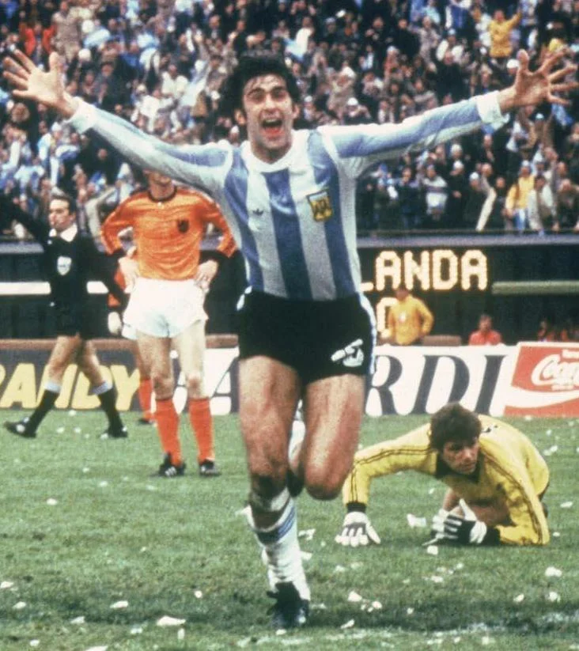 | `mario-kempes` | Mario Kempes | [link](https://upload.wikimedia.org/wikipedia/commons/e/e4/Mario_Kempes_Argentina_vs._Holanda.JPG) | [link](https://upload.wikimedia.org/wikipedia/commons/6/6d/Kempes_Valencia_CF.jpg) | mismatch: source=mario_kempes_argentina_vs._holanda.jpg vs probe=kempes_valencia_cf.jpg |
| 49 | 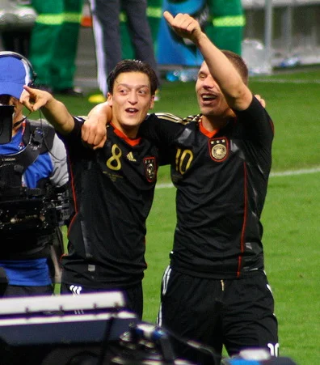 | `mesut-ozil` | Mesut Özil | [link](https://upload.wikimedia.org/wikipedia/commons/e/ea/%C3%96zil_podolski.JPG) | [link](https://upload.wikimedia.org/wikipedia/commons/thumb/1/12/Mesut_%C3%96zil_at_Baku_before_2019_UEFA_Europe_League_Final.jpg/500px-Mesut_%C3%96zil_at_Baku_before_2019_UEFA_Europe_League_Final.jpg) | mismatch: source=özil_podolski.jpg vs probe=mesut_özil_at_baku_before_2019_uefa_europe_league_final.jpg |
| 50 | 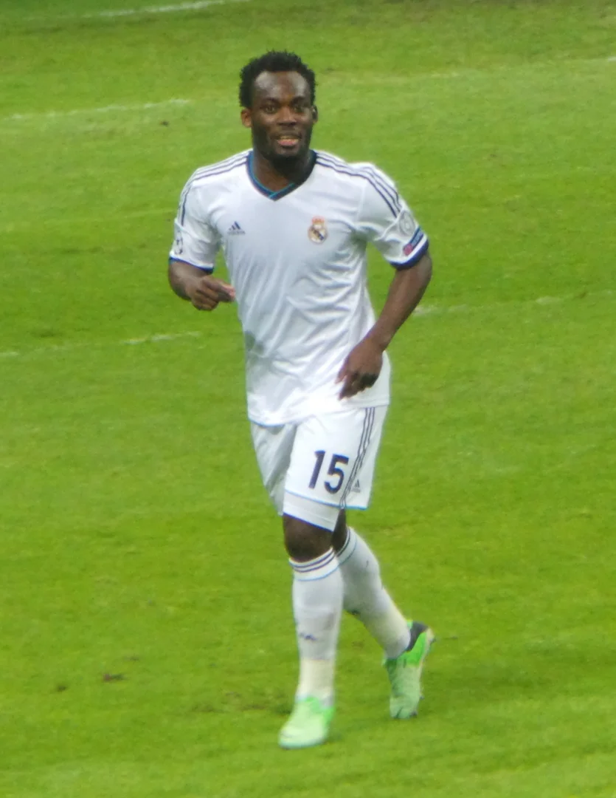 | `michael-essien` | Michael Essien | [link](https://upload.wikimedia.org/wikipedia/commons/5/55/Flickr_-_tpower1978_-_International_friendly_match_%281%29.jpg) | [link](https://upload.wikimedia.org/wikipedia/commons/thumb/e/ea/Chelsea_Legends_1_Inter_Forever_4_%2828453496098%29_%28cropped%29.jpg/500px-Chelsea_Legends_1_Inter_Forever_4_%2828453496098%29_%28cropped%29.jpg) | mismatch: source=flickr_-_tpower1978_-_international_friendly_match_(1).jpg vs probe=chelsea_legends_1_inter_forever_4_(28453496098)_(cropped).jpg |
| 51 | 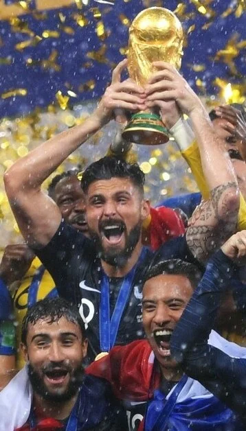 | `olivier-giroud` | Olivier Giroud | [link](https://upload.wikimedia.org/wikipedia/commons/9/9f/France_champion_of_the_Football_World_Cup_Russia_2018_%28cropped%29_%28Giroud_with_Trophy%29.jpg) | [link](https://upload.wikimedia.org/wikipedia/commons/9/96/Olivier_Giroud_December_2024.png) | mismatch: source=france_champion_of_the_football_world_cup_russia_2018_(cropped)_(giroud_with_trophy).jpg vs probe=olivier_giroud_december_2024.png |
| 52 | 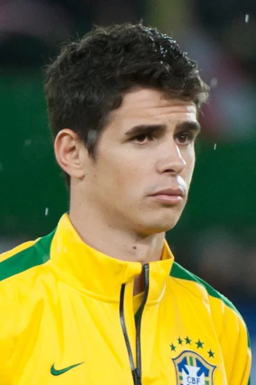 | `oscar` | Oscar | [link](https://upload.wikimedia.org/wikipedia/commons/c/c5/20141118_AUTBRA_5022.jpg) | [link](https://upload.wikimedia.org/wikipedia/commons/thumb/3/32/Oscar_II_of_Sweden_1898.jpg/500px-Oscar_II_of_Sweden_1898.jpg) | mismatch: source=20141118_autbra_5022.jpg vs probe=oscar_ii_of_sweden_1898.jpg |
| 53 | 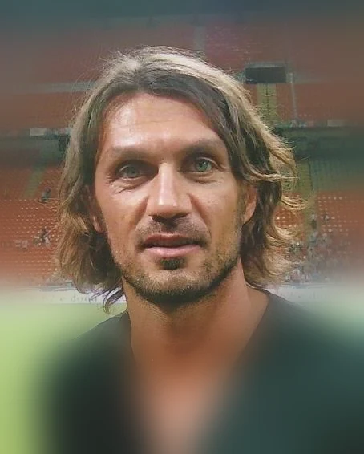 | `paolo-maldini` | Paolo Maldini | [link](https://upload.wikimedia.org/wikipedia/commons/6/60/Maldini_Italia.jpg) | [link](https://upload.wikimedia.org/wikipedia/commons/thumb/0/0a/Paolo_Maldini_AC_Milan_Technical_director_2018.jpg/500px-Paolo_Maldini_AC_Milan_Technical_director_2018.jpg) | mismatch: source=maldini_italia.jpg vs probe=paolo_maldini_ac_milan_technical_director_2018.jpg |
| 54 | 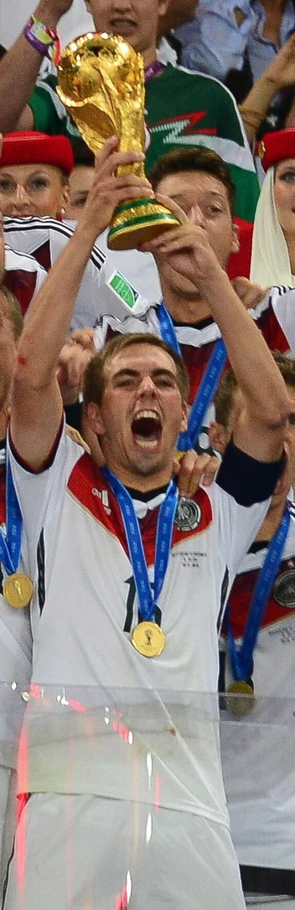 | `philipp-lahm` | Philipp Lahm | [link](https://upload.wikimedia.org/wikipedia/commons/c/c1/Philipp_Lahm_com_o_trof%C3%A9u_de_Campe%C3%A3o_do_Mundo_em_2014.jpg) | [link](https://upload.wikimedia.org/wikipedia/commons/thumb/8/8a/Philipp_Lahm_auf_der_Berlinale_2024%2C_Ausschnitt.jpg/500px-Philipp_Lahm_auf_der_Berlinale_2024%2C_Ausschnitt.jpg) | mismatch: source=philipp_lahm_com_o_troféu_de_campeão_do_mundo_em_2014.jpg vs probe=philipp_lahm_auf_der_berlinale_2024,_ausschnitt.jpg |
| 55 | 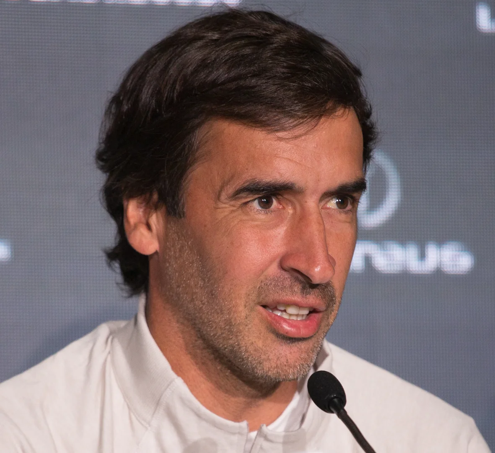 | `raul` | Raul | [link](https://upload.wikimedia.org/wikipedia/commons/5/5a/25th_Laureus_World_Sports_Awards_-_Ra%C3%BAl_-_240422_132916-2_%28cropped%29.jpg) | [link](https://upload.wikimedia.org/wikipedia/commons/thumb/6/67/Raul_Castro_cropped.jpg/500px-Raul_Castro_cropped.jpg) | mismatch: source=25th_laureus_world_sports_awards_-_raúl_-_240422_132916-2_(cropped).jpg vs probe=raul_castro_cropped.jpg |
| 56 | 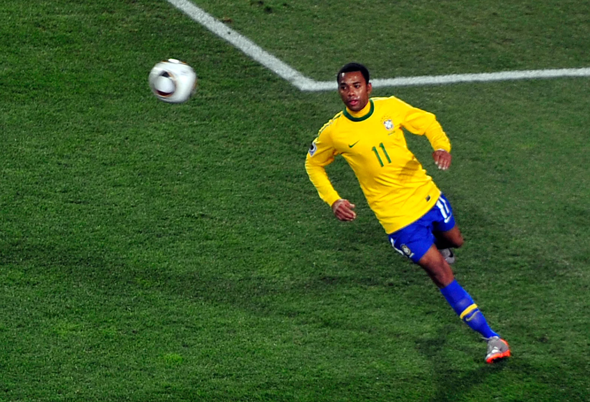 | `robinho` | Robinho | [link](https://upload.wikimedia.org/wikipedia/commons/2/20/Robinho_at_Brazil_%26_Chile_match_at_World_Cup_2010-06-28.jpg) | [link](https://upload.wikimedia.org/wikipedia/commons/thumb/0/08/Robinho061115-2.jpg/500px-Robinho061115-2.jpg) | mismatch: source=robinho_at_brazil_&_chile_match_at_world_cup_2010-06-28.jpg vs probe=robinho061115-2.jpg |
| 57 | 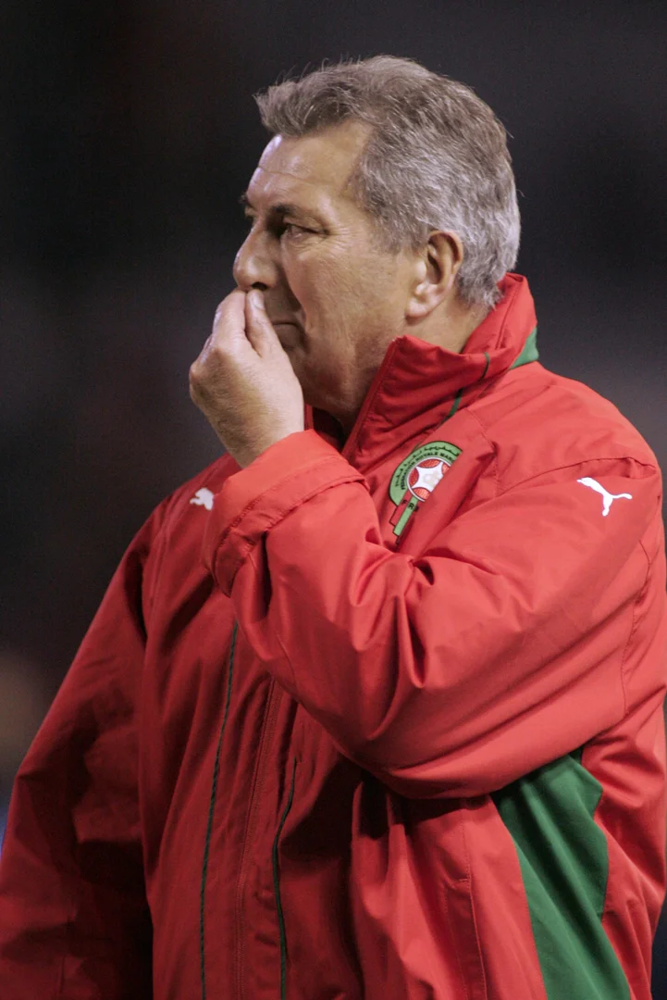 | `roger-lemerre` | Roger Lemerre | [link](https://upload.wikimedia.org/wikipedia/commons/8/8a/Morocco_vs_Gabon%2C_Roger_Lemerre%2C_March_28_2009.jpg) | _(none)_ | no pageimage for displayName (likely renamed or removed) |
| 58 | 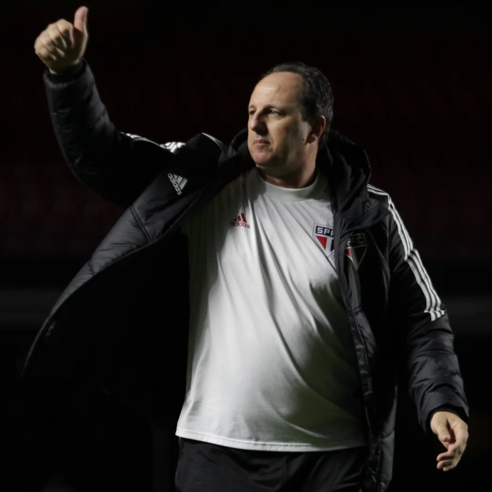 | `rogerio-ceni` | Rogerio Ceni | [link](https://upload.wikimedia.org/wikipedia/commons/4/4e/Rogerio-Ceni-Sao-Paulo-Juventude-jun-2022_%28cropped%29.jpg) | _(none)_ | no pageimage for displayName (likely renamed or removed) |
| 59 | 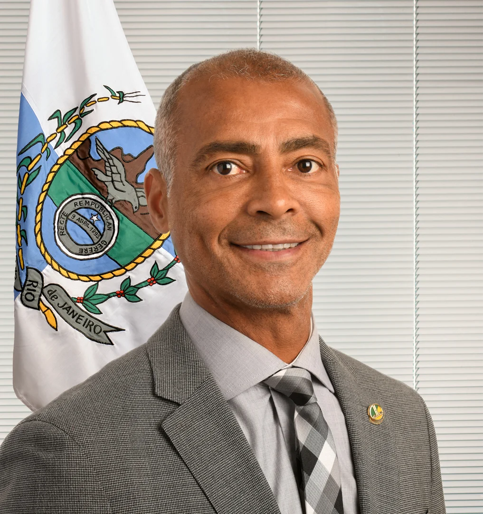 | `romario` | Romário | _(no batch-input)_ | _(none)_ | no pageimage for displayName (likely renamed or removed) |
| 60 | 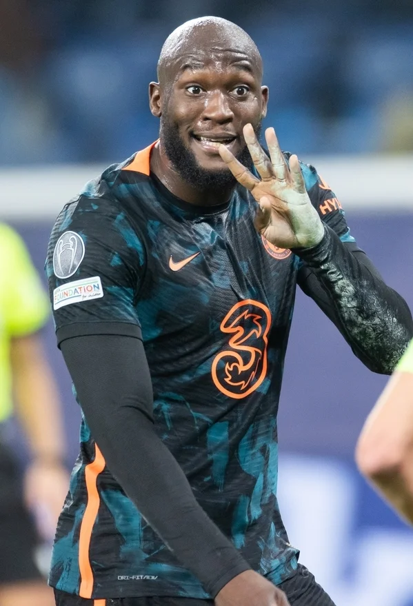 | `romelu-lukaku` | Romelu Lukaku | [link](https://upload.wikimedia.org/wikipedia/commons/d/dc/Romelu_Lukaku_2021.jpg) | _(none)_ | no pageimage for displayName (likely renamed or removed) |
| 61 | 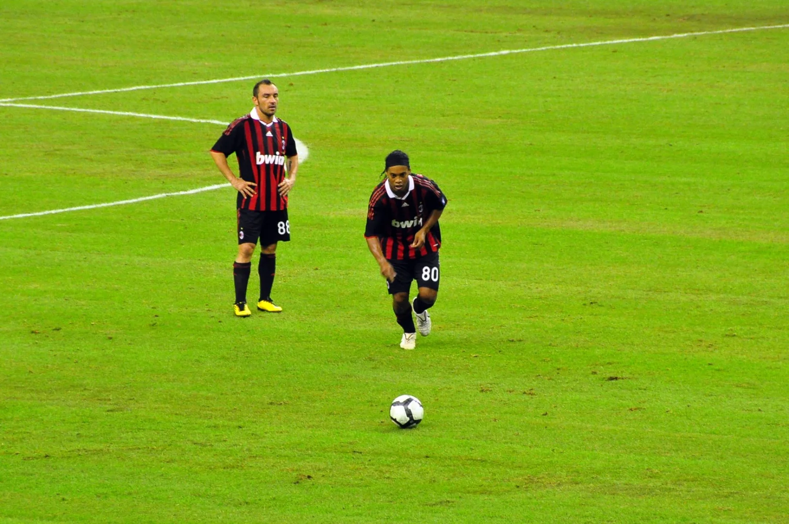 | `ronaldinho` | Ronaldinho | [link](https://upload.wikimedia.org/wikipedia/commons/1/10/Ronaldinho_corner_brazil.jpg) | _(none)_ | no pageimage for displayName (likely renamed or removed) |
| 62 | 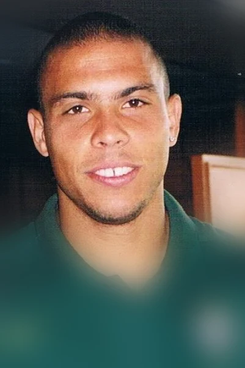 | `ronaldo-nazario` | Ronaldo Nazário | [link](https://upload.wikimedia.org/wikipedia/commons/d/d5/Ronaldo_2002_cropped.jpg) | _(none)_ | no pageimage for displayName (likely renamed or removed) |
| 63 | 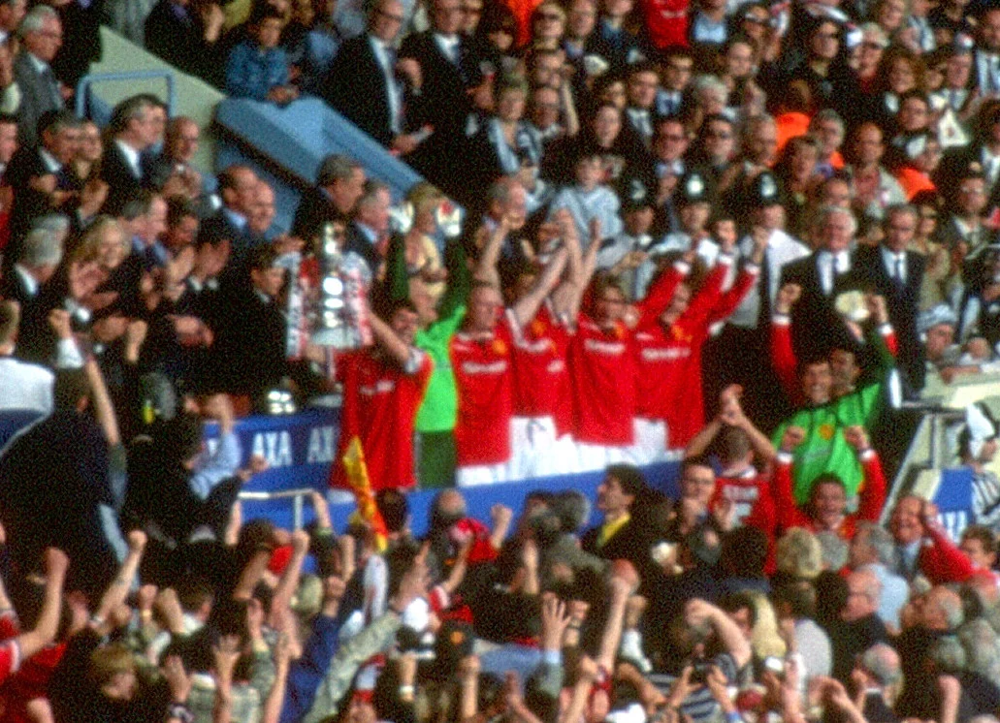 | `roy-keane` | Roy Keane | [link](https://upload.wikimedia.org/wikipedia/commons/0/0a/Roy_keane_2014.jpg) | _(none)_ | no pageimage for displayName (likely renamed or removed) |
| 64 | 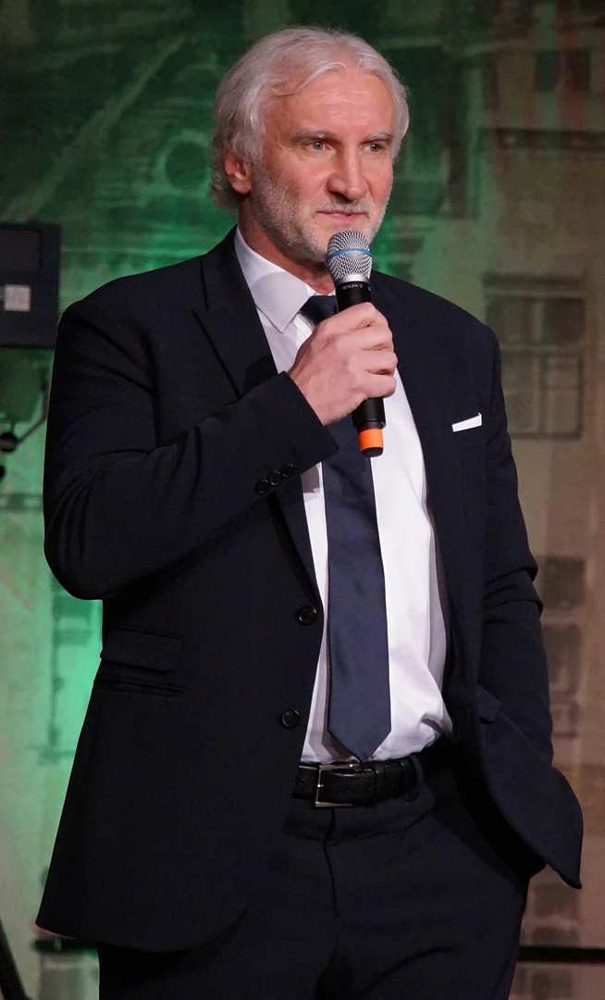 | `rudi-voller` | Rudi Voller | [link](https://upload.wikimedia.org/wikipedia/commons/4/4e/Rudi_V%C3%B6ller_B%C3%BChne_%28cropped%29.jpg) | _(none)_ | no pageimage for displayName (likely renamed or removed) |
| 65 | 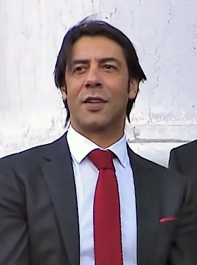 | `rui-costa` | Rui Costa | [link](https://upload.wikimedia.org/wikipedia/commons/e/ea/Rui_Costa_2019.png) | _(none)_ | no pageimage for displayName (likely renamed or removed) |
| 66 | 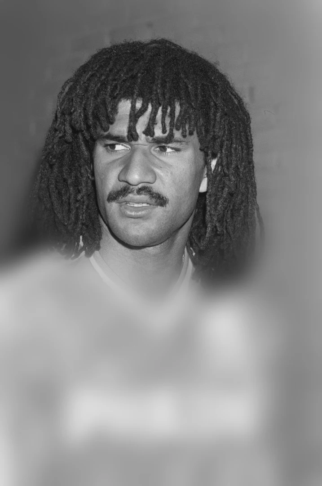 | `ruud-gullit` | Ruud Gullit | [link](https://upload.wikimedia.org/wikipedia/commons/4/4b/Selectie_Nederlands_elftal_in_Zeist_Ruud_Gullit_%2C_kop%2C_Bestanddeelnr_934-2142.jpg) | _(none)_ | no pageimage for displayName (likely renamed or removed) |
| 67 | 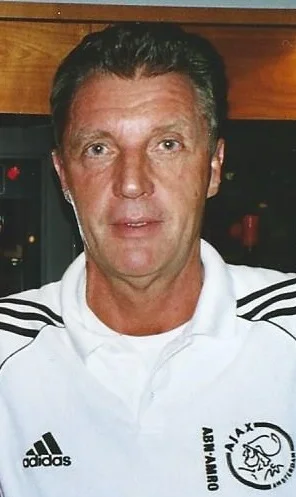 | `ruud-krol` | Ruud Krol | [link](https://upload.wikimedia.org/wikipedia/commons/7/7a/Ruud_Krol_2005.jpg) | _(none)_ | no pageimage for displayName (likely renamed or removed) |
| 68 | 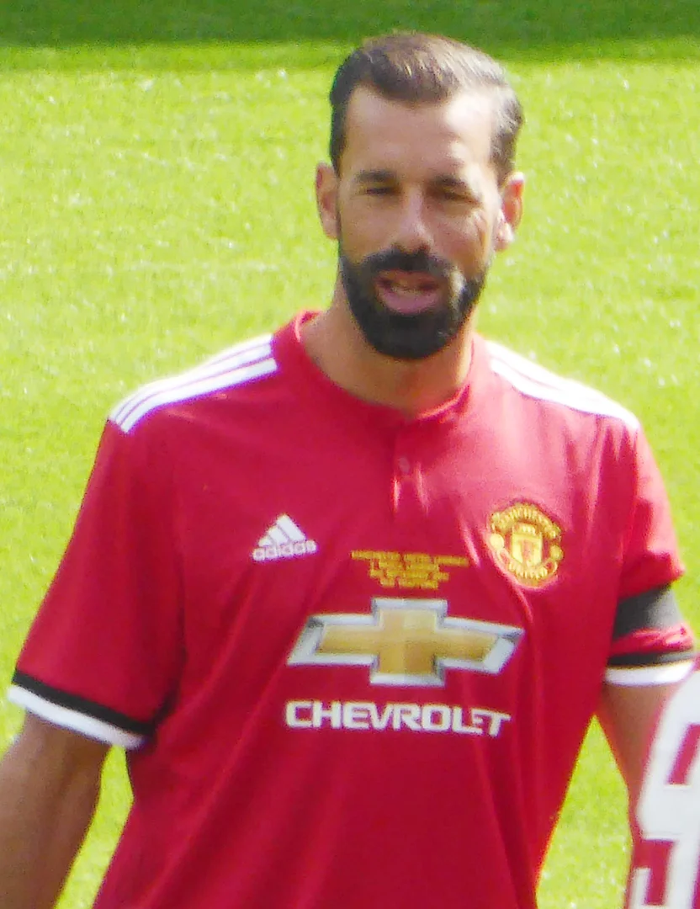 | `ruud-van-nistelrooy` | Ruud Van Nistelrooy | [link](https://upload.wikimedia.org/wikipedia/commons/9/9d/Ruud_van_Nistelrooy_2017.jpg) | _(none)_ | no pageimage for displayName (likely renamed or removed) |
| 69 | 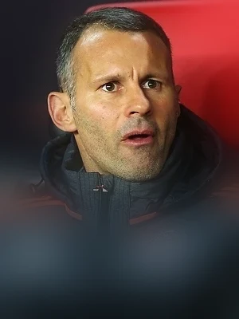 | `ryan-giggs` | Ryan Giggs | [link](https://upload.wikimedia.org/wikipedia/commons/1/13/Ryan_Giggs_2015_%28cropped%29.jpg) | _(none)_ | no pageimage for displayName (likely renamed or removed) |
| 70 | 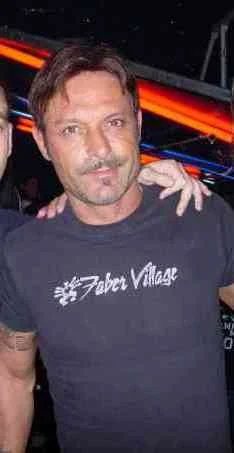 | `salvatore-schillaci` | Salvatore Schillaci | [link](https://upload.wikimedia.org/wikipedia/commons/1/10/Salvatore_Schillaci.jpg) | _(none)_ | no pageimage for displayName (likely renamed or removed) |
| 71 | 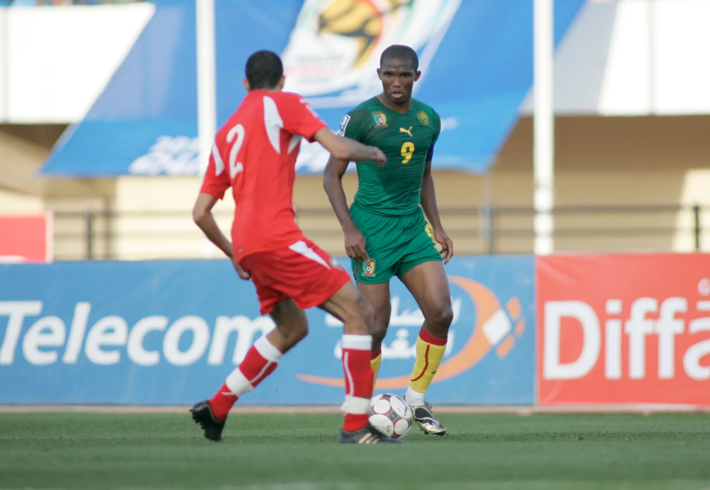 | `samuel-etoo` | Samuel Eto'o | [link](https://upload.wikimedia.org/wikipedia/commons/b/bf/FIFA_World_Cup_2010_Netherlands_Cameroon5.jpg) | _(none)_ | no pageimage for displayName (likely renamed or removed) |
| 72 | 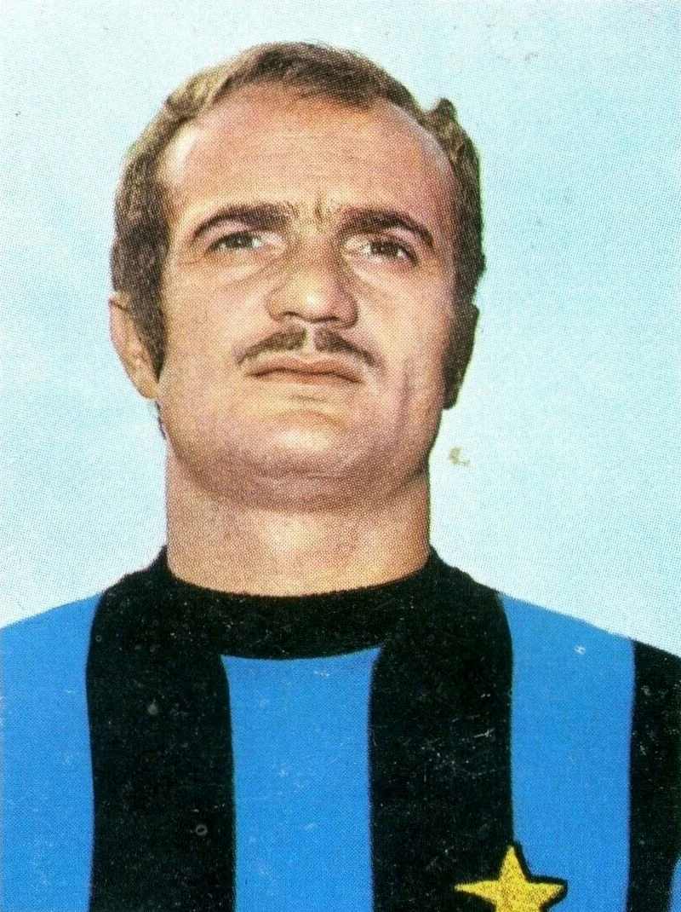 | `sandro-mazzola` | Sandro Mazzola | [link](https://upload.wikimedia.org/wikipedia/commons/c/cb/Inter_Milan_1971-1972_Sandro_Mazzola.jpg) | _(none)_ | no pageimage for displayName (likely renamed or removed) |
| 73 | 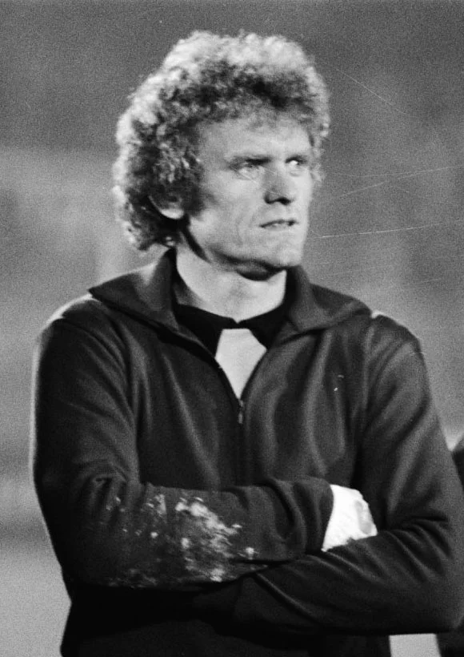 | `sepp-maier` | Sepp Maier | [link](https://upload.wikimedia.org/wikipedia/commons/5/51/6137Sepp_Maier_Torwart-Legende.JPG) | _(none)_ | no pageimage for displayName (likely renamed or removed) |
| 74 | 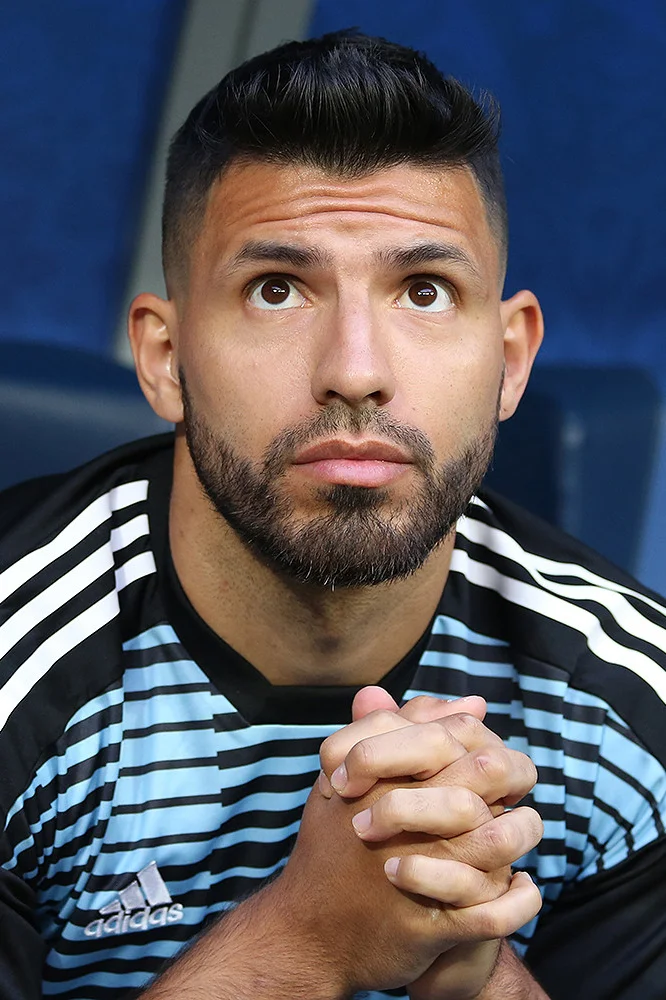 | `sergio-aguero` | Sergio Aguero | [link](https://upload.wikimedia.org/wikipedia/commons/7/7b/Ag%C3%BCero_in_2018.jpg) | _(none)_ | no pageimage for displayName (likely renamed or removed) |
| 75 | 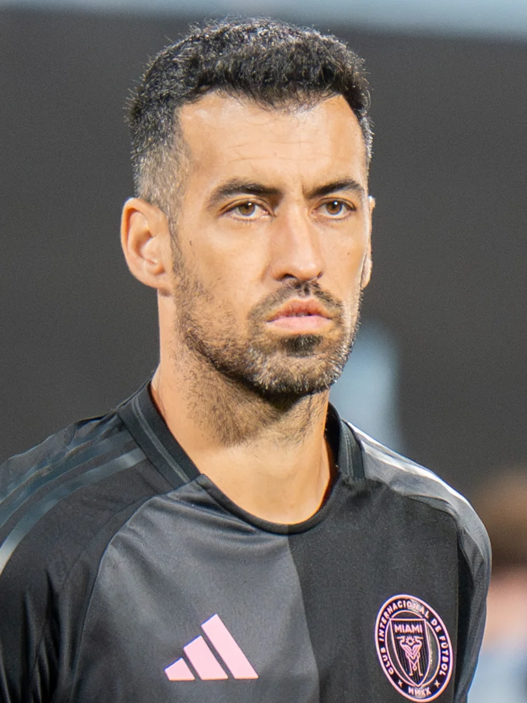 | `sergio-busquets` | Sergio Busquets | [link](https://upload.wikimedia.org/wikipedia/commons/4/40/Sergio_Busquets_NYCFC_Miami_24_Sep_2025-020_%28cropped%29.jpg) | _(none)_ | no pageimage for displayName (likely renamed or removed) |
| 76 | 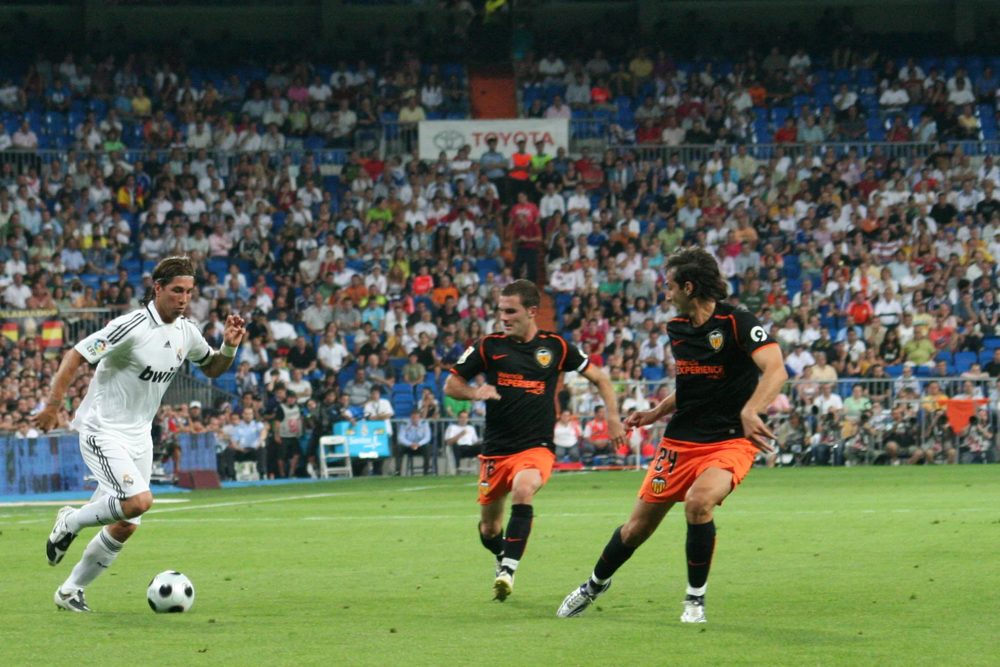 | `sergio-ramos` | Sergio Ramos | _(no batch-input)_ | _(none)_ | no pageimage for displayName (likely renamed or removed) |
| 77 | 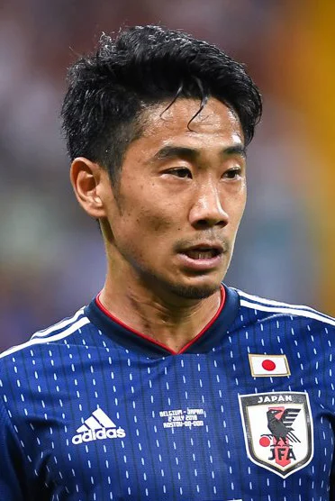 | `shinji-kagawa` | Shinji Kagawa | [link](https://upload.wikimedia.org/wikipedia/commons/8/81/Shinji_Kagawa_2018_%28cropped%29.jpg) | _(none)_ | no pageimage for displayName (likely renamed or removed) |
| 78 | 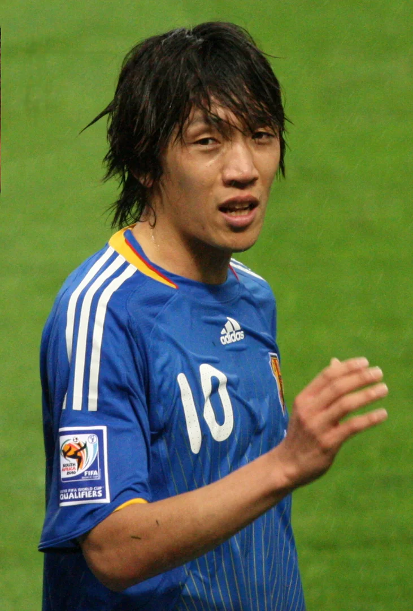 | `shunsuke-nakamura` | Shunsuke Nakamura | [link](https://upload.wikimedia.org/wikipedia/commons/e/e4/Shunsuke2_20080622.png) | _(none)_ | no pageimage for displayName (likely renamed or removed) |
| 79 | 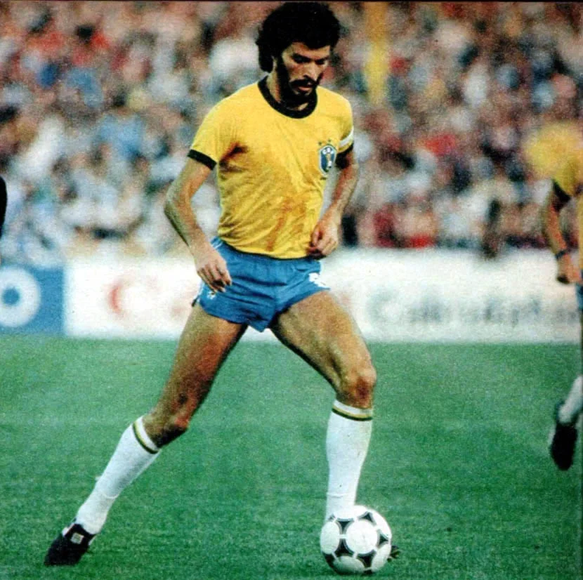 | `socrates` | Sócrates | [link](https://upload.wikimedia.org/wikipedia/commons/5/56/Socrates_elgrafico_1983.jpg) | _(none)_ | no pageimage for displayName (likely renamed or removed) |
| 80 | 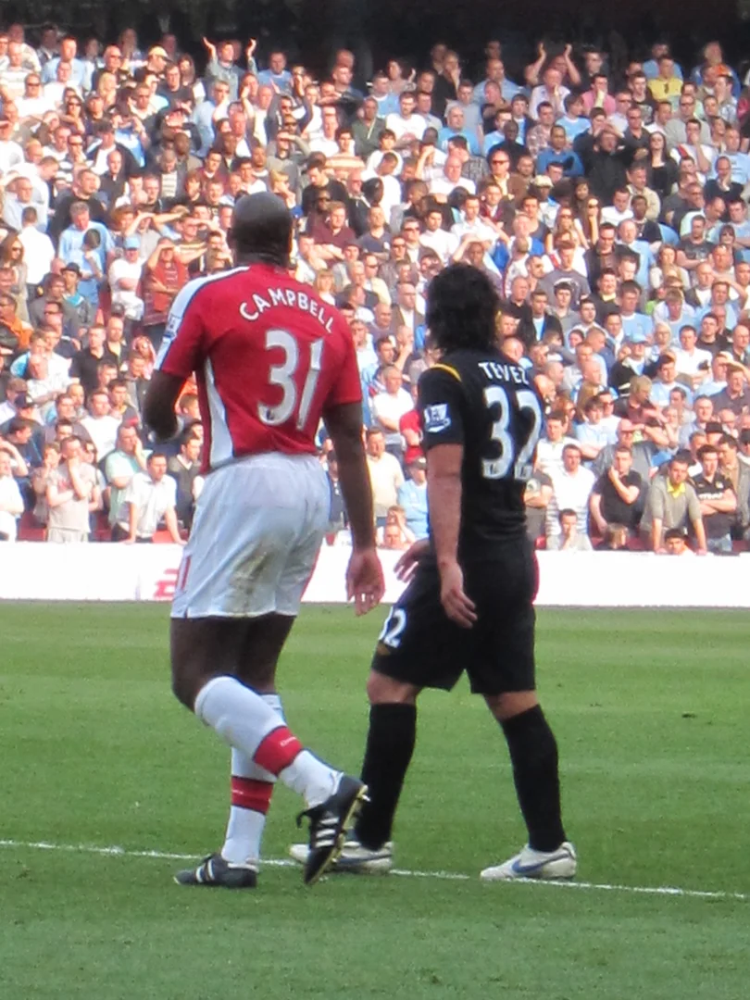 | `sol-campbell` | Sol Campbell | [link](https://upload.wikimedia.org/wikipedia/commons/1/1f/Sol_Campbell_%2854921202604%29_%28cropped%29.jpg) | _(none)_ | no pageimage for displayName (likely renamed or removed) |
| 81 | 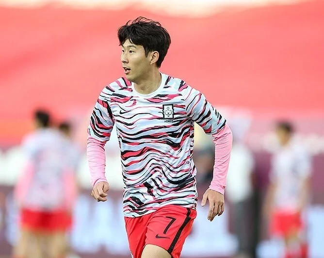 | `son-heung-min` | Son Heung-min | [link](https://upload.wikimedia.org/wikipedia/commons/4/42/Iran%2C_S._Korea_Closer_to_Securing_Spot_in_World_Cup_Tournament_after_Draw_2021-7_%28cropped%29.jpg) | _(none)_ | no pageimage for displayName (likely renamed or removed) |
| 82 | 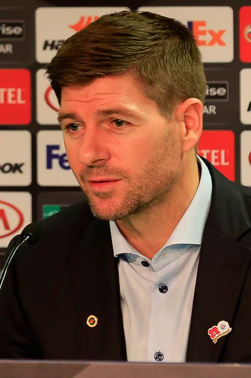 | `steven-gerrard` | Steven Gerrard | [link](https://upload.wikimedia.org/wikipedia/commons/d/d5/Steven_Gerrard_2018.jpg) | _(none)_ | no pageimage for displayName (likely renamed or removed) |
| 83 |  | `stuart-pearce` | Stuart Pearce | [link](https://upload.wikimedia.org/wikipedia/commons/7/71/Stuart_Pearce_%2831651906441%29.jpg) | _(none)_ | no pageimage for displayName (likely renamed or removed) |
| 84 | 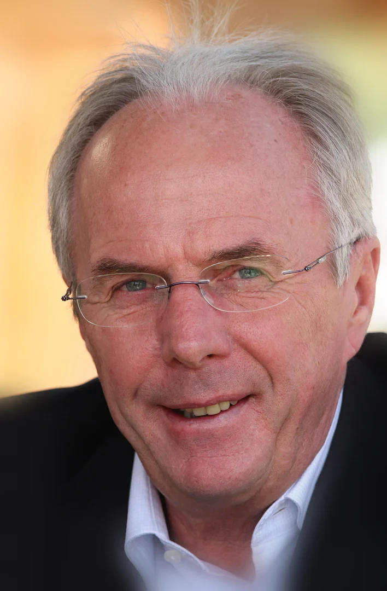 | `sven-goran-eriksson` | Sven-Göran Eriksson | [link](https://upload.wikimedia.org/wikipedia/commons/a/ad/Sven-Goran_Eriksson_2012.jpg) | _(none)_ | no pageimage for displayName (likely renamed or removed) |
| 85 | 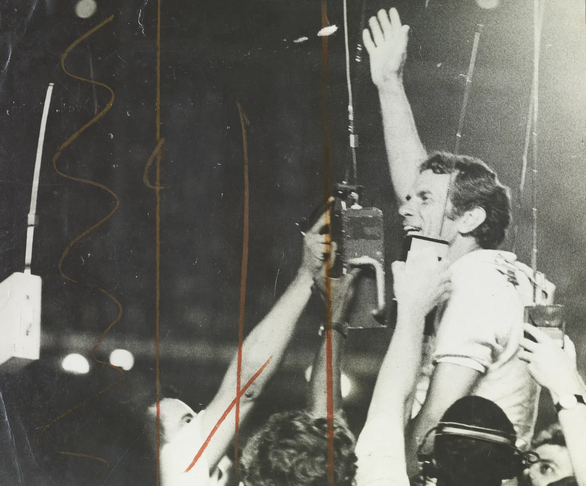 | `tele-santana` | Telê Santana | [link](https://upload.wikimedia.org/wikipedia/commons/3/3e/Tel%C3%A9%2C_T%C3%A9cnico_de_Futebol.tif) | _(none)_ | no pageimage for displayName (likely renamed or removed) |
| 86 | 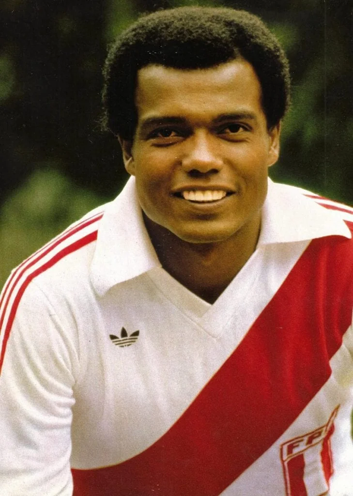 | `teofilo-cubillas` | Teófilo Cubillas | [link](https://upload.wikimedia.org/wikipedia/commons/0/0b/Te%C3%B3filo_Cubillas_1978.jpg) | _(none)_ | no pageimage for displayName (likely renamed or removed) |
| 87 | 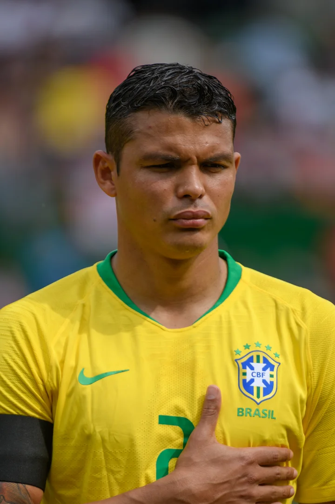 | `thiago-silva` | Thiago Silva | [link](https://upload.wikimedia.org/wikipedia/commons/c/c8/20180610_FIFA_Friendly_Match_Austria_vs._Brazil_Thiago_Silva_850_1582.jpg) | _(none)_ | no pageimage for displayName (likely renamed or removed) |
| 88 | 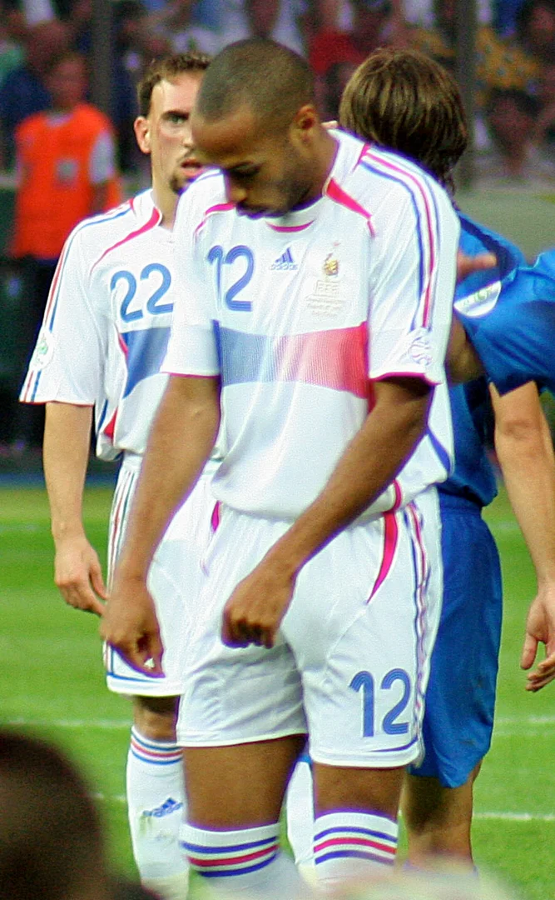 | `thierry-henry` | Thierry Henry | [link](https://upload.wikimedia.org/wikipedia/commons/4/44/Henry_in_world_cup_final_2006.jpg) | _(none)_ | no pageimage for displayName (likely renamed or removed) |
| 89 | 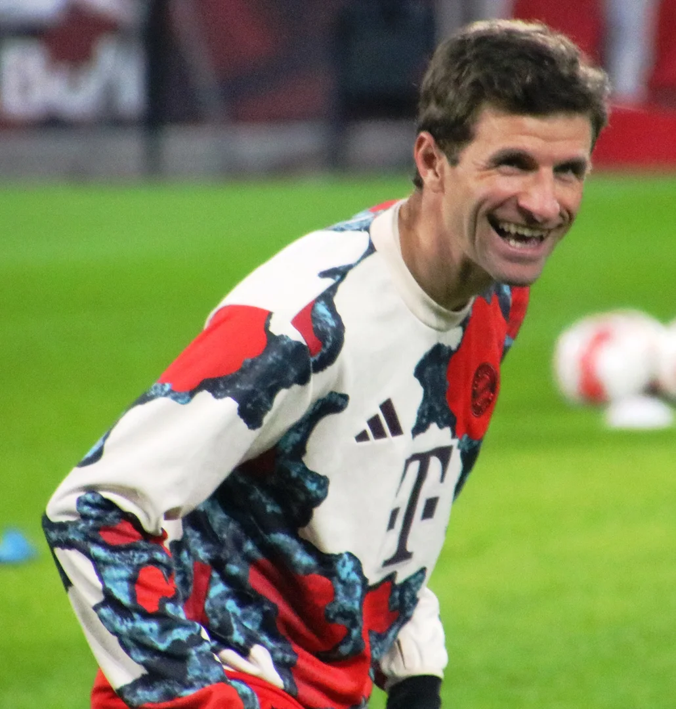 | `thomas-muller` | Thomas Muller | [link](https://upload.wikimedia.org/wikipedia/commons/a/aa/FC_Red_Bull_Salzburg_gegen_Bayern_M%C3%BCnchen_%282025-01-06_Testspiel%29_19.jpg) | _(none)_ | no pageimage for displayName (likely renamed or removed) |
| 90 | 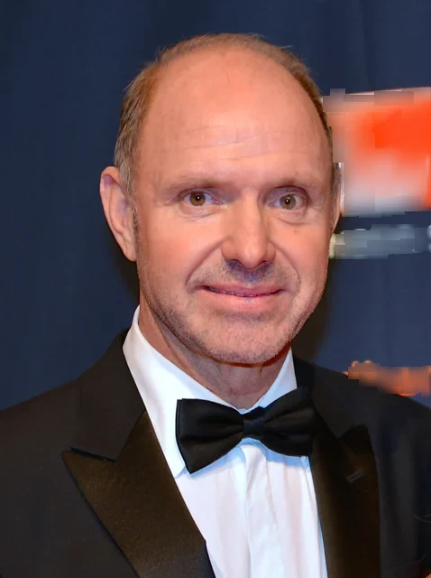 | `thomas-ravelli` | Thomas Ravelli | [link](https://upload.wikimedia.org/wikipedia/commons/4/41/Thomas_Ravelli_in_January_2014.jpg) | _(none)_ | no pageimage for displayName (likely renamed or removed) |
| 91 | 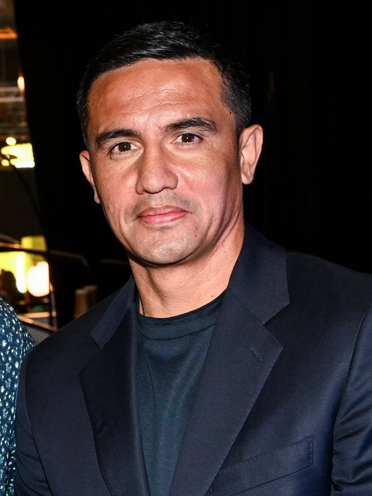 | `tim-cahill` | Tim Cahill | [link](https://upload.wikimedia.org/wikipedia/commons/d/dc/Tim_Cahill_%2853557484101%29.jpg) | _(none)_ | no pageimage for displayName (likely renamed or removed) |
| 92 | 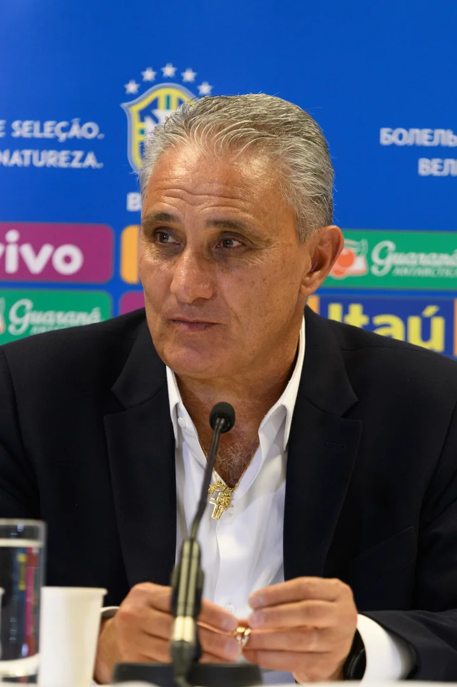 | `tite` | Tite | [link](https://upload.wikimedia.org/wikipedia/commons/f/f7/20180610_FIFA_Friendly_Match_Austria_vs._Brazil_Tite_850_0231.jpg) | [link](https://upload.wikimedia.org/wikipedia/commons/thumb/1/10/Tom_Tits_Experiment_2013_01.jpg/500px-Tom_Tits_Experiment_2013_01.jpg) | mismatch: source=20180610_fifa_friendly_match_austria_vs._brazil_tite_850_0231.jpg vs probe=tom_tits_experiment_2013_01.jpg |
| 93 | 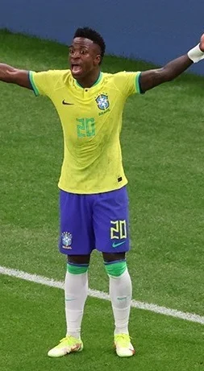 | `vinicius-junior` | Vinícius Júnior | [link](https://upload.wikimedia.org/wikipedia/commons/3/34/Vinicius_Junior_WC2022.jpg) | [link](https://upload.wikimedia.org/wikipedia/commons/thumb/c/c6/2023_05_06_Final_de_la_Copa_del_Rey_-_52879242230_%28cropped%29.jpg/500px-2023_05_06_Final_de_la_Copa_del_Rey_-_52879242230_%28cropped%29.jpg) | mismatch: source=vinicius_junior_wc2022.jpg vs probe=2023_05_06_final_de_la_copa_del_rey_-_52879242230_(cropped).jpg |
| 94 | 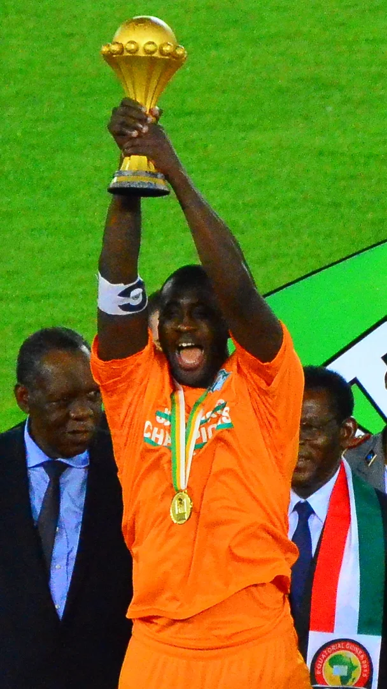 | `yaya-toure` | Yaya Touré | [link](https://upload.wikimedia.org/wikipedia/commons/5/53/Ivory_Coast_players_2013-01-10_001.jpg) | [link](https://upload.wikimedia.org/wikipedia/commons/thumb/b/b7/Yaya_Tour%C3%A9_%28cropped%29.jpg/500px-Yaya_Tour%C3%A9_%28cropped%29.jpg) | mismatch: source=ivory_coast_players_2013-01-10_001.jpg vs probe=yaya_touré_(cropped).jpg |