# FIFA World Cup Image Validation

**Total items: 327**

Markera felmatch eller dålig kvalitet i kolumnen "Action". Webp-thumbnail visar vad spelaren ser i appen.

| # | Webp | ID | Display | Source | Wikipedia |
|---|------|----|---------|--------|-----------|
| 1 |  | `ademir` | Ademir | [link](https://upload.wikimedia.org/wikipedia/commons/4/4a/Ademir_de_Menezes.jpg) | [wp](https://en.wikipedia.org/wiki/Ademir) |
| 2 | 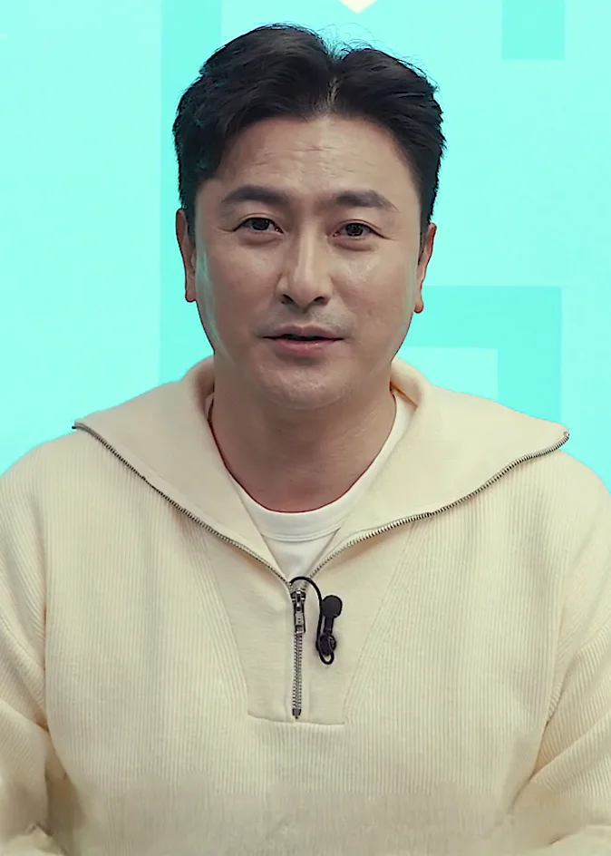 | `ahn-jung-hwan` | Ahn Jung Hwan | [link](https://upload.wikimedia.org/wikipedia/commons/a/a8/Ahn_Jung-hwan_in_November_2021.png) | [wp](https://en.wikipedia.org/wiki/Ahn_Jung_Hwan) |
| 3 | 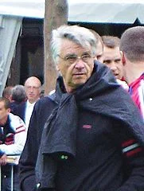 | `aime-jacquet` | Aimé Jacquet | [link](https://upload.wikimedia.org/wikipedia/commons/5/5c/Aime_Jacquet_portrait.jpg) | [wp](https://en.wikipedia.org/wiki/Aim%C3%A9_Jacquet) |
| 4 |  | `alan-shearer` | Alan Shearer | [link](https://upload.wikimedia.org/wikipedia/commons/b/ba/Alan_Shearer_2008.jpg) | [wp](https://en.wikipedia.org/wiki/Alan_Shearer) |
| 5 |  | `aleksandar-tirnanic` | Aleksandar Tirnanić | [link](https://upload.wikimedia.org/wikipedia/commons/6/69/Aleksandar_Tirnani%C4%87.jpg) | [wp](https://en.wikipedia.org/wiki/Aleksandar_Tirnani%C4%87) |
| 6 |  | `alessandro-del-piero` | Alessandro Del Piero | [link](https://upload.wikimedia.org/wikipedia/commons/d/d3/25th_Laureus_World_Sports_Awards_-_Alessandro_Del_Piero_-_240421_155220_%28cropped%29.jpg) | [wp](https://en.wikipedia.org/wiki/Alessandro_Del_Piero) |
| 7 |  | `alessandro-nesta` | Alessandro Nesta | [link](https://upload.wikimedia.org/wikipedia/commons/0/0f/Alessandro_Nesta_as_Miami_FC_Manager.jpg) | [wp](https://en.wikipedia.org/wiki/Alessandro_Nesta) |
| 8 |  | `alexander-isak` | Alexander Isak | [link](https://upload.wikimedia.org/wikipedia/commons/0/00/UEFA_EURO_qualifiers_Sweden_vs_Spain_20191015_Alexander_Isak_56_%28cropped%29.jpg) | [wp](https://en.wikipedia.org/wiki/Alexander_Isak) |
| 9 |  | `alexis-sanchez` | Alexis Sanchez | [link](https://upload.wikimedia.org/wikipedia/commons/5/50/Alexis_S%C3%A1nchez_2017.jpg) | [wp](https://en.wikipedia.org/wiki/Alexis_Sanchez) |
| 10 |  | `alf-ramsey` | Alf Ramsey | [link](https://upload.wikimedia.org/wikipedia/commons/2/20/Alf_Ramsey_%281969%29.jpg) | [wp](https://en.wikipedia.org/wiki/Alf_Ramsey) |
| 11 |  | `ali-daei` | Ali Daei | [link](https://upload.wikimedia.org/wikipedia/commons/f/ff/Ali_Daei%2C_Saipa_vs._Al-Rayyan_pre-match_conference.jpg) | [wp](https://en.wikipedia.org/wiki/Ali_Daei) |
| 12 | 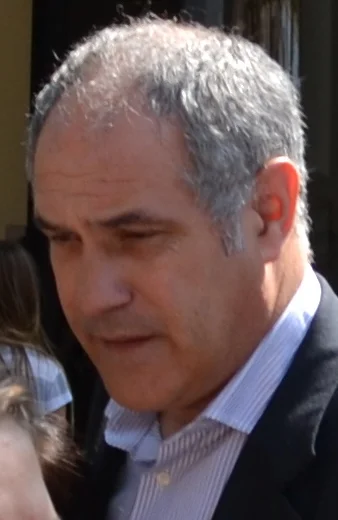 | `andoni-zubizarreta` | Andoni Zubizarreta | [link](https://upload.wikimedia.org/wikipedia/commons/7/71/Andoni_Zubizarreta_en_2013-03_-_versi%C3%B3n_ampliada_%28cropped%29.JPG) | [wp](https://en.wikipedia.org/wiki/Andoni_Zubizarreta) |
| 13 |  | `andrea-pirlo` | Andrea Pirlo | [link](https://upload.wikimedia.org/wikipedia/commons/6/6e/20150616_-_Portugal_-_Italie_-_Gen%C3%A8ve_-_Andrea_Pirlo_%28cropped%29.jpg) | [wp](https://en.wikipedia.org/wiki/Andrea_Pirlo) |
| 14 |  | `andreas-brehme` | Andreas Brehme | [link](https://upload.wikimedia.org/wikipedia/commons/c/c1/Andreas_Brehme.jpg) | [wp](https://en.wikipedia.org/wiki/Andreas_Brehme) |
| 15 |  | `andreas-isaksson` | Andreas Isaksson | [link](https://upload.wikimedia.org/wikipedia/commons/3/3f/Hammarby-Djurg%C3%A5rden-25.jpg) | [wp](https://en.wikipedia.org/wiki/Andreas_Isaksson) |
| 16 |  | `andrej-kramaric` | Andrej Kramaric | [link](https://upload.wikimedia.org/wikipedia/commons/2/2e/Andrej_Kramari%C4%87_2018.jpg) | [wp](https://en.wikipedia.org/wiki/Andrej_Kramaric) |
| 17 |  | `andres-iniesta` | Andrés Iniesta | _(no batch-input)_ | [wp](https://en.wikipedia.org/wiki/Andr%C3%A9s_Iniesta) |
| 18 |  | `andriy-shevchenko` | Andriy Shevchenko | [link](https://upload.wikimedia.org/wikipedia/commons/2/25/%D0%90%D0%BD%D0%B4%D1%80%D1%96%D0%B9_%D0%A8%D0%B5%D0%B2%D1%87%D0%B5%D0%BD%D0%BA%D0%BE_2024_%28cropped%29.png) | [wp](https://en.wikipedia.org/wiki/Andriy_Shevchenko) |
| 19 |  | `angel-di-maria` | Ángel Di María | [link](https://upload.wikimedia.org/wikipedia/commons/8/8c/NIG-ARG_%285%29.jpg) | [wp](https://en.wikipedia.org/wiki/%C3%81ngel_Di_Mar%C3%ADa) |
| 20 |  | `antoine-griezmann` | Antoine Griezmann | [link](https://upload.wikimedia.org/wikipedia/commons/6/6e/FRA-ARG_%2810%29_%28cropped%29.jpg) | [wp](https://en.wikipedia.org/wiki/Antoine_Griezmann) |
| 21 |  | `antonio-cabrini` | Antonio Cabrini | [link](https://upload.wikimedia.org/wikipedia/commons/8/8a/Cabrini_sez.JPG) | [wp](https://en.wikipedia.org/wiki/Antonio_Cabrini) |
| 22 |  | `arjen-robben` | Arjen Robben | [link](https://upload.wikimedia.org/wikipedia/commons/4/42/Arjen_Robben_v_Shakhtar_2015_%28cropped%29.jpg) | [wp](https://en.wikipedia.org/wiki/Arjen_Robben) |
| 23 |  | `arrigo-sacchi` | Arrigo Sacchi | [link](https://upload.wikimedia.org/wikipedia/commons/5/58/Arrigo_Sacchi_2007_%28cropped%29.jpg) | [wp](https://en.wikipedia.org/wiki/Arrigo_Sacchi) |
| 24 |  | `arturo-vidal` | Arturo Vidal | [link](https://upload.wikimedia.org/wikipedia/commons/0/0d/Arturo_Vidal_Copiap%C3%B3_v_Colo-Colo_20241110_13.jpg) | [wp](https://en.wikipedia.org/wiki/Arturo_Vidal) |
| 25 |  | `asamoah-gyan` | Asamoah Gyan | [link](https://upload.wikimedia.org/wikipedia/commons/7/71/Asamoah_Gyan_%282014%29.jpg) | [wp](https://en.wikipedia.org/wiki/Asamoah_Gyan) |
| 26 |  | `ashley-cole` | Ashley Cole | [link](https://upload.wikimedia.org/wikipedia/commons/d/d5/ACole.JPG) | [wp](https://en.wikipedia.org/wiki/Ashley_Cole) |
| 27 |  | `aurelien-tchouameni` | Aurelien Tchouameni | [link](https://upload.wikimedia.org/wikipedia/commons/0/0f/2025_04_26_Final_de_la_Copa_del_Rey_-_Aur%C3%A9lien_Tchouam%C3%A9ni.jpg) | [wp](https://en.wikipedia.org/wiki/Aurelien_Tchouameni) |
| 28 |  | `bastian-schweinsteiger` | Bastian Schweinsteiger | _(no batch-input)_ | [wp](https://en.wikipedia.org/wiki/Bastian_Schweinsteiger) |
| 29 |  | `bebeto` | Bebeto | [link](https://upload.wikimedia.org/wikipedia/commons/6/68/Bebeto_brazil_%28cropped%29.jpg) | [wp](https://en.wikipedia.org/wiki/Bebeto) |
| 30 |  | `bernardo-silva` | Bernardo Silva | [link](https://upload.wikimedia.org/wikipedia/commons/c/cf/Bernardo_Silva_%28Isto_%C3%89_Gozar_Com_Quem_Trabalha%2C_2024%29.png) | [wp](https://en.wikipedia.org/wiki/Bernardo_Silva) |
| 31 |  | `bernd-schuster` | Bernd Schuster | [link](https://upload.wikimedia.org/wikipedia/commons/b/b3/Bernd_Schuster_2013_%28cropped%29.jpg) | [wp](https://en.wikipedia.org/wiki/Bernd_Schuster) |
| 32 |  | `berti-vogts` | Berti Vogts | [link](https://upload.wikimedia.org/wikipedia/commons/7/7c/Berti_Vogts_1_%28cropped%29.JPG) | [wp](https://en.wikipedia.org/wiki/Berti_Vogts) |
| 33 |  | `bobby-charlton` | Bobby Charlton | [link](https://upload.wikimedia.org/wikipedia/commons/0/09/LondonHouseAmsterdam1966_Bobby_Charlton.jpg) | [wp](https://en.wikipedia.org/wiki/Bobby_Charlton) |
| 34 |  | `bobby-moore` | Bobby Moore | [link](https://upload.wikimedia.org/wikipedia/commons/c/c6/Bobby_moore_elgrafico_1970.jpg) | [wp](https://en.wikipedia.org/wiki/Bobby_Moore) |
| 35 |  | `bora-milutinovic` | Bora Milutinović | [link](https://upload.wikimedia.org/wikipedia/commons/1/18/Bora_Milutinovic_2012_5_%28cropped%29.jpg) | [wp](https://en.wikipedia.org/wiki/Bora_Milutinovi%C4%87) |
| 36 |  | `bruno-conti` | Bruno Conti | [link](https://upload.wikimedia.org/wikipedia/commons/7/7b/Bruno_Conti_1982.jpg) | [wp](https://en.wikipedia.org/wiki/Bruno_Conti) |
| 37 |  | `bruno-fernandes` | Bruno Fernandes | [link](https://upload.wikimedia.org/wikipedia/commons/c/c7/Bruno_Fernandes_USMNT_v_Portugal_Mar_31_2026-27_%28cropped%29.jpg) | [wp](https://en.wikipedia.org/wiki/Bruno_Fernandes) |
| 38 |  | `bukayo-saka` | Bukayo Saka | [link](https://upload.wikimedia.org/wikipedia/commons/c/cd/1_bukayo_saka_arsenal_2025_%28cropped%29.jpg) | [wp](https://en.wikipedia.org/wiki/Bukayo_Saka) |
| 39 |  | `cafu` | Cafu | [link](https://upload.wikimedia.org/wikipedia/commons/7/7a/14_06_2019_Abertura_da_Copa_Am%C3%A9rica_Brasil_2019_%2848064408836%29_%28cropped%29.jpg) | [wp](https://en.wikipedia.org/wiki/Cafu) |
| 40 |  | `cafu-falcao` | Cafu Falcao | [link](https://upload.wikimedia.org/wikipedia/commons/7/73/Paulo_Roberto_Falc%C3%A3o%2C_Roma_1983-84.jpg) | [wp](https://en.wikipedia.org/wiki/Cafu_Falcao) |
| 41 |  | `carles-puyol` | Carles Puyol | [link](https://upload.wikimedia.org/wikipedia/commons/0/06/FIFA_World_Cup_2010_Spain_with_cup.jpg) | [wp](https://en.wikipedia.org/wiki/Carles_Puyol) |
| 42 |  | `carlos-alberto` | Carlos Alberto | [link](https://upload.wikimedia.org/wikipedia/commons/9/9b/Carlos_alberto_cosmos.jpg) | [wp](https://en.wikipedia.org/wiki/Carlos_Alberto) |
| 43 |  | `carlos-alberto-parreira` | Carlos Alberto Parreira | [link](https://upload.wikimedia.org/wikipedia/commons/b/b4/Carlos_Alberto_Parreira_at_University_of_the_Witwatersrand_2010-06-04_4.jpg) | [wp](https://en.wikipedia.org/wiki/Carlos_Alberto_Parreira) |
| 44 |  | `carlos-bilardo` | Carlos Bilardo | [link](https://upload.wikimedia.org/wikipedia/commons/1/1f/Narig%C3%B3n_Bilardo_1986.jpg) | [wp](https://en.wikipedia.org/wiki/Carlos_Bilardo) |
| 45 | 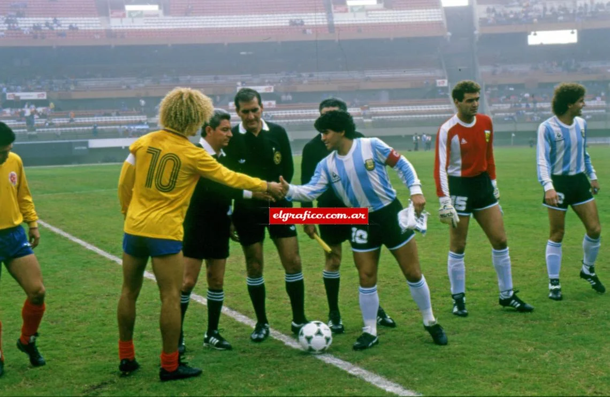 | `carlos-valderrama` | Carlos Valderrama | [link](https://upload.wikimedia.org/wikipedia/commons/a/a1/Pibe_Valderrama_2022.jpg) | [wp](https://en.wikipedia.org/wiki/Carlos_Valderrama) |
| 46 |  | `cesar-luis-menotti` | César Luis Menotti | [link](https://upload.wikimedia.org/wikipedia/commons/e/ea/Cesar_menotti_in_1983.jpg) | [wp](https://en.wikipedia.org/wiki/C%C3%A9sar_Luis_Menotti) |
| 47 |  | `cesare-maldini` | Cesare Maldini | [link](https://upload.wikimedia.org/wikipedia/commons/3/3a/Cesare_Maldini_op_de_tribune_bij_N.E.C._%28cropped%29.jpg) | [wp](https://en.wikipedia.org/wiki/Cesare_Maldini) |
| 48 |  | `cesc-fabregas` | Cesc Fabregas | [link](https://upload.wikimedia.org/wikipedia/commons/5/5b/2023_-_Cesc_Fabregas_%28cropped%29.jpg) | [wp](https://en.wikipedia.org/wiki/Cesc_Fabregas) |
| 49 | 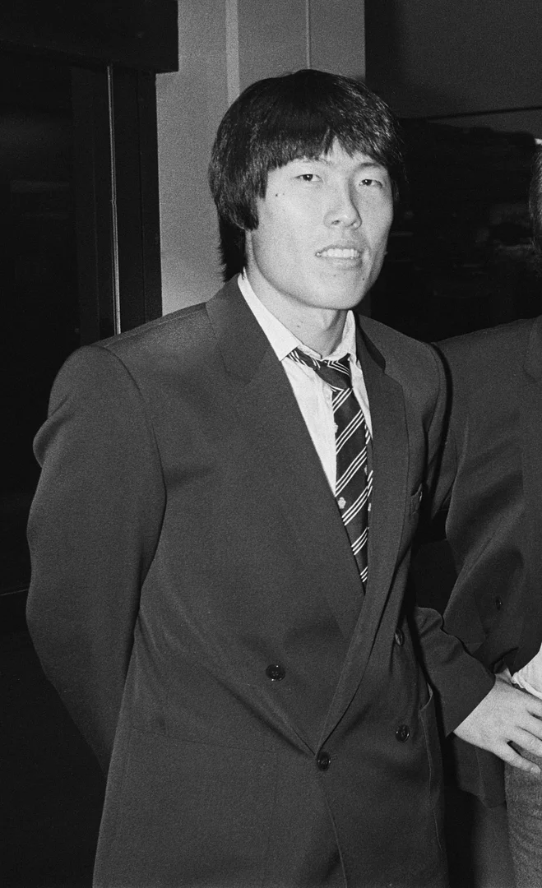 | `cha-bum-kun` | Cha Bum Kun | [link](https://upload.wikimedia.org/wikipedia/commons/0/05/Cha_Bum_Kun.jpg) | [wp](https://en.wikipedia.org/wiki/Cha_Bum_Kun) |
| 50 |  | `christian-pulisic` | Christian Pulisic | [link](https://upload.wikimedia.org/wikipedia/commons/7/71/Christian_Pulisic_USMNT_v_Belgium_Mar_28_2026-73_%28cropped%29.jpg) | [wp](https://en.wikipedia.org/wiki/Christian_Pulisic) |
| 51 |  | `christian-vieri` | Christian Vieri | [link](https://upload.wikimedia.org/wikipedia/commons/4/42/Christian_Vieri_%28cropped%29.jpg) | [wp](https://en.wikipedia.org/wiki/Christian_Vieri) |
| 52 |  | `clarence-seedorf` | Clarence Seedorf | [link](https://upload.wikimedia.org/wikipedia/commons/c/c2/Clarence_Seedorf_Introductory_Press_Conferences%2C_2_June_2025_-_40_%28cropped%29.jpg) | [wp](https://en.wikipedia.org/wiki/Clarence_Seedorf) |
| 53 | 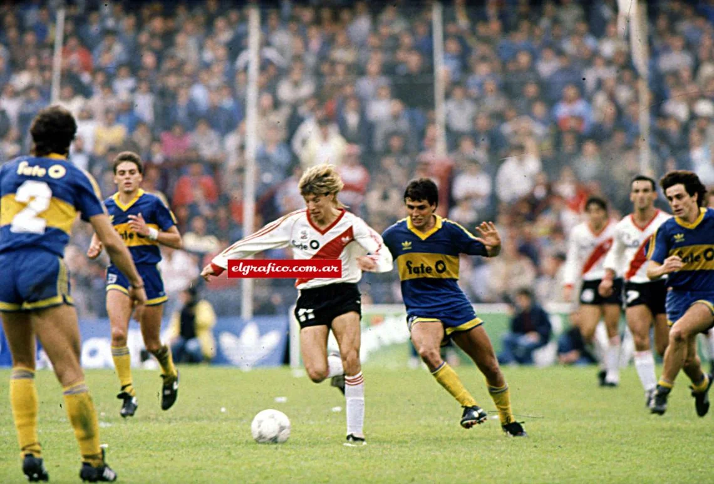 | `claudio-caniggia` | Claudio Caniggia | [link](https://upload.wikimedia.org/wikipedia/commons/1/17/Caniggia_sonriente_1988.jpg) | [wp](https://en.wikipedia.org/wiki/Claudio_Caniggia) |
| 54 |  | `claudio-taffarel` | Claudio Taffarel | [link](https://upload.wikimedia.org/wikipedia/commons/3/30/Taffarel_2018.png) | [wp](https://en.wikipedia.org/wiki/Claudio_Taffarel) |
| 55 |  | `clint-dempsey` | Clint Dempsey | [link](https://upload.wikimedia.org/wikipedia/commons/e/e3/Clint_Dempsey_%2826347615912%29_%28cropped%29.jpg) | [wp](https://en.wikipedia.org/wiki/Clint_Dempsey) |
| 56 |  | `cody-gakpo` | Cody Gakpo | [link](https://upload.wikimedia.org/wikipedia/commons/4/4f/Cody_Gakpo_06042025_%282%29_%28cropped%29.jpg) | [wp](https://en.wikipedia.org/wiki/Cody_Gakpo) |
| 57 |  | `cristiano-ronaldo` | Cristiano Ronaldo | _(no batch-input)_ | [wp](https://en.wikipedia.org/wiki/Cristiano_Ronaldo) |
| 58 | 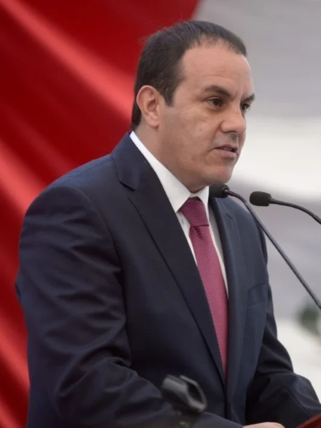 | `cuauhtemoc-blanco` | Cuauhtemoc Blanco | [link](https://upload.wikimedia.org/wikipedia/commons/2/25/Cuauht%C3%A9moc_Blanco_MORELOS_%28cropped%29.jpg) | [wp](https://en.wikipedia.org/wiki/Cuauhtemoc_Blanco) |
| 59 |  | `dani-alves` | Dani Alves | [link](https://upload.wikimedia.org/wikipedia/commons/d/dd/07_07_2019_Final_da_Copa_Am%C3%A9rica_2019_%2848226649586%29_%28cropped%29.jpg) | [wp](https://en.wikipedia.org/wiki/Dani_Alves) |
| 60 |  | `daniel-passarella` | Daniel Passarella | [link](https://upload.wikimedia.org/wikipedia/commons/a/a7/Daniel_passarella_en_1985.jpg) | [wp](https://en.wikipedia.org/wiki/Daniel_Passarella) |
| 61 |  | `daniele-de-rossi` | Daniele De Rossi | [link](https://upload.wikimedia.org/wikipedia/commons/7/7d/Daniele_De_Rossi_BGR-ITA_2012.jpg) | [wp](https://en.wikipedia.org/wiki/Daniele_De_Rossi) |
| 62 |  | `david-beckham` | David Beckham | _(no batch-input)_ | [wp](https://en.wikipedia.org/wiki/David_Beckham) |
| 63 |  | `david-trezeguet` | David Trezeguet | [link](https://upload.wikimedia.org/wikipedia/commons/1/15/David_Trezeguet_became_Save_the_Dream_Ambassador%2C_2017_%28cropped%29.jpg) | [wp](https://en.wikipedia.org/wiki/David_Trezeguet) |
| 64 |  | `david-villa` | David Villa | [link](https://upload.wikimedia.org/wikipedia/commons/a/a4/Spain-Tahiti%2C_Confederations_Cup_2013_%2802%29_%28Villa_crop%29.jpg) | [wp](https://en.wikipedia.org/wiki/David_Villa) |
| 65 |  | `davor-suker` | Davor Šuker | [link](https://upload.wikimedia.org/wikipedia/commons/a/ab/Croatia%27s_post-match_huddle_after_the_2018_FIFA_World_Cup_Final.jpg) | [wp](https://en.wikipedia.org/wiki/Davor_%C5%A0uker) |
| 66 |  | `declan-rice` | Declan Rice | [link](https://upload.wikimedia.org/wikipedia/commons/e/ea/1_declan_rice_arsenal_2025_%28cropped%29.jpg) | [wp](https://en.wikipedia.org/wiki/Declan_Rice) |
| 67 |  | `deco` | Deco | [link](https://upload.wikimedia.org/wikipedia/commons/f/fa/Deco_com_o_Fluminense_em_2013_%28cropped%29.jpg) | [wp](https://en.wikipedia.org/wiki/Deco) |
| 68 |  | `dejan-kulusevski` | Dejan Kulusevski | [link](https://upload.wikimedia.org/wikipedia/commons/2/2f/Sweden-Slovenia_Nations_League_2022-09-27_17_Kulusevski_%28cropped%29.jpg) | [wp](https://en.wikipedia.org/wiki/Dejan_Kulusevski) |
| 69 |  | `demetrio-albertini` | Demetrio Albertini | [link](https://upload.wikimedia.org/wikipedia/commons/8/8c/Demetrio_Albertini_in_2016.jpg) | [wp](https://en.wikipedia.org/wiki/Demetrio_Albertini) |
| 70 |  | `dennis-bergkamp` | Dennis Bergkamp | [link](https://upload.wikimedia.org/wikipedia/commons/3/33/Dennis_Bergkamp_Euro_%2796.jpg) | [wp](https://en.wikipedia.org/wiki/Dennis_Bergkamp) |
| 71 |  | `didier-deschamps` | Didier Deschamps | [link](https://upload.wikimedia.org/wikipedia/commons/a/ae/Didier_Deschamps_in_2018.jpg) | [wp](https://en.wikipedia.org/wiki/Didier_Deschamps) |
| 72 |  | `didier-drogba` | Didier Drogba | [link](https://upload.wikimedia.org/wikipedia/commons/5/53/Ivory_Coast_players_2013-01-10_001.jpg) | [wp](https://en.wikipedia.org/wiki/Didier_Drogba) |
| 73 |  | `diego-costa` | Diego Costa | [link](https://upload.wikimedia.org/wikipedia/commons/5/5f/Iran_and_Spain_match_at_the_FIFA_World_Cup_23.jpg) | [wp](https://en.wikipedia.org/wiki/Diego_Costa) |
| 74 |  | `diego-forlan` | Diego Forlan | [link](https://upload.wikimedia.org/wikipedia/commons/f/f3/U10_Diego_Forl%C3%A1n_7524.jpg) | [wp](https://en.wikipedia.org/wiki/Diego_Forlan) |
| 75 |  | `diego-maradona` | Diego Maradona | _(no batch-input)_ | [wp](https://en.wikipedia.org/wiki/Diego_Maradona) |
| 76 |  | `diego-simeone` | Diego Simeone | [link](https://upload.wikimedia.org/wikipedia/commons/9/9b/25th_Laureus_World_Sports_Awards_-_Red_Carpet_-_Diego_Simeone_-_240422_192621-2_%28cropped%29.jpg) | [wp](https://en.wikipedia.org/wiki/Diego_Simeone) |
| 77 |  | `dino-zoff` | Dino Zoff | [link](https://upload.wikimedia.org/wikipedia/commons/4/48/Zoff%2C_Causio%2C_Pertini%2C_Bearzot_-_Mondiale_1982.jpg) | [wp](https://en.wikipedia.org/wiki/Dino_Zoff) |
| 78 |  | `dirk-kuyt` | Dirk Kuyt | [link](https://upload.wikimedia.org/wikipedia/commons/9/98/Dirk_Kuijt-Feyenoord-DSC_0058_%28cropped%29.jpg) | [wp](https://en.wikipedia.org/wiki/Dirk_Kuyt) |
| 79 |  | `djalma-santos` | Djalma Santos | [link](https://upload.wikimedia.org/wikipedia/commons/3/36/Djalma_Santos.jpg) | [wp](https://en.wikipedia.org/wiki/Djalma_Santos) |
| 80 |  | `dunga` | Dunga | [link](https://upload.wikimedia.org/wikipedia/commons/6/66/Aecio_Neves_e_Dunga_-_17-06-2008_%288368243127%29_%28cropped%29.jpg) | [wp](https://en.wikipedia.org/wiki/Dunga) |
| 81 |  | `eden-hazard` | Eden Hazard | [link](https://upload.wikimedia.org/wikipedia/commons/4/46/Eden_Hazard_at_Baku_before_2019_UEFA_Europe_League_Final.jpg) | [wp](https://en.wikipedia.org/wiki/Eden_Hazard) |
| 82 |  | `edgar-davids` | Edgar Davids | [link](https://upload.wikimedia.org/wikipedia/commons/e/ee/Edgar_Davids_%28cropped%29.jpg) | [wp](https://en.wikipedia.org/wiki/Edgar_Davids) |
| 83 |  | `edinson-cavani` | Edinson Cavani | [link](https://upload.wikimedia.org/wikipedia/commons/9/9f/Edinson_Cavani_2018_%28cropped%29.jpg) | [wp](https://en.wikipedia.org/wiki/Edinson_Cavani) |
| 84 |  | `el-hadji-diouf` | El Hadji Diouf | [link](https://upload.wikimedia.org/wikipedia/commons/f/f8/El_Hadji_Diouf.jpg) | [wp](https://en.wikipedia.org/wiki/El_Hadji_Diouf) |
| 85 |  | `emilio-butragueno` | Emilio Butragueno | [link](https://upload.wikimedia.org/wikipedia/commons/8/8d/25th_Laureus_World_Sports_Awards_-_Red_Carpet_-_Emilio_Butrague%C3%B1o_-_240422_191751-2_%28cropped%29.jpg) | [wp](https://en.wikipedia.org/wiki/Emilio_Butragueno) |
| 86 |  | `emmanuel-adebayor` | Emmanuel Adebayor | [link](https://upload.wikimedia.org/wikipedia/commons/4/47/Emmanuel_Adebayor_-_Lech_-_Manchester_026.jpg) | [wp](https://en.wikipedia.org/wiki/Emmanuel_Adebayor) |
| 87 |  | `enzo-bearzot` | Enzo Bearzot | [link](https://upload.wikimedia.org/wikipedia/commons/4/40/Enzo_Bearzot_2.jpg) | [wp](https://en.wikipedia.org/wiki/Enzo_Bearzot) |
| 88 | 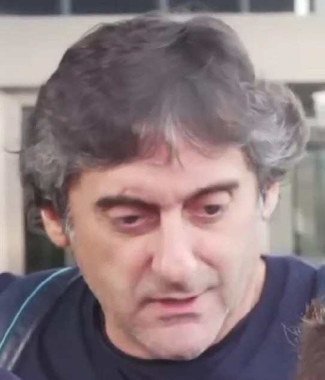 | `enzo-francescoli` | Enzo Francescoli | [link](https://upload.wikimedia.org/wikipedia/commons/2/24/Enzo_Francescoli_in_2018.png) | [wp](https://en.wikipedia.org/wiki/Enzo_Francescoli) |
| 89 |  | `erling-haaland` | Erling Haaland | _(no batch-input)_ | [wp](https://en.wikipedia.org/wiki/Erling_Haaland) |
| 90 |  | `esteban-cambiasso` | Esteban Cambiasso | [link](https://upload.wikimedia.org/wikipedia/commons/0/08/Esteban_Cambiasso_FC_Internazionale.jpg) | [wp](https://en.wikipedia.org/wiki/Esteban_Cambiasso) |
| 91 |  | `eusebio` | Eusébio | [link](https://upload.wikimedia.org/wikipedia/commons/5/55/Eusebio_en_1973.jpg) | [wp](https://en.wikipedia.org/wiki/Eus%C3%A9bio) |
| 92 |  | `fabio-cannavaro` | Fabio Cannavaro | [link](https://upload.wikimedia.org/wikipedia/commons/5/50/Fabio_Cannavaro_in_world_cup_2006.jpg) | [wp](https://en.wikipedia.org/wiki/Fabio_Cannavaro) |
| 93 |  | `fernando-hierro` | Fernando Hierro | [link](https://upload.wikimedia.org/wikipedia/commons/2/29/Fernando_Hierro_in_Spain-Iran_press_conference_2018-06-19.jpg) | [wp](https://en.wikipedia.org/wiki/Fernando_Hierro) |
| 94 |  | `fernando-santos` | Fernando Santos | [link](https://upload.wikimedia.org/wikipedia/commons/a/ae/Fernando_Santos_20240116_1.jpg) | [wp](https://en.wikipedia.org/wiki/Fernando_Santos) |
| 95 | 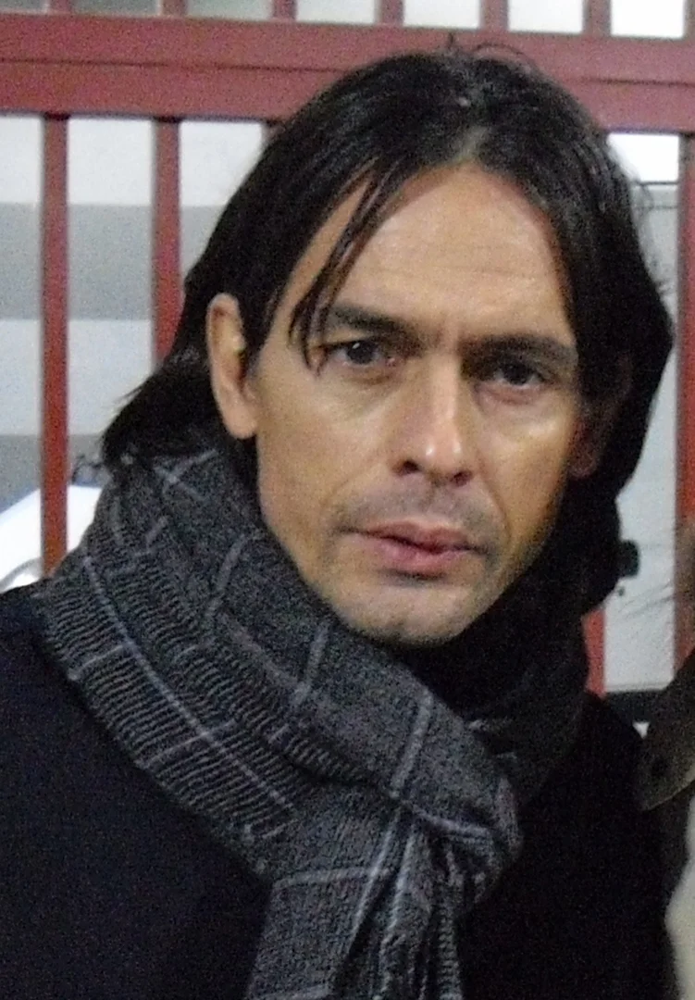 | `filippo-inzaghi` | Filippo Inzaghi | [link](https://upload.wikimedia.org/wikipedia/commons/3/39/Filippo_Inzaghi_2011.jpg) | [wp](https://en.wikipedia.org/wiki/Filippo_Inzaghi) |
| 96 |  | `francesco-totti` | Francesco Totti | [link](https://upload.wikimedia.org/wikipedia/commons/9/99/Italy_vs_France_-_FIFA_World_Cup_2006_final_-_Francesco_Totti.jpg) | [wp](https://en.wikipedia.org/wiki/Francesco_Totti) |
| 97 |  | `franco-baresi` | Franco Baresi | _(no batch-input)_ | [wp](https://en.wikipedia.org/wiki/Franco_Baresi) |
| 98 |  | `frank-lampard` | Frank Lampard | [link](https://upload.wikimedia.org/wikipedia/commons/8/8c/Frank_Lampard_2019.jpg) | [wp](https://en.wikipedia.org/wiki/Frank_Lampard) |
| 99 |  | `frank-rijkaard` | Frank Rijkaard | [link](https://upload.wikimedia.org/wikipedia/commons/4/4a/FrankRijkaard2.jpg) | [wp](https://en.wikipedia.org/wiki/Frank_Rijkaard) |
| 100 |  | `franz-beckenbauer` | Franz Beckenbauer | [link](https://upload.wikimedia.org/wikipedia/commons/5/56/Franz_Beckenbauer_%281975%29.jpg) | [wp](https://en.wikipedia.org/wiki/Franz_Beckenbauer) |
| 101 |  | `fred` | Fred | [link](https://upload.wikimedia.org/wikipedia/commons/b/ba/Fred_Silver_Boot%2C_Confederations_Cup_2013.jpg) | [wp](https://en.wikipedia.org/wiki/Fred) |
| 102 | 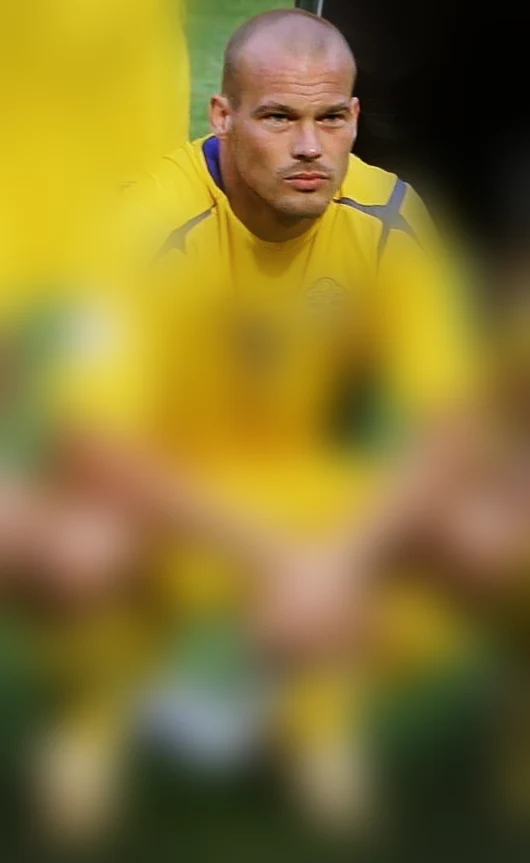 | `freddie-ljungberg` | Freddie Ljungberg | [link](https://upload.wikimedia.org/wikipedia/commons/3/3a/Football_against_poverty_2014_-_Fredrik_Ljungberg.jpg) | [wp](https://en.wikipedia.org/wiki/Freddie_Ljungberg) |
| 103 |  | `frenkie-de-jong` | Frenkie De Jong | [link](https://upload.wikimedia.org/wikipedia/commons/4/42/%D0%9C%D0%B0%D1%82%D1%87_%C2%AB%D0%94%D0%B8%D0%BD%D0%B0%D0%BC%D0%BE%C2%BB_-_%C2%AB%D0%91%D0%B0%D1%80%D1%81%D0%B5%D0%BB%D0%BE%D0%BD%D0%B0%C2%BB_0-1._2_%D0%BD%D0%BE%D1%8F%D0%B1%D1%80%D1%8F_2021_%D0%B3%D0%BE%D0%B4%D0%B0._II_%E2%80%94_1289671_%28cropped%29.jpg) | [wp](https://en.wikipedia.org/wiki/Frenkie_De_Jong) |
| 104 |  | `fritz-walter` | Fritz Walter | [link](https://upload.wikimedia.org/wikipedia/commons/a/aa/Fritz_Walter_cropped_2.JPG) | [wp](https://en.wikipedia.org/wiki/Fritz_Walter) |
| 105 |  | `gabriel-batistuta` | Gabriel Batistuta | [link](https://upload.wikimedia.org/wikipedia/commons/e/e4/Gabriel_batistuta.jpg) | [wp](https://en.wikipedia.org/wiki/Gabriel_Batistuta) |
| 106 |  | `gaetano-scirea` | Gaetano Scirea | [link](https://upload.wikimedia.org/wikipedia/commons/5/5e/1975%E2%80%9376_Juventus_FC_-_Gaetano_Scirea.jpg) | [wp](https://en.wikipedia.org/wiki/Gaetano_Scirea) |
| 107 |  | `gareth-bale` | Gareth Bale | [link](https://upload.wikimedia.org/wikipedia/commons/1/1e/2022_FIFA_World_Cup_United_States_1%E2%80%931_Wales_-_%2832%29_%28cropped%29.jpg) | [wp](https://en.wikipedia.org/wiki/Gareth_Bale) |
| 108 |  | `garrincha` | Garrincha | [link](https://upload.wikimedia.org/wikipedia/commons/e/e3/Garrincha_na_copa_de_1962.jpg) | [wp](https://en.wikipedia.org/wiki/Garrincha) |
| 109 |  | `gary-lineker` | Gary Lineker | [link](https://upload.wikimedia.org/wikipedia/commons/2/2e/Lineker_Nederland_1-3%2C_Bestanddeelnr_934-2662_%28cropped%29.jpg) | [wp](https://en.wikipedia.org/wiki/Gary_Lineker) |
| 110 |  | `gennaro-gattuso` | Gennaro Gattuso | [link](https://upload.wikimedia.org/wikipedia/commons/0/01/Lausanne_vs_Sion_27_february_2013_-_Gennaro_Gattuso.jpg) | [wp](https://en.wikipedia.org/wiki/Gennaro_Gattuso) |
| 111 |  | `george-best` | George Best | _(no batch-input)_ | [wp](https://en.wikipedia.org/wiki/George_Best) |
| 112 |  | `gerard-pique` | Gerard Piqué | [link](https://upload.wikimedia.org/wikipedia/commons/f/f2/Gerard_Piqu%C3%A9_Euro_2012_vs_France_01.jpg) | [wp](https://en.wikipedia.org/wiki/Gerard_Piqu%C3%A9) |
| 113 |  | `gerd-muller` | Gerd Müller | [link](https://upload.wikimedia.org/wikipedia/commons/9/9a/Gerd_M%C3%BCller_c1973_%28cropped%29.jpg) | [wp](https://en.wikipedia.org/wiki/Gerd_M%C3%BCller) |
| 114 |  | `gheorghe-hagi` | Gheorghe Hagi | [link](https://upload.wikimedia.org/wikipedia/commons/4/49/Lansarea_candidaturii_Gabrielei_Szabo_pentru_Camera_Deputatilor%2C_Voluntari_-_04.05_%2848%29_%2814270956179%29_%28cropped%29.jpg) | [wp](https://en.wikipedia.org/wiki/Gheorghe_Hagi) |
| 115 |  | `gheorghe-popescu` | Gheorghe Popescu | [link](https://upload.wikimedia.org/wikipedia/commons/1/18/Genera%C8%9Bia_de_Aur_vs_Barcelona_Legends_%280-2%29_2018_Sports_Festival_-_meciul_amintirilor._%2852809831697%29.jpg) | [wp](https://en.wikipedia.org/wiki/Gheorghe_Popescu) |
| 116 |  | `gianluca-zambrotta` | Gianluca Zambrotta | [link](https://upload.wikimedia.org/wikipedia/commons/2/24/Gianluca_Zambrotta_2019_%28cropped%29.jpg) | [wp](https://en.wikipedia.org/wiki/Gianluca_Zambrotta) |
| 117 |  | `gianluigi-buffon` | Gianluigi Buffon | [link](https://upload.wikimedia.org/wikipedia/commons/d/d7/Norway_Italy_-_June_2025_A_44_%28Gianluigi_Buffon%29.jpg) | [wp](https://en.wikipedia.org/wiki/Gianluigi_Buffon) |
| 118 |  | `giuseppe-meazza` | Giuseppe Meazza | [link](https://upload.wikimedia.org/wikipedia/commons/1/19/Giuseppe_Meazza_1935.jpg) | [wp](https://en.wikipedia.org/wiki/Giuseppe_Meazza) |
| 119 |  | `glenn-hoddle` | Glenn Hoddle | [link](https://upload.wikimedia.org/wikipedia/commons/e/e0/Glenn_Hoddle_2014_%28cropped%29.jpg) | [wp](https://en.wikipedia.org/wiki/Glenn_Hoddle) |
| 120 |  | `gonzalo-higuain` | Gonzalo Higuain | [link](https://upload.wikimedia.org/wikipedia/commons/7/72/Gonzalo_Higua%C3%ADn_2019.jpg) | [wp](https://en.wikipedia.org/wiki/Gonzalo_Higuain) |
| 121 |  | `grzegorz-lato` | Grzegorz Lato | [link](https://upload.wikimedia.org/wikipedia/commons/3/3f/V.l.n.r._Lato%2C_Boniek_en_trainer_Kulesza%2C_Bestanddeelnr_930-4929_%28Lato_cropped%29.jpg) | [wp](https://en.wikipedia.org/wiki/Grzegorz_Lato) |
| 122 |  | `guillermo-ochoa` | Guillermo Ochoa | [link](https://upload.wikimedia.org/wikipedia/commons/2/2f/Mex-Kor_%281%29_%28cropped%29.jpg) | [wp](https://en.wikipedia.org/wiki/Guillermo_Ochoa) |
| 123 |  | `gusztav-sebes` | Gusztáv Sebes | [link](https://upload.wikimedia.org/wikipedia/commons/a/a8/Gusztav_Sebes_1930.jpg) | [wp](https://en.wikipedia.org/wiki/Guszt%C3%A1v_Sebes) |
| 124 |  | `guus-hiddink` | Guus Hiddink | [link](https://upload.wikimedia.org/wikipedia/commons/5/5c/Guus_Hiddink_2012.jpg) | [wp](https://en.wikipedia.org/wiki/Guus_Hiddink) |
| 125 |  | `hans-peter-briegel` | Hans Peter Briegel | [link](https://upload.wikimedia.org/wikipedia/commons/d/d4/6633_Hans_Peter_Briegel_%28cropped%29.JPG) | [wp](https://en.wikipedia.org/wiki/Hans_Peter_Briegel) |
| 126 |  | `harry-kane` | Harry Kane | _(no batch-input)_ | [wp](https://en.wikipedia.org/wiki/Harry_Kane) |
| 127 |  | `harry-kewell` | Harry Kewell | [link](https://upload.wikimedia.org/wikipedia/commons/b/b2/HarryKewell.jpg) | [wp](https://en.wikipedia.org/wiki/Harry_Kewell) |
| 128 |  | `hector-cuper` | Héctor Cúper | [link](https://upload.wikimedia.org/wikipedia/commons/5/54/H%C3%A9ctor_C%C3%BAper.jpg) | [wp](https://en.wikipedia.org/wiki/H%C3%A9ctor_C%C3%BAper) |
| 129 |  | `helmut-rahn` | Helmut Rahn | [link](https://upload.wikimedia.org/wikipedia/commons/4/4b/Helmut_Rahn.jpg) | [wp](https://en.wikipedia.org/wiki/Helmut_Rahn) |
| 130 |  | `helmut-schon` | Helmut Schön | [link](https://upload.wikimedia.org/wikipedia/commons/9/92/Fu%C3%9Fball-Bundestrainer_Helmut_Sch%C3%B6n_%28Kiel_87.306%29.jpg) | [wp](https://en.wikipedia.org/wiki/Helmut_Sch%C3%B6n) |
| 131 |  | `henrik-larsson` | Henrik Larsson | _(no batch-input)_ | [wp](https://en.wikipedia.org/wiki/Henrik_Larsson) |
| 132 |  | `hernan-crespo` | Hernan Crespo | [link](https://upload.wikimedia.org/wikipedia/commons/9/9f/Chelsea_Legends_1_Inter_Forever_4_%2827457022797%29.jpg) | [wp](https://en.wikipedia.org/wiki/Hernan_Crespo) |
| 133 |  | `hidetoshi-nakata` | Hidetoshi Nakata | [link](https://upload.wikimedia.org/wikipedia/commons/e/eb/Hidetoshi_Nakata_in_Okinawa.jpg) | [wp](https://en.wikipedia.org/wiki/Hidetoshi_Nakata) |
| 134 |  | `hristo-stoichkov` | Hristo Stoichkov | [link](https://upload.wikimedia.org/wikipedia/commons/2/20/World_Cup_1994_-_Bulgaria_v_Germany_-_Stoichkov_has_scored_in_75th_minute.jpg) | [wp](https://en.wikipedia.org/wiki/Hristo_Stoichkov) |
| 135 |  | `hugo-lloris` | Hugo Lloris | [link](https://upload.wikimedia.org/wikipedia/commons/c/ca/Lloris_2018_%28cropped%29.jpg) | [wp](https://en.wikipedia.org/wiki/Hugo_Lloris) |
| 136 |  | `hugo-sanchez` | Hugo Sanchez | [link](https://upload.wikimedia.org/wikipedia/commons/9/9e/Huguito.jpg) | [wp](https://en.wikipedia.org/wiki/Hugo_Sanchez) |
| 137 |  | `ian-rush` | Ian Rush | _(no batch-input)_ | [wp](https://en.wikipedia.org/wiki/Ian_Rush) |
| 138 |  | `iker-casillas` | Iker Casillas | _(no batch-input)_ | [wp](https://en.wikipedia.org/wiki/Iker_Casillas) |
| 139 |  | `ivan-rakitic` | Ivan Rakitic | [link](https://upload.wikimedia.org/wikipedia/commons/f/f0/Ivan_Rakiti%C4%87_2020_%28cropped%29.jpg) | [wp](https://en.wikipedia.org/wiki/Ivan_Rakitic) |
| 140 | 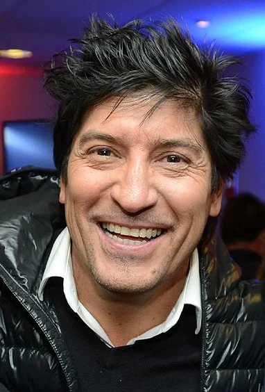 | `ivan-zamorano` | Ivan Zamorano | [link](https://upload.wikimedia.org/wikipedia/commons/4/4b/Iv%C3%A1n_Zamorano.jpg) | [wp](https://en.wikipedia.org/wiki/Ivan_Zamorano) |
| 141 |  | `jairzinho` | Jairzinho | [link](https://upload.wikimedia.org/wikipedia/commons/8/8f/Jairzinho_1970s.jpg) | [wp](https://en.wikipedia.org/wiki/Jairzinho) |
| 142 |  | `james-rodriguez` | James Rodriguez | [link](https://upload.wikimedia.org/wikipedia/commons/7/79/James_Rodriguez_2018.jpg) | [wp](https://en.wikipedia.org/wiki/James_Rodriguez) |
| 143 |  | `jamie-carragher` | Jamie Carragher | [link](https://upload.wikimedia.org/wikipedia/commons/c/c8/Football_against_poverty_2014_-_Jamie_Carragher_%28cropped%29.jpg) | [wp](https://en.wikipedia.org/wiki/Jamie_Carragher) |
| 144 |  | `jan-ceulemans` | Jan Ceulemans | [link](https://upload.wikimedia.org/wikipedia/commons/c/c5/Jan_Ceulemans.jpg) | [wp](https://en.wikipedia.org/wiki/Jan_Ceulemans) |
| 145 |  | `javier-aguirre` | Javier Aguirre | [link](https://upload.wikimedia.org/wikipedia/commons/b/b4/Javier_Aguirre.png) | [wp](https://en.wikipedia.org/wiki/Javier_Aguirre) |
| 146 |  | `javier-hernandez` | Javier Hernandez | [link](https://upload.wikimedia.org/wikipedia/commons/9/95/Hertha_BSC_vs._West_Ham_United_20190731_%28139%29.jpg) | [wp](https://en.wikipedia.org/wiki/Javier_Hernandez) |
| 147 |  | `javier-mascherano` | Javier Mascherano | [link](https://upload.wikimedia.org/wikipedia/commons/9/9a/Javier_Mascherano_NE_Revolution_Inter_Miami_7.9.25-040_%28cropped%29.jpg) | [wp](https://en.wikipedia.org/wiki/Javier_Mascherano) |
| 148 |  | `javier-zanetti` | Javier Zanetti | [link](https://upload.wikimedia.org/wikipedia/commons/e/e7/Metalist-Inter_%282%29.jpg) | [wp](https://en.wikipedia.org/wiki/Javier_Zanetti) |
| 149 |  | `jean-marie-pfaff` | Jean Marie Pfaff | [link](https://upload.wikimedia.org/wikipedia/commons/1/16/Jean-Marie_Pfaff_at_Runa_Ralley_2007_cropped.jpg) | [wp](https://en.wikipedia.org/wiki/Jean_Marie_Pfaff) |
| 150 |  | `jean-tigana` | Jean Tigana | [link](https://upload.wikimedia.org/wikipedia/commons/5/59/Jean_Tigana_cropped.jpg) | [wp](https://en.wikipedia.org/wiki/Jean_Tigana) |
| 151 |  | `jean-pierre-papin` | Jean-Pierre Papin | [link](https://upload.wikimedia.org/wikipedia/commons/a/a6/PapinJP1997_%28cropped%29.jpg) | [wp](https://en.wikipedia.org/wiki/Jean-Pierre_Papin) |
| 152 |  | `joachim-low` | Joachim Löw | [link](https://upload.wikimedia.org/wikipedia/commons/2/2d/20180602_FIFA_Friendly_Match_Austria_vs._Germany_Jogi_L%C3%B6w_850_1386.jpg) | [wp](https://en.wikipedia.org/wiki/Joachim_L%C3%B6w) |
| 153 |  | `joao-felix` | João Félix | [link](https://upload.wikimedia.org/wikipedia/commons/5/55/Jo%C3%A3o_F%C3%A9lix_USMNT_v_Portugal_Mar_31_2026-22_%28cropped%29.jpg) | [wp](https://en.wikipedia.org/wiki/Jo%C3%A3o_F%C3%A9lix) |
| 154 |  | `joaquin` | Joaquin | [link](https://upload.wikimedia.org/wikipedia/commons/f/ff/Joaquin_2022_%28cropped%29.jpg) | [wp](https://en.wikipedia.org/wiki/Joaquin) |
| 155 |  | `johan-cruyff` | Johan Cruyff | [link](https://upload.wikimedia.org/wikipedia/commons/c/cb/Johan_Cruijff_%281974%29.jpg) | [wp](https://en.wikipedia.org/wiki/Johan_Cruyff) |
| 156 |  | `john-barnes` | John Barnes | [link](https://upload.wikimedia.org/wikipedia/commons/e/e4/John_Barnes_in_Singapore%2C_2023_01.jpg) | [wp](https://en.wikipedia.org/wiki/John_Barnes) |
| 157 |  | `john-terry` | John Terry | [link](https://upload.wikimedia.org/wikipedia/commons/c/c3/John_Terry_at_pro-am_Wentworth_golf_course_September_2023_%28cropped%29.jpg) | [wp](https://en.wikipedia.org/wiki/John_Terry) |
| 158 |  | `jose-pekerman` | José Pekerman | [link](https://upload.wikimedia.org/wikipedia/commons/5/59/Jos%C3%A9_N%C3%A9stor_P%C3%A9kerman_and_Police_at_Colombia_vs_Uruguay_match_for_Russia_2018_%28cropped%29.jpg) | [wp](https://en.wikipedia.org/wiki/Jos%C3%A9_Pekerman) |
| 159 |  | `juan-mata` | Juan Mata | [link](https://upload.wikimedia.org/wikipedia/commons/6/63/Juan_Mata_Melbourne_Victory_Signing_Press_Conference.png) | [wp](https://en.wikipedia.org/wiki/Juan_Mata) |
| 160 |  | `juan-roman-riquelme` | Juan Roman Riquelme | [link](https://upload.wikimedia.org/wikipedia/commons/b/ba/Juan_Rom%C3%A1n_Riquelme_-_2019.jpg) | [wp](https://en.wikipedia.org/wiki/Juan_Roman_Riquelme) |
| 161 |  | `juan-sebastian-veron` | Juan Sebastian Veron | [link](https://upload.wikimedia.org/wikipedia/commons/2/27/Juan_Sebastian_Veron_2017.jpg) | [wp](https://en.wikipedia.org/wiki/Juan_Sebastian_Veron) |
| 162 |  | `jude-bellingham` | Jude Bellingham | [link](https://upload.wikimedia.org/wikipedia/commons/f/f9/25th_Laureus_World_Sports_Awards_-_Red_Carpet_-_Jude_Bellingham_-_240422_190551-2_%28cropped%29.jpg) | [wp](https://en.wikipedia.org/wiki/Jude_Bellingham) |
| 163 |  | `jules-kounde` | Jules Kounde | [link](https://upload.wikimedia.org/wikipedia/commons/b/bd/Jules_Kound%C3%A9_2020.jpg) | [wp](https://en.wikipedia.org/wiki/Jules_Kounde) |
| 164 |  | `julio-cesar` | Julio Cesar | [link](https://upload.wikimedia.org/wikipedia/commons/a/a8/J%C3%BAlio_C%C3%A9sar_FC_Internazionale.jpg) | [wp](https://en.wikipedia.org/wiki/Julio_Cesar) |
| 165 |  | `jupp-derwall` | Jupp Derwall | [link](https://upload.wikimedia.org/wikipedia/commons/c/ce/Derwall1.jpg) | [wp](https://en.wikipedia.org/wiki/Jupp_Derwall) |
| 166 |  | `jurgen-klinsmann` | Jurgen Klinsmann | [link](https://upload.wikimedia.org/wikipedia/commons/a/af/J%C3%BCrgen_Klinsmann_14021113000678638425063004371092_64131.jpg) | [wp](https://en.wikipedia.org/wiki/Jurgen_Klinsmann) |
| 167 |  | `just-fontaine` | Just Fontaine | [link](https://upload.wikimedia.org/wikipedia/commons/7/7f/Fontaine1958.jpg) | [wp](https://en.wikipedia.org/wiki/Just_Fontaine) |
| 168 |  | `kaka` | Kaká | [link](https://upload.wikimedia.org/wikipedia/commons/2/27/Kak%C3%A1_after_Brazil_national_team_training_at_Randburg_High_School_2010-06-06.jpg) | [wp](https://en.wikipedia.org/wiki/Kak%C3%A1) |
| 169 |  | `karim-benzema` | Karim Benzema | [link](https://upload.wikimedia.org/wikipedia/commons/5/5f/Karim_Benzema_Pick.jpg) | [wp](https://en.wikipedia.org/wiki/Karim_Benzema) |
| 170 |  | `karl-heinz-rummenigge` | Karl Heinz Rummenigge | [link](https://upload.wikimedia.org/wikipedia/commons/f/fc/2015-02-06_Rummenigge_0370_%28cropped%29.JPG) | [wp](https://en.wikipedia.org/wiki/Karl_Heinz_Rummenigge) |
| 171 |  | `keisuke-honda` | Keisuke Honda | [link](https://upload.wikimedia.org/wikipedia/commons/7/79/Keisuke_Honda_2018_%28cropped%29_%28cropped%29.jpg) | [wp](https://en.wikipedia.org/wiki/Keisuke_Honda) |
| 172 |  | `kenny-dalglish` | Kenny Dalglish | _(no batch-input)_ | [wp](https://en.wikipedia.org/wiki/Kenny_Dalglish) |
| 173 |  | `kevin-de-bruyne` | Kevin De Bruyne | [link](https://upload.wikimedia.org/wikipedia/commons/4/40/Kevin_De_Bruyne_USMNT_v_Belgium_Mar_28_2026-64_%28cropped%29.jpg) | [wp](https://en.wikipedia.org/wiki/Kevin_De_Bruyne) |
| 174 |  | `keylor-navas` | Keylor Navas | [link](https://upload.wikimedia.org/wikipedia/commons/d/dc/Keylor_Navas_2018_%28cropped%29.jpg) | [wp](https://en.wikipedia.org/wiki/Keylor_Navas) |
| 175 |  | `kylian-mbappe` | Kylian Mbappé | _(no batch-input)_ | [wp](https://en.wikipedia.org/wiki/Kylian_Mbapp%C3%A9) |
| 176 |  | `lakhdar-belloumi` | Lakhdar Belloumi | [link](https://upload.wikimedia.org/wikipedia/commons/1/1b/Lakhdar_Belloumi_%282017%29.jpg) | [wp](https://en.wikipedia.org/wiki/Lakhdar_Belloumi) |
| 177 |  | `landon-donovan` | Landon Donovan | [link](https://upload.wikimedia.org/wikipedia/commons/6/6f/NC_Courage_vs_SD_Wave_%28Oct_2024%29_045.jpg) | [wp](https://en.wikipedia.org/wiki/Landon_Donovan) |
| 178 |  | `lars-lagerback` | Lars Lagerbäck | [link](https://upload.wikimedia.org/wikipedia/commons/8/85/Lars_Lagerb%C3%A4ck_in_Jan_2014.jpg) | [wp](https://en.wikipedia.org/wiki/Lars_Lagerb%C3%A4ck) |
| 179 |  | `lev-yashin` | Lev Yashin | [link](https://upload.wikimedia.org/wikipedia/commons/f/f5/LevYashin.JPG) | [wp](https://en.wikipedia.org/wiki/Lev_Yashin) |
| 180 |  | `lilian-thuram` | Lilian Thuram | [link](https://upload.wikimedia.org/wikipedia/commons/2/24/Lilian_Thuram_-_F%C3%A9vrier_2013.jpg) | [wp](https://en.wikipedia.org/wiki/Lilian_Thuram) |
| 181 |  | `lionel-messi` | Lionel Messi | _(no batch-input)_ | [wp](https://en.wikipedia.org/wiki/Lionel_Messi) |
| 182 |  | `lionel-scaloni` | Lionel Scaloni | [link](https://upload.wikimedia.org/wikipedia/commons/7/7c/Lionel_Scaloni_-_2022.jpg) | [wp](https://en.wikipedia.org/wiki/Lionel_Scaloni) |
| 183 |  | `lothar-matthaus` | Lothar Matthaus | [link](https://upload.wikimedia.org/wikipedia/commons/8/84/2019_Lothar_Matth%C3%A4us.jpg) | [wp](https://en.wikipedia.org/wiki/Lothar_Matthaus) |
| 184 |  | `louis-van-gaal` | Louis van Gaal | [link](https://upload.wikimedia.org/wikipedia/commons/0/09/Louis_van_Gaal_2014.jpg) | [wp](https://en.wikipedia.org/wiki/Louis_van_Gaal) |
| 185 |  | `luigi-riva` | Luigi Riva | [link](https://upload.wikimedia.org/wikipedia/commons/5/5c/Gigi_Riva%2C_Italia%2C_1968_%28cropped%29.JPG) | [wp](https://en.wikipedia.org/wiki/Luigi_Riva) |
| 186 |  | `luis-aragones` | Luis Aragones | [link](https://upload.wikimedia.org/wikipedia/commons/4/40/Luis_Aragones_2011.jpg) | [wp](https://en.wikipedia.org/wiki/Luis_Aragones) |
| 187 |  | `luis-figo` | Luis Figo | [link](https://upload.wikimedia.org/wikipedia/commons/1/15/Luis_Figo_2023.jpg) | [wp](https://en.wikipedia.org/wiki/Luis_Figo) |
| 188 |  | `luis-suarez` | Luis Suarez | [link](https://upload.wikimedia.org/wikipedia/commons/f/f7/Luis_Su%C3%A1rez_2026_%28cropped%29.jpg) | [wp](https://en.wikipedia.org/wiki/Luis_Suarez) |
| 189 |  | `luiz-felipe-scolari` | Luiz Felipe Scolari | [link](https://upload.wikimedia.org/wikipedia/commons/1/19/Felip%C3%A3o_cropped.jpg) | [wp](https://en.wikipedia.org/wiki/Luiz_Felipe_Scolari) |
| 190 |  | `luka-modric` | Luka Modrić | _(no batch-input)_ | [wp](https://en.wikipedia.org/wiki/Luka_Modri%C4%87) |
| 191 |  | `manuel-neuer` | Manuel Neuer | _(no batch-input)_ | [wp](https://en.wikipedia.org/wiki/Manuel_Neuer) |
| 192 | 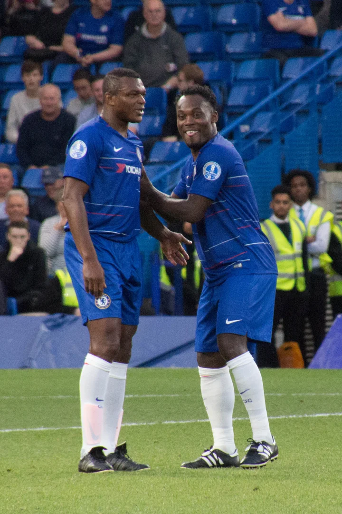 | `marcel-desailly` | Marcel Desailly | [link](https://upload.wikimedia.org/wikipedia/commons/c/c7/25th_Laureus_World_Sports_Awards_-_Red_Carpet_-_Marcel_Desailly_-_240422_192752-3_%28cropped%29.jpg) | [wp](https://en.wikipedia.org/wiki/Marcel_Desailly) |
| 193 |  | `marcello-lippi` | Marcello Lippi | [link](https://upload.wikimedia.org/wikipedia/commons/8/8d/Marcello_Lippi_at_China-Iran_press_conference_20190123.jpg) | [wp](https://en.wikipedia.org/wiki/Marcello_Lippi) |
| 194 |  | `marcelo` | Marcelo | [link](https://upload.wikimedia.org/wikipedia/commons/b/b8/Brazil_and_Croatia_match_at_the_FIFA_World_Cup_2014-06-12_%2824%29.jpg) | [wp](https://en.wikipedia.org/wiki/Marcelo) |
| 195 |  | `marcelo-brozovic` | Marcelo Brozovic | [link](https://upload.wikimedia.org/wikipedia/commons/c/c9/Marcelo_Brozovi%C4%87_2021_%28cropped%29.jpg) | [wp](https://en.wikipedia.org/wiki/Marcelo_Brozovic) |
| 196 |  | `marcelo-salas` | Marcelo Salas | [link](https://upload.wikimedia.org/wikipedia/commons/6/61/Marcelo_Salas_2015.jpg) | [wp](https://en.wikipedia.org/wiki/Marcelo_Salas) |
| 197 |  | `marco-materazzi` | Marco Materazzi | [link](https://upload.wikimedia.org/wikipedia/commons/0/0d/Marco_Materazzi_2020.jpg) | [wp](https://en.wikipedia.org/wiki/Marco_Materazzi) |
| 198 |  | `marco-tardelli` | Marco Tardelli | [link](https://upload.wikimedia.org/wikipedia/commons/0/07/Marco_Tardelli_-_Lucca_Comics_%26_Games_2016.jpg) | [wp](https://en.wikipedia.org/wiki/Marco_Tardelli) |
| 199 |  | `marco-van-basten` | Marco van Basten | [link](https://upload.wikimedia.org/wikipedia/commons/d/d5/Marco_van_Basten_1989_crop.jpg) | [wp](https://en.wikipedia.org/wiki/Marco_van_Basten) |
| 200 |  | `mario-kempes` | Mario Kempes | [link](https://upload.wikimedia.org/wikipedia/commons/e/e4/Mario_Kempes_Argentina_vs._Holanda.JPG) | [wp](https://en.wikipedia.org/wiki/Mario_Kempes) |
| 201 |  | `mario-mandzukic` | Mario Mandzukic | [link](https://upload.wikimedia.org/wikipedia/commons/4/47/Mario_Mand%C5%BEuki%C4%87_in_2018.jpg) | [wp](https://en.wikipedia.org/wiki/Mario_Mandzukic) |
| 202 |  | `mario-zagallo` | Mário Zagallo | [link](https://upload.wikimedia.org/wikipedia/commons/8/88/M%C3%A1rio_Zagallo_1974.jpg) | [wp](https://en.wikipedia.org/wiki/M%C3%A1rio_Zagallo) |
| 203 |  | `martin-dahlin` | Martin Dahlin | [link](https://upload.wikimedia.org/wikipedia/commons/4/40/Martin_Dahlin_in_Jan_2014.jpg) | [wp](https://en.wikipedia.org/wiki/Martin_Dahlin) |
| 204 |  | `martin-odegaard` | Martin Ødegaard | [link](https://upload.wikimedia.org/wikipedia/commons/a/aa/Norway_Italy_-_June_2025_E_04.jpg) | [wp](https://en.wikipedia.org/wiki/Martin_%C3%98degaard) |
| 205 |  | `matthijs-de-ligt` | Matthijs De Ligt | [link](https://upload.wikimedia.org/wikipedia/commons/c/c9/2022-07-30_Fu%C3%9Fball%2C_M%C3%A4nner%2C_DFL-Supercup%2C_RB_Leipzig_-_FC_Bayern_M%C3%BCnchen_Matthijs_de_Ligt_%28cropped%29.jpg) | [wp](https://en.wikipedia.org/wiki/Matthijs_De_Ligt) |
| 206 |  | `memphis-depay` | Memphis Depay | [link](https://upload.wikimedia.org/wikipedia/commons/1/1c/Memphis_Depay_2019.jpg) | [wp](https://en.wikipedia.org/wiki/Memphis_Depay) |
| 207 |  | `mesut-ozil` | Mesut Özil | [link](https://upload.wikimedia.org/wikipedia/commons/e/ea/%C3%96zil_podolski.JPG) | [wp](https://en.wikipedia.org/wiki/Mesut_%C3%96zil) |
| 208 |  | `michael-essien` | Michael Essien | [link](https://upload.wikimedia.org/wikipedia/commons/5/55/Flickr_-_tpower1978_-_International_friendly_match_%281%29.jpg) | [wp](https://en.wikipedia.org/wiki/Michael_Essien) |
| 209 |  | `michael-owen` | Michael Owen | [link](https://upload.wikimedia.org/wikipedia/commons/2/24/Michael_Owen.jpg) | [wp](https://en.wikipedia.org/wiki/Michael_Owen) |
| 210 |  | `michel-platini` | Michel Platini | [link](https://upload.wikimedia.org/wikipedia/commons/6/66/Michel_Platini_2010_%28cropped%29.jpg) | [wp](https://en.wikipedia.org/wiki/Michel_Platini) |
| 211 |  | `miroslav-klose` | Miroslav Klose | [link](https://upload.wikimedia.org/wikipedia/commons/8/8c/2016209185719_2016-07-27_Champions_for_Charity_-_Sven_-_1D_X_-_0149_-_DV3P4742_mod.jpg) | [wp](https://en.wikipedia.org/wiki/Miroslav_Klose) |
| 212 |  | `mladen-ramljak` | Mladen Ramljak | [link](https://upload.wikimedia.org/wikipedia/commons/b/bf/Mladen_Ramljak.jpg) | [wp](https://en.wikipedia.org/wiki/Mladen_Ramljak) |
| 213 |  | `mohamed-salah` | Mohamed Salah | [link](https://upload.wikimedia.org/wikipedia/commons/4/4a/Mohamed_Salah_2018.jpg) | [wp](https://en.wikipedia.org/wiki/Mohamed_Salah) |
| 214 |  | `morten-olsen` | Morten Olsen | [link](https://upload.wikimedia.org/wikipedia/commons/e/e6/Morten_Olsen_2012_%28cropped%29.jpg) | [wp](https://en.wikipedia.org/wiki/Morten_Olsen) |
| 215 |  | `nani` | Nani | [link](https://upload.wikimedia.org/wikipedia/commons/3/3a/New_Zealand-Portugal_Nani.jpg) | [wp](https://en.wikipedia.org/wiki/Nani) |
| 216 |  | `neymar` | Neymar | _(no batch-input)_ | [wp](https://en.wikipedia.org/wiki/Neymar) |
| 217 |  | `ngolo-kante` | Ngolo Kante | [link](https://upload.wikimedia.org/wikipedia/commons/0/05/N%27Golo_Kant%C3%A9_%28cropped%29.jpg) | [wp](https://en.wikipedia.org/wiki/Ngolo_Kante) |
| 218 |  | `nils-liedholm` | Nils Liedholm | [link](https://upload.wikimedia.org/wikipedia/commons/6/67/Nils_Liedholm-1959.jpg) | [wp](https://en.wikipedia.org/wiki/Nils_Liedholm) |
| 219 |  | `nilton-santos` | Nilton Santos | [link](https://upload.wikimedia.org/wikipedia/commons/2/2e/Nilton_Santos_1_%281956%29.tif) | [wp](https://en.wikipedia.org/wiki/Nilton_Santos) |
| 220 |  | `oliver-kahn` | Oliver Kahn | [link](https://upload.wikimedia.org/wikipedia/commons/4/4b/2022-07-30_Fu%C3%9Fball%2C_M%C3%A4nner%2C_DFL-Supercup%2C_RB_Leipzig_-_FC_Bayern_M%C3%BCnchen_1DX_3179_by_Stepro.jpg) | [wp](https://en.wikipedia.org/wiki/Oliver_Kahn) |
| 221 |  | `olivier-giroud` | Olivier Giroud | [link](https://upload.wikimedia.org/wikipedia/commons/9/9f/France_champion_of_the_Football_World_Cup_Russia_2018_%28cropped%29_%28Giroud_with_Trophy%29.jpg) | [wp](https://en.wikipedia.org/wiki/Olivier_Giroud) |
| 222 |  | `oscar` | Oscar | [link](https://upload.wikimedia.org/wikipedia/commons/c/c5/20141118_AUTBRA_5022.jpg) | [wp](https://en.wikipedia.org/wiki/Oscar) |
| 223 |  | `otto-rehhagel` | Otto Rehhagel | [link](https://upload.wikimedia.org/wikipedia/commons/0/0c/Otto_Rehhagel_01-2.jpg) | [wp](https://en.wikipedia.org/wiki/Otto_Rehhagel) |
| 224 |  | `pablo-aimar` | Pablo Aimar | [link](https://upload.wikimedia.org/wikipedia/commons/8/80/Match_legends_2017_CC_%284%29.jpg) | [wp](https://en.wikipedia.org/wiki/Pablo_Aimar) |
| 225 |  | `paolo-guerrero` | Paolo Guerrero | [link](https://upload.wikimedia.org/wikipedia/commons/6/6d/Paolo_Guerrero_Mundial_2018.jpg) | [wp](https://en.wikipedia.org/wiki/Paolo_Guerrero) |
| 226 |  | `paolo-maldini` | Paolo Maldini | [link](https://upload.wikimedia.org/wikipedia/commons/6/60/Maldini_Italia.jpg) | [wp](https://en.wikipedia.org/wiki/Paolo_Maldini) |
| 227 |  | `paolo-rossi` | Paolo Rossi | [link](https://upload.wikimedia.org/wikipedia/commons/b/b7/Paolo_Rossi_at_the_1982_FIFA_World_Cup_%28cropped%29.jpg) | [wp](https://en.wikipedia.org/wiki/Paolo_Rossi) |
| 228 |  | `park-ji-sung` | Park Ji Sung | [link](https://upload.wikimedia.org/wikipedia/commons/4/4a/Park_Ji-sung_G20_Seoul_Summit_Ambassador_%28cropped%29.jpg) | [wp](https://en.wikipedia.org/wiki/Park_Ji_Sung) |
| 229 |  | `pat-jennings` | Pat Jennings | [link](https://upload.wikimedia.org/wikipedia/commons/9/9a/Pat_Jennings_%282018%29.jpg) | [wp](https://en.wikipedia.org/wiki/Pat_Jennings) |
| 230 | 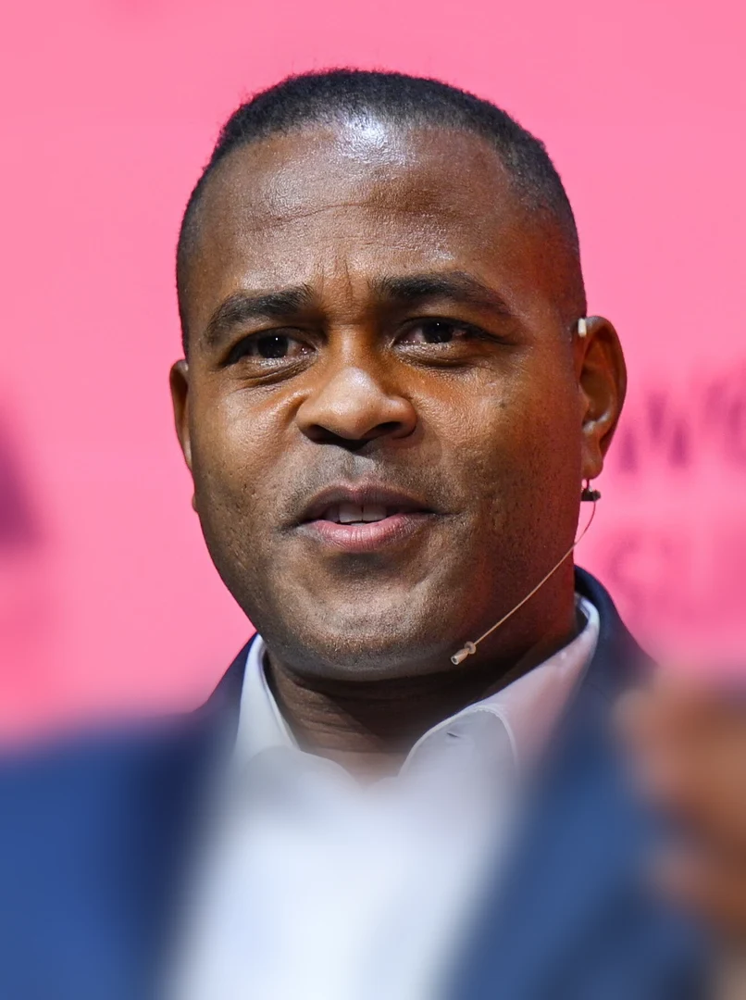 | `patrick-kluivert` | Patrick Kluivert | [link](https://upload.wikimedia.org/wikipedia/commons/3/3c/Patrick_Kluivert_at_Web_Summit_2024_%28cropped_2%29.jpg) | [wp](https://en.wikipedia.org/wiki/Patrick_Kluivert) |
| 231 |  | `patrick-vieira` | Patrick Vieira | [link](https://upload.wikimedia.org/wikipedia/commons/6/6c/Patrick_Vieira_NYCFC_%28cropped%29.JPG) | [wp](https://en.wikipedia.org/wiki/Patrick_Vieira) |
| 232 |  | `paul-gascoigne` | Paul Gascoigne | _(no batch-input)_ | [wp](https://en.wikipedia.org/wiki/Paul_Gascoigne) |
| 233 | 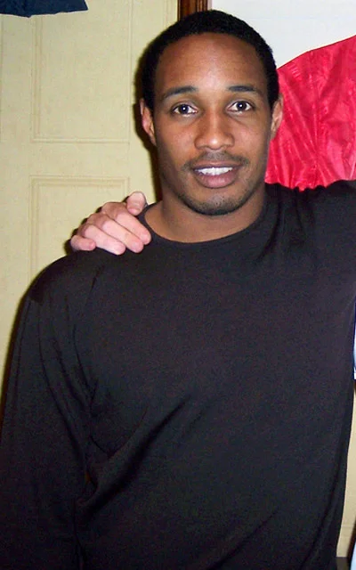 | `paul-ince` | Paul Ince | [link](https://upload.wikimedia.org/wikipedia/commons/4/41/Paul_Ince.jpg) | [wp](https://en.wikipedia.org/wiki/Paul_Ince) |
| 234 |  | `paul-pogba` | Paul Pogba | [link](https://upload.wikimedia.org/wikipedia/commons/e/ec/Paul_Pogba_at_the_2025_Cannes_Film_Festival_02.jpg) | [wp](https://en.wikipedia.org/wiki/Paul_Pogba) |
| 235 |  | `paulo-bento` | Paulo Bento | [link](https://upload.wikimedia.org/wikipedia/commons/3/39/Paulo_Bento_managing_South_Korea_at_2019_AFC_Asian_Cup.jpg) | [wp](https://en.wikipedia.org/wiki/Paulo_Bento) |
| 236 |  | `pavel-nedved` | Pavel Nedved | [link](https://upload.wikimedia.org/wikipedia/commons/4/46/Pavel_Nedv%C4%9Bd.jpg) | [wp](https://en.wikipedia.org/wiki/Pavel_Nedved) |
| 237 |  | `pedro-rodriguez` | Pedro Rodriguez | [link](https://upload.wikimedia.org/wikipedia/commons/3/30/Bar%C3%A7a_-_Napoli_-_20140806_-_Pedro_Rodriguez_%28cropped%29.jpg) | [wp](https://en.wikipedia.org/wiki/Pedro_Rodriguez) |
| 238 |  | `pele` | Pelé | [link](https://upload.wikimedia.org/wikipedia/commons/5/5e/Pele_con_brasil_%28cropped%29.jpg) | [wp](https://en.wikipedia.org/wiki/Pel%C3%A9) |
| 239 |  | `pepe` | Pepe | [link](https://upload.wikimedia.org/wikipedia/commons/5/55/Pepe_2018.jpg) | [wp](https://en.wikipedia.org/wiki/Pepe) |
| 240 | 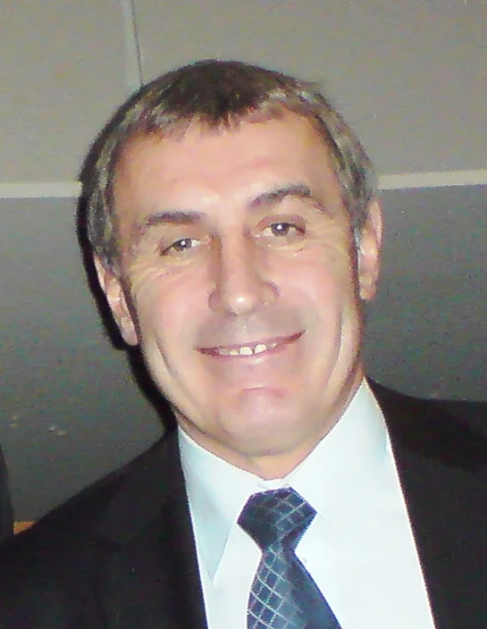 | `peter-shilton` | Peter Shilton | [link](https://upload.wikimedia.org/wikipedia/commons/4/43/Peter_Shilton.png) | [wp](https://en.wikipedia.org/wiki/Peter_Shilton) |
| 241 |  | `petr-cech` | Petr Cech | [link](https://upload.wikimedia.org/wikipedia/commons/7/75/Arsenal_players_training_before_2019_UEFA_Europa_League_final_07_%28cropped%29.jpg) | [wp](https://en.wikipedia.org/wiki/Petr_Cech) |
| 242 |  | `phil-foden` | Phil Foden | [link](https://upload.wikimedia.org/wikipedia/commons/5/53/2023-10-04_Fu%C3%9Fball%2C_M%C3%A4nner%2C_UEFA_Champions_League%2C_RB_Leipzig_-_Manchester_City_FC_1DX_2613%2C_Phil_Foden.jpg) | [wp](https://en.wikipedia.org/wiki/Phil_Foden) |
| 243 |  | `philipp-lahm` | Philipp Lahm | [link](https://upload.wikimedia.org/wikipedia/commons/c/c1/Philipp_Lahm_com_o_trof%C3%A9u_de_Campe%C3%A3o_do_Mundo_em_2014.jpg) | [wp](https://en.wikipedia.org/wiki/Philipp_Lahm) |
| 244 |  | `pierre-littbarski` | Pierre Littbarski | [link](https://upload.wikimedia.org/wikipedia/commons/b/b8/Pierre_Littbarski_2006_%28cropped%29.jpg) | [wp](https://en.wikipedia.org/wiki/Pierre_Littbarski) |
| 245 |  | `rabah-madjer` | Rabah Madjer | [link](https://upload.wikimedia.org/wikipedia/commons/a/a0/FC_Porto_%28in_verband_met_wedstrijd_om_Super_Cup_tegen_Ajax%29_speler_Madjer_%28l%29_e%2C_Bestanddeelnr_934-1340_%28cropped%29.jpg) | [wp](https://en.wikipedia.org/wiki/Rabah_Madjer) |
| 246 |  | `radamel-falcao` | Radamel Falcao | [link](https://upload.wikimedia.org/wikipedia/commons/9/98/Radamel_Falcao_Garc%C3%ADa_%28cropped%29.jpg) | [wp](https://en.wikipedia.org/wiki/Radamel_Falcao) |
| 247 |  | `rafa-marquez` | Rafael Márquez | [link](https://upload.wikimedia.org/wikipedia/commons/2/26/Rafael_M%C3%A1rquez_2014.jpg) | [wp](https://en.wikipedia.org/wiki/Rafael_M%C3%A1rquez) |
| 248 |  | `raphael-varane` | Raphael Varane | [link](https://upload.wikimedia.org/wikipedia/commons/c/cc/Rapha%C3%ABl_Varane_2018_%28cropped%29.jpg) | [wp](https://en.wikipedia.org/wiki/Raphael_Varane) |
| 249 |  | `raul` | Raul | [link](https://upload.wikimedia.org/wikipedia/commons/5/5a/25th_Laureus_World_Sports_Awards_-_Ra%C3%BAl_-_240422_132916-2_%28cropped%29.jpg) | [wp](https://en.wikipedia.org/wiki/Raul) |
| 250 |  | `raymond-domenech` | Raymond Domenech | [link](https://upload.wikimedia.org/wikipedia/commons/0/01/Raymond_Domenech.jpg) | [wp](https://en.wikipedia.org/wiki/Raymond_Domenech) |
| 251 | 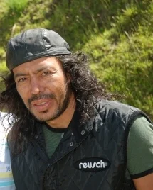 | `rene-higuita` | Rene Higuita | [link](https://upload.wikimedia.org/wikipedia/commons/7/7a/Ren%C3%A9_Higuita%2C_2007.jpg) | [wp](https://en.wikipedia.org/wiki/Rene_Higuita) |
| 252 |  | `rene-simoes` | René Simões | [link](https://upload.wikimedia.org/wikipedia/commons/a/a1/Ren%C3%A9_Sim%C3%B5es_2006-08-20.jpg) | [wp](https://en.wikipedia.org/wiki/Ren%C3%A9_Sim%C3%B5es) |
| 253 |  | `ricardo-la-volpe` | Ricardo La Volpe | [link](https://upload.wikimedia.org/wikipedia/commons/9/94/RicardoLavolpe.jpg) | [wp](https://en.wikipedia.org/wiki/Ricardo_La_Volpe) |
| 254 |  | `ricardo-quaresma` | Ricardo Quaresma | [link](https://upload.wikimedia.org/wikipedia/commons/b/be/Ricardo_Quaresma_%28cropped%29_2.jpg) | [wp](https://en.wikipedia.org/wiki/Ricardo_Quaresma) |
| 255 | 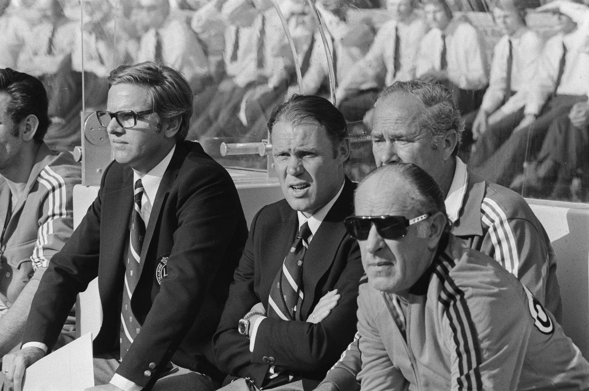 | `rinus-michels` | Rinus Michels | [link](https://upload.wikimedia.org/wikipedia/commons/6/67/Koppen_Nederlandse_voetballers_Rinus_Michels%2C_Bestanddeelnr_254-9536_2.jpg) | [wp](https://en.wikipedia.org/wiki/Rinus_Michels) |
| 256 |  | `rio-ferdinand` | Rio Ferdinand | [link](https://upload.wikimedia.org/wikipedia/commons/4/4c/Web_Summit_2015_-_Dublin%2C_Ireland_-_22183056474_%28cropped%29.jpg) | [wp](https://en.wikipedia.org/wiki/Rio_Ferdinand) |
| 257 |  | `rivaldo` | Rivaldo | [link](https://upload.wikimedia.org/wikipedia/commons/8/8e/Rivaldo.jpg) | [wp](https://en.wikipedia.org/wiki/Rivaldo) |
| 258 |  | `rivellino` | Rivellino | [link](https://upload.wikimedia.org/wikipedia/commons/e/ea/Rivellino_1970.jpg) | [wp](https://en.wikipedia.org/wiki/Rivellino) |
| 259 |  | `riyad-mahrez` | Riyad Mahrez | [link](https://upload.wikimedia.org/wikipedia/commons/4/45/Mahrez_2021.jpg) | [wp](https://en.wikipedia.org/wiki/Riyad_Mahrez) |
| 260 |  | `robbie-keane` | Robbie Keane | [link](https://upload.wikimedia.org/wikipedia/commons/3/30/2013_Robbie_Keane_%28cropped%29.jpg) | [wp](https://en.wikipedia.org/wiki/Robbie_Keane) |
| 261 |  | `robert-lewandowski` | Robert Lewandowski | _(no batch-input)_ | [wp](https://en.wikipedia.org/wiki/Robert_Lewandowski) |
| 262 |  | `robert-prosinecki` | Robert Prosinecki | [link](https://upload.wikimedia.org/wikipedia/commons/d/df/Prosinecki_in_2025.jpg) | [wp](https://en.wikipedia.org/wiki/Robert_Prosinecki) |
| 263 |  | `roberto-baggio` | Roberto Baggio | _(no batch-input)_ | [wp](https://en.wikipedia.org/wiki/Roberto_Baggio) |
| 264 |  | `roberto-carlos` | Roberto Carlos | [link](https://upload.wikimedia.org/wikipedia/commons/a/a8/LS3_1288_%2853332367864%29_%28cropped%29.jpg) | [wp](https://en.wikipedia.org/wiki/Roberto_Carlos) |
| 265 |  | `roberto-donadoni` | Roberto Donadoni | [link](https://upload.wikimedia.org/wikipedia/commons/f/f2/Roberto_Donadoni_-_SSC_Neapel_%282%29_%28cropped%29.jpg) | [wp](https://en.wikipedia.org/wiki/Roberto_Donadoni) |
| 266 |  | `roberto-martinez` | Roberto Martínez | [link](https://upload.wikimedia.org/wikipedia/commons/6/62/Roberto_Mart%C3%ADnez_USMNT_v_Portugal_Mar_31_2026-35.jpg) | [wp](https://en.wikipedia.org/wiki/Roberto_Mart%C3%ADnez) |
| 267 |  | `robin-van-persie` | Robin Van Persie | [link](https://upload.wikimedia.org/wikipedia/commons/6/65/Loco-Fener_%2810%29.jpg) | [wp](https://en.wikipedia.org/wiki/Robin_Van_Persie) |
| 268 |  | `robinho` | Robinho | [link](https://upload.wikimedia.org/wikipedia/commons/2/20/Robinho_at_Brazil_%26_Chile_match_at_World_Cup_2010-06-28.jpg) | [wp](https://en.wikipedia.org/wiki/Robinho) |
| 269 |  | `roger-lemerre` | Roger Lemerre | [link](https://upload.wikimedia.org/wikipedia/commons/8/8a/Morocco_vs_Gabon%2C_Roger_Lemerre%2C_March_28_2009.jpg) | [wp](https://en.wikipedia.org/wiki/Roger_Lemerre) |
| 270 |  | `rogerio-ceni` | Rogerio Ceni | [link](https://upload.wikimedia.org/wikipedia/commons/4/4e/Rogerio-Ceni-Sao-Paulo-Juventude-jun-2022_%28cropped%29.jpg) | [wp](https://en.wikipedia.org/wiki/Rogerio_Ceni) |
| 271 |  | `romario` | Romário | _(no batch-input)_ | [wp](https://en.wikipedia.org/wiki/Rom%C3%A1rio) |
| 272 |  | `romelu-lukaku` | Romelu Lukaku | [link](https://upload.wikimedia.org/wikipedia/commons/d/dc/Romelu_Lukaku_2021.jpg) | [wp](https://en.wikipedia.org/wiki/Romelu_Lukaku) |
| 273 |  | `ronaldinho` | Ronaldinho | [link](https://upload.wikimedia.org/wikipedia/commons/1/10/Ronaldinho_corner_brazil.jpg) | [wp](https://en.wikipedia.org/wiki/Ronaldinho) |
| 274 |  | `ronaldo-nazario` | Ronaldo Nazário | [link](https://upload.wikimedia.org/wikipedia/commons/d/d5/Ronaldo_2002_cropped.jpg) | [wp](https://en.wikipedia.org/wiki/Ronaldo_Naz%C3%A1rio) |
| 275 |  | `roy-keane` | Roy Keane | [link](https://upload.wikimedia.org/wikipedia/commons/0/0a/Roy_keane_2014.jpg) | [wp](https://en.wikipedia.org/wiki/Roy_Keane) |
| 276 |  | `rudi-voller` | Rudi Voller | [link](https://upload.wikimedia.org/wikipedia/commons/4/4e/Rudi_V%C3%B6ller_B%C3%BChne_%28cropped%29.jpg) | [wp](https://en.wikipedia.org/wiki/Rudi_Voller) |
| 277 |  | `rui-costa` | Rui Costa | [link](https://upload.wikimedia.org/wikipedia/commons/e/ea/Rui_Costa_2019.png) | [wp](https://en.wikipedia.org/wiki/Rui_Costa) |
| 278 |  | `ruud-gullit` | Ruud Gullit | [link](https://upload.wikimedia.org/wikipedia/commons/4/4b/Selectie_Nederlands_elftal_in_Zeist_Ruud_Gullit_%2C_kop%2C_Bestanddeelnr_934-2142.jpg) | [wp](https://en.wikipedia.org/wiki/Ruud_Gullit) |
| 279 |  | `ruud-krol` | Ruud Krol | [link](https://upload.wikimedia.org/wikipedia/commons/7/7a/Ruud_Krol_2005.jpg) | [wp](https://en.wikipedia.org/wiki/Ruud_Krol) |
| 280 |  | `ruud-van-nistelrooy` | Ruud Van Nistelrooy | [link](https://upload.wikimedia.org/wikipedia/commons/9/9d/Ruud_van_Nistelrooy_2017.jpg) | [wp](https://en.wikipedia.org/wiki/Ruud_Van_Nistelrooy) |
| 281 |  | `ryan-giggs` | Ryan Giggs | [link](https://upload.wikimedia.org/wikipedia/commons/1/13/Ryan_Giggs_2015_%28cropped%29.jpg) | [wp](https://en.wikipedia.org/wiki/Ryan_Giggs) |
| 282 |  | `salvatore-schillaci` | Salvatore Schillaci | [link](https://upload.wikimedia.org/wikipedia/commons/1/10/Salvatore_Schillaci.jpg) | [wp](https://en.wikipedia.org/wiki/Salvatore_Schillaci) |
| 283 |  | `samuel-etoo` | Samuel Eto'o | [link](https://upload.wikimedia.org/wikipedia/commons/b/bf/FIFA_World_Cup_2010_Netherlands_Cameroon5.jpg) | [wp](https://en.wikipedia.org/wiki/Samuel_Eto'o) |
| 284 |  | `sandro-mazzola` | Sandro Mazzola | [link](https://upload.wikimedia.org/wikipedia/commons/c/cb/Inter_Milan_1971-1972_Sandro_Mazzola.jpg) | [wp](https://en.wikipedia.org/wiki/Sandro_Mazzola) |
| 285 |  | `sepp-maier` | Sepp Maier | [link](https://upload.wikimedia.org/wikipedia/commons/5/51/6137Sepp_Maier_Torwart-Legende.JPG) | [wp](https://en.wikipedia.org/wiki/Sepp_Maier) |
| 286 |  | `sergio-aguero` | Sergio Aguero | [link](https://upload.wikimedia.org/wikipedia/commons/7/7b/Ag%C3%BCero_in_2018.jpg) | [wp](https://en.wikipedia.org/wiki/Sergio_Aguero) |
| 287 |  | `sergio-busquets` | Sergio Busquets | [link](https://upload.wikimedia.org/wikipedia/commons/4/40/Sergio_Busquets_NYCFC_Miami_24_Sep_2025-020_%28cropped%29.jpg) | [wp](https://en.wikipedia.org/wiki/Sergio_Busquets) |
| 288 |  | `sergio-ramos` | Sergio Ramos | _(no batch-input)_ | [wp](https://en.wikipedia.org/wiki/Sergio_Ramos) |
| 289 |  | `shinji-kagawa` | Shinji Kagawa | [link](https://upload.wikimedia.org/wikipedia/commons/8/81/Shinji_Kagawa_2018_%28cropped%29.jpg) | [wp](https://en.wikipedia.org/wiki/Shinji_Kagawa) |
| 290 |  | `shunsuke-nakamura` | Shunsuke Nakamura | [link](https://upload.wikimedia.org/wikipedia/commons/e/e4/Shunsuke2_20080622.png) | [wp](https://en.wikipedia.org/wiki/Shunsuke_Nakamura) |
| 291 |  | `socrates` | Sócrates | [link](https://upload.wikimedia.org/wikipedia/commons/5/56/Socrates_elgrafico_1983.jpg) | [wp](https://en.wikipedia.org/wiki/S%C3%B3crates) |
| 292 |  | `sol-campbell` | Sol Campbell | [link](https://upload.wikimedia.org/wikipedia/commons/1/1f/Sol_Campbell_%2854921202604%29_%28cropped%29.jpg) | [wp](https://en.wikipedia.org/wiki/Sol_Campbell) |
| 293 |  | `son-heung-min` | Son Heung-min | [link](https://upload.wikimedia.org/wikipedia/commons/4/42/Iran%2C_S._Korea_Closer_to_Securing_Spot_in_World_Cup_Tournament_after_Draw_2021-7_%28cropped%29.jpg) | [wp](https://en.wikipedia.org/wiki/Son_Heung-min) |
| 294 |  | `steven-gerrard` | Steven Gerrard | [link](https://upload.wikimedia.org/wikipedia/commons/d/d5/Steven_Gerrard_2018.jpg) | [wp](https://en.wikipedia.org/wiki/Steven_Gerrard) |
| 295 |  | `stuart-pearce` | Stuart Pearce | [link](https://upload.wikimedia.org/wikipedia/commons/7/71/Stuart_Pearce_%2831651906441%29.jpg) | [wp](https://en.wikipedia.org/wiki/Stuart_Pearce) |
| 296 |  | `sven-goran-eriksson` | Sven-Göran Eriksson | [link](https://upload.wikimedia.org/wikipedia/commons/a/ad/Sven-Goran_Eriksson_2012.jpg) | [wp](https://en.wikipedia.org/wiki/Sven-G%C3%B6ran_Eriksson) |
| 297 |  | `tele-santana` | Telê Santana | [link](https://upload.wikimedia.org/wikipedia/commons/3/3e/Tel%C3%A9%2C_T%C3%A9cnico_de_Futebol.tif) | [wp](https://en.wikipedia.org/wiki/Tel%C3%AA_Santana) |
| 298 |  | `teofilo-cubillas` | Teófilo Cubillas | [link](https://upload.wikimedia.org/wikipedia/commons/0/0b/Te%C3%B3filo_Cubillas_1978.jpg) | [wp](https://en.wikipedia.org/wiki/Te%C3%B3filo_Cubillas) |
| 299 |  | `thiago-silva` | Thiago Silva | [link](https://upload.wikimedia.org/wikipedia/commons/c/c8/20180610_FIFA_Friendly_Match_Austria_vs._Brazil_Thiago_Silva_850_1582.jpg) | [wp](https://en.wikipedia.org/wiki/Thiago_Silva) |
| 300 |  | `thierry-henry` | Thierry Henry | [link](https://upload.wikimedia.org/wikipedia/commons/4/44/Henry_in_world_cup_final_2006.jpg) | [wp](https://en.wikipedia.org/wiki/Thierry_Henry) |
| 301 |  | `thomas-muller` | Thomas Muller | [link](https://upload.wikimedia.org/wikipedia/commons/a/aa/FC_Red_Bull_Salzburg_gegen_Bayern_M%C3%BCnchen_%282025-01-06_Testspiel%29_19.jpg) | [wp](https://en.wikipedia.org/wiki/Thomas_Muller) |
| 302 |  | `thomas-ravelli` | Thomas Ravelli | [link](https://upload.wikimedia.org/wikipedia/commons/4/41/Thomas_Ravelli_in_January_2014.jpg) | [wp](https://en.wikipedia.org/wiki/Thomas_Ravelli) |
| 303 |  | `tim-cahill` | Tim Cahill | [link](https://upload.wikimedia.org/wikipedia/commons/d/dc/Tim_Cahill_%2853557484101%29.jpg) | [wp](https://en.wikipedia.org/wiki/Tim_Cahill) |
| 304 |  | `tim-howard` | Tim Howard | [link](https://upload.wikimedia.org/wikipedia/commons/2/26/Tim_Howard_2023.jpg) | [wp](https://en.wikipedia.org/wiki/Tim_Howard) |
| 305 |  | `tite` | Tite | [link](https://upload.wikimedia.org/wikipedia/commons/f/f7/20180610_FIFA_Friendly_Match_Austria_vs._Brazil_Tite_850_0231.jpg) | [wp](https://en.wikipedia.org/wiki/Tite) |
| 306 |  | `tomas-brolin` | Tomas Brolin | _(no batch-input)_ | [wp](https://en.wikipedia.org/wiki/Tomas_Brolin) |
| 307 |  | `tomislav-ivic` | Tomislav Ivić | [link](https://upload.wikimedia.org/wikipedia/commons/7/70/FC_Porto_%28in_verband_met_wedstrijd_om_Super_Cup_tegen_Ajax%29_trainer_Ivic%2C_Bestanddeelnr_934-1341_%28cropped%29.jpg) | [wp](https://en.wikipedia.org/wiki/Tomislav_Ivi%C4%87) |
| 308 |  | `toni-kroos` | Toni Kroos | _(no batch-input)_ | [wp](https://en.wikipedia.org/wiki/Toni_Kroos) |
| 309 |  | `tostao` | Tostão | [link](https://upload.wikimedia.org/wikipedia/commons/4/4d/Tost%C3%A3o_1970.jpg) | [wp](https://en.wikipedia.org/wiki/Tost%C3%A3o) |
| 310 |  | `uwe-seeler` | Uwe Seeler | [link](https://upload.wikimedia.org/wikipedia/commons/4/42/Uwe_Seeler_1966_%28cropped%29.jpg) | [wp](https://en.wikipedia.org/wiki/Uwe_Seeler) |
| 311 |  | `valeriy-lobanovskyi` | Valeriy Lobanovskyi | [link](https://upload.wikimedia.org/wikipedia/commons/f/f0/Valeri_Lobanovsky.jpg) | [wp](https://en.wikipedia.org/wiki/Valeriy_Lobanovskyi) |
| 312 |  | `vava` | Vavá | [link](https://upload.wikimedia.org/wikipedia/commons/e/ec/Vav%C3%A1_en_1962.jpg) | [wp](https://en.wikipedia.org/wiki/Vav%C3%A1) |
| 313 |  | `vicente-del-bosque` | Vicente del Bosque | [link](https://upload.wikimedia.org/wikipedia/commons/b/b7/Vicente_del_Bosque_Euro_2012_final.jpg) | [wp](https://en.wikipedia.org/wiki/Vicente_del_Bosque) |
| 314 |  | `vinicius-junior` | Vinícius Júnior | [link](https://upload.wikimedia.org/wikipedia/commons/3/34/Vinicius_Junior_WC2022.jpg) | [wp](https://en.wikipedia.org/wiki/Vin%C3%ADcius_J%C3%BAnior) |
| 315 |  | `virgil-van-dijk` | Virgil van Dijk | [link](https://upload.wikimedia.org/wikipedia/commons/5/5d/20160604_AUT_NED_8876_%28cropped%29.jpg) | [wp](https://en.wikipedia.org/wiki/Virgil_van_Dijk) |
| 316 |  | `vittorio-pozzo` | Vittorio Pozzo | [link](https://upload.wikimedia.org/wikipedia/commons/6/68/Vittorio_Pozzo_allenatore.jpg) | [wp](https://en.wikipedia.org/wiki/Vittorio_Pozzo) |
| 317 |  | `wayne-rooney` | Wayne Rooney | [link](https://upload.wikimedia.org/wikipedia/commons/9/9d/Wayne_Rooney_%2850121495731%29_%28cropped%29.jpg) | [wp](https://en.wikipedia.org/wiki/Wayne_Rooney) |
| 318 |  | `wesley-sneijder` | Wesley Sneijder | [link](https://upload.wikimedia.org/wikipedia/commons/4/42/Wesley_Sneijder_%2815487233555%29_%28cropped%29.jpg) | [wp](https://en.wikipedia.org/wiki/Wesley_Sneijder) |
| 319 |  | `wolfgang-overath` | Wolfgang Overath | [link](https://upload.wikimedia.org/wikipedia/commons/4/40/Wolfgang_Overath_1974.jpg) | [wp](https://en.wikipedia.org/wiki/Wolfgang_Overath) |
| 320 |  | `xabi-alonso` | Xabi Alonso | [link](https://upload.wikimedia.org/wikipedia/commons/b/b6/Los_Caminos_del_f%C3%BAtbol._Xabi_Alonso_%2839666778464%29_%28cropped%29.jpg) | [wp](https://en.wikipedia.org/wiki/Xabi_Alonso) |
| 321 |  | `xavi` | Xavi | _(no batch-input)_ | [wp](https://en.wikipedia.org/wiki/Xavi) |
| 322 |  | `yaya-toure` | Yaya Touré | [link](https://upload.wikimedia.org/wikipedia/commons/5/53/Ivory_Coast_players_2013-01-10_001.jpg) | [wp](https://en.wikipedia.org/wiki/Yaya_Tour%C3%A9) |
| 323 |  | `yoshikatsu-kawaguchi` | Yoshikatsu Kawaguchi | [link](https://upload.wikimedia.org/wikipedia/commons/9/96/Yoshikatsu_Kawaguchi.jpg) | [wp](https://en.wikipedia.org/wiki/Yoshikatsu_Kawaguchi) |
| 324 |  | `zbigniew-boniek` | Zbigniew Boniek | [link](https://upload.wikimedia.org/wikipedia/commons/6/64/Zbigniew_Boniek_2015.jpg) | [wp](https://en.wikipedia.org/wiki/Zbigniew_Boniek) |
| 325 |  | `zico` | Zico | [link](https://upload.wikimedia.org/wikipedia/commons/e/e3/Zico_2012_3.jpg) | [wp](https://en.wikipedia.org/wiki/Zico) |
| 326 |  | `zinedine-zidane` | Zinédine Zidane | _(no batch-input)_ | [wp](https://en.wikipedia.org/wiki/Zin%C3%A9dine_Zidane) |
| 327 |  | `zlatan-ibrahimovic` | Zlatan Ibrahimović | _(no batch-input)_ | [wp](https://en.wikipedia.org/wiki/Zlatan_Ibrahimovi%C4%87) |